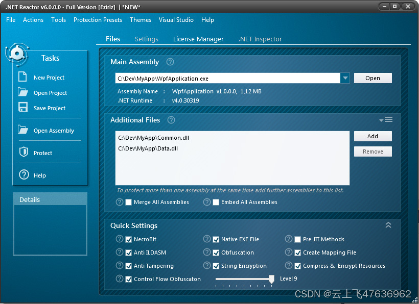

# .net程序的许可证书发布(.NET Reactor软件)

我们使用微软.Net编写程序生成的代码(.net 程序集,dll或exe)很容易被反编译程序(.net reflector)查看源代码，另一方面，有时我们希望我们的成果受到保护，例如只能在固定的电脑上运行(license文件)，或者设置使用次数，过期作废等。

.NET Reactor就是这样一款软件，用来保护我们的.net程序集。

本文简述使用.net reactor加密.net程序集，并且配置license文件，使得程序只能在固定的机器上运行。

# 保护程序集步骤
1. 选项卡"Files"中，“Main Assembly"里中，打开你要保护项目的主程序集(*.dll)。
2. “Additional Files”可以添加主程序集之外的其它多个程序集(附属程序集），选择“Merge All Assemblies”，则可将所有的附属程序集全部合并到主程序集，形成一个程序集文件。这个步骤为可选。
3. 在"Quick Settings"中，勾选合适的选项，对程序集进行混淆等保护设置，这个步骤为主要工作。
4. 如果只是混淆程序集，防止反编译，那么到这步就行了。如果想设置程序集的运行次数、过期时间，或者配置license文件使得程序只能在固定机器上运行，那么继续执行下面几步。
5. 切换到选项卡"Settings"，展开"Lock Settings"。
6. 不勾选"Run Without License File"（即设置为False），则意味着程序集启动时必须要license文件；
7. 此外，若勾选"Inbulit Lock-Expiration Date"，并设置过期日期，则程序集在指定的日期后不能使用，必须要license文件才能使用。
8. 切换到"License Manaager"选项卡，看到Master Key， 这就是我们的私钥，它与当前的程序是一对一的，所以一定要保存好它，将来生成许可证license时要用到，点击SAVE保存(.mkey文件)。 下面的选项暂时不用管，它们主要是配置生成许可证的。
9. OK，点击左边的"Protect"，默认会在项目的文件夹添加一个子文件夹（***_Secure），里面的程序集就是混淆后生成后的程序集，运行的时候就会有license验证了。那么我们发布给别人时就用这个程序集。

# license的生成
前面混淆生成后的程序集在目标机器上运行的时候需要license文件，license文件通常与机器的cpu/board/hdd/MAC等ID相关。

1. 菜单栏"TOOLS-Hardware id tool generator"，选择"cpu/board/hdd/MAC"中的组合(记住自己的选项，后面生成license的时候要对应)，即生成机器ID的生成器程序（HID.exe）。注意，在最新版6.8版本中没有此菜单选项，可使用5.8版本。
2. 将HID.exe给使用者，放置在程序集运行的机器上运行，即可得到一个记录着机器ID的TXT文件（hardwareID.txt）(相当于公钥)。
3. 再使用.net reactor, 在"License Manaager"选项卡中，"Master Key"打开们上面保存好的对应的私钥文件(.mkey)。
4. 在"License File Settings"中的"Lock-Hardware Lock"，选择对应的"cpu/Board/Hdd/MAC”（与生成HID.exe时的选择一样）,点击Hardware ID，导入用户生成的"hardwareID.txt（或者直接输入里面的机器码）。
5. 点击"Create License"即可生成许可证书(.license)，将其发给用户，放在程序集同级目录即可，这样用户就获得了使用权。

# 小结
切记，不能把程序生成license的私钥(.mkey)给用户，自己保存好，否则用户可自己使用.net reactor生成license文件。
小结一下步骤：
1. 生产者使用.net reactor将混淆后的程序集以及HID.exe给用户
2. 用户在部署的机器上运行HID.exe，生成机器码文件hardwareId.txt
3. 生产者再使用.net reactor生成license文件，给用户
4. 用户将licenshe文件(.license)放置在程序集同一目录下即可。

此外，点击[这里](https://www.eziriz.com/)可直接跳转到.net reactor的网站。
希望大家支持正版。

