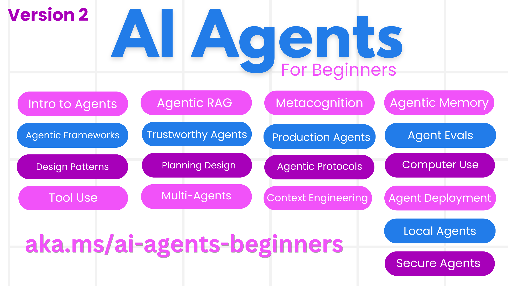
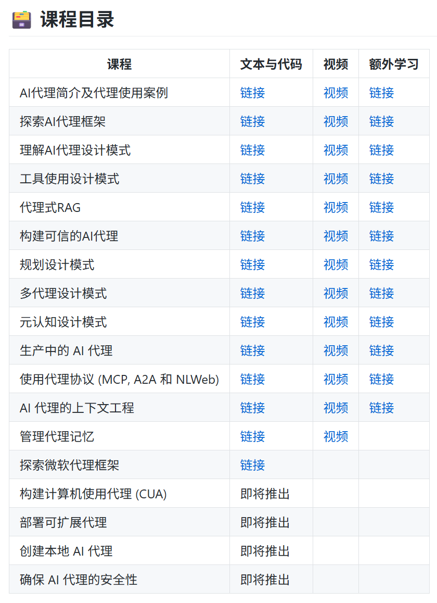

# AI智能体Agents教程（微软出品）介绍

微软免费发布了Agent开发课程帮助大家快速入门，有文字说明，也有精湛的视频讲解，例如，Agent RAG和传统RAG有什么不同，应该如何选择合适的Agent框架，只要你会一些基本的编程，0基础也能快速学会开发智能体。

微软刚发布的Agent课程在github上评价相当高，已经超过8000颗星，可见其质量是相当过硬的。文中末尾还有个小彩蛋。

直接上链接：
微软主页： [https://microsoft.github.io/ai-agents-for-beginners/translations/zh/](https://microsoft.github.io/ai-agents-for-beginners/translations/zh/)

Github主页：[https://github.com/microsoft/ai-agents-for-beginners](https://github.com/microsoft/ai-agents-for-beginners)
