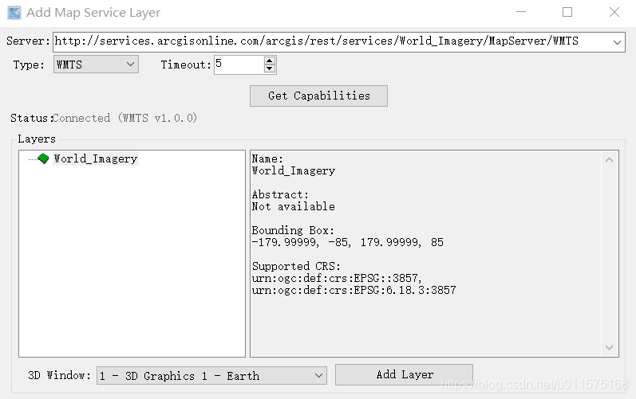
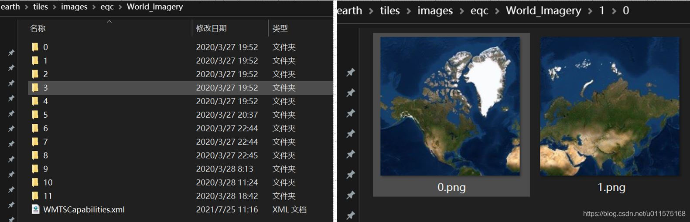
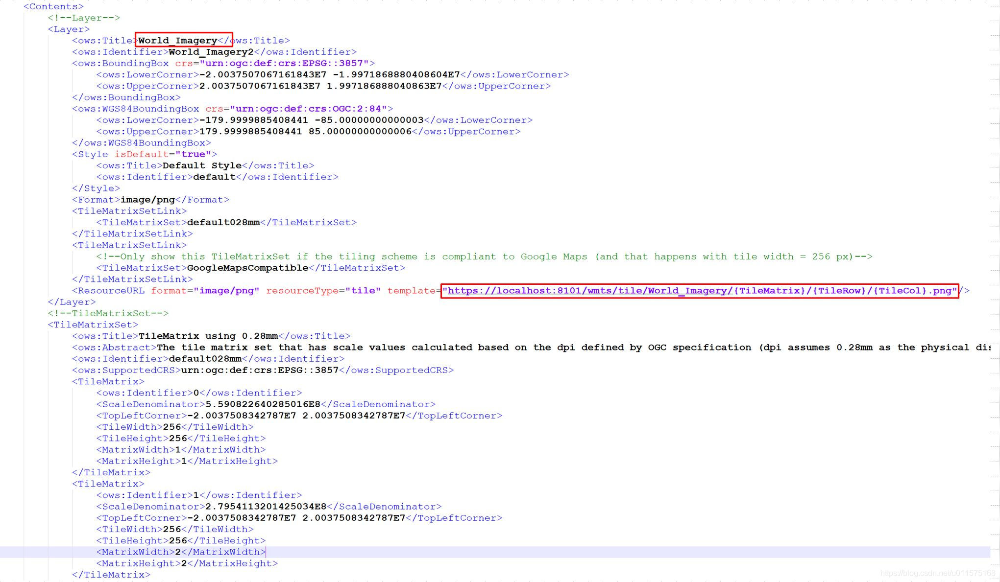
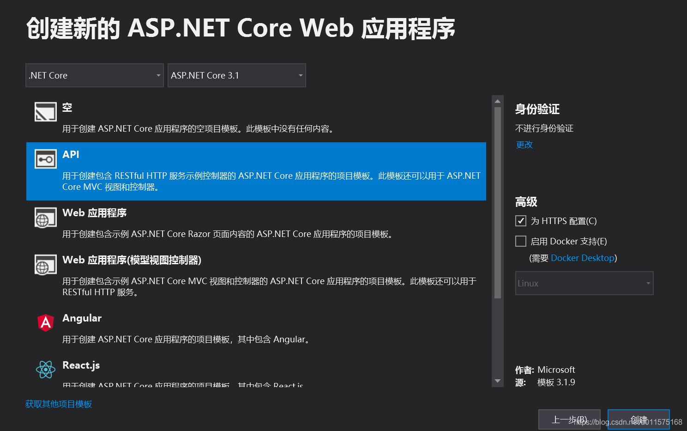
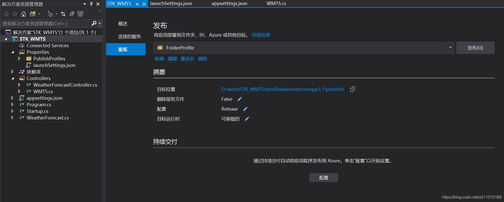
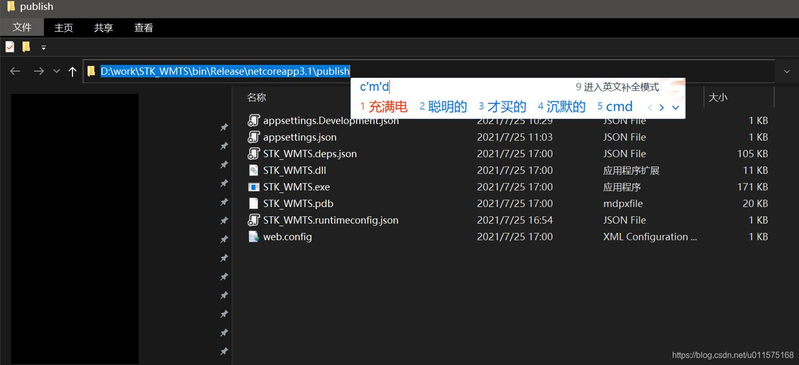
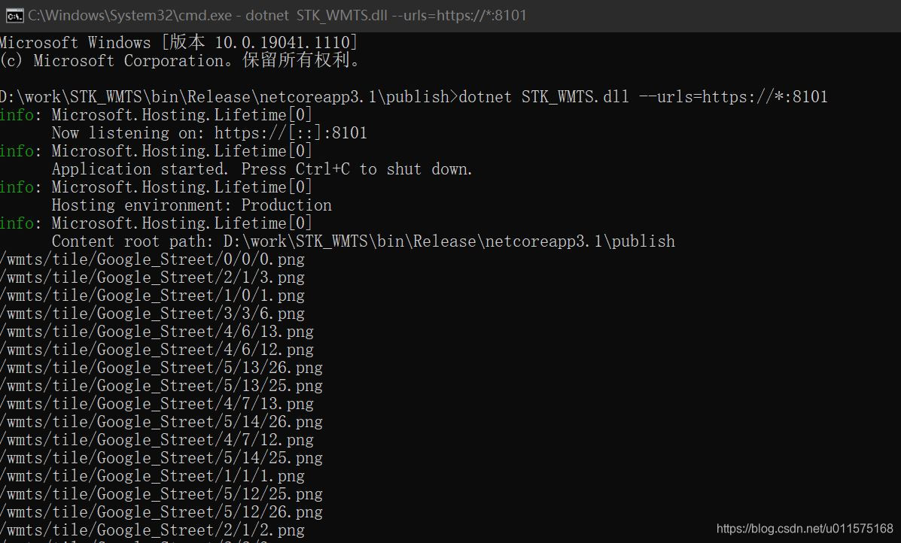
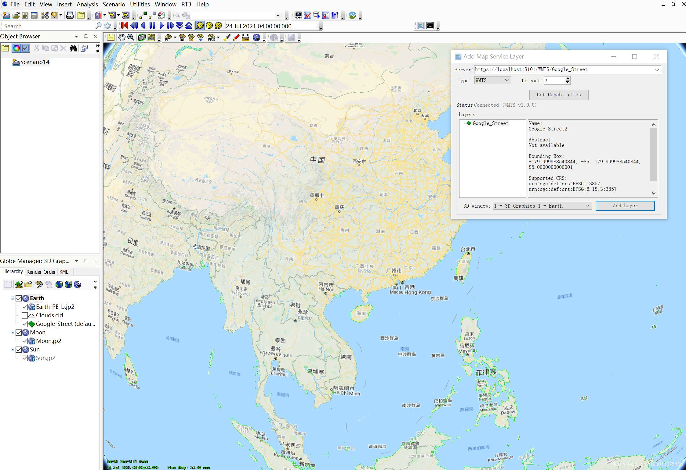

# ASP.Net Core创建STK WMTS服务

在前面文章中，介绍了如何在STK中，通过插件（ArcGIS REST Client插件和Web Map Services插件），使得STK中的3D窗口（2D窗口目前不支持）可直接自动加载网络地图。详见：[STK加载WMS、WMTS服务](https://blog.csdn.net/u011575168/article/details/84670751)

当在局域网内，怎么办？也就是说我们有了类似谷歌街道图或谷歌卫星图的瓦片数据，如何搭建一个提供WMTS的网站？使得STK在局域网内仍然可以链接大容量地图数据服务？

本文使用ASP.Net Core搭建网络地图瓦片服务（WMTS）。

本节内容需具备WMTS基础知识和Asp.net core编程基础知识。
## WMS插件的请求


打开STK的Web Map Services插件，从界面上和实际使用来说，此插件主要做了两件事：
1.  输入Server地址后，点击"Get Capabilities"按钮，会向服务器发出http://ip:port/***?&SERVICE=WMTS&REQUEST=GetCapabilities
请求，从而获得"WMTSCapabilities.xml"文件。
2. 有了"WMTSCapabilities.xml"文件，则可根据里面的"ResourceURL"地址，实时获取瓦片。

## 自有瓦片数据修改
根据STK WMS的请求，首先得提供"WMTSCapabilities.xml"文件，并修改里面的内容。
下图为自有的（可通过网络地图下载器下载）Arcgis World_Imagery的影像层瓦片。一共有12级（0-11级），采用WMTS编号方式（以左上角为起点），具体可参考WMTS相关文档。

每个文件夹内包含“行编号”文件夹，再里面是“列编号文件”，见下右图，给出的是第1级文件夹里的“0”行文件夹内的两个文件：0.png,1.png。

对应此"World_Imagery"图层，需要提供对应的"WMTSCapabilities.xml"文件，如果没有，可以从别的地方拷贝过来，然后修改里面的内容，使之符合此图层。此处，"World_Imagery"图层对应的投影坐标系为EPSG:3857，即Web Mercator投影。

注意，"WMTSCapabilities.xml"文件放在什么地方无所谓，关键服务器要找得到，为了方便，我们将它放在对应图层文件夹的根目录下，见上图。

打开WMTSCapabilities.xml文件，修改"Contents"里面的以下2处：
1. Title,修改为对应的图层名称
2. ResourceURL ，修改对应的template。
    注意，地址中，localhost:8101应于服务器部署的地方一致，".png"应与实际瓦片的扩展名一致，通常为png或jpeg两种格式。

## Asp.Net Core服务端程序
采用Asp.Net Core编写Web Api程序，运行在服务器上，提供WMTS服务。

笔者采用VS2019，新建 asp.net core web应用程序，采用ASP.NET Core 3.1，选用API。

创建完成后，在工程里的“appsettings.json”中增加瓦片文件夹的配置选项，供程序使用，同时可随时更改配置而不需重新编译文件夹。
增加了两个属性："WMTS_PATH"和"WMTS_TYPE"，此处以两个瓦片文件夹为例："Google_Street"和"World_Imagery"。
```cpp
{
  "Logging": {
    "LogLevel": {
      "Default": "Information",
      "Microsoft": "Warning",
      "Microsoft.Hosting.Lifetime": "Information"
    }
  },
  "AllowedHosts": "*",
  "WMTS_PATH": {
    "Google_Street": "D:\\earth\\tiles\\images\\eqc\\Google_Street",
    "World_Imagery": "D:\\earth\\tiles\\images\\eqc\\World_Imagery"
  },
  "WMTS_TYPE": {
    "Google_Street": "WMTS",
    "World_Imagery": "WMTS"
  }
}
```
在项目工程中，“Controller”文件夹中，增加控制器WMTS.cs文件，里面代码如下。
WMTS控制器提供了两个方法：
1. GetCapabilities用于返回WMTSCapabilities.xml文件
2. GetTile用于返回具体的瓦片。内部会根据图层的编号，处理后，再返回对应的瓦片文件。

```csharp
using Microsoft.AspNetCore.Mvc;
using Microsoft.Extensions.Configuration;
using System;
using System.IO;

namespace STK_WMTS.Controllers
{
    /*  用于STK Web Map Services(WMS) 插件的 服务端地图发布
     *  
     *  STK中WMS插件中
     *      1   点击"Get Capabilities"按钮，会向服务器发出 http://ip:port/**?&SERVICE=WMTS&REQUEST=GetCapabilities
     *          用于向服务器获取 WMTS服务的"WMTSCapabilities.xml"文件
     *          其中，根据"ResourceURL"地址的内容，向服务器请求瓦片信息
     *      2   修改"ResourceURL"地址的内容，使得和服务器一致
     * 
     *  由于服务器端的瓦片编号可能是WMTS格式，也可能是TMS格式，因此需要根据具体的图层，在下面代码层级手工确定，
     *      也就是说，STK向服务器请求的WMTS格式的瓦片不直接从服务器中的静态目录获取，而是通过服务器处理后获得
     * 
     * 
     */

    [ApiController]
    [Route("WMTS")]
    public class WMTS : ControllerBase
    {
        //读取配置文件(appsettings.json)
        private readonly IConfiguration _Configuration;

        public WMTS(IConfiguration configuration)
        {
            _Configuration = configuration;//读取配置文件赋值
        }

        /// <summary>
        /// 返回图层的"WMTSCapabilities.xml"文件(此处地址为:http://ip:port/WMTS/{LayserName})
        /// </summary>
        /// <param name="layername"></param>
        /// <returns></returns>
        [HttpGet]
        [Route("{LayerName}")]
        public Stream GetCapabilities(string LayerName)
        {
            //  请求地址里有参数(?&SERVICE=WMTS&REQUEST=GetCapabilities),此处忽略
            var name = Request.Query["SERVICE"];
            var req = Request.Query["REQUEST"];

            //  调试输出
            Console.WriteLine("请求WMTSCapabilities.xml文件:  "+Request.Path);

            //  从配置文件中获取对应的路径            
            var ph = _Configuration[$"WMTS_PATH:{LayerName}"];

            //  返回对应图层文件夹内的WMTSCapabilities.xml
            var path = Path.Combine(ph, "WMTSCapabilities.xml");
            if (System.IO.File.Exists(path))
                return System.IO.File.OpenRead(path);
            else
                throw new Exception("无此文件!");
        }


        /// <summary>
        /// 返回切片文件(.png/.jpeg)，请求路径需和WMTSCapabilities.xml中的"ResourceURL"内一致        
        /// <para>此处请求的地址为:http://ip:port/WMTS/tile/{LayerName}/{TileMatrix}/{TileRow}/{TileCol}.{img}</para>
        /// </summary>
        /// <param name="TileMatrix">WMTS瓦片编码的层级(0,1,2...)</param>
        /// <param name="TileRow">WMTS瓦片编码的行(左上角开始)</param>
        /// <param name="TileCol">WMTS瓦片编码的列(左上角开始)</param>
        /// <param name="img">文件后缀(img/jpeg)</param>
        /// <returns></returns>
        [HttpGet]
        [Route("tile/{LayerName}/{TileMatrix}/{TileRow}/{TileCol}.{img}")]
        public FileResult GetTile(string LayerName, int TileMatrix, int TileRow, int TileCol, string img)
        {
            //  调试输出
            Console.WriteLine(Request.Path);

            //  从配置文件中获取对应的路径            
            var ph = _Configuration[$"WMTS_PATH:{LayerName}"];

            //  从配置文件中获取对应的编码类型(WMTS?TMS)
            var tp = _Configuration[$"WMTS_TYPE:{LayerName}"];            
            //  TMS时，需要将WMTS编码转换
            if (tp == "TMS")
            { 
                //....TODO
            }

            //创建一个文件流 FileStream
            var stream = System.IO.File.OpenRead(Path.Combine(ph, @$"{TileMatrix}\{TileRow}\{TileCol}.{img}"));
            
            //文件类型 Content-Type
            var contentType = $"image/{img}";

            //  返回瓦片文件
            return File(stream, contentType);
        }
    }
}
```
## 发布程序
至此，不到百行的代码搞定服务器发布私有网络地图服务！！

右键工程“STK_WMTS”，点击“发布”，即可弹出发布界面，见下图，点击“发布”，即可生成此项目工程的发布版本。

发布成功后，进入发布文件夹内，在地址栏内输入“cmd”（见下图），回车后即可启动Windows控制台界面，且当前路径即为程序发布文件夹路径。

在cmd中输入"dotnet STK_WMTS.dll --urls=https://*:8101"，即可启动服务端程序，且运行端口为8101。

STK中插件WMS中服务器中输入："https://localhost:8101/WMTS/Google_Street"，即可链接服务器。

服务器运行界面如下：



## 小结
本文给出了使用ASP.Net Core编写WMTS服务端程序的详细过程，以配合STK WMS插件的使用。需要注意的是：
1. 需在服务器上提供私有的瓦片地图文件夹，并配置对应的"WMTSCapabilities.xml"文件。
2. "WMTSCapabilities.xml"文件中的ResourceURL路径应与Asp.Net Core服务器提供的服务路径一致。
3. 本文中以localhost:8081为例，实际应用中，asp.net core程序应发布在服务器上，所以localhost应修改为服务器的地址。
4. 本文中采用"dotnet"命令发布服务器端程序，也可采用windows IIS服务发布，此处不再详述。


