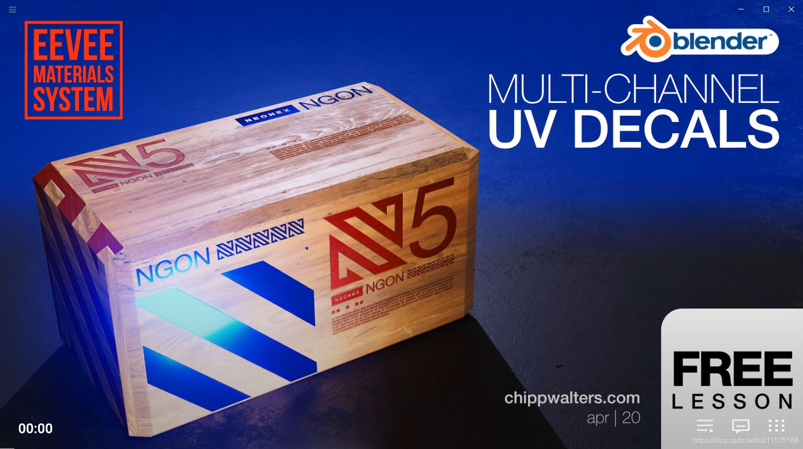
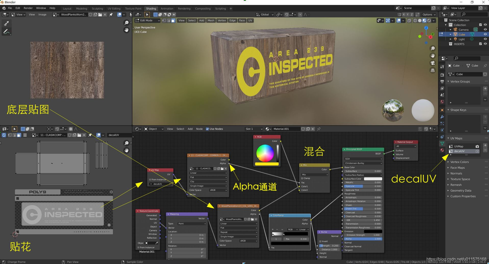

# Blender学习笔记-印花(decal)贴图

最近学习blender制作模型，特将学习心得记录下来，供参考。

今天的心得是如何将贴图(英文名为decal)贴在另一张贴图的表面上，常用于文字、logo的图案制作。

视频教程（可在最后的链接下载）最后的结果如下图所示：
 1. 底图使用木头贴图；
 2. 在不同的面上实现不同贴花的覆盖，贴花的分辨率要大于木头贴图的分辨率。
 3. 还可实现贴花的文字或图形凹凸或发光的效果。

整个视频的内容要点如下：
 5. 贴花(decal)贴图为png图片，具备alpha通道（透明通道），通常为文字、公司logo图案等。
 6. 底层贴图为普通jpg图像，此处为木头材质的贴图，长方体的uv展开为UVMap，自行调整uv展开与底层贴图的关系，如smart uv或cube uv方式。总之，底层贴图与长方体uv为一般的uv展开过程。
 7. 底层贴图可通过ColorRamp转换为黑白贴图，然后链接到roughness通道和normal通道。
 8. 需要为长方体新建一个uv，此处名称为decalUV（名称无所谓），然后重新将长方体的uv展开到decalUV中。此处将长方体所有uv展开移到decalUV范围外，只将一个面的uv展开移到decalUV的合适位置，见下图。这样只在一个面上显示贴花的一部分。如果想在其它面上显示不同的贴花，是类似的。
 9. 为贴花新建image texture节点，图像选择贴花的图像，并将默认的repeat改为clip。并新建UV Map节点，其中UV Map中需选中decalUV。
 10. 创建混合(Mix)节点和颜色节点(RGB),然后将RGB节点和底层贴图的节点链接至color1和color2，这样就是一种单色与地图图像的混合输出。
7.将贴花的image节点的alpha通道链接至混合节点的fac节点。由于贴花为png图片，通过alpha通道，将文字或logo的位置全显示（通过颜色节点控制显示颜色），其它地方全透明（用于显示底层贴图）。
 11. 还可实现文字或logo的发光效果，具体看视频中介绍。

百度网盘[视频教程](https://pan.baidu.com/s/1qBzjc7QGMnjkeHWPkPrSRQ)
提取码：rxmn 

