# Cesium与STK中的天空盒子(skybox)

天空盒子是计算机图形学中的概念，用于在3D展示中，显示观测者上下左右前后的全景图像。
# 星空图介绍
在STK和Cesium中，常常以地球为中心天体，背景就是宇宙星空，观测者超哪个方向看，就可以看到对应方向的星空。我们知道，宇宙中所有的星系都离地球很远，且在短时间内恒星的自行（单位时间内恒星在天球切面上走过的距离对观测者所张的角度叫自行）非常小，因此我们可假设星空背景是不变的，可以用一张星空图片来代替宇宙，在3D场景中作为远景展示。
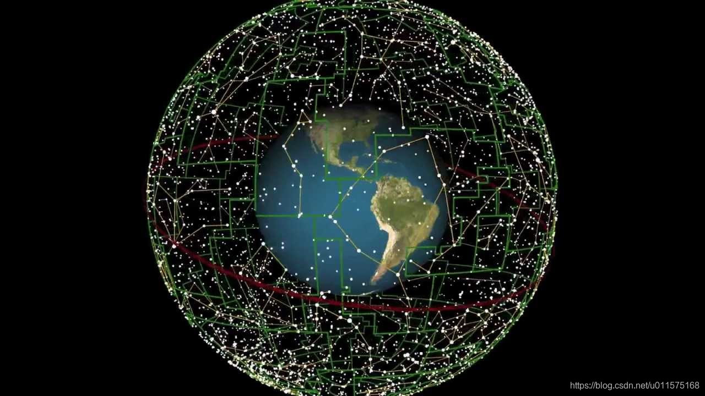
显然，我们无法做一个球面的星空图，想像一下地球的表面也是球形的，我们是如何处理的？把它展开为一张平面图，专业的说法叫映射，也就是地图Map的原始含义。

星空图通常由星表产生，目前使用的星表主要是依巴谷与第谷星表集（Hipparcos and Tycho star catalogs），这两个名人不用介绍了吧？依巴谷与第谷星表集从何而来？答案是：依巴谷卫星。

依巴谷卫星由欧洲空间局于1989年8月发射升空，1993年8月完成历史使命，观测寿命为4年。其中在1989年11月至1993年3月共40个月期间，卫星观测得到了高质量的科学资料。通过两个独立的数据处理中心FAST(Fundamental Astronomy by Space Techniques)和NDAC(Northern Data Analysis Consortium)认真处理仔细分析，最终的主要成果是依巴谷星表和第谷星表。

星表中给出了各恒星的位置、星等等数据，依据此数据可制作成二维星空图，见下图（来源：NASA，见最后引用地址，有不同分辨率的图片）。投影坐标系为地心天球坐标系，投影方式为等距圆柱投影（ plate carrée projection /Cylindrical-Equidistant）。
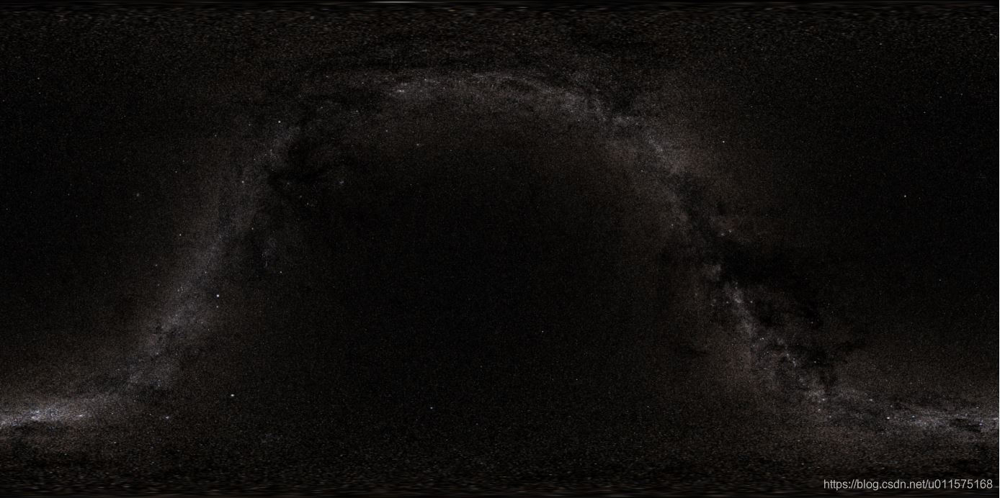
具备GIS（地理信息系统）基本知识可知，等距圆柱投影，其经线和纬线是等距的直线，由此可形成一个完美方形的笛卡尔格网。在此投影中，各极点被表示为通过格网顶部和底部的直线，其长度与赤道相同。经纬网沿赤道和中央经线对称。这是一种非常经典的地图投影方式，我们常常可以看到此种投影方式的地球地图。
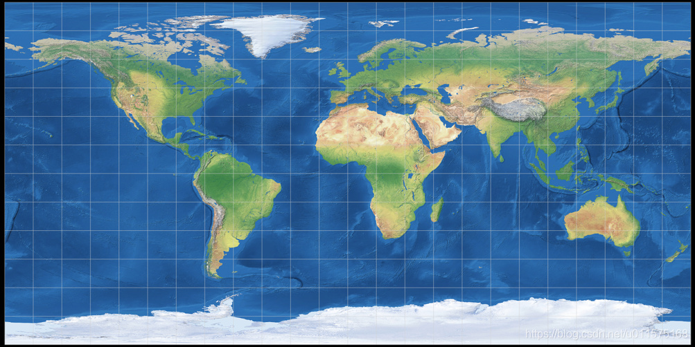
# 天空盒子(skybox)原理
天空盒子的制作方法并没有采用上述方法。

想象一下，一个立方体盒子将天球包围，从球心到球面上任意一点的连线延伸出去必然与立方体盒子的一个面相交，从而将球面上的一个点映射到立方体的一个面上。最终完整的天球映射到立方体盒子的两个面上，形成6张正方形的图片。所以说天空盒子的贴图是6张（也叫立方体贴图），分别对应6个方向的星空背景贴图。

在实际的渲染中，将这个立方体始终罩在摄像机的周围，让摄像机始终处于这个立方体的中心位置，然后根据视线与立方体的交点的坐标，来确定究竟要在哪一个面上进行纹理采样。
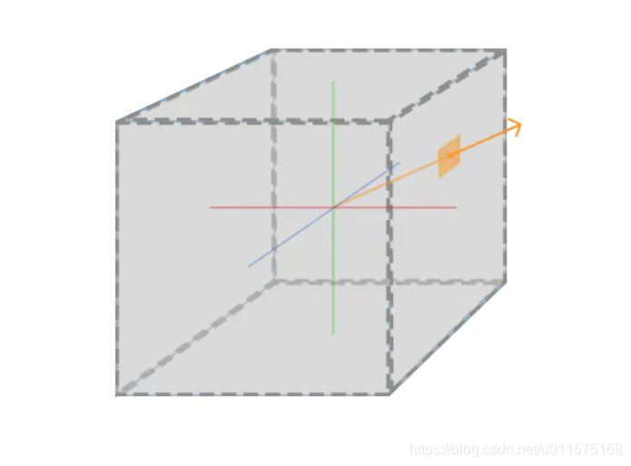
在制作立方体贴图过程中，我们的球面星空背景图通常为一张等距圆柱投影的2D图，因此需要等距圆柱投影到立方体投影的转换过程。
# STK中的天空盒子
STK软件中，新建场景后，3D窗口的默认星空背景是零零散散的星星，也可以通过加载高分辨率图片来替换星空背景，见下图。
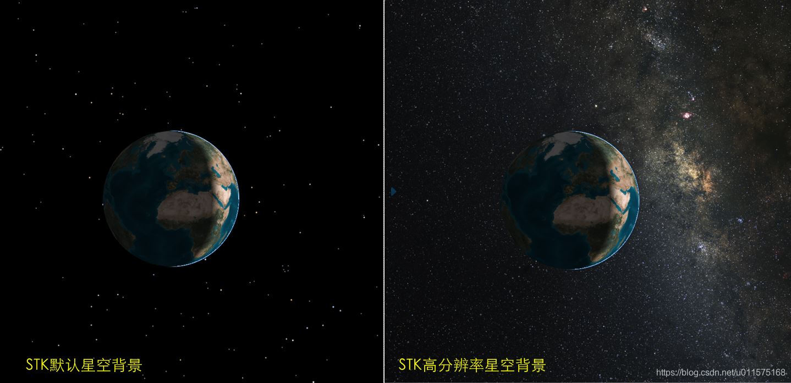
STK星空背景的设置：打开3D窗口的属性窗口，选择“Celestial”标签页， 在"Star"属性框内，“Show”复选框用于控制星空背景是否显示；显示时有两种显示方式：
1. "Show as Points"，即使用一系列的点来表示星星。从属性说明中我们可知，实际上是采用依巴谷星表(Hipparcos)中的数据来显示背景星空的，点的位置、大小和亮度，皆由依巴谷星表给出。
2. "Show as Texture"，即使用立方体盒子的6张星空背景贴图。通过"..."按钮打开文件对话框，找到STK数据盘中的星空图片文件中的"mwpan2.ctm"文件即可。
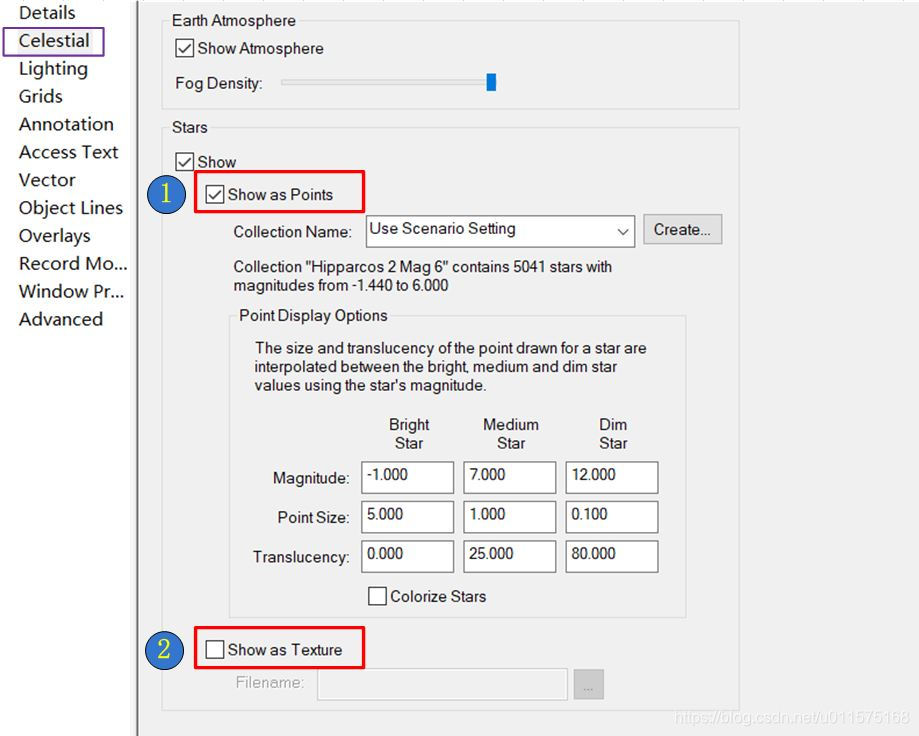

通过AGI官网可下载STK数据盘（国内访问不了，需搭梯子，且需要注册，比较麻烦，在后面我会附上云盘链接），名称为STK-Data-Disc-V11或STK-Data-Disc-V12等，里面包含高精度地图、高精度地球月球2D影像图、 全球地形和高分辨率星空背景图。

其中高分辨率星空背景图在"STK Celestial Imagery"文件夹内，其中"mwpan2.ctm"文件用于STK的星空背景设置时选择，"dataFiles"文件夹中有6张pdttx格式的图片，每张图片约24M，即为ＳＴＫ的星空背景的skybox。
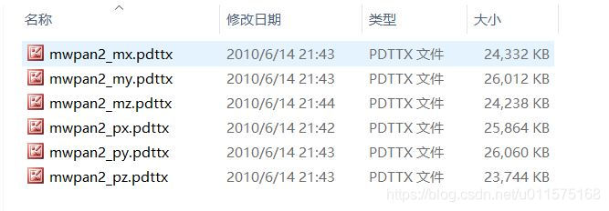
# Cesium中的天空盒子
在Cesium 3D场景中，同样也是使用6张贴图实现了星空背景的skybox。

下载Cesium代码包后，星空背景的贴图在"Build\Cesium\Assets\Textures\SkyBox"目录下，见下图。每张图片仅有150k左右，为1024×1024大小，即1k，因此分辨率非常低。
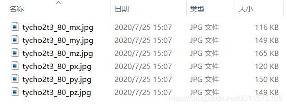
在之前的Release版本中，Cesium还提供过2048*2048分辨率的星空背景贴图（见下图）,我从Github上找到了原始版本，见下图。
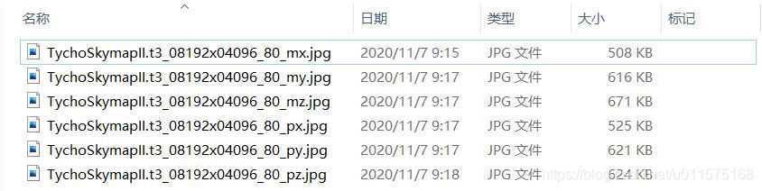
从贴图的名称可以看出它们都是根据依巴谷第谷星表制作而成的，原图就是上面的第二张图。
# Cesium中天空盒子加载
有了6幅立方体贴图，在Cesium中加载的代码如下：
```javascript
scene.skyBox = new Cesium.SkyBox({
  sources : {
    positiveX : 'skybox_px.png',
    negativeX : 'skybox_nx.png',
    positiveY : 'skybox_py.png',
    negativeY : 'skybox_ny.png',
    positiveZ : 'skybox_pz.png',
    negativeZ : 'skybox_nz.png'
  }
});
```
由代码可知，加载时，需要明确positiveX/negativeX....等参数对应的贴图编号。我们约定下面对应关系：

```
positiveX 	=px 
negativeX	=nx=mx
positiveY	=py
negativeY	=ny=my
positiveZ	=pz
negativeZ	=nz=mz
```
在Cesium提供的skybox贴图名称后缀中，有得用nx/ny/nz表示，有的用mx/my/mz表示，因此我们将其等效。
# 天空盒子制作
适用于STK或Cesium的星空背景的天空盒子生成的程序在网上始终没有直接找到现成的，但是立方体贴图的制作基本原理都是通用的，无非就是最后生成的cubemap的贴图方位不对而已。

在网上找到了生成立方体贴图的python代码，经过调整后，可直接生成6个立方体贴图，供stk或cesium使用。

在贴具体代码前，先讲一下立方体与cesium立方体贴图编号的关系。下图右图为边长为2的立方体，立方体中心为坐标系原点。立方体6个面分别垂直与X轴、Y轴和Z轴方向，具体关系见下图。
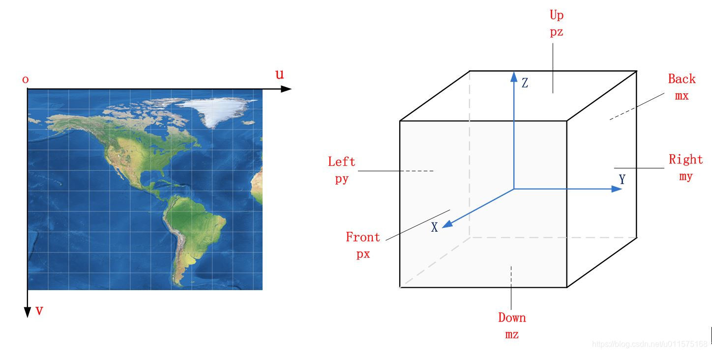
其次，立方体的每个面为二维平面图，也就是普通的图像（通常格式为jpg/png），长宽像素长度相同。对于图像，也有坐标系来描述图中每个像素点的坐标，称为图像坐标系或像素坐标系，通常以图像的左上角为原点，向右为u坐标，向下为v坐标，见上图左图。

生成立方体贴图的流程如下：
1. 循环六个面，每个面生成时，循环其图像坐标系的u、v;
2. 由某个面的编号及具体像素坐标:u、v，求解其在立方体中的笛卡尔坐标（x,y,z)。例如，对于px的贴图，其x坐标为1，即x=1,有，y,z的坐标由u、v表达（还需注意图像在front面的具体方位)；
3. 有了笛卡尔坐标(x,y,z)，就可以求出球坐标，以经纬度方式表示(经度：$\theta$，纬度：$\phi$);
4. 由球坐标($\theta$，$\phi$)，转换为星空背景的平面坐标（上面第二幅图），即可获得具体的图像像素位置；
5. 由星空二维平面图的具体像素位置，即可获得具体像素值，通常为RGB三个颜色通道的数值，在具体求解时，通常通过周围四个像素点的数值进行插值处理，以便得到的数值较为真实。

从上面流程可以看出，立方体贴图生成的过程，其实就是一系列坐标系转换的过程，当然还涉及到图像像素坐标系的概念。

下面给出python源码(python 3.0)，读者可直接使用，生成6幅立方体贴图，供Cesium使用。

```javascript
# -*- coding: utf-8 -*-
"""
Created on Fri Nov 27 21:51:12 2020

@author: liyunfei
原始代码来自于: https://stackoverflow.com/questions/29678510/convert-21-equirectangular-panorama-to-cube-map/29681646#29681646
"""

from PIL import Image
from math import pi, sin, cos, tan, atan2, hypot, floor
from numpy import clip

# get x,y,z coords from out image pixels coords
# i,j are pixel coords
# faceIdx is face number
# faceSize is edge length
def outImgToXYZ(i, j, faceIdx, faceSize):
    """此函数被lyf修改过,以适应cesium skybox的贴图
    """
    a = 2.0 * float(i) / faceSize
    b = 2.0 * float(j) / faceSize

    if faceIdx == 0: # back
        #(x,y,z) = (-1.0, 1.0 - a, 1.0 - b)
        (x,y,z) = (-1.0, 1.0 - b, a - 1.0)
    elif faceIdx == 1: # left
        (x,y,z) = (a - 1.0, -1.0, 1.0 - b)
    elif faceIdx == 2: # front
        #(x,y,z) = (1.0, a - 1.0, 1.0 - b)
        (x,y,z) = (1.0, 1.0 - b, 1.0 - a)
    elif faceIdx == 3: # right
        #(x,y,z) = (1.0 - a, 1.0, 1.0 - b)
        (x,y,z) = (a - 1.0, 1.0, b - 1.0)
    elif faceIdx == 4: # top
        #(x,y,z) = (b - 1.0, a - 1.0, 1.0)
        (x,y,z) = (a - 1.0, 1.0 - b, 1.0)
    elif faceIdx == 5: # bottom
        #(x,y,z) = (1.0 - b, a - 1.0, -1.0)
        (x,y,z) = (1.0 - a, 1.0 - b, -1.0)

    return (x, y, z)

# convert using an inverse transformation
def convertFace(imgIn, imgOut, faceIdx):
    inSize = imgIn.size
    outSize = imgOut.size
    inPix = imgIn.load()
    outPix = imgOut.load()
    faceSize = outSize[0]

    for xOut in range(faceSize):
        #print 
        print("Current face: %s   progress: %s %%"%(faceIdx, floor(xOut/faceSize*100)))
        
        for yOut in range(faceSize):
            (x,y,z) = outImgToXYZ(xOut, yOut, faceIdx, faceSize)
            theta = atan2(y,x) # range -pi to pi
            r = hypot(x,y)
            phi = atan2(z,r) # range -pi/2 to pi/2

            # source img coords
            uf = 0.5 * inSize[0] * (theta + pi) / pi
            vf = 0.5 * inSize[0] * (pi/2 - phi) / pi

            # Use bilinear interpolation between the four surrounding pixels
            ui = floor(uf)  # coord of pixel to bottom left
            vi = floor(vf)
            u2 = ui+1       # coords of pixel to top right
            v2 = vi+1
            mu = uf-ui      # fraction of way across pixel
            nu = vf-vi

            # Pixel values of four corners
            A = inPix[ui % inSize[0], int(clip(vi, 0, inSize[1]-1))]
            B = inPix[u2 % inSize[0], int(clip(vi, 0, inSize[1]-1))]
            C = inPix[ui % inSize[0], int(clip(v2, 0, inSize[1]-1))]
            D = inPix[u2 % inSize[0], int(clip(v2, 0, inSize[1]-1))]

            # interpolate
            (r,g,b) = (
              A[0]*(1-mu)*(1-nu) + B[0]*(mu)*(1-nu) + C[0]*(1-mu)*nu+D[0]*mu*nu,
              A[1]*(1-mu)*(1-nu) + B[1]*(mu)*(1-nu) + C[1]*(1-mu)*nu+D[1]*mu*nu,
              A[2]*(1-mu)*(1-nu) + B[2]*(mu)*(1-nu) + C[2]*(1-mu)*nu+D[2]*mu*nu )

            outPix[xOut, yOut] = (int(round(r)), int(round(g)), int(round(b)))


## ★★★
## 由使用者自行提供原图的路径fp，此原图应为星空背景的2D图，在地心天球坐标系下，且投影方式为
##   等距圆柱投影（ plate carrée projection /Cylindrical-Equidistant）。
# 注意fp的路径，最后此代码文件与原图在同一文件夹内
            
#fp = "TychoSkymapII.t5_04096x02048.tif"
#fp = 'TychoSkymapII.t3_08192x04096.tif'
#fp = 'starmap_2020_8k.png'
#fp = 'TychoSkymapII.t5_16384x08192.jpg'
fp = 'starmap_2020_16k.png'


imgIn = Image.open(fp)
inSize = imgIn.size
# 立方体图片的宽度默认为源图片长度的1/4
faceSize = int(inSize[0] / 4) 
components = fp.rsplit('.', 1)

# 立方体贴图6个面的编号与cesium贴图名称后缀的关系(lyf调整)
FACE_NAMES = {
  0: 'mx',  #back
  1: 'py',  #left
  2: 'px',  #front
  3: 'my',  #right
  4: 'pz',  #top
  5: 'mz'   #bottom'
}

# 循环生成六个面的贴图，贴图格式为jpg
for face in range(6):
  print("face:",face)
  imgOut = Image.new("RGB", (faceSize, faceSize), "black")
  convertFace(imgIn, imgOut, face)
  imgOut.save(components[0] + "_" + FACE_NAMES[face] + ".jpg")

print('complete!!!')  
```
下面给出两种转换后的贴图在Cesium中的表现：
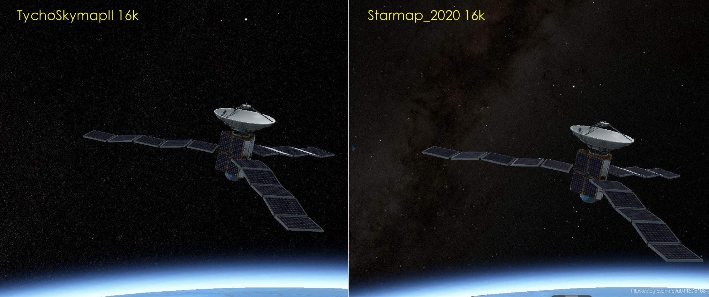


## 参考
1. [天空盒(SkyBox)的实现原理与细节](https://blog.csdn.net/yjr3426619/article/details/81224101)
2. [计算机图形学(OPENGL):天空盒](https://www.jianshu.com/p/709789d4623f)
3. [恒星星空图绘制（二）——星表详解](https://zhuanlan.zhihu.com/p/82496762)
4. Cesium skybox的原图： [The Tycho Catalog Skymap - Version 2.0](https://svs.gsfc.nasa.gov/3572)
5. [Convert 2:1 equirectangular panorama to cube map](https://stackoverflow.com/questions/29678510/convert-21-equirectangular-panorama-to-cube-map/29681646#29681646)
6. Stk数据盘[StkDataDisc11.0](https://share.weiyun.com/5FLtpCO)
7. [cesium星空背景贴图](https://share.weiyun.com/kyaXdoc7)
8. [Cesium之天空盒对应方位](https://blog.csdn.net/weixin_40184249/article/details/102808142)
9. [Deep Star Maps 2020](https://svs.gsfc.nasa.gov/4851)

