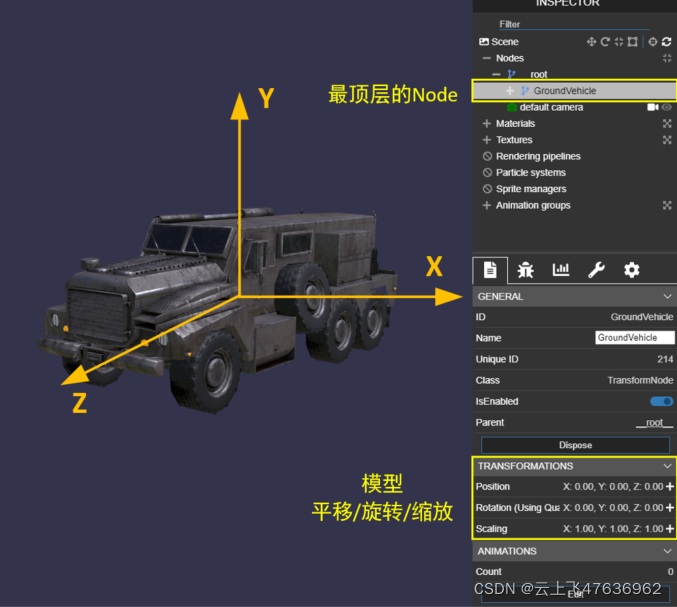
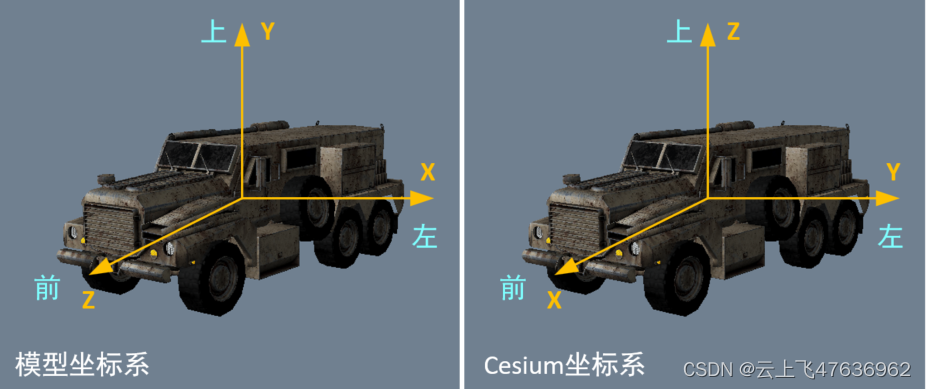
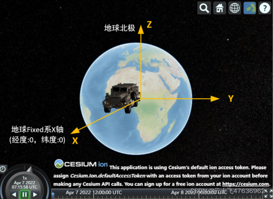
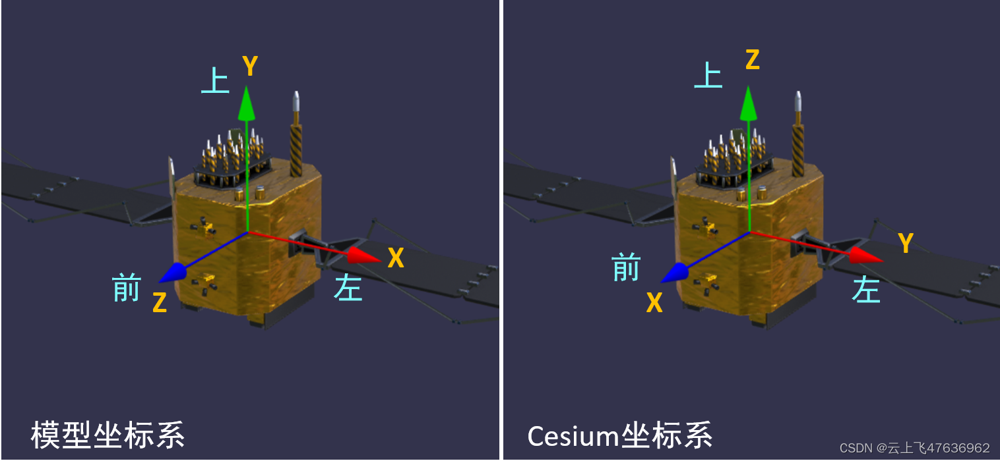
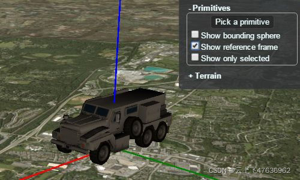

# Cesium中gltf模型的坐标系

Cesium中使用gltf格式的模型，而gltf格式的模型的坐标系在加载到Cesium中后，Cesium会自动变换坐标系。

本文简要阐述gltf模型的坐标系加载前后的变化。

## gltf模型
可以使用各种3D制图工具来进行模型的制作，例如3dsMax,Maya,Blender。在Blender中不仅可以制作模型，而且具备导出模型为gltf格式的功能。

我们可以使用visual studio code来打开gltf模型，不过需要gltf插件：gltf Tools，此处不再详述。

在vsc中可以可视化的方式显示三维模型，目前具备"Babylon.js","Cesium"，"Filament"和"Three.js"四种插件的加载方式。使用"Babylon.js"浏览时，通过调试方式，可打开模型的节点及坐标系相关。

下图为Cesium官方的地面车的模型使用vsc打开的效果：
 - __root__下面的"GroundVehicle"即为地面车的最顶层的节点，名称为"GroundVehicle"，由gltf文件中定义；
 - 下方TRANSFORMATIONS可手动调整模型的平移，旋转，缩放，可实时看到调整的效果。此坐标系即为模型最顶层节点的坐标系，我们称为模型坐标系。

通常在gltf模型制作中，模型坐标系的常规定义为：
  - 模型的顶部，为Y轴；
 - 模型的前面，为Z轴；
 - 由X,Y轴和右手定则确定X轴。
所谓模型的顶部，一般符合人们对模型的常识，如车子顶部，房子的上部等；

## Cesium中的坐标系
当Cesium中加载gltf模型时，会自动将模型的Y轴转Z轴朝上和Z轴转X轴朝前，加载前后效果图如下：

也就是说，在Cesium中，凡是涉及模型的旋转等操作，均针对**Cesium坐标系！！！**，这点请务必和模型坐标系区分开来，具体对应为：

1. Cesium坐标系X轴：模型坐标系Z轴
2. Cesium坐标系Y轴：模型坐标系X轴
3. Cesium坐标系Z轴：模型坐标系Y轴

下面为一简单的例子，代码如下，仅加载一个地面车，无任何旋转，那么地面车的坐标系(Cesium坐标系)应与地球Fixed系（在Cesium中,地球Fixed系为世界坐标系，所有对象均要表示在此坐标系）重合。
```javascript
var veh = viewer.entities.add({
  //  地球Fixed系中,经度、纬度均为0
  position: Cesium.Cartesian3.fromDegrees(0, 0, 0),
  //  模型相对地球Fixed系无任何转动
  orientation: new Cesium.Quaternion(0,0,0,1),
  model: {
    uri: "../../Apps/SampleData/models/GroundVehicle/GroundVehicle.glb",
    minimumPixelSize: 200
  }});
```
加载的效果如下图

下图为Cesium中的卫星的模型坐标系和Cesium坐标系区别

## cesium中的gltf模型的坐标轴显示
Cesium中提供了加载gltf模型后显示Cesium坐标轴的功能: Cesium Inspector。在 Cesium 调试器面板中勾选显示参考框架，能够很清晰地看到该模型对应的X、Y、Z轴以及原点。

显示Cesium Inspector插件的代码一句话：
```javascript
viewer.extend(Cesium.viewerCesiumInspectorMinxin);
```
下图为Inspector面板和模型的Cesium坐标轴显示，重点：

 - X轴：前方，红色
 - Y轴：左方，绿色
 - Z轴：上方，蓝色


