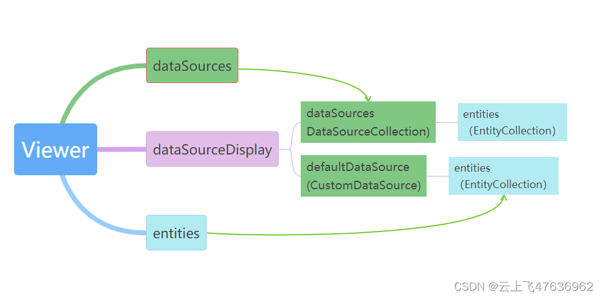

# Cesium中的DataSource和Entity关系


本章主要探讨一下Cesium中的DataSource和Entity。
# 介绍
首先简单说一下Entity与Primitive。

Cesium为开发者提供了丰富的图形绘制和空间数据管理的API，可以分为两类，一类是面向图形开发人员的低层次API，通常被称为Primitive API，另一类是用于驱动数据可视化的高层次API，称为Entity API。

总的来说，Primitive偏底层，图形绘制和数据加载效率较高，但开发难度更大，而Entity基于Primitive做了进一步封装，调用便捷。

对于绝大多数开发者来说，我们添加各种对象（点、模型、线等）都是使用Entity方式的，通过DataSource加载后其内部也是Entity对象方式的。而Entity最终转换为 Primitive对象来显示的。

 - **添加entity**

```javascript
var viewer = new Cesium.Viewer('cesiumContainer');

var citizensBankPark = viewer.entities.add({
    name : 'Citizens Bank Park',
    position : Cesium.Cartesian3.fromDegrees(-75.166493, 39.9060534),
    point : {
        pixelSize : 5,
        color : Cesium.Color.RED,
        outlineColor : Cesium.Color.WHITE,
        outlineWidth : 2
    },
    label : {
        text : 'Citizens Bank Park',
        font : '14pt monospace',
        style: Cesium.LabelStyle.FILL_AND_OUTLINE,
        outlineWidth : 2,
        verticalOrigin : Cesium.VerticalOrigin.BOTTOM,
        pixelOffset : new Cesium.Cartesian2(0, -9)
    }
});
```

 - **添加Primitive**

```javascript
// 1. Draw a translucent ellipse on the surface with a checkerboard pattern
const instance = new Cesium.GeometryInstance({
  geometry : new Cesium.EllipseGeometry({
      center : Cesium.Cartesian3.fromDegrees(-100.0, 20.0),
      semiMinorAxis : 500000.0,
      semiMajorAxis : 1000000.0,
      rotation : Cesium.Math.PI_OVER_FOUR,
      vertexFormat : Cesium.VertexFormat.POSITION_AND_ST
  }),
  id : 'object returned when this instance is picked and to get/set per-instance attributes'
});
scene.primitives.add(new Cesium.Primitive({
  geometryInstances : instance,
  appearance : new Cesium.EllipsoidSurfaceAppearance({
    material : Cesium.Material.fromType('Checkerboard')
  })
}));
```
 - **添加DataSource**
```javascript
const viewer = new Cesium.Viewer('cesiumContainer');
// 添加 GeoJson类型的数据
viewer.dataSources.add(Cesium.GeoJsonDataSource.load('../../SampleData/ne_10m_us_states.topojson', {
  stroke: Cesium.Color.HOTPINK,
  fill: Cesium.Color.PINK,
  strokeWidth: 3,
  markerSymbol: '?'
}));

//	添加czml类型的数据
viewer.dataSources.add(Cesium.CzmlDataSource.load("../SampleData/simple.czml"));
```
从以上例子中，我们可以看出:
1. 添加一个新的Primitive对象是存放在scene中的primitives集合(PrimitiveCollection类)里的；
2. 添加一个新的Entity对象是存放在viewer里的enitites集合(EntityCollection类)里的；
3. 添加一个新的DataSource是存放在viewer里的dataSources集合(DataSourceCollection类)里的

# DataSource与Entity
DataSource有多种类型文件形式，如czml，GeoJson等，不同的文件类型只是为了不同方式的输入数据结构而已，本质上内部还是转换为Entity对象保存。

我们来看看Viewer里的entites和dataSources属性定义，源代码文件位于："Source\Widgets\Viewer\Viewer.js"，此处仅列出了关节的代码片段，并添加了部分注释。
```javascript

//	从构造函数里获取dataSources，如果没有就新建DataSourceCollection对象
var dataSourceCollection = options.dataSources;
var destroyDataSourceCollection = false;
if (!defined(dataSourceCollection)) {
  dataSourceCollection = new DataSourceCollection();
  destroyDataSourceCollection = true;
}

// 新建dataSourceDisplay对象（DataSourceDisplay），并把前面的dataSourceCollection对象作为参数赋值
//	DataSourceDisplay类型里的属性：dataSources实际上就是传进来的dataSourceCollection,
//	也就是说viewer.dataSource和dataSourceDisplay里的dataSource是同一个对象

var dataSourceDisplay = new DataSourceDisplay({
   scene: scene,
   dataSourceCollection: dataSourceCollection,
 });

this._dataSourceCollection = dataSourceCollection;
this._dataSourceDisplay = dataSourceDisplay;

Object.defineProperties(Viewer.prototype, {
	//...
	
  /**
   * Gets the collection of entities not tied to a particular data source.
   * This is a shortcut to [dataSourceDisplay.defaultDataSource.entities]{@link Viewer#dataSourceDisplay}.
   * @memberof Viewer.prototype
   * @type {EntityCollection}
   * @readonly
   */
  entities: {
    get: function () {
      return this._dataSourceDisplay.defaultDataSource.entities;
    },
  },

  /**
   * Gets the set of {@link DataSource} instances to be visualized.
   * @memberof Viewer.prototype
   * @type {DataSourceCollection}
   * @readonly
   */
  dataSources: {
    get: function () {
      return this._dataSourceCollection;
    },
  },
  
   /**
   * Gets the display used for {@link DataSource} visualization.
   * @memberof Viewer.prototype
   * @type {DataSourceDisplay}
   * @readonly
   */
  dataSourceDisplay: {
    get: function () {
      return this._dataSourceDisplay;
    },
  },
  //...
```
从代码中可以看出，viewer.dataSources与其viewer.dataSourceDisplay.dataSources是同一个对象；
而viewer.entities是viewer._dataSourceDisplay.defaultDataSource.entities属性。

就是说，viewer里的enities和dataSources实际上都是viewer里的dataSourceDisplay里属性。而每个dataSource里都有enties属性。

 - 我们手动通过viewer.entites.add方法添加的所有entity对象都放在viewer.dataSourceDisplay里的defaultDataSource.enities里；
 - 而通过viewer.dataSources.add方法添加方式首先将整个单个dataSource保存在dataSources集合里，而每个dataSource里的所有entity集合都存放在各自的dataSource.entites对象中；

下面是对应的数据结构图

