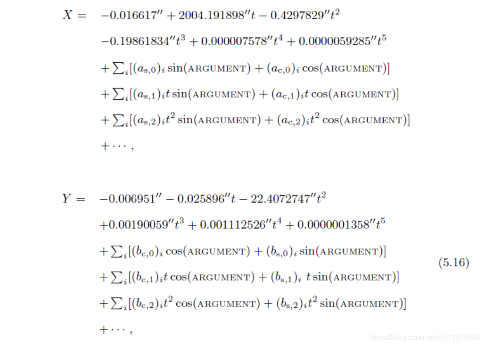
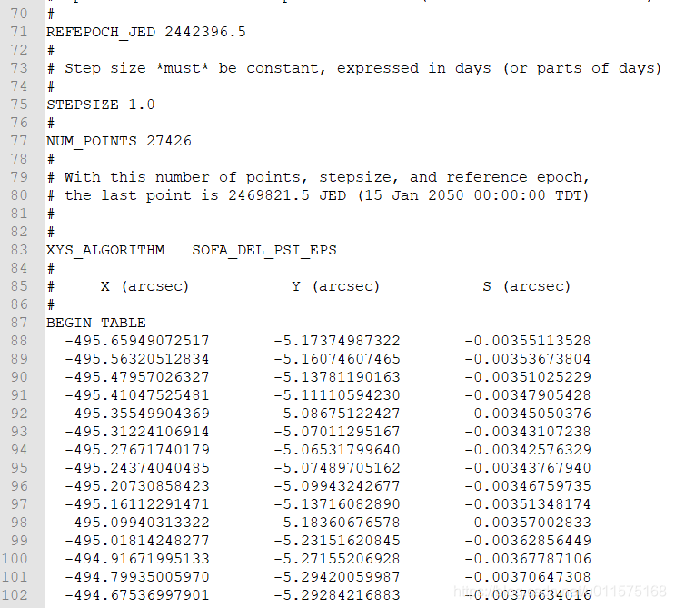
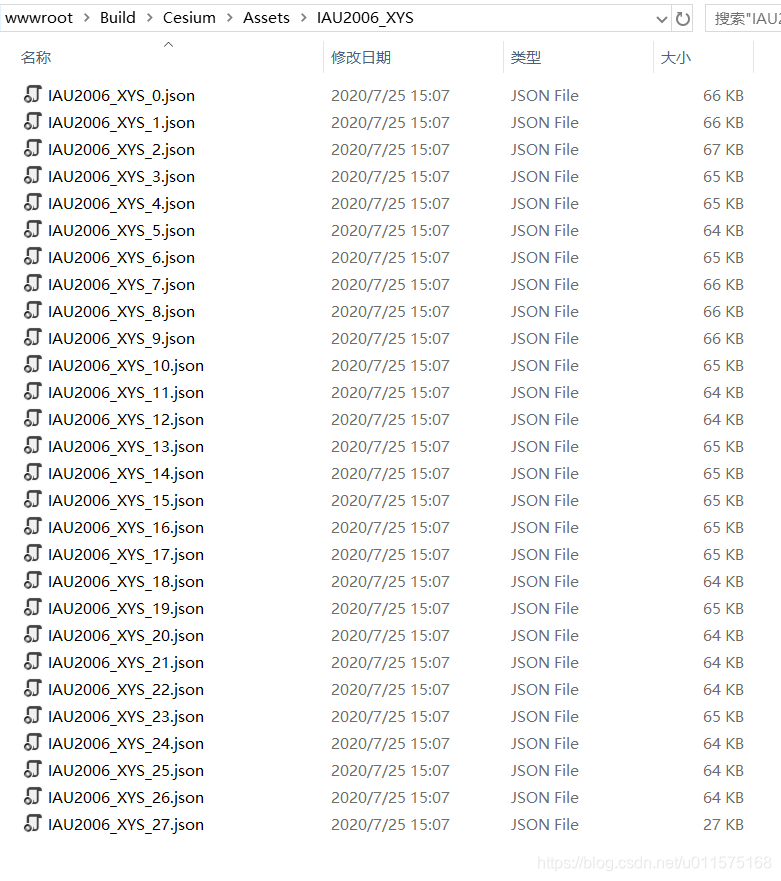
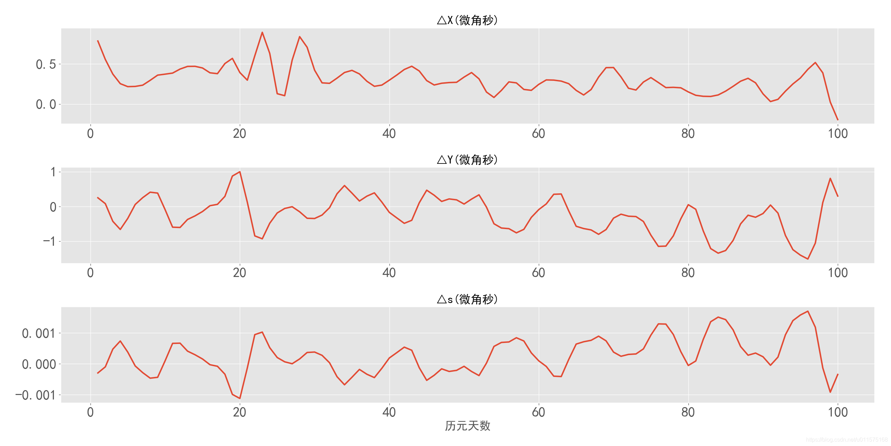

# Cesium中的地球坐标系转换：岁差章动计算(XYs)

从本章开始，介绍下Cesium中有关地球坐标系转换的相关内容。

在Cesium中，默认的中心天体为地球，且涉及到的地球坐标系有地心固连系和地心惯性系。

 - **地心固连系**，即地固系，Cesium和STK软件里都用Fixed表示，在IERS中的正式表示为：ITRF（或ITRS）（international terrestrial reference frame）。此坐标系和我们常见的WGS84系基本一致，仅微小差别。
 - **地心惯性系**，Cesium和STK软件里都用ICRF表示，也是IERS中的正式表述：ICRF（或ICRS）（international celestial reference frame）。此坐标系和我们常说的J2000惯性系有个常值矩阵的差别，也非常小。对于地心惯性系，ICRF等效为GCRS。
 
 有关ITRF和ICRF的详细描述和转换过程请参见我之前一篇文档：[ITRS/GCRS/J2000坐标系的相互转换](https://blog.csdn.net/u011575168/article/details/52081409)。
 
 从地固坐标系(ITRF)到地心惯性系(ICRF或GCRS）的坐标转换矩阵由极移，自转和岁差章动组成。

 本节主要阐述Cesium的岁差章动参数（X，Y，s）的计算方式。
 
 **概括起来一句话：受计算时间的限制，采用与STK软件中的计算方式：从文件读取预先计算好的数表，然后用拉格朗日差值法插值计算。**
 
 ##  岁差章动参数：X,Y,s
 根据IERS给出的最新的岁差章动理论模型，岁差章动的矩阵计算涉及到三个参数:X,Y,s。其中，X,Y为CIP在ICRF的XY平面内的坐标，s为CIO点在XY平面的具体位置。
X，Y的数值涉及到两部分，见下式：
$$(X,Y)=(X,Y)_{IAU2006}+(dX+dY)_{IERS}$$
其中， $(X,Y)_{IAU2006}$和$s$可根据IAU2006A/B岁差章动模型求解出，另外，由于IAU2000A/B岁差章动模型没有包含地轴的高频率运动，所以要加上IERS通过观测数据给出的高频率修正项$(dX+dY)_{IERS}$ 。

本节所讨论的内容就是前面的一项：$(X,Y)_{IAU2006}$的计算。

有关X,Y的计算，根据IAU2006的岁差章动模型，主要为数千项的三角函数的级数形式，IERS Conventions（2010）给出的公式如下：

我们可以看出，有关X、Y的级数计算方式原理简单，但是系数太多。
## Cesium和STK中的计算方法

在Cesium中，计算ITRF到ICRF的过程主要在前端进行的，且调用非常频繁。因此需要简单且精确的计算方式。因此如果还是采用上式的计算方式，估计满足不了计算的速度（我没测试过）。

因此，Cesium中采用了STK软件中的计算方式：预先计算好X、Y、s的数值，以一天一个点的方式存储到文件中。首次计算时，先读取文件中的系数。计算某时刻t的XYs时，从系数中找到离t最近的几天系数（根据插值阶数确定），然后采用拉格朗日插值法求解出精确数值。

以上计算方式有几方面好处：
 1. 提升计算效率：避免了对大量的三角函数的级数求和，节省了计算时间；
 2. 保证计算精度：由于X、Y、s的变化较为缓慢，因此间隔1天的采样点存储方式保证了一定的精度，再加上高阶的拉格朗日插值法，使得最终求得的数值不失真，保证原汁原味的精度（后面有论证结果）。
 3. 形式简单：采用拉格朗日插值法计算总比计算数千项的三角级数计算形式简单吧，且编程起来也容易。
## STK的数据文件
STK软件中，打开目录："C:\Program Files\AGI\STK 11\STKData\ICRF"，其中文件"IAU2006_XYS.Dat"即为X、Y、s的数据内容，其中部分内容见下图。

由数据内容可得到：

 1. 数据的历元起点时刻（ＴＴ）为2442396.5（15 Dec 1974 00:00:00 TT）；
 2. 每行三个数，分别是X,Y,s，单位为角秒(arcsec);
 3. 每天一行数据，一共27426行，即27426天，对应最后一行数据的时刻为15 Jan 2050 00:00:00（TT）；
 4. STK计算时使用拉格朗日插值法，默认插值阶数为9。

## Cesium的数据文件
Cesium软件包中，打开目录："\Build\Cesium\Assets\IAU2006_XYS"，其中文件"IAU2006_XYS_0.json"-"IAU2006_XYS_27.json"共27个数据文件即为X、Y、s的数据内容。注意，这27个文件里的内容皆以json格式存储。

**前面说过，Cesium中的XYS数据与STK中的内容一致**，从15 Dec 1974 00:00:00 TT到15 Jan 2050 00:00:00（TT），每天一个数据，共27426天。在Cesium中，1000天的数据存储为一个文件，即"IAU2006_XYS_0.json"中存储1-1000天的数据；"IAU2006_XYS_1.json"中存储1001-2000天的数据；以此类推。最后一个文件"IAU2006_XYS_27.json"仅存储426天的数据。

下面为"IAU2006_XYS_0.json"中的部分数据（注释是我自己添加的）：
```
{
    "version": "1.0",
    "updated": "2008 Dec 02 20:00:00 UTC",
    "interpolationOrder": 9,
    "xysAlgorithm": "SOFA_DEL_PSI_EPS",
    "sampleZeroJulianEphemerisDate": 2442396.5,
    "stepSizeDays": 1,
    "startIndex": 0,
    "numberOfSamples": 1000,
    "samples": [
        -0.002403025022753476,           //第1天的X(radian)   
        -2.5083047211757836e-5,          //第1天的Y(radian)
        -1.721638967214743e-8,			//第1天的s(radian)
        -0.002402558217007106,			//第2天的X(radian)   
        -2.5020003017226545e-5,			//第2天的Y(radian)
        -1.7146589882925253e-8,			//第2天的s(radian)
        ...													//第3天的X(radian)
        ...
```
从内容我们可以获知：

 1. 以json文件格式保存时，不再是一行三个参数的形式了，而是把所有天数的参数按照时间的顺序和XYs的顺序全部放到"samples"的数组中；
 2. X，Y，s的单位为弧度(radian)，STK中为角秒(arcsec)，仅此不同，数值都是一样的，有兴趣的读者可以自行转换一下。
## 计算函数与结果校对
有关XYs三个参数的读取和计算都放在模块"Iau2006XysData"中，对应的源代码文件在Cesium软件包目录中"\Source\Core\Iau2006XysData.js"。

Iau2006XysData模块里有函数computeXysRadians用于计算X、Y、s参数，但是并不能直接调用，一般是在计算ITRF到Fixed的转换矩阵时调用，内部会调用computeXysRadians，这个过程会在以后的文章中介绍。

最后，以儒略日2460000（TT）为零点，每天一个点，计算100天。分别使用SOFA软件包里的XYS06_series函数和Cesium里的函数进行计算并做比较，结果如下图。

可以看出，两者差别达到了微角秒量级，这个精度也是IAU2006岁差章动模型的精度，因此STK和Cesium这种采用拉格朗日插值法计算XYs参数的方法无计算精度的损失。


