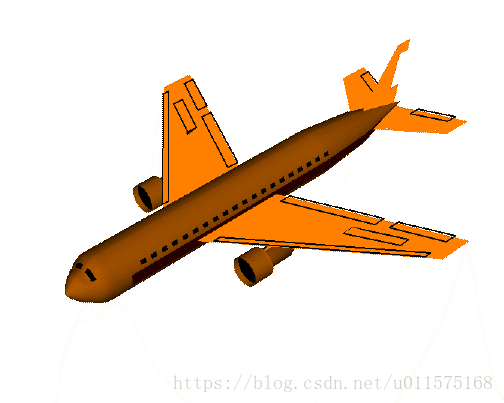
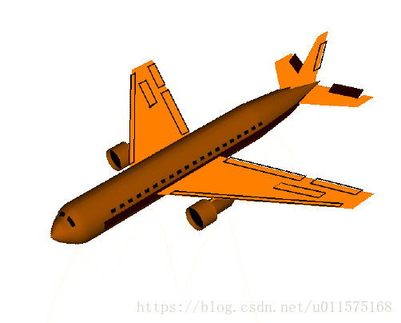
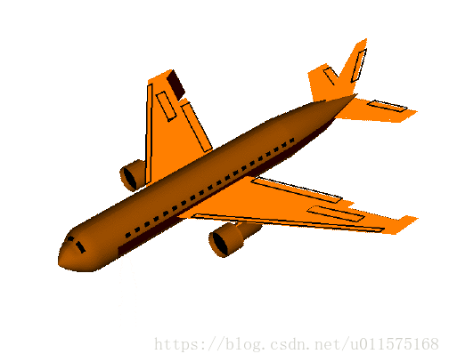
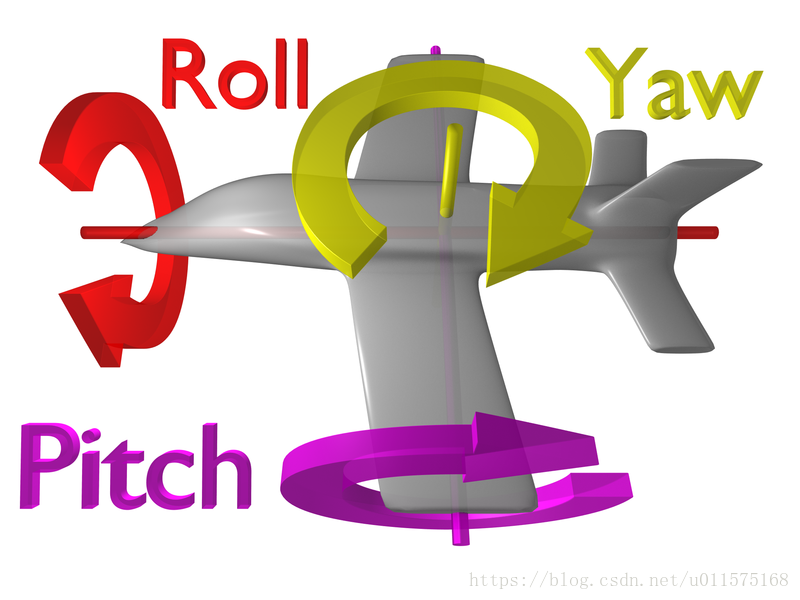
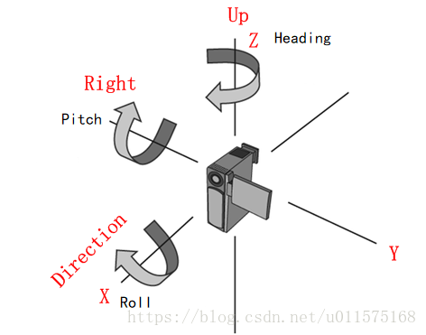
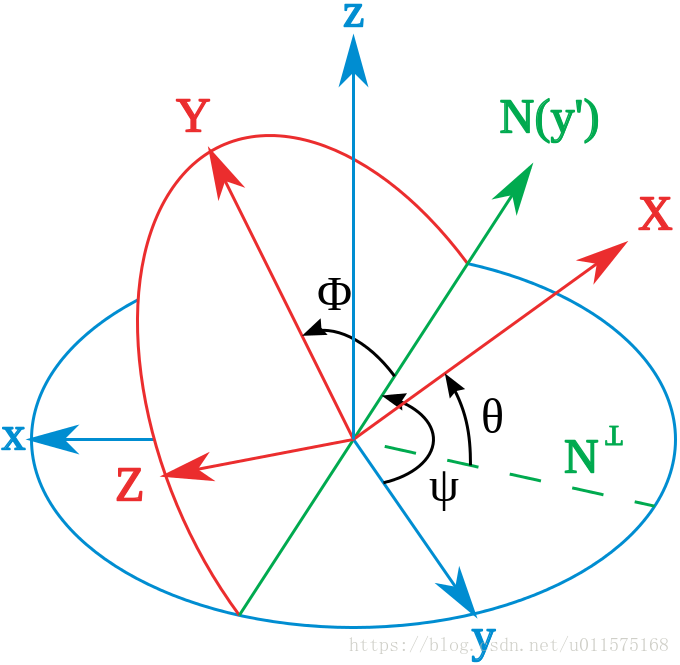

# Cesium中的相机—HeadingPitchRoll

在Cesium中，常常使用HeadingPitchRoll三个角度来定义相机坐标系相对某基准坐标系的方位。

在详细阐述这个概念之前，先阐述在航空飞行中常用的yaw/pitch/roll。
### 偏航(yaw)/俯仰(pitch)/滚动(roll)
在航空中，常用yaw,pitch,roll这三个词来表示飞机的俯仰、偏航、和滚动。为了避免混淆，这里暂时不用坐标系x,y,z轴来表示具体的旋转轴，而只是用描述性的语言。

首先看这三个词的翻译：
 - yaw：（火箭、飞机、宇宙飞船等）偏航
 yaw是偏航的意思，如果要改变航向，飞机必定是绕着重力方向为轴；
 - pitch:  倾斜；投掷；搭帐篷；坠落
 pitch有倾斜、坠落的意思。飞机在坠落时，必定会一头栽下去，以翅膀所在的直线为轴。常翻译为俯仰。
 - roll:  卷；滚动，转动；辗
roll的意思是翻滚，中文中飞机的翻滚是什么，就是绕着机身所在的那个轴。

再来看看简单的动画来描述yaw/pitch/roll
 1. 偏航（yaw），即机头朝左右摇摆 
2. 俯仰(pitch)，机头上下摇摆

3. 滚转(roll)，机身绕中轴线旋转

使用单独一副图来描述飞机的yaw/pitch/roll.

### Cesium中的Heading/Pitch/Roll的定义
注意，在上面描述飞机三个方向的旋转时，我们并没有将yaw/pitch/roll与具体的x,y,z轴关联，也没有指定yaw/pitch/roll的前后顺序，这主要是因为并没有一个具体的标准。

**重点来了：**
在Cesium中，Heading就是yaw，即偏航的意思。则相机的Heading/pitch/roll与飞机类似：
 - [ ] Heading=yaw，表示相机绕Up轴旋转，Up轴为+Z轴，且定义绕-Z轴旋转为正。
 - [ ] Pitch，表示相机绕Right轴旋转，Right轴为-Y轴，且定义绕-Y轴旋转为正。
 - [ ] Roll，表示相机绕Direction轴（视线方向）旋转，Direction轴为+X轴，且绕+X轴旋转为正。
 
 相机的三个旋转方向见下图示意，同时给出了Cesium中相机的Up/Right/Direction三个轴与X/Y/Z轴的关系。


**下面给出Heading/Pitch/Roll的旋转顺序：**

初始时刻，相机以坐标系$o-xyz$为参考基准，相机坐标系$o-XYZ$与之重合。

1. 绕z轴旋转角度$\psi$;
2. 接着绕新的y轴（下图中的N(y'))旋转角度$\theta$；
3. 最后绕着新的x轴（下图中的X轴）旋转角度$\phi$。
即相机坐标系经过三次基本的欧拉旋转，旋转到最终的坐标系$o-XYZ$（下图红色），欧拉转序为321（ZYX），旋转的角度遵循右手定则。


**注意，在Cesium中，常使用对象headingPitchRoll来表示相机的三次旋转角度，使用heading属性表示绕z轴旋转的角度（绕-z轴为正）；使用pitch表示绕y轴旋转的角度(绕-y轴为正）；使用roll表示绕x轴旋转角度（绕+x轴为正）；旋转顺序仍为321（ZYX)。**

因此，对比$\psi\theta\phi$，有以下关系：
$$
\psi = -heading \\
\theta = -pitch \\
\phi = roll
$$
### 旋转矩阵的表示
因此，以后再考虑HeadingPitchRoll旋转时，可正常按照321转序，欧拉角为$\psi、 \theta 、\phi$，只要注意前两个角度需要添加负号。

相机坐标系经过三次基本旋转（ZYX）后，以$\begin{bmatrix} X,Y,Z\end{bmatrix}^{T}$表示点P在相机坐标系$o-XYZ$中的坐标分量（始终不变），$\begin{bmatrix} x,y,z\end{bmatrix}^{T}$表示点P随相机旋转后在原坐标系$o-xyz$中的坐标分量，则有：
$$\begin{bmatrix} {x}\\{y} \\{z} \end{bmatrix}=M(\psi,\theta,\phi)
\begin{bmatrix} X \\Y \\Z \end{bmatrix}  =
M_z(\psi)\cdot M_y(\theta)\cdot  M_x(\phi)\cdot
\begin{bmatrix} X \\Y \\Z \end{bmatrix}  \\=
\begin{bmatrix} 
\cos\psi &-\sin\psi & 0 \\
\sin\psi &\cos\psi & 0\\
0 & 0 &1
\end{bmatrix}
\begin{bmatrix} 
\cos\theta &0 &\sin\theta\\
0 & 1 &0\\
-\sin\theta &0 &\cos\theta\\
\end{bmatrix}
\begin{bmatrix} 
1 & 0 &0 \\
0 &\cos\theta &-\sin\theta \\
0 &\sin\theta &\cos\theta \end{bmatrix}
\begin{bmatrix} X \\Y \\Z \end{bmatrix}  \\=
\begin{bmatrix} 
\cos\theta\cos\psi &-\cos\phi\sin\psi+\sin\phi\sin\theta\cos\psi &\sin\phi\sin\psi+\cos\phi\sin\theta\cos\psi \\
\cos\theta\sin\psi &\cos\phi\cos\psi+\sin\phi\sin\theta\sin\psi &-\sin\phi\cos\psi+\cos\phi\sin\theta\sin\psi \\
-\sin\theta &\sin\phi\cos\theta &\cos\phi\cos\theta \end{bmatrix}
\begin{bmatrix} X \\Y \\Z \end{bmatrix}  \qquad(1)
$$ 
旋转矩阵$M(\psi,\theta,\phi)$是将点P在相机坐标系中的坐标分量转换到相机旋转前的原坐标系中的坐标分量。

Cesium中，使用Matrix3对象表示3×3矩阵，其中表示相机HeadingPitchRoll的旋转矩阵（$M(\psi,\theta,\phi)$）代码如下：

```
 /**
     * Computes a 3x3 rotation matrix from the provided headingPitchRoll. (see http://en.wikipedia.org/wiki/Conversion_between_quaternions_and_Euler_angles )
     *
     * @param {HeadingPitchRoll} headingPitchRoll the headingPitchRoll to use.
     * @param {Matrix3} [result] The object in which the result will be stored, if undefined a new instance will be created.
     * @returns {Matrix3} The 3x3 rotation matrix from this headingPitchRoll.
     */
    Matrix3.fromHeadingPitchRoll = function(headingPitchRoll, result) {
        //>>includeStart('debug', pragmas.debug);
        Check.typeOf.object('headingPitchRoll', headingPitchRoll);
        //>>includeEnd('debug');

		//	注意此处，为了使用正常的321转序，此处需将heding和pitch的角度加上负号
        var cosTheta = Math.cos(-headingPitchRoll.pitch);
        var cosPsi = Math.cos(-headingPitchRoll.heading);
        var cosPhi = Math.cos(headingPitchRoll.roll);
        var sinTheta = Math.sin(-headingPitchRoll.pitch);
        var sinPsi = Math.sin(-headingPitchRoll.heading);
        var sinPhi = Math.sin(headingPitchRoll.roll);
		
		//	第1行矩阵元素
        var m00 = cosTheta * cosPsi;
        var m01 = -cosPhi * sinPsi + sinPhi * sinTheta * cosPsi;
        var m02 = sinPhi * sinPsi + cosPhi * sinTheta * cosPsi;
		
		//	第2行矩阵元素
        var m10 = cosTheta * sinPsi;
        var m11 = cosPhi * cosPsi + sinPhi * sinTheta * sinPsi;
        var m12 = -sinPhi * cosPsi + cosPhi * sinTheta * sinPsi;
		
		//	第3行矩阵元素
        var m20 = -sinTheta;
        var m21 = sinPhi * cosTheta;
        var m22 = cosPhi * cosTheta;

        if (!defined(result)) {
            return new Matrix3(m00, m01, m02,
                m10, m11, m12,
                m20, m21, m22);
        }
        result[0] = m00;
        result[1] = m10;
        result[2] = m20;
        result[3] = m01;
        result[4] = m11;
        result[5] = m21;
        result[6] = m02;
        result[7] = m12;
        result[8] = m22;
        return result;
    };
```
### 四元素的表示
参考[Cesium中的相机—四元素](https://blog.csdn.net/u011575168/article/details/83034048)一文中连续旋转的四元素乘法规则，相机从原坐标系$o-xyz$历经321（ZYX）三次旋转的四元素表示为：
$$q(\psi,\theta,\phi)=q_z(\psi)\cdot q_y(\theta) \cdot q_x(\phi)=
\begin{bmatrix}\cos(\psi/2) \\0 \\0 \\ \sin(\psi/2) \end{bmatrix}
\begin{bmatrix}\cos(\theta/2) \\0 \\ \sin(\theta/2) \\0 \end{bmatrix}
\begin{bmatrix}\cos(\phi/2) \\ \sin(\phi/2) \\0 \\0  \end{bmatrix} \\=
\begin{bmatrix}
 \cos(\phi/2)\cos(\theta/2)\cos(\psi/2)+\sin(\phi/2)\sin(\theta/2)\sin(\psi/2)\\
 \sin(\phi/2)\cos(\theta/2)\cos(\psi/2)-\cos(\phi/2)\sin(\theta/2)\sin(\psi/2)\\
 \cos(\phi/2)\sin(\theta/2)\cos(\psi/2)+\sin(\phi/2)\cos(\theta/2)\sin(\psi/2)\\
 \cos(\phi/2)\cos(\theta/2)\sin(\psi/2)-\sin(\phi/2)\sin(\theta/2)\cos(\psi/2)
\end{bmatrix}  \qquad(2)$$ 
上式中，$q_z(\psi)$表示绕Z轴旋转$\psi$角度的四元素，其它类似。

参考[Cesium中的相机—四元素](https://blog.csdn.net/u011575168/article/details/83034048)文中式（5），将四元素$q(\psi,\theta,\phi)$可表示为旋转矩阵，则本文中，式（1）和式（2）相等。

Cesium中，使用对象Quaternion表示四元素，则由表示相机HeadingPitchRoll的表示的四元素源代码如下：
```
	//	临时四元素对象存储
    var scratchHPRQuaternion = new Quaternion();
    var scratchHeadingQuaternion = new Quaternion();
    var scratchPitchQuaternion = new Quaternion();
    var scratchRollQuaternion = new Quaternion();

    /**
     * Computes a rotation from the given heading, pitch and roll angles. Heading is the rotation about the
     * negative z axis. Pitch is the rotation about the negative y axis. Roll is the rotation about
     * the positive x axis.
     *
     * @param {HeadingPitchRoll} headingPitchRoll The rotation expressed as a heading, pitch and roll.
     * @param {Quaternion} [result] The object onto which to store the result.
     * @returns {Quaternion} The modified result parameter or a new Quaternion instance if none was provided.
     */
    Quaternion.fromHeadingPitchRoll = function(headingPitchRoll, result) {
        //>>includeStart('debug', pragmas.debug);
        Check.typeOf.object('headingPitchRoll', headingPitchRoll);
        //>>includeEnd('debug');

		//	注意此处，为了使用正常的321转序，此处需将heding和pitch的角度加上负号
		//	最终的四元素=qz•qy•qx
        scratchRollQuaternion = Quaternion.fromAxisAngle(Cartesian3.UNIT_X, headingPitchRoll.roll, scratchHPRQuaternion);
        scratchPitchQuaternion = Quaternion.fromAxisAngle(Cartesian3.UNIT_Y, -headingPitchRoll.pitch, result);
        result = Quaternion.multiply(scratchPitchQuaternion, scratchRollQuaternion, scratchPitchQuaternion);
        scratchHeadingQuaternion = Quaternion.fromAxisAngle(Cartesian3.UNIT_Z, -headingPitchRoll.heading, scratchHPRQuaternion);
        return Quaternion.multiply(scratchHeadingQuaternion, result, result);
    };
```
### 小结
Cesium中，使用Heading /Pitch /Roll来分别表示相机坐标系绕Z、Y、X轴的3次连续旋转，需要注意的是，Heading和Pitch的旋转角度与普通右手旋转的符号相反，因此在计算中需要在前两个角度加上负号，再进行321转序的旋转。

Cesium采用的是第二种旋转方式，因此连续旋转时，最先旋转的矩阵（或四元素）在最左边。

由HeadingPitchRoll创建的旋转矩阵Matrix3（或者四元素表示的）是把相机坐标系中的点坐标转换为原坐标系中（不一定是世界坐标系）的坐标。


