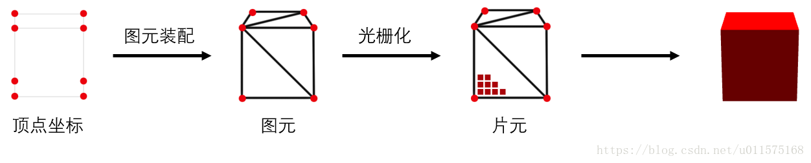
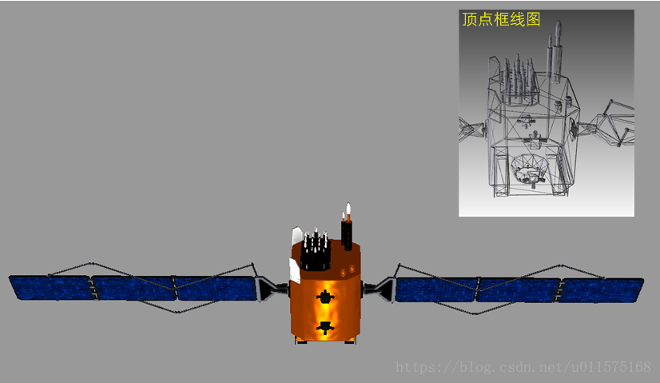
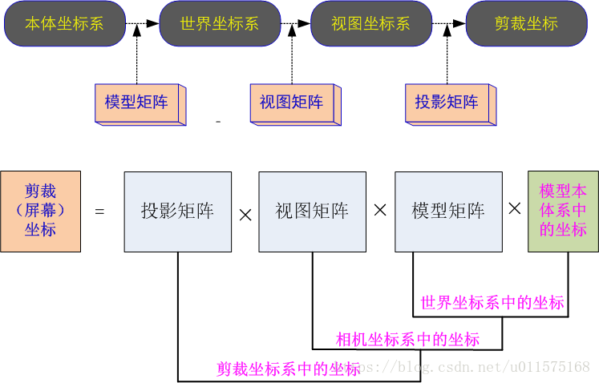
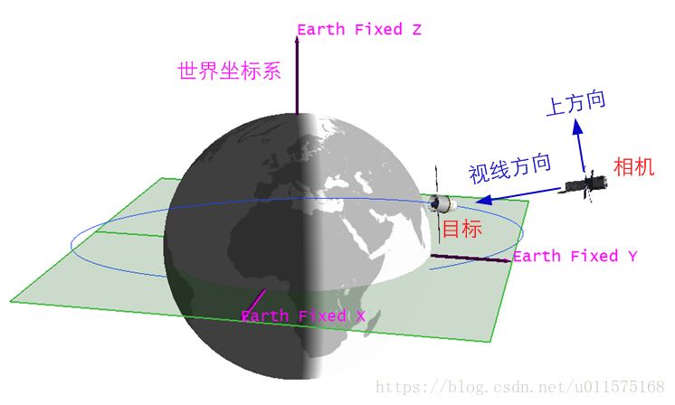
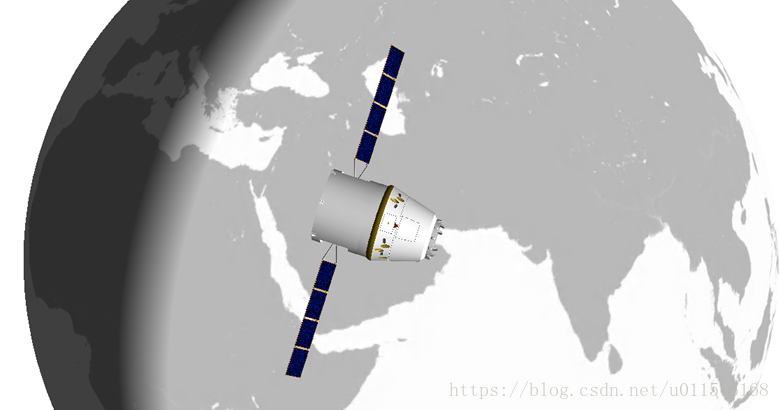
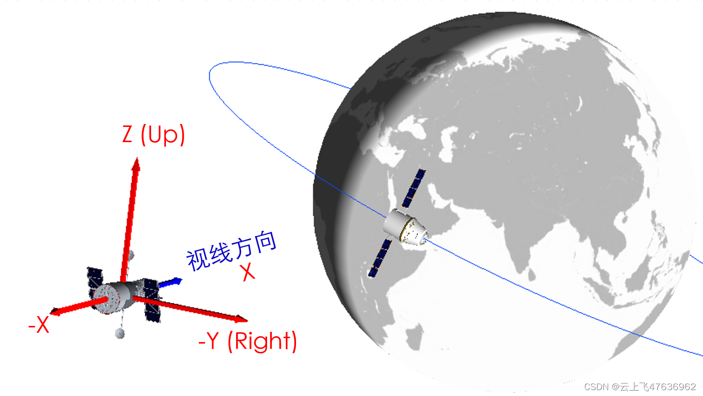

# Cesium中的相机—WebGL基础

Cesium是基于Html5 WebGL技术在浏览器中显示三维物体，本文阐述一下WebGL显示三维物体的基本概念。

需要说明是，在三维场景中，相机(Cesium中为**Camera**)指的是观察者，即用相机模拟人眼观测，因此在以后各篇章中，为避免读者引起疑惑，以下名词等效：

**相机=摄像机=人眼=观察者**

# WebGL 三维场景渲染原理
 WebGL是基于GLSL ES（着色器语言）的，并以字符串的形式在JavaScript中编写的。WebGL中有两种着色器：
 
 - 顶点着色器（Vertex shader）：顶点着色器用来描述顶点特性（如位置、颜色）的程序。
 **Vertex（顶点）** 是指二维或三维空间中的一个点。
 - 片元着色器（Fragment shader）：进行逐片元处理过程（如光照、纹理贴图）的程序。**片元(Fragment)** 是一个WebGL属于，你可以将其理解为像素（图像的单元）。
 
 简单的说，在三维场景中，仅仅用线条和颜色把图形画出来是远远不够的。你必须考虑，比如，光线照上去之后，或者观察者的视角发生变化，对场景会有些什么影响。着色器可以高度灵活地完成这些工作，提供各种渲染效果。这就是当今计算器制作出的三维场景如此逼真和令人震撼的原因。

当然，在Cesium中，我们不需要接触到底层的东西，Cesium已经全部通过函数的方式为我们包装好相应的功能，使用时直接调用相关API即可。

简单的说，任何一个三维模型，都是一系列的点组成，再由点组成一系列的三角形，而在WebGL中也只能通过绘制三种图形（点、线段和三角形）来绘制整个模型。

WebGL绘制过程包括以下三步：
 1. 获取顶点坐标
 2. 图元装配（即画出一个个三角形）
 3. 光栅化（生成片元，即一个个像素点）

尽管模型有着成千上万个顶点，但是在渲染过程中，是一个个顶点顺序处理的，也就是说所有顶点的处理步骤是一样的，**因此，在各种文档中，阐述坐标转换时，仅仅以一个点为例，读者需要清楚这一点。**

下图为某卫星的渲染图和顶点框线图。

# 模型矩阵、视图矩阵、投影矩阵
计算机屏幕显示一个三维物体时，实际上是把三维空间中的模型转换为屏幕上的二维的点坐标，本质上是一个投影变换，即：将三维空间中的物体映射到二维屏幕上，基本的流程如下：

 1. 在一个世界坐标系中建立场景，场景中所有的对象（即各种三维模型，如地球、飞船、地面站）的顶点坐标均要在世界坐标系中表示。
 	
 	但是，通常我们建立模型的时候，模型所有顶点的坐标都是相对模型本体坐标系的，根本不知道世界坐标系，怎么办？
 	还有，如果模型一直在运动怎么办？比如卫星绕地球运行。
 	 	
	没有关系，在WebGL中，缓存中存储的模型顶点的坐标就是原始坐标，通常就是模型本体坐标系下的坐标。在每一帧渲染时，需要根据模型在世界坐标系中的位置和姿态，将模型的所有顶点坐标转换为世界坐标系中的坐标，这个转换过程可用一4×4的矩阵表示，称为**模型矩阵(Model Matrix**。
	
2.  有了世界坐标系中的所有顶点坐标还不够，还需要知道相机的位置和观察方位。相机模拟的是人眼对世界的观测，相机的位置不同、方向不同，所观测到的同一个世界的场景也不同，就像我们平时往前看和往后看的景色不一样，但是我们所处的世界都是同一个世界。

	因此，需要根据相机的位置和观察方位，将世界坐标系中的所有顶点坐标转换为视图坐标系 **（也称相机坐标系）** 中的坐标，这个转换过程也可用一4×4的矩阵表示，称为**视图矩阵（View Matrix）**
	
3. 在相机坐标中，所有模型的顶点坐标仍是三维的（具有x,y,z三个分量），而显示器是二维的（x,y两个分量），因此还需将三维的顶点坐标投影到二维平面上去（也称剪裁坐标）。对于人眼观测世界来说，远处的东西显得比近处的小，这种投影方式称之为透视投影，仍可用一4×4的矩阵表示，称为**（透视）投影矩阵（Perspective projection Matrix）**
 
 就是通常所说的模型视图投影矩阵（MVP），流程图见下。
 
其中，模型矩阵、视图矩阵、投影矩阵均为4×4的矩阵。

# Cesium中的世界坐标系与相机坐标系
在Cesium中，Camera对象是处理相机的位置和观察方位的，显然，是属于上述三个矩阵中的**视图矩阵**。

Cesium中，世界坐标系就是地球的WGS84系，也即地球固连坐标系（Earth Fiexed），在此坐标中定义相机的位置与观测方位。

下图中，目标为一运动的飞船，其在WGS84系中的位置是时刻变化的。相机位置、视线方向和相机的上方向均在WGS84系下表达。

根据相机的位置和观察方位，可给出相机观测到的场景，见下示意图。

Cesium中的相机坐标系见下图(使用Hubble望远镜示意相机)，在Camera对象中，通常用三个矢量来表示：Up、Right和Direction，这三个方向确定了相机的观测方位。Up、Right、Direction与相机坐标系（视图坐标系）XYZ三轴的关系为：
X=Direction
Y=Left
Z=Up

Cesium中，Camera对象中已经包含很多常见设置函数。掌握视图矩阵的概念，即可熟练对Cesium中的相机（Camera）的各项参数进行设置。后续我们会逐渐从源代码分析Camera中各种函数所实现的过程及相应的功能。

综上所述，模型、视图和投影矩阵是三维计算机图形学的基石。关于这三个矩阵的知识虽然不是我们学习Cesium的必须，但是至少能够帮助我们更好地了解那些库函数在做些什么，或者自己直接操作矩阵对象。

# 参考资料
如果对WebGL基础想具体了解的，可参考以下文章：

 - WebGL编程指南
 老外写的一本WebGL入门书籍，从入门到逐渐深入讲解WebGL的各种原理，如果对WebGL原理有兴趣的，强烈推荐。写的浅显易懂，且有代码一步步示范。
 - [图解WebGL&Three.js工作原理](https://www.cnblogs.com/wanbo/p/6754066.html)
- [webgl笔记-1.模型视图矩阵和投影矩阵](https://www.cnblogs.com/yiyezhai/archive/2012/09/12/2677902.html)
- [webgl开发第一道坎——矩阵与坐标变换](http://www.cnblogs.com/dojo-lzz/p/7223364.html)

