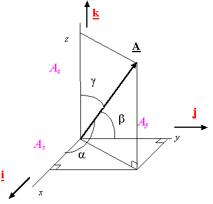

# Cesium中的相机—方向余弦阵

前面在讨论两个不同坐标系之间的转换时都是通过欧拉旋转或者四元素来定义的。今天直接给出方向余弦阵的定义和用途。
## 方向余弦的定义
方向余弦是指在解析几何里，一个向量的三个方向余弦分别是这向量与三个坐标轴之间的角度的余弦。
如下图中，矢量A与坐标系三个轴$i,j,k$的夹角为$\alpha,\beta,\gamma$,则矢量A的方向余弦就是：
$$[\cos(\alpha),\cos(\beta),\cos(\gamma)]$$

## 方向余弦矩阵
方向余弦矩阵是由两组不同的标准正交基的基底向量之间的方向余弦所形成的矩阵。方向余弦矩阵可以用来表达一组标准正交基与另一组标准正交基之间的关系。
使用$i_b,j_b,k_b$表示直角坐标系$ox_by_bz_b(b系)$的三个坐标轴的基向量，用$i_i,j_i,k_i$表示直角坐标系$ox_iy_iz_i(i系)$的三个坐标轴的基向量，则$i_b,j_b,k_b$（单位向量）分别可用$i_i,j_i,k_i$表示：
$$\left\{\begin{matrix}
i_b=(i_b\cdot i_i)i_i+(i_b\cdot j_i)j_i+(i_b\cdot k_i)k_i\\
j_b=(j_b\cdot i_i)i_i+(j_b\cdot j_i)j_i+(j_b\cdot k_i)k_i\\
k_b=(k_b\cdot i_i)i_i+(k_b\cdot j_i)j_i+(k_b\cdot k_i)k_i\\
\end{matrix}\right. \qquad(1)$$
上式中，
$[(i_b\cdot i_i),(i_b\cdot j_i),(i_b\cdot k_i)]$为单位矢量$i_b$ 在坐标系$ox_iy_iz_i$的方向余弦；
$[(j_b\cdot i_i),(j_b\cdot j_i),(j_b\cdot k_i)]$为单位矢量$j_b$ 在坐标系$ox_iy_iz_i$的方向余弦；
$[(k_b\cdot i_i),(k_b\cdot j_i),(k_b\cdot k_i)]$为单位矢量$k_b$ 在坐标系$ox_iy_iz_i$ 的方向余弦。

将$i_b,j_b,k_b$分别在坐标系$ox_iy_iz_i$的方向余弦组成矩阵$M$(注意，按列组成)：
$$M=\begin{bmatrix}
i_b\cdot i_i &j_b\cdot i_i &k_b\cdot i_i\\
i_b\cdot j_i &j_b\cdot j_i &k_b\cdot j_i\\
i_b\cdot k_i &j_b\cdot k_i &k_b\cdot k_i
\end{bmatrix} \qquad(2)$$
则矩阵$M$即为b系到i系的坐标变换矩阵(推导过程略）。

假设点P在b系中的坐标为$\begin{bmatrix} x_b,y_b,z_b\end{bmatrix}^{T}$,在i系中的坐标为$\begin{bmatrix} x_i,y_i,z_i\end{bmatrix}^{T}$，则两者通过坐标旋转矩阵$M$联系：
$$\begin{bmatrix} x_i\\y_i \\z_i \end{bmatrix}=
M\cdot\begin{bmatrix} x_b \\y_b \\z_b \end{bmatrix} \qquad(3)$$ 
## 方向余弦的应用
之前我们通过欧拉旋转或者四元素的方式得到两个坐标系之间的坐标变换矩阵$M$，而现在我们多了一种方法得到$M$。

假设上式中，$i$系为原始坐标系，$b$系为相机坐标系，那么我只要知道了相机坐标系（b系）的三个坐标轴的基向量$i_b,j_b,k_b$在$i$系中的坐标（方向余弦，式1），就可以得到坐标变换矩阵$M$（式2）。实际上只要知道两个基向量即可，剩下的用前两个基向量叉乘即可。

