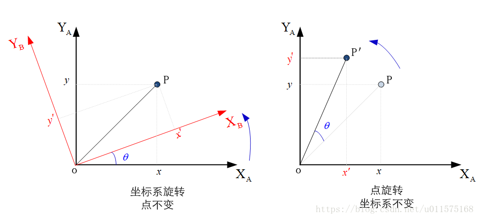
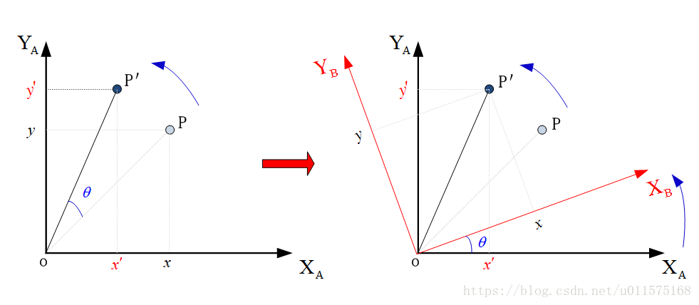
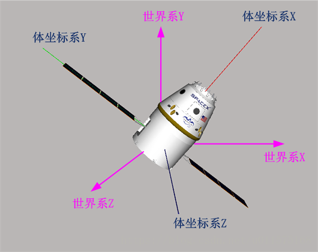

# Cesium中的相机—旋转矩阵

在学习坐标旋转的时候，一不小心就会把坐标系的旋转和矢量的旋转弄错，这里给出详细的两种旋转过程：
## 两种旋转矩阵的定义 ##
下面仅以绕Z轴旋转为例，给出两种旋转的过程定义。
 1. **坐标系旋转，点不变(见下左图)**
   - 两个坐标系$O-X_AY_AZ_A$和$O-X_BY_BZ_B$初始时重合。
   - 点P在原坐标系$O-X_AY_AZ_A$中的坐标分量为$(x,y,z)$；
   - 若将坐标系$O-X_BY_BZ_B$绕Z轴旋转（右手旋转法则）$\theta$角度，则点P在新的坐标$O-X_BY_BZ_B$中的坐标分量为$({x}',{y}',{z}')$
   - 同一个点P在两个坐标系中的坐标分量(列向量的形式)的关系可以由下面旋转矩阵的形式关联：
$$\begin{bmatrix} {x}'\\{y}' \\{z}' \end{bmatrix}=
\begin{bmatrix} 
\cos\theta &\sin\theta & 0 \\
-\sin\theta &\cos\theta & 0\\
0 & 0 &1
\end{bmatrix}
\begin{bmatrix} x \\y \\z \end{bmatrix}$$
 2. **点旋转，坐标系不变**
 - 点P在原坐标系$O-X_AY_AZ_A$中的坐标分量为$(x,y,z)$；
 - 若将P绕Z轴旋转（右手旋转法则）$\theta$角度，则新的点P'的坐标分量（仍为坐标系$O-X_AY_AZ_A$）为$({x}',{y}',{z}')$
 - 点P旋转前后的坐标分量(列向量的形式)的关系可以由下面旋转矩阵的形式关联：
$$\begin{bmatrix} {x}'\\{y}' \\{z}' \end{bmatrix}=
\begin{bmatrix} 
\cos\theta &-\sin\theta & 0 \\
\sin\theta &\cos\theta & 0\\
0 & 0 &1
\end{bmatrix}
\begin{bmatrix} x \\y \\z \end{bmatrix}$$ 

## 两者的关联 ##
可以看出，两种旋转方式的旋转矩阵刚好是转置或者互逆的。在使用的时候一定要区别清楚是哪一种。

以第二种为例，即一个点的旋转前后坐标分量的关系，可以等效成下图的转换过程：
 - 两个坐标系$O-X_AY_AZ_A$和$O-X_BY_BZ_B$初始时重合；
 - 点P在坐标系$O-X_BY_BZ_B$中的坐标分量为$(x,y,z)$；
 - 若将坐标系$O-X_BY_BZ_B$绕Z轴旋转（右手旋转法则）$\theta$角度，同时点P固定在坐标系$O-X_BY_BZ_B$中随坐标系一起旋转；
 -  旋转后的点p'在坐标系$O-X_AY_AZ_A$中的新坐标分量为$({x}',{y}',{z}')$

若只看点P'，则其在坐标系$O-X_BY_BZ_B$中的坐标分量为$(x,y,z)$（无论坐标系$O-X_BY_BZ_B$如何旋转），在坐标系$O-X_AY_AZ_A$中的坐标分量为$({x}',{y}',{z}')$，参考上面第一种旋转转换方式，则有：
$$\begin{bmatrix} x \\y \\z \end{bmatrix}=
\begin{bmatrix} 
\cos\theta &\sin\theta & 0 \\
-\sin\theta &\cos\theta & 0\\
0 & 0 &1
\end{bmatrix}
\begin{bmatrix} {x}'\\{y}' \\{z}' \end{bmatrix}$$
左乘旋转矩阵的逆矩阵，即可得到：
$$\begin{bmatrix} {x}'\\{y}' \\{z}' \end{bmatrix}=
\begin{bmatrix} 
\cos\theta &-\sin\theta & 0 \\
\sin\theta &\cos\theta & 0\\
0 & 0 &1
\end{bmatrix}
\begin{bmatrix} x \\y \\z \end{bmatrix}$$ 
**因此，本质上两种旋转是一样的！！！仅仅是表现形式不同而已！**
## STK Component与Cesium中旋转矩阵的区别
### 旋转矩阵的特点
绕X、Y、Z轴的矩阵称为旋转矩阵（也称基础旋转矩阵），它是一个正交矩阵，即有：
$$MM^{-1}=MM^{T}=I$$
**STK Component中定义的旋转矩阵为第一种，Cesium及其他WebGL系统中的旋转矩阵为第二种！**
下面给出两种旋转矩阵的完整形式。
### 第一种旋转矩阵(仅坐标系旋转)
绕X轴的旋转矩阵：
$$M_x=
\begin{bmatrix} 
1 & 0 &0 \\
0 & \cos\theta &\sin\theta \\
0 & -\sin\theta &\cos\theta \\
\end{bmatrix} $$
绕Y轴的旋转矩阵：
$$M_y=
\begin{bmatrix} 
\cos\theta &0 &-\sin\theta \\
0 & 1 &0 \\
\sin\theta &0 &\cos\theta \\
\end{bmatrix}$$
绕Z轴的旋转矩阵：
$$M_z=
\begin{bmatrix} 
\cos\theta &\sin\theta & 0 \\
-\sin\theta &\cos\theta & 0\\
0 & 0 &1
\end{bmatrix}$$ 
若令$M$表示旋转矩阵，则有：
$$\begin{bmatrix} {x}'\\{y}' \\{z}' \end{bmatrix}=
M\cdot\begin{bmatrix} x \\y \\z \end{bmatrix}$$ 
其中，$\begin{bmatrix} x,y,z\end{bmatrix}^{T}$表示点P在原坐标系中的坐标分量，$\begin{bmatrix} x',y',z'\end{bmatrix}^{T}$表示点P在旋转后的坐标系中的坐标分量。
### 第二种旋转矩阵(点或矢量随坐标系一起旋转)
绕X轴的旋转矩阵：
$$M_x=
\begin{bmatrix} 
1 & 0 &0 \\
0 & \cos\theta &-\sin\theta \\
0 & \sin\theta &\cos\theta \\
\end{bmatrix} $$
绕Y轴的旋转矩阵：
$$M_y=
\begin{bmatrix} 
\cos\theta &0 &\sin\theta \\
0 & 1 &0 \\
-\sin\theta &0 &\cos\theta \\
\end{bmatrix}$$
绕Z轴的旋转矩阵：
$$M_z=
\begin{bmatrix} 
\cos\theta &-\sin\theta & 0 \\
\sin\theta &\cos\theta & 0\\
0 & 0 &1
\end{bmatrix}$$ 
同样，若令$M$表示旋转矩阵，则有：
$$\begin{bmatrix} {x}'\\{y}' \\{z}' \end{bmatrix}=
M\cdot\begin{bmatrix} x \\y \\z \end{bmatrix}$$ 
其中，$\begin{bmatrix} x,y,z\end{bmatrix}^{T}$表示点P在旋转后坐标系中的坐标分量（始终不变），$\begin{bmatrix} x',y',z'\end{bmatrix}^{T}$表示点P旋转后在原坐标系中的坐标分量。
## 旋转矩阵与模型矩阵
**在Cesium中，采用第2种的旋转矩阵！**

在[Cesium中的相机—WebGL基础](https://mp.csdn.net/mdeditor/82824438#)中，我们说过，在WebGL中，缓存中存储的模型顶点的坐标就是原始坐标，通常就是模型本体坐标系下的坐标。在每一帧渲染时，需要根据模型在世界坐标系中的位置和姿态，将模型的所有顶点坐标转换为世界坐标系中的坐标，这个转换过程可用一4×4的矩阵表示，称为**模型矩阵(Model Matrix）**。

模型矩阵是4X4的矩阵，若仅考虑旋转（不考虑平移），则模型矩阵为3X3的矩阵，也就是旋转矩阵。

见下图，假设模型体坐标系初始与世界系重合，经过一系列的旋转后，体坐标系不再与世界系重合。

定义$M$为世界系到体坐标系的旋转矩阵，则模型（见下图龙飞船模型）上任意一点P的坐标$\begin{bmatrix} x,y,z\end{bmatrix}^{T}$在世界系中的坐标为$\begin{bmatrix} x',y',z'\end{bmatrix}^{T}$，两者通过旋转矩阵联系：
$$\begin{bmatrix} {x}'\\{y}' \\{z}' \end{bmatrix}=
M\cdot\begin{bmatrix} x \\y \\z \end{bmatrix}$$ 

这就是Cesium中旋转矩阵的定义，它将模型本体系中的坐标转换到世界坐标系中的坐标，因此也用来表示模型矩阵。

在上面阐述模型矩阵的过程中，我们定义了$M$为世界系到体坐标系的旋转矩阵，实际上它可为一系列基础旋转矩阵的组合，后面再单独阐述！

