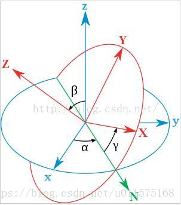

# Cesium中的相机—欧拉旋转

在[Cesium中的相机—旋转矩阵](https://blog.csdn.net/u011575168/article/details/82914686)一文中，我们给出了对于绕某个轴旋转的旋转矩阵，并给出了两种旋转方式的区别。

本文讨论连续旋转的旋转矩阵，仍然给出两种旋转的区别。

下图中，原始坐标系$o-xyz$为蓝色所示，经过三次欧拉旋转后得到最终的坐标系$o-XYZ$（图中红色）。

三次旋转为：
1. 首先绕Z轴旋转$\alpha$角度，此时X轴指向N；
2. 然后绕新的坐标系的X轴（N方向）旋转$\beta$角度，此时将原来的Z轴旋转至红色的Z轴方向；
3. 最后再绕新的坐标系的Z轴（红色）旋转$\gamma$角度，得到最终的坐标系$o-XYZ$（图中红色）。

则坐标系$o-xyz$到坐标$o-XYZ$的旋转矩阵可由三次旋转矩阵相乘得到，每次旋转的角度称为欧拉角。

下面仍然分两种方式，分别给出，以便区别。
### 第一种旋转矩阵(仅坐标系旋转)
若以$\begin{bmatrix} x,y,z\end{bmatrix}^{T}$表示点P在原坐标系$o-xyz$中的坐标分量，$\begin{bmatrix} x',y',z'\end{bmatrix}^{T}$表示点P在旋转后的坐标系$o-XYZ$中的坐标分量，则有：
$$\begin{bmatrix} {x}'\\{y}' \\{z}' \end{bmatrix}=
M\cdot\begin{bmatrix} x \\y \\z \end{bmatrix}=
M_z(\gamma)\cdot M_x(\beta)\cdot M_z(\alpha)\cdot\begin{bmatrix} x \\y \\z \end{bmatrix} (1)$$ 
旋转矩阵$M$是将点P在原坐标系中的坐标分量转换到新坐标系中的坐标分量。
### 第二种旋转矩阵(点或矢量随坐标系一起旋转)
以$\begin{bmatrix} x,y,z\end{bmatrix}^{T}$表示点P在旋转后坐标系$o-XYZ$中的坐标分量（始终不变），$\begin{bmatrix} x',y',z'\end{bmatrix}^{T}$表示点P旋转后在原坐标系$o-xyz$中的坐标分量，则有：
$$\begin{bmatrix} {x}'\\{y}' \\{z}' \end{bmatrix}=
M\cdot\begin{bmatrix} x \\y \\z \end{bmatrix}=
M_z(\alpha)\cdot M_x(\beta)\cdot  M_z(\gamma)\cdot\begin{bmatrix} x \\y \\z \end{bmatrix} (2)$$ 
点P始终随坐标系$o-XYZ$一起旋转，因此坐标分量始终为$\begin{bmatrix} x,y,z\end{bmatrix}^{T}$
旋转矩阵$M$是将点P在旋转后坐标系$o-XYZ$（也可看成体坐标系）中的坐标分量转换到旋转前的原坐标系中的坐标分量。

**注意！上述两式中，基础旋转矩阵刚好互逆，即式（1）和式（2）中的$M_z(\alpha)$(其它类似)是不同的，刚好互为转置，详细形式参见[Cesium中的相机—旋转矩阵](https://blog.csdn.net/u011575168/article/details/82914686)。**

**Cesium中，采用第二种旋转矩阵的形式！**

