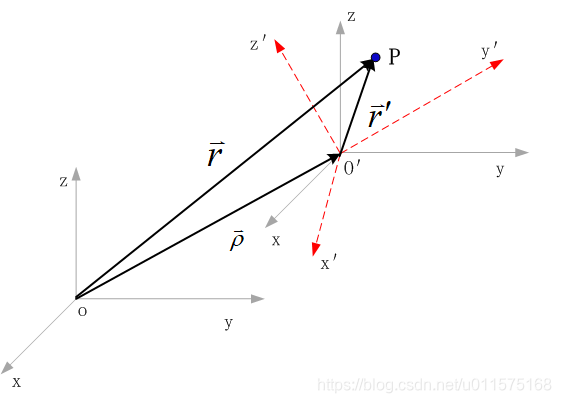

# Cesium中的相机—齐次坐标与坐标变换

在前面几个章节中，我们仅仅讨论了两个坐标系之间的坐标转换矩阵，涉及到四元素、方向余弦阵、欧拉旋转等各种表现形式，但并没有涉及到两个坐标系的平移。

首先看两个坐标系之间的坐标转换矩阵：
$$\begin{bmatrix} x_i\\y_i \\z_i \end{bmatrix}=
M\cdot\begin{bmatrix} x_b \\y_b \\z_b \end{bmatrix} \qquad(1)$$ 
$M$为3×3的矩阵。

如果两个坐标系之间仅仅是平移关系（原点不重合），则两坐标系的坐标关系:
$$\begin{bmatrix} x_i\\y_i \\z_i \end{bmatrix}=
\begin{bmatrix} x_b \\y_b \\z_b \end{bmatrix}+\begin{bmatrix} T_x \\T_y \\T_z \end{bmatrix} \qquad(2)$$ 

可以看出，式（1）和式（2）的形式不同。一个是矩阵与向量相乘，一个是两个向量相加。

在WebGL中，数据处理主要依赖于GPU，而不是CPU。而正如大多数人所知道的，GPU的处理速度之快得益于它可以高效地处理矩阵乘法和卷积。因此，无论是旋转变换还是平移变换，我们应尽量表达成矩阵运算，这样才能最大的高效利用GPU的优势。

而齐次坐标的引用可以使得诸如缩放、平移的计算全部转换为矩阵计算的形式，也就是说式（1）和式（2）的形式全部统一为矩阵形式，下面具体阐述。

## 齐次坐标
我们使用长度为3的数组表示一个点在坐标系中的坐标分量，如：（x, y, z）; 然而在表示一个向量的时候也是同样的表达方式：（x, y, z）。如果我们只看数组（x, y, z），鬼知道这是向量还是点，毕竟点与向量还是有很大区别的，点只表示位置，向量没有位置只有大小和方向。

为了区分点和向量我们给它加上一维，用长度为4的数组（x, y, z, w）来表达坐标，我们规定（x, y, z, 0）表示一个向量，（x, y, z, 1）表示一个点。这种用n+1维坐标表示n维坐标的方式称为齐次坐标。

设点P的齐次坐标为$[x,y,z,1]$
使用齐次坐标可以将坐标的缩放、旋转、平移全部使用矩阵乘法表示:
### 缩放
P的位置在三个轴上分别缩放$[S_1,S_2,S_3]$:
$$\begin{bmatrix}
S_1 &0 &0 &0\\
0 &S_2 &0 &0\\
0 &0 &S_3 &0\\
0 &0 &0 &1\end{bmatrix}\cdot
\begin{bmatrix} x \\y \\z \\1\end{bmatrix} 
=\begin{bmatrix} S_1 \cdot x \\S_2\cdot y \\S_3\cdot z \\1\end{bmatrix}\qquad(3)$$ 
### 平移
P的位置平移$[T_x,T_y,T_z]$:
$$\begin{bmatrix}
1 &0 &0 &T_x\\
0 &1 &0 &T_y\\
0 &0 &1 &T_z\\
0 &0 &0 &1\end{bmatrix}\cdot
\begin{bmatrix} x \\y \\z \\1\end{bmatrix} 
=\begin{bmatrix} x+T_x \\y+T_y \\z+T_z \\1\end{bmatrix}\qquad(4)$$ 
### 旋转
P绕X轴旋转后的坐标：
$$\begin{bmatrix}
1 &0 &0 &0\\
0 &\cos\theta &-\sin\theta &0\\
0 &\sin\theta &\cos\theta &0\\
0 &0 &0 &1\end{bmatrix}\cdot
\begin{bmatrix} x \\y \\z \\1\end{bmatrix} 
=\begin{bmatrix}
x\\
\cos\theta \cdot y-\sin\theta \cdot z \\
\sin\theta \cdot y+\cos\theta \cdot z \\
1\end{bmatrix}\qquad(5)$$ 
P绕Y轴旋转后的坐标：
$$\begin{bmatrix}
\cos\theta &0 &\sin\theta &0\\
0 &1 &0 &0 \\
-\sin\theta &0 &\cos\theta &0\\
0 &0 &0 &1\end{bmatrix}\cdot
\begin{bmatrix} x \\y \\z \\1\end{bmatrix} 
=\begin{bmatrix}
\cos\theta \cdot x+\sin\theta \cdot z \\
y\\
-\sin\theta \cdot x+\cos\theta \cdot z \\
1\end{bmatrix}\qquad(6)$$ 
P绕Z轴旋转后的坐标：
$$\begin{bmatrix}
\cos\theta &-\sin\theta &0 &0\\
\sin\theta &\cos\theta &0 &0\\
0 &0 &1 &0\\
0 &0 &0 &1\end{bmatrix}\cdot
\begin{bmatrix} x \\y \\z \\1\end{bmatrix} 
=\begin{bmatrix}
\cos\theta \cdot x-\sin\theta \cdot y \\
\sin\theta \cdot x+\cos\theta \cdot y \\
z\\
1\end{bmatrix}\qquad(7)$$ 
## 平移+旋转的齐次坐标转换矩阵
使用最多的是平移和旋转，见下图。
- 坐标系$o'-x'y'z'$初始时与坐标系$o-xyz$重合；
- 接着，坐标系$o'-x'y'z'$由原点$o$平移到$o'$处（即坐标系$o'-xyz$）；
- 再历经旋转到达现在的$o'-x'y'z'$

另$oo'$为矢量$\vec{\rho}$，对任意一点P，令$oP$为矢量$\vec{r}$，令$o'P$为矢量$\vec{r'}$，则有矢量关系式：
$$\vec{r}=\vec{\rho}+\vec{r'}\qquad(8)$$
**注意，上式为矢量关系式，如果表达为坐标关系式，则三个矢量必须表达为同一坐标系系下。**
令$oo'$在$o-xyz$下的坐标为：
$$\vec{\rho}=\begin{bmatrix} T_x \\T_y \\T_z \end{bmatrix} $$
令点P在$o-xyz$下的坐标为：
$$\vec{r}=\begin{bmatrix} x \\y \\z \end{bmatrix} $$
令点P在$o'-x'y'z'$下的坐标为：
$$\vec{r'}=\begin{bmatrix} x' \\y' \\z' \end{bmatrix} $$
若定义旋转矩阵$R$为$o'-x'y'z'$到$o-xyz$的坐标转换矩阵，则有：
$$\begin{bmatrix} x \\y \\z \end{bmatrix}=
\begin{bmatrix} T_x \\T_y \\T_z \end{bmatrix} +R\cdot \begin{bmatrix} x' \\y' \\z' \end{bmatrix}
\qquad(9)$$
上式写成齐次坐标为(参见式4，将坐标平移写成矩阵与齐次坐标的相乘)：
$$\begin{bmatrix} x \\y \\z \\1\end{bmatrix}=T \cdot R\cdot \begin{bmatrix} x' \\y' \\z' \\1\end{bmatrix}
\\=\begin{bmatrix}
1 &0 &0 &T_x\\
0 &1 &0 &T_y\\
0 &0 &1 &T_z\\
0 &0 &0 &1\end{bmatrix}\cdot
\begin{bmatrix}
U_x &V_x &N_x &0\\
U_y &V_y &N_y &0\\
U_z &V_z &N_z &0\\
0 &0 &0 &1\end{bmatrix}\cdot
\begin{bmatrix} x' \\y' \\z' \\1 \end{bmatrix}
\\=\begin{bmatrix}
U_x &V_x &N_x &T_x\\
U_y &V_y &N_y &T_y\\
U_z &V_z &N_z &T_z\\
0 &0 &0 &1\end{bmatrix}\cdot
\begin{bmatrix} x' \\y' \\z' \\1 \end{bmatrix}
\qquad(10)$$
上式中，旋转矩阵$R$中，$U_x,U_y,U_z$为坐标系$o'-x'y'z'$的$x'$轴在坐标系$o-xyz$中的方向余弦（或者说坐标分量），$V_x,V_y,V_z$为坐标系$o'-x'y'z'$的$y'$轴在坐标系$o-xyz$中的方向余弦，$N_x,N_y,N_z$为坐标系$o'-x'y'z'$的$z'$轴在坐标系$o-xyz$中的方向余弦（或者说坐标分量），详细参考：[Cesium中的相机—方向余弦阵](https://mp.csdn.net/mdeditor/83833493#)。

因此，$o'-x'y'z'$到$o-xyz$的**齐次坐标转换矩阵为：**：
$$C=\begin{bmatrix}
U_x &V_x &N_x &T_x\\
U_y &V_y &N_y &T_y\\
U_z &V_z &N_z &T_z\\
0 &0 &0 &1\end{bmatrix}\qquad(11)$$
反之，坐标系$o-xyz$到$o'-x'y'z'$坐标系的**齐次坐标转换矩阵为：**：
$$C^{-1}=\begin{bmatrix}
U_x &U_y &U_z &-U\cdot T \\
V_x &V_y &V_z &-V\cdot T \\
N_x &N_y &N_z &-N\cdot T \\
0 &0 &0 &1\end{bmatrix}\qquad(12)$$

上面两式就是我们常用的齐次坐标转换矩阵。
