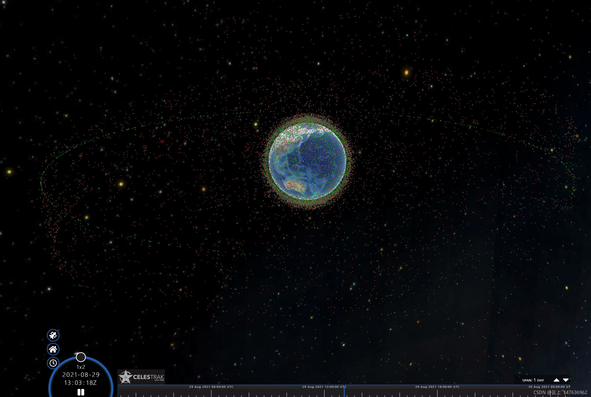

# Cesium中通过Primitive显示大量的点以及点的运动

如果想在Cesium中显示一个点，目前有这么几种方法：
- Primitive
- Entity
- czml文件
- GeoJson文件等

如果要显示大量的点呢？比如几千个，几万个，甚至是几十万，上百万个？那么什么场景要用到显示这么多点呢？

在航天领域，就是地球空间的所有在轨物体了，包括火箭残骸、解体碎片、卫星、飞船等各种航天器。目前老美空间目标监测能力最强，几乎给空间所有的可探测物体都进行了编目，每天都有更新，总数目约有2万个左右。

从CelesTrak.com网站，我们可以下载到最新的所有空间物体的两行根数TLE。目前CelesTrak网站也提供了基于Cesium开发的空间物体在轨运行图，见下图所示。

## Primitive与Entity区别
Cesium官方介绍里，对于Primitive和Entity的区别是这样描述的。

CesiumJS has a rich API for spatial data that can be split into two categories: a low-level Primitive API geared towards graphics developers, and a high-level Entity API for data-driven visualization.

The low-level Primitive API exposes the minimal amount of abstraction needed to perform the task at hand. It is structured to provide a flexible implementation for graphics developers, not for API consistency. Loading a model is different from creating a billboard, and both are radically different from creating a polygon. Each type of visualization is its own distinct feature. Furthermore, each has different performance characteristics and requires different best practices. While this approach is powerful and flexible, most applications are better served with a higher level of abstraction.

The Entity API exposes a set of consistently designed high-level objects that aggregate related visualization and information into a unified data structure, which we call an Entity. It lets us concentrate on the presentation of data rather than worrying about the underlying mechanism of visualization. It also provides constructs for easily building complex, time-dynamic visualization in a way that fits naturally alongside static data. While the Entity API actually uses the Primitive API under the hood, that’s an implementation detail we (almost) never have to concern ourselves with. By applying various heuristics to the data we give it, the Entity API is able to provide flexible, high-performance visualization while exposing a consistent, easy to learn, and easy to use interface.

上述文章大意是， Primitive接近底层，适合图形开发人员；而Entity是数据的抽象，使用方便。

对于显示成千上万个点，由于加载性能等因素，Cesium官方推荐我们使用Primitive。

下面是显示64,800 个点的 PointPrimitiveobjects 的代码示例，并且让所有点同时都运动起来
```bash
var viewer = new Cesium.Viewer('cesiumContainer');
//  生成PointPrimitiveCollection对象
var pointCollection = viewer.scene.primitives.add(new Cesium.PointPrimitiveCollection());

//  生成64800个点，每个经度、纬度值各生成一个点，高度为0（贴地表）
//  每个点都添加到PointPrimitiveCollection对象中
for (var longitude = -180; longitude < 180; longitude++) {
    var color = Cesium.Color.PINK;
    if ((longitude % 2) === 0) {
        color = Cesium.Color.CYAN;
    }
    for (var latitude = -90; latitude < 90; latitude++) {
      pointCollection.add({
            position : Cesium.Cartesian3.fromDegrees(longitude, latitude),
            color : color
        });
    }
}

//  模拟每个点固定向外偏移(1km,1km,1km)(跟时间无关，每帧调用此函数)
function animatePoints() {
  var positionScratch = new Cesium.Cartesian3();
  var points = pointCollection._pointPrimitives;
  var length = points.length;
  for (var i = 0; i < length; ++i) {
      var point = points[i];
      Cesium.Cartesian3.clone(point.position, positionScratch);
      Cesium.Cartesian3.add(
          positionScratch,
          new Cesium.Cartesian3(1000, 1000, 1000),
          positionScratch);
      point.position = positionScratch;
  }
}

//  scene中的render 方法，每一帧都被会调用，用于场景的重绘
//  此处的preRender在render方法之前执行，也是每一帧被调用
//  由于每一帧调用animatePoints方法时，方法内部都将每个点
//    的位移向外移动1km，因此所有点就都运动起来了
viewer.scene.preRender.addEventListener(animatePoints);
```
通过scene.primitives.add方法加载一个 PointPrimitiveCollection对象，然后往这个PointPrimitiveCollection对象里不断加载单个Primitive对象，目前每个Primitive对象只赋值两个参数：position和color，更多的参数请参考帮助文档。

此外，通过注册animatePoints方法到scene.preRender事件中，我们可以实现每一帧都可以改变所有点的位置，从而实现所有点都运动起来的效果。

加载效果如下，加载速度很快，6万个点运动起来没有任何卡顿！！！

此外，Cesium官方推荐一下措施，可以使得渲染速度更快：
 - pixelSize，每个点越小时，
 - scaleByDistance，当相机离点更远时，
 - translucencyByDistance ，完全半透明
 
有兴趣的读者可以测试一下。

