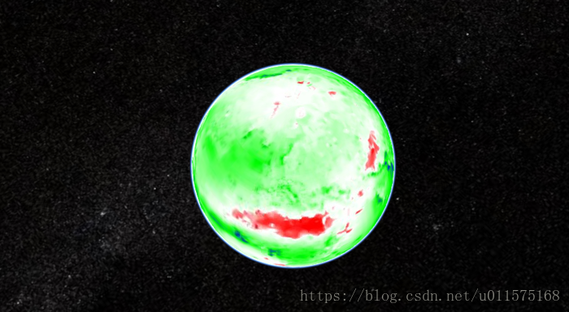

# Cesium加载GeoServer的WMS（含跨域解决）

本文主要介绍了Cesium加载GeoServer的WMS过程。
###参考
 - [cesium三维GIS开发实践（二）](https://www.jianshu.com/p/bcc9d8f5f167)
 - [[Geoserver-users] CORS for jetty 6.1.8 (Geoserver 2.x), solved](https://sourceforge.net/p/geoserver/mailman/message/32391594/)
###背景
 系统：win10
地图服务器：geoserver（2.12.1）
jdk：1.8
cesium：1.44
有关Cesium的基本操作请参考官方文档。
有关GeoServer的安装请参考我的前两篇文章：
 - [GeoServer的安装与启动](https://blog.csdn.net/u011575168/article/details/79920107)
 - [基于GeoServer的WMS（Web Map Service）的发布](https://blog.csdn.net/u011575168/article/details/79941966)
#加载GeoServer的WMS代码
 以Cesium的HelloWorld.html为例，在body中的Javascript处写如下代码：
```
<body>
  <div id="cesiumContainer"></div>
  <script>
	var url='http://localhost:8080/geoserver/wms'; //Geoserver(我的端口号默认为8080)
	var viewer = new Cesium.Viewer('cesiumContainer',{  
		    imageryProvider:new Cesium.WebMapServiceImageryProvider({   
	        url : url,         
	        layers: 'nurc:Arc_Sample'// GeoServer自带的图层名   
		    }),  
		    baseLayerPicker:false  // 去掉自带的图层选择器
		});
  </script>
</body>

```
#解决geoserver跨域请求的问题

 1. 下载压缩包文件[http://shanbe.hezoun.com/cors.zip ](http://shanbe.hezoun.com/cors.zip) 
 2. 将其放在[Geoserver]\webapps\geoserver\WEB-INF\下，并解压缩，最终的文件路径如下：
[Geoserver]\webapps\geoserver\WEB-INF\org\mortbay\servlets\CrossOriginFilter.class
 3. 修改[geoserver]/webapps/geoserver/WEB-INF下面的web.xml文件，
 在```<filter>```平级位置添加如下内容：```
<filter>    
 <filter-name>cross-origin</filter-name>    
 <filter-class>org.eclipse.jetty.servlets.CrossOriginFilter</filter-class>    
 <init-param>    
     <param-name>allowedOrigins</param-name>    
     <param-value>*</param-value>    
 </init-param>    
 <init-param>    
     <param-name>allowedMethods</param-name>    
     <param-value>GET,POST</param-value>    
 </init-param>    
 <init-param>    
     <param-name>allowedHeaders</param-name>    
     <param-value>x-requested-with,content-type</param-value>    
 </init-param>    
</filter>
...其他内容
<filter-mapping>    
 <filter-name>cross-origin</filter-name>    
 <url-pattern>/*</url-pattern>    
</filter-mapping>
```
 4. 重启GeoServer
 
 最终HelloWorld.html展示的页面为：
 

