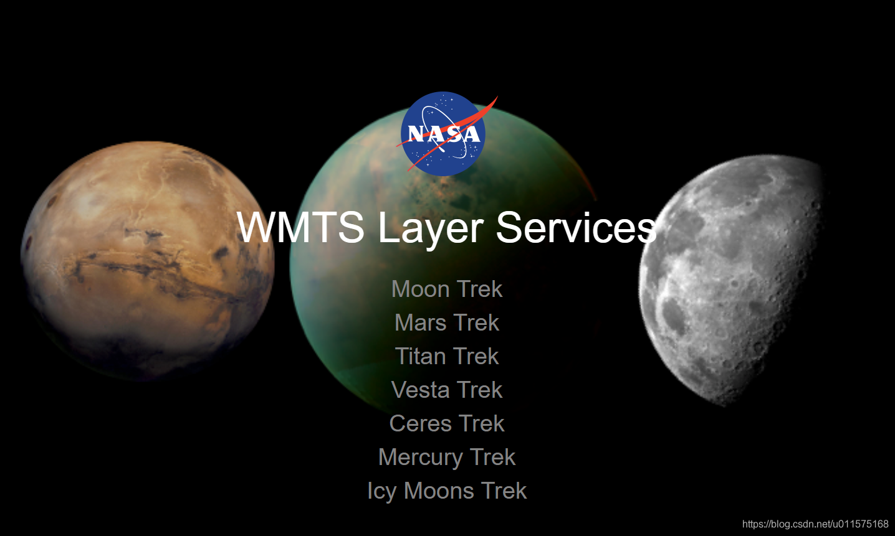
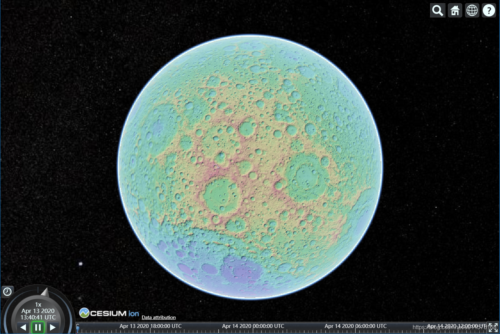

# Cesium加载月球WMTS服务

本文的背景知识：
1. 熟悉wmts
2. 熟悉Cesium的加载


今天给大家介绍一个好东西：月球的各种WMTS服务。

对于地球的各种地图服务，如卫星图片、街道地图等各种地图服务，已有多种服务提供商（百度、微软、谷歌），并且提供多种方式，如WMTS、WMS、TMS等等。

对于地球以外的行星（或月球），NASA根据已经拍摄的卫星影像，也发布了相应的地图服务，通过ＷＭＴＳ方式。

ＮＡＳＡ提供ＷＭＴＳ的网址为：https://trek.nasa.gov/tiles/apidoc/
点击进入"Moon Trek"网站后，即可看见目前提供的WMTS服务（皆采用RESTful WMTS service）
1. Equirectangular（目前暂时链接好像不可用）
2. North Pole
3. South Pole

以Clem_UVVIS_FeO_Clr_Global_152ppd图层为例，点击进去后可以看见其WMTSCapabilities.xml文件，里面定义了引用的接口：
"https://trek.nasa.gov/tiles/Moon/EQ/Clem_UVVIS_FeO_Clr_Global_152ppd/1.0.0//{Style}/{TileMatrixSet}/{TileMatrix}/{TileRow}/{TileCol}.png"

因此，Cesium里加载WMTS的代码如下：

```javascript
<body>
    <div id="cesiumContainer"></div>
    <script>
      // Clem_UVVIS_FeO_Clr_Global_152ppd tiles (RESTful)
      var clem = new Cesium.WebMapTileServiceImageryProvider({
        url:      "https://trek.nasa.gov/tiles/Moon/EQ/LRO_LOLA_ClrShade_Global_128ppd_v04/1.0.0//{Style}/{TileMatrixSet}/{TileMatrix}/{TileRow}/{TileCol}.png",
        layer: "LRO_LOLA_ClrShade_Global_128ppd_v04",
        style: "default",
        format: "image/png",
        tileMatrixSetID: "default028mm",
        maximumLevel: 6,
        tilingScheme: new Cesium.GeographicTilingScheme(),
        credit: new Cesium.Credit("Clem_UVVIS_FeO_Clr_Global_152ppd"),
      });
		
      // 初始化Viewer时，直接加载对应额imageryProvider
      var viewer = new Cesium.Viewer("cesiumContainer", {
        imageryProvider: clem,
        baseLayerPicker: false,
      });
    </script>
  </body>
```
加载后的效果如下：

这里告诉大家一个快捷路径，如果大家想下载原始.tiff格式的影像，则可使用下面链接方式可直接下载：
"https://trek.nasa.gov/moon/TrekWS/rest/cat/data/stream?label=Clem_UVVIS_FeO_Clr_Global_152ppd"

**其中把"label="后面的图层名换成其它的图层名即可下载任意图层的tif格式的影像数据！**
