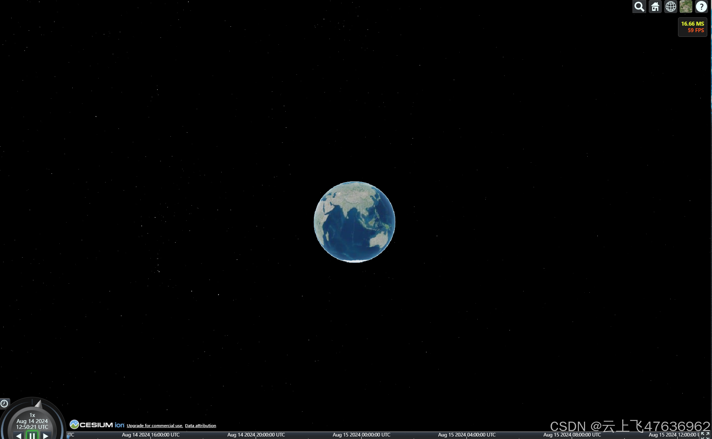

# Cesium天空盒子(Skybox)制作(js代码)和显示

## 介绍
在Cesium中，星空背景是通过天空盒子方式（6张图片）来显示的，原生的图片分辨率太低，本项目用于生成天空盒子的6张图片。最终生成的6个图片大小约为500kb(每个)，格式为jpg，总共的恒星数目约为1万颗左右，在最终的地球星空背景中，仅出现恒星点，不会出现模糊的效果！

有关Cesium天空盒子的原理和介绍请参见我之前写的一篇文章：[Cesium与STK中的天空盒子(skybox)](https://blog.csdn.net/u011575168/article/details/109889699)。

## 原理
星空背景本质上就是将所有的恒星投影到天空盒子对应的6个方位的图片上。

本项目利用Canvas的2D作图功能，创建一个纯黑色的背景。然后根据每个恒星的位置转换为对应图片下的像素坐标，然后再利用恒星
对应的星等画一个白色的点，点的像素大小和透明度由星等决定（恒星越亮，则点的像素越大，越不透明）。

目前基本设置为（详见：createSkyboxImage.js）
- 最亮： -1等，对应为5个像素，透明度为1.0（不透明）
- 中等： 7等，对应为1个像素，透明度为0.75

本项目中，最暗为7等星，因为超过8等星人眼就看不到了！
## 项目目录
- CesiumUnminified文件夹为Cesium安装包里面的内容（Build目录下），本项目用于引用Cesium.js文件
- Skybox文件夹里存放了其它方式生成的天空盒子，可供测试使用
- CatalogSkybox.js，为本人编写的天球坐标系ICRF到立方体盒子的投影转换相关函数
- createSkyboxImage.js，用于生成立方体盒子的一副图片
- hipparcos_7_concise.js，包含了依巴谷星表（hipparcos）中7等星以上的所有数据（经过处理的），数据来源: https://github.com/gmiller123456/hip2000
#### 使用说明
1. VS Code里使用Live Server打开index.html，即可加载Cesium默认的启动界面，同时加载了内置生成的天空盒子
2. 网页启动后，会自动将创建的6张天空盒子照片存放在浏览器的下载目录下
3. 实际使用时，可以将本项目的代码集成到项目中，页面启动时动态创建6个图片（如index.html中那样）；也可以使用生成好的图片，以静态图片引用的方式加载。
加载后效果如下：

## 其它
1. 用户可自行修改createSkyboxImage.js函数，使用不同的星等创建不同像素大小的星星！

## 项目地址： [https://gitee.com/blitheli/test-skybox](https://gitee.com/blitheli/test-skybox)
