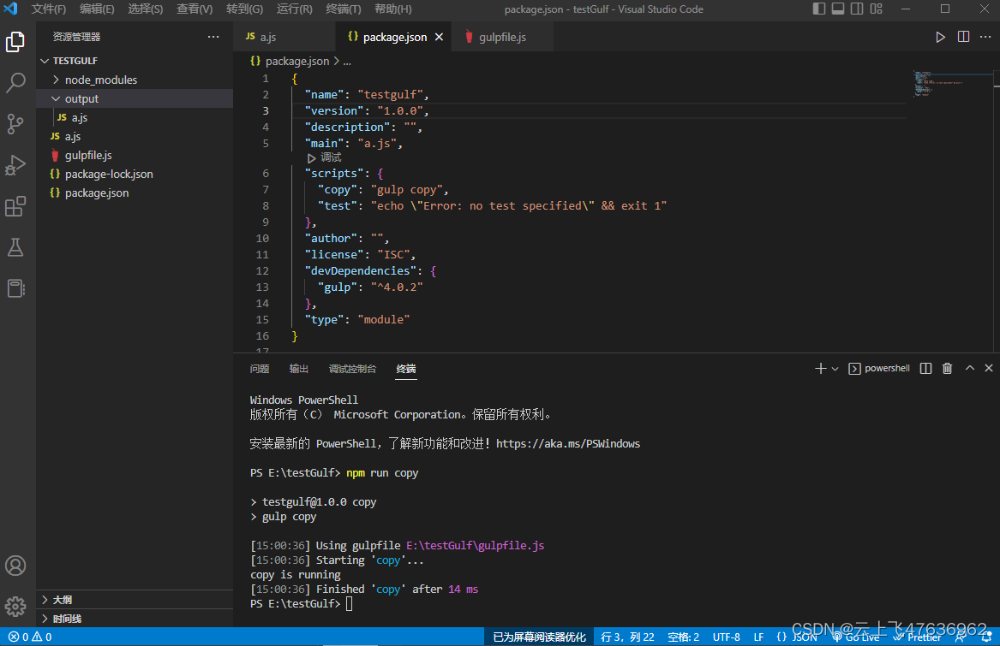
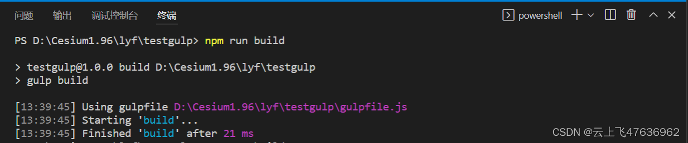
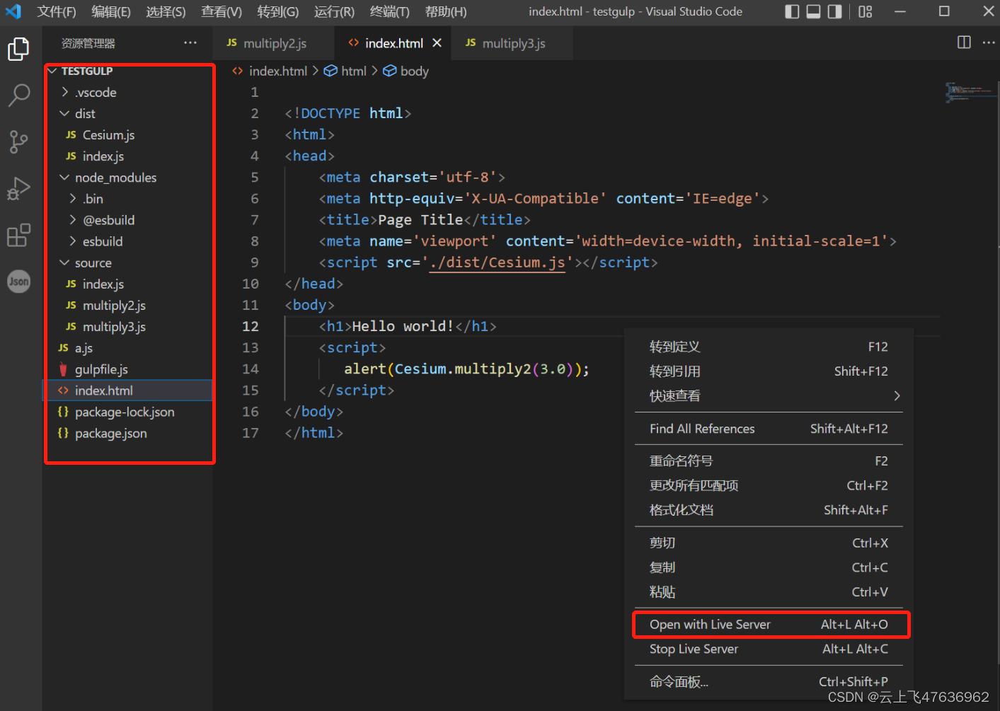
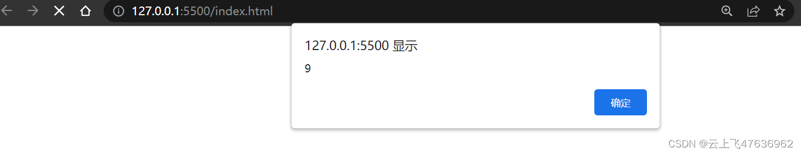
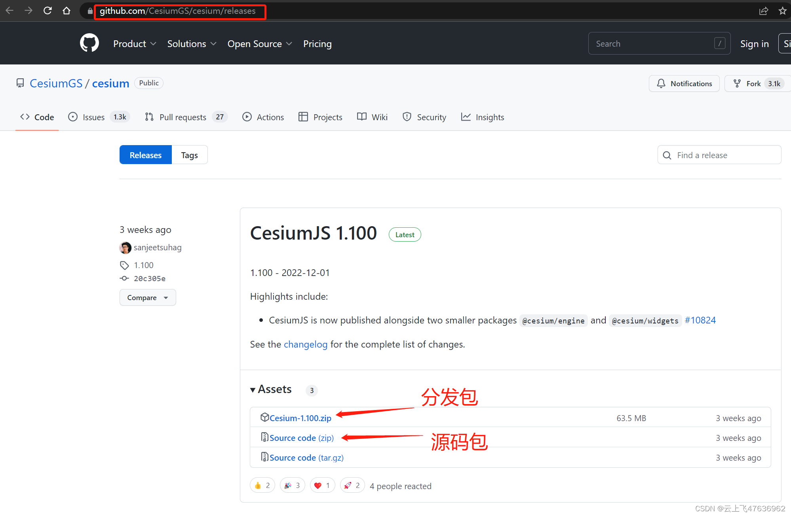
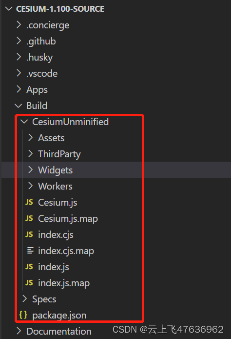
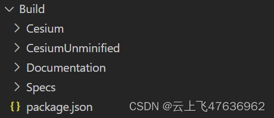

# Cesium打包入门(gulp与esbuild)

本文针对Cesium源码包的打包工具gulp和esbuild进行了初步探讨，属于入门篇。

首先简要介绍采用gulp+esbuild如何为多个源代码文件打包成一个单独文件，然后介绍了下Cesium中的源码包的结构，并简要分析了其打包的相关函数。

本文编译环境IDE使用VS code，请读者自行安装，以下简称vsc。

本文没有详细介绍gulp和esbuild，直接使用，读者需自行了解这两个工具。

以下教程中，需要在vsc中的“终端”面板里输入相关命令，如果没有，那么在菜单栏里点击“查看-终端”则可打开“终端”面板。
## 环境安装

1. **创建一个空文件夹，名称自己设定(此处命名为testgulp)，将vsc定位到此文件夹(菜单栏“文件-打开文件”)**

2. **安装 gulp 命令行工具**

```bash
npm install --global gulp-cli
```

 2. **在项目目录下创建 package.json 文件**
 ```bash
npm init
```
上述命令将指引你设置项目名、版本、描述信息等，可一路回车，采用默认值。

 3. **安装 gulp，作为开发时依赖项**

```bash
npm install --save-dev gulp
```
上述命令将在项目文件夹内创建"node_modules"文件夹，后面通过npm命令安装的本地包到存放到此文件夹内。

4. **检查 gulp 版本**

```bash
gulp --version
```
上述命令可显示安装的版本
5. **安装esbuild**
下载并本地安装 esbuild， 可以通过 npm 安装预编译的原生可执行文件：
```bash
npm install esbuild
```
此命令应该会将 esbuild 安装到你本地的 node_modules 中。 你可以运行如下命令，来检测 esbuild 的原生可执行文件 是否正常

```bash
.\node_modules\.bin\esbuild --version
```

## gulp
### 创建 gulpfile 文件
gulp运行时，会在项目文件夹内创建一个名为 gulpfile.js 的文件。

gulpfile.js文件会在运行 gulp 命令时被自动加载。在这个文件中，你经常会看到类似 src()、dest()、series() 或 parallel() 函数之类的 gulp API，除此之外，纯 JavaScript 代码或 Node 模块也会被使用。任何导出（export）的函数都将注册到 gulp 的任务（task）系统中。

为了测试，我在文件中输入以下内容：

```bash
import gulp from "gulp";

/**
 * 将js文件拷贝到另一个文件夹内
 * @returns
 */
export function copy() {
  console.log("copy is running");

  return gulp.src("a.js").pipe(gulp.dest("output/"));
}

```

Nodejs已支持ES6模块的功能，因此，我们不需要采用之前的require函数来引入模块，而是采用"import gulp from ‘gulp’”来导入模块。

同时，在gulpfile.js文件中，也不需要"exports."方式导出，而采用"export ***"方式。

上面代码中，采用了gulp里的src和dest函数。

同时使用export命令，输出了函数 "copy"，以便在后续命令中，直接使用"gulp copy”。

**注意：凡是从 gulpfile 中被导出（export）的函数，可以通过 gulp 命令直接调用！！**

### 创建普通的代码文件
在项目文件夹里创建"a.js"文件，代码如下（为了测试，随便写的）：

```bash
/// a.js
var a = 1.0;

console.log(a);
```

### package.json文件配置
在前面创建好的package.json文件中，添加"scripts"命令"copy"，具体代码如下：

```bash
{
  "name": "testgulf",
  "version": "1.0.0",
  "description": "",
  "main": "a.js",
  "scripts": {
    "copy": "gulp copy",
    "test": "echo \"Error: no test specified\" && exit 1"
  },
  "author": "",
  "license": "ISC",
  "devDependencies": {
    "gulp": "^4.0.2"
  },
  "type": "module"
}

```
在vsc终端输入命令"npm run copy"，则会自动调用package.json文件中的"scripts"命令里的"copy"，继而调用命令“gulp copy"，这个命令和直接在终端运行"gulp copy"是一样的！！

命令执行后，则会创建"output"文件夹，并且把a.js文件拷贝到了output文件夹下，见下图

### gulp文件的调试
有时候，我们想直接调试gulp运行的文件，如上面的“copy”函数。vsc提供了这个功能，见上图，在"package.json"文件中的"scripts"上面，有“调试”的按钮，点击后，则会弹出选择框，让你选择要调试的函数，点击即可！

## Esbuild
Esbuild 是由 Figma 的 CTO 「Evan Wallace」基于 Golang 开发的一款打包工具，相比传统的打包工具(Webpack、Rollup、Parcel )，主打性能优势，在构建速度上可以快 10~100 倍。这也是为啥Cesium最近将打包工具更换为Esbuild的主要原因。

### 创建模拟代码文件
Cesium的源码都是采用es6方式编写的，此处我们简单的模仿一下。
创建文件夹“source”,并创建3个模块文件"multipy2.js"、“multiply3.js”和“index.js”。
前两个文件模拟两个函数功能模块，而"index.js"作为总文件，并作为打包的入口文件。3个文件的具体代码见下：

```javascript
// multiply2.js文件

//  模块内的私有变量
var pa = 3.0;

/**
 * 返回2倍数值+3
 * @param {*} a 
 * @returns 
 */
function multiply2(a) {
    return 2 * a + pa;
}

export default multiply2;

// multiply3.js文件

//  模块内的私有变量
var pa = 4.0;

/**
 * 返回3倍数值+3
 * @param {*} a 
 * @returns 
 */
function multiply3(a) {
    return 3 * a + pa;
}

export default multiply3;

// index.js文件
export {default as multiply2} from "./multiply2.js";
export {default as multiply3} from "./multiply3.js";
```

### 创建打包函数
在gulpfile.js里添加打包函数，完整代码如下：

```javascript
import gulp from "gulp";
import esbuild from 'esbuild';

/**
 * 将js文件拷贝到另一个文件夹内
 * @returns
 */
export function copy() {
  console.log("copy is running");

  return gulp.src("a.js").pipe(gulp.dest("output/"));
}

/**
 * 使用esbuild打包(esm和iife两种打包方式),生成 index.js/Cesium.js两个文件
 * @returns
 */
export async function build() {

  await esbuild.build({
    entryPoints: ["./source/index.js"],
    bundle: true,
    format: "esm",
    outfile: "dist/index.js"
  })

  await esbuild.build({
    entryPoints: ["./source/index.js"],
    bundle: true,
    format: "iife",
    globalName:"Cesium",
    outfile: "dist/Cesium.js"
  })
}
```
函数名称可以任意命名的，此处命名为“build”也是有意义的（未压缩代码，可供调试），后续有可能创建"release"函数，用于打包压缩后的生产环境代码。

### 打包
从打包命令可知，使用esbuild函数非常简单，配置好相应的输入参数即可。

打包函数创建好了后，我们还需要在package.json文件中，添加"scripts"命令"build"，以便能够使用npm快捷指令直接运行：

```javascript
{
  "name": "testgulp",
  "version": "1.0.0",
  "description": "",
  "main": "a.js",
  "scripts": {
    "copy": "gulp copy",
    "build":"gulp build",
    "test": "echo \"Error: no test specified\" && exit 1"
  },
  "author": "",
  "license": "ISC",
  "type": "module",
  "dependencies": {
    "esbuild": "^0.16.10"
  }
}
```
在vsc终端栏里输入命令“npm run build”，即可打包，速度非常快。

### 打包后文件
打包后输出的2个文件在"dist"文件夹下。

"Cesium.js"文件的内容如下（iife方式，不懂的自行必应搜索）：

```javascript
var Cesium = (() => {
  var __defProp = Object.defineProperty;
  var __getOwnPropDesc = Object.getOwnPropertyDescriptor;
  var __getOwnPropNames = Object.getOwnPropertyNames;
  var __hasOwnProp = Object.prototype.hasOwnProperty;
  var __export = (target, all) => {
    for (var name in all)
      __defProp(target, name, { get: all[name], enumerable: true });
  };
  var __copyProps = (to, from, except, desc) => {
    if (from && typeof from === "object" || typeof from === "function") {
      for (let key of __getOwnPropNames(from))
        if (!__hasOwnProp.call(to, key) && key !== except)
          __defProp(to, key, { get: () => from[key], enumerable: !(desc = __getOwnPropDesc(from, key)) || desc.enumerable });
    }
    return to;
  };
  var __toCommonJS = (mod) => __copyProps(__defProp({}, "__esModule", { value: true }), mod);

  // source/index.js
  var source_exports = {};
  __export(source_exports, {
    multiply2: () => multiply2_default,
    multiply3: () => multiply3_default
  });

  // source/multiply2.js
  var pa = 3;
  function multiply2(a) {
    return 2 * a + pa;
  }
  var multiply2_default = multiply2;

  // source/multiply3.js
  var pa2 = 4;
  function multiply3(a) {
    return 3 * a + pa2;
  }
  var multiply3_default = multiply3;
  return __toCommonJS(source_exports);
})();
```

"index.js"文件的内容如下（esm方式,即ES6模块）：

```javascript
// source/multiply2.js
var pa = 3;
function multiply2(a) {
  return 2 * a + pa;
}
var multiply2_default = multiply2;

// source/multiply3.js
var pa2 = 4;
function multiply3(a) {
  return 3 * a + pa2;
}
var multiply3_default = multiply3;
export {
  multiply2_default as multiply2,
  multiply3_default as multiply3
};
```

从上面打包后的代码可以看出：
- iife方式，直接把我们的原始模块里的函数封装起来，作为Cesium（这个名称也是自定义的）对象的子属性；
- esm方式，就是简单的把所有的模块内容罗列在一起，对于私有变量，如果名称重复，则会自动重命名（如multiply3.js中的pa变量被重命名为pa2）

### 测试
我们使用Cesium.js文件来测试一下。首先创建index.html文档(具体内容见下图）。

最终的文件夹组织结构见下图。

使用vsc中的Liver Server插件（没有的请安装），可直接创建本地服务器，加载index.html文档（在index.html文件上右键，然后点击“Open with Live Server”）。

打开本地服务器并加载index.html页面后如下图所示，直接弹出窗口显示结果9（2*3+3）。可以看出，打包后的Cesium.js可正确执行。


## Cesium的打包流程
注意，此部分和上一部分无任何关系，下载源码包后，打开vsc，并将vsc定位到此源码包文件夹(菜单栏“文件-打开文件”)。

在终端输入命令: npm install，则会根据当前的配置文件(package.json)安装所有依赖模块，生成node_modules文件夹。
### 源码包下载
Cesium有两种包：分发包和源码包。Cesium官方网站的下载页面（[https://cesium.com/downloads/](https://cesium.com/downloads/)）就是提供的分发包。

分发包和源码包都托管在github上，具体网址为：https://github.com/CesiumGS/cesium/releases

分发包能通过源码包运行npm打包命令得来。

分发包与源码包最大的区别在于，提供了打包后的Build文件夹，可供调试或者发布直接使用；提供了两个版本的打包API，提供了API文档，删除了部分生产用不着的打包配置文件。注意，分发包保留了源码目录，但是有关打包命令可能失效。

**打包请使用源码包。**

### Cesium中的打包
从前面gulp和esbuild介绍我们知道，使用gulp和esbuild进行打包，一般是创建gulpfile.js文件和package.json文件。

最新的Cesium 100源码包中，gulpfile.js文件已经完全采用ES6模块方式（之前为gulpfile.cjs，即为commonjs方式）。

此外，源码分拆为两部分，存放在packages文件夹中的engine和widgets两个文件夹中，而Source文件夹则为空（仅有一个copyrightHeader .js文件）。

原先gulpfile.js的大部分内容独立出来单独放在文件"build.js"中，然后，在gulpfile.js中引用build.js。

首先看看package.json中的srcpts代码：

```javascript
  "scripts": {
    "prepare": "gulp prepare && husky install",
    "start": "node server.js",
    "start-public": "node server.js --public",
    "build": "gulp build",
    "build-release": "gulp buildRelease",
    "build-watch": "gulp buildWatch",
    "build-ts": "gulp buildTs",
    "build-third-party": "gulp buildThirdParty",
    "build-apps": "gulp buildApps",
    "clean": "gulp clean",
    "cloc": "gulp cloc",
    "coverage": "gulp coverage",
    "build-docs": "gulp buildDocs",
    "build-docs-watch": "gulp buildDocsWatch",
    "eslint": "eslint \"./**/*.js\" \"./**/*.cjs\" \"./**/*.html\" --cache --quiet",
    "make-zip": "gulp makeZip",
    "markdownlint": "markdownlint \"*.md\" \"Documentation/**/*.md\" --ignore CHANGES.md --ignore README.md --ignore LICENSE.md --ignore packages/engine/LICENSE.md --ignore packages/widgets/LICENSE.md",
    "release": "gulp release",
    "website-release": "gulp websiteRelease",
   ...
```

build指令（对应builde.js文件中的build函数,有兴趣可以看看）主要做了下面几件事（重点过程）
- 转换packages/engine/Source/Shaders 下所有 .glsl 格式的文件成 ESModule 文件，导出着色器代码字符串常量；
- 生成packages/engine/index.js和packages/widgets/index.js两个模块文件
- 生成 Source/Cesium.js 这个 ESModule 文件，导出所有 CesiumJS 的模块、常量、类等，无论公开或私有；此文件作为esbuild函数的入口文件
- 生成 Build/CesiumUnminified 文件夹，同时调用esbuild函数生成 esm(ESModule)、iife、commonjs 三种格式的单文件 CesiumJS 库，含 source-map 映射文件(分别为: index.js,Cesium.js,index.cjs）；
- 复制package源码里的css文件到Build/CesiumUnminified/Widgets文件夹下；
- 复制package源码里静态文件夹（Assets,ThirdPart,Workers,Widgets）到Build/CesiumUnminified文件夹下

build指令（vsc终端输入：npm run build）在我个人工作站上的运行时间为12s。打包命令产生的Build文件夹目录如下：

release指令类似。在build指令的基础上，多了个"Cesium"文件夹（压缩包）和文档等的生成。即最终在Build文件夹下生成如下文件：


## 小结
本文初步给出了采用gulp+esbuild方式进行打包的流程，并且从Cesium源码包入手，运行build或release命令，最终生成Build目录，以供开发或生成环境使用。

gulp+esbuild打包流程本身是非常简单的，但是由于Cesium源码包里的文件众多，还包括glsl代码，所以最终导致gulfile.js和build.js文件相对来说较大，看起来比较头疼。

生成后的Build文件夹（或者分发包里的Build文件夹）里直接包含iife风格的文件，可直接使用 Build/Cesium/Cesium.js 或 Build/CesiumUnminified/Cesium.js，在html文档里引用的方式同官方教程里一致(具体路径根据你项目而不同）：

```javascript
<script src='../Build/Cesium/Cesium.js'></script>
```

如果你觉得有帮助可以请作者喝杯咖啡：-)

