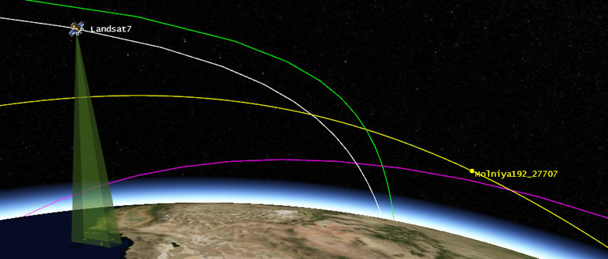
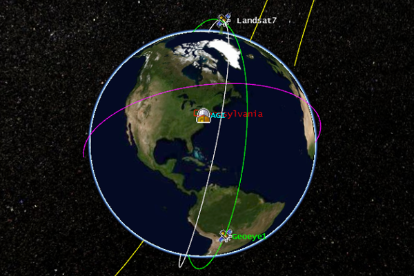
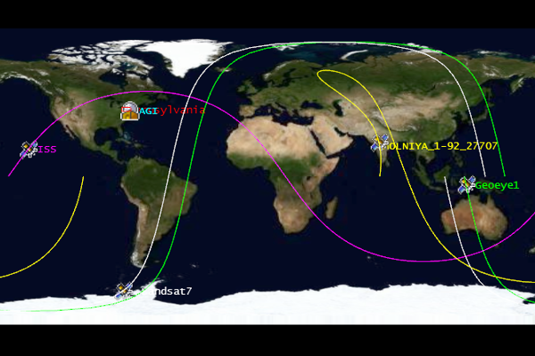
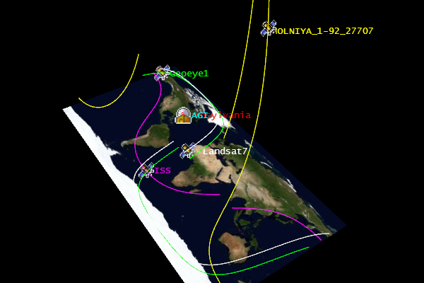
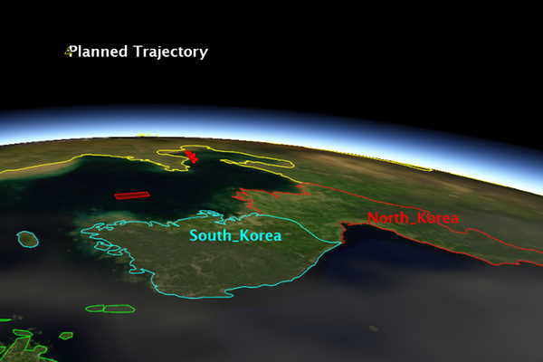
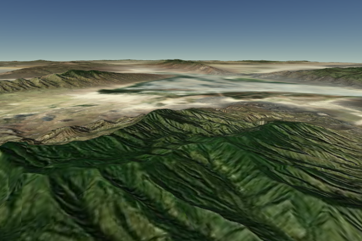
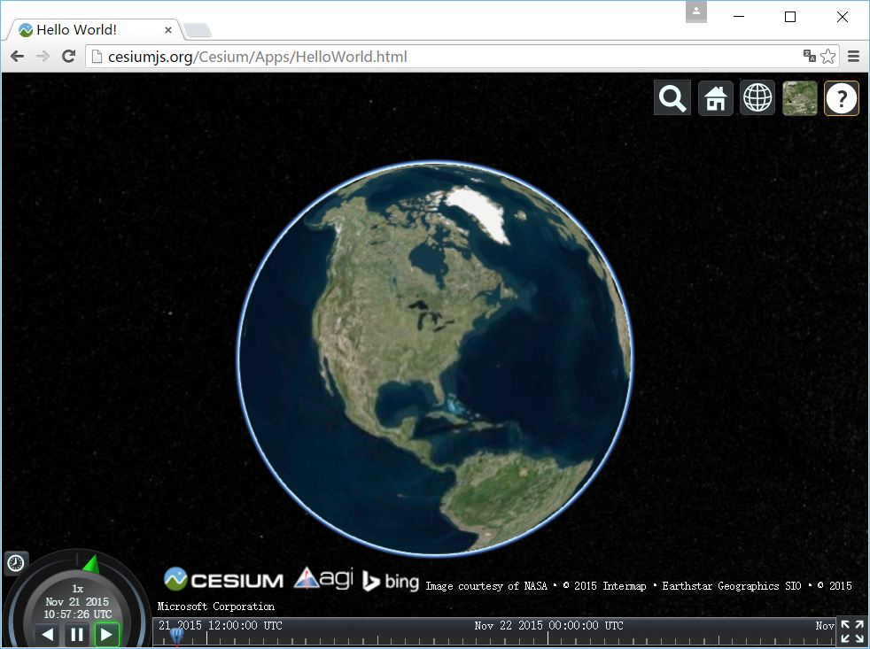
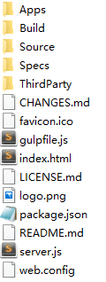
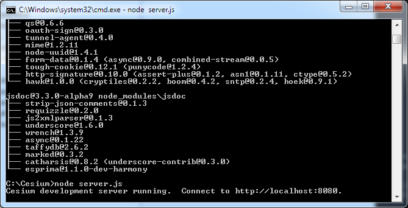

# Cesium简介

Cesium 是基于 JavaScript 与 WebGL 的开源三维地球与地图引擎，支持 3D、2D 与 2.5D 哥伦布视图。本文介绍其主要能力（动态时空数据可视化、全球高精度地形、开箱即用的几何与标注）以及官方示例入口，便于快速了解 Cesium 能做什么。

## 一、Cesium介绍

Cesium是国外一个基于JavaScript编写的使用WebGL的地图引擎。Cesium支持3D,2D,2.5D形式的地图展示，可以自行绘制图形，高亮区域，并提供良好的触摸支持，且支持绝大多数的浏览器和mobile。

## 二、Cesium特点

### 1、一个API - 三种视图

*（原图 OneApiThreeViews 外链已失效，未收录）*

Cesium支持三维地球（3D），二维地图（2D）以及2.5D哥伦布视图（2.5D）。

  

### 2、动态地理空间数据的可视化

  * 通过[CZML](https://github.com/AnalyticalGraphicsInc/cesium/wiki/CZML-Guide)创建数据驱动的时间动态场景。

  * 高分辨率的世界地形可视化。

  * 使用WMS，TMS，openstreetmaps，Bind以及ESRI的标准绘制影像图层。

  * 使用KML，GeoJSON和TopoJSON绘制矢量数据。

  * 使用COLLADA和glTF绘制3D模型。

  * 使用插件扩展核心Cesium。

### 3、内置的高性能和高精度

  * 优化的WebGL，充分利用硬件渲染图形，使用低级别的几何和渲染程序。
  * 绘制大范围的折线，多边形，广告牌，标签，挤压以及走廊。
  * 控制摄像头和创造飞行路径。
  * 使用动画控件控制动画时间。

## 三、Cesium示例

以下将示例如何运行一个Cesium应用程序：

### 1、确保浏览器支持Cesium

验证Cesium在Web浏览器中工作的最简单方法是运行HelloWorld例子，[点击这里](http://cesiumjs.org/Cesium/Apps/HelloWorld.html)。如果你看到一些像下面的图片，恭喜你，你运行的该Web浏览器支持运行Cesium，那么你可以跳到下一部分阅读；否则，继续阅读。

Cesium是建立在几个新的HTML5技术之上的，其中最重要的是WebGL。虽然这些新的标准正在迅速成为广泛采用，但一些浏览器和系统需要升级从而支持他们。如果示例应用程序允许失败，你可以尝试以下的建议：

（1）更新您的Web浏览器。大多数的Cesium团队使用Google Chrome，但Firefox，IE 11以及Opera也能运行。如果你正在用这些浏览器，请确保更新它到最新版本。

（2）更新您的显卡驱动从而更好地支持3D。如果你知道你正用的是什么类型的显卡，你可以检查进行更新。三个最流行的显卡提供商是：[Nvidia](http://www.nvidia.com/drivers), [AMD](http://www.amd.com/drivers)以及 [Intel](https://downloadcenter.intel.com/default.aspx)。

（3）如果你仍然有问题，尝试访问[http://get.webgl.org/](http://get.webgl.org/)，它提供了额外的问题解决建议。你也可以在[Cesium论坛](http://cesiumjs.org/forum.html)寻求帮助。

### 2、选择编辑器或IDE

如果你已经是一个经验丰富的开发者，你很可能会有一个最喜爱的编辑器和开发环境；例如，大多数的Cesium的团队使用日蚀。如果你刚刚开始，一个伟大的自由和开放源码编辑器，记事本++，你可以从网上下载他们的网站。最终，任何文本编辑器会做的，所以去一个你最舒服。

### 3、下载Cesium

如果你还没有这样做，点击这个按钮来获取最新的Cesium：[下载Cesium](http://cesiumjs.org/downloads.html)。  
下载完成之后将zip文件解压到你选择的新目录，解压之后文件目录类似于下图。

不能直接双击运行index.html，在实际工作中，它需要运行在Web服务器上。

### 4、设置Web服务器

为了运行Cesium的应用，我们需要一个本地Web服务器的主机文件。我们所有的例子将使用Node.js。当然你也可以使用自己的服务器，只要把上一节的目录放在服务器根目录下。

设置一个Web服务器通过Node.js是很容易的，只需要3个步骤：

（1）从安装Node.js网站，你可以使用默认安装设置。

（2）打开命令行，然后进入Cesium的根目录，通过npm install下载安装所需要的模块。  
最后，在根目录执行node server.js启动Web服务器。

（3）此时您将看到下图：

### 5、运行Hello world!

现在我们的Cesium已经运行在Web服务器上，我们可以启动Web浏览器并输入网址http://localhost:8080/HelloWorld.html。这与我们刚开始测试WebGL时看到的Hello World应用程序是一样的，但现在是运行在你自己的系统中，而不是在Cesium网站上。如果我们在编辑器中打开helloworld.html，我们会看到以下代码：
[code] 
    <!DOCTYPE html>
    <html lang="en">
    <head>
      <!-- Use correct character set. -->
      <meta charset="utf-8">
      <!-- Tell IE to use the latest, best version. -->
      <meta http-equiv="X-UA-Compatible" content="IE=edge">
      <!-- Make the application on mobile take up the full browser screen and disable user scaling. -->
      <meta name="viewport" content="width=device-width, initial-scale=1, maximum-scale=1, minimum-scale=1, user-scalable=no">
      <title>Hello World!</title>
      
      
    </head>
    <body>
      

      
    </body>
    </html>
[/code]

以下四行将添加到你的应用程序中：

（1）引入cesium.js。该文件定义了Cesium对象，它包含了我们需要的一切。
[code] 
    
[/code]

（2）为了能使用Cesium各个可视化控件，我们需要引入widgets.css。
[code] 
    @import url(../Build/Cesium/Widgets/widgets.css);
[/code]

（3）在HTML的body中我们创建一个DIV，用来作为三维地球的容器。
[code] 
    

[/code]

（4）最后，在js中初始化CesiumViewer实例。
[code] 
    var viewer = new Cesium.CesiumViewer('cesiumContainer');
[/code]

### 6、接下来干嘛

通过以上的学习，恭喜你，你已经开始写你自己的Cesium应用和网页了。那么根据自己的情况，你可能对其他[Cesium教程](http://cesiumjs.org/tutorials.html)感兴趣。如果你是一个新手，通过[Cesium Sandcastle](http://cesiumjs.org/Cesium/Apps/Sandcastle/index.html)这个编码的应用，您不仅可以查看几十个实例，也可以查看和编辑自己的源代码，从应用程序中运行查看你的改变。最后，无论你如何学习，[参考文献](http://cesiumjs.org/Cesium/Build/Documentation/)对每个人来说都是一个非常宝贵的资源。
