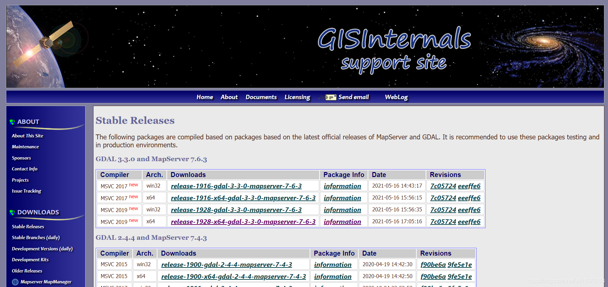
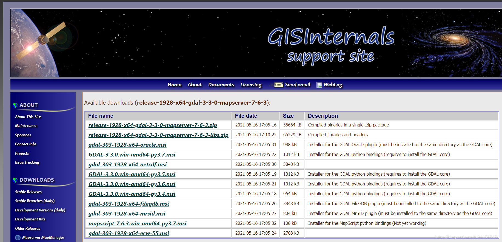
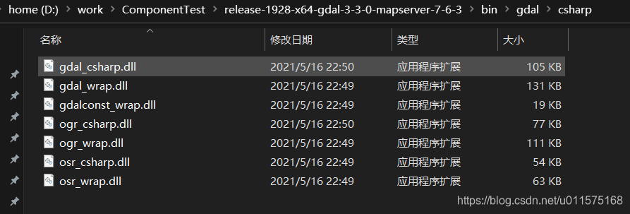
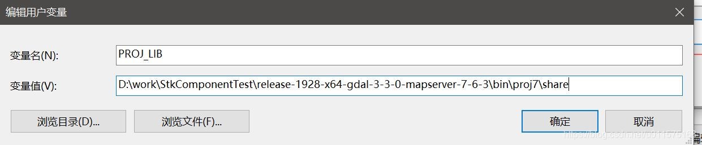

# GDAL库的C#开发配置

## GDAL简介
GDAL(Geospatial Data Abstraction Library)是一个在X/MIT许可协议下的开源栅格空间数据转换库。OGR是GDAL项目的一个分支，功能与GDAL类似，只不过它提供对矢量数据的支持。

有很多著名的GIS类产品都使用了GDAL/OGR库，包括ESRI的ARCGIS 9.3，Google Earth和跨平台的GRASS GIS系统。

GDAL可以的开发环境有很多，如python,C#。本文主要阐述C#环境开发下GDAL的配置。

C#利用GDAL库开发时，主要是加载C#版本的GDAL dll文件(就是对原有gdal的封装），从而可以直接使用GDAL相关的功能函数。

## 运行环境
 - windows 10操作系统
 -  64位平台，visual studio 2019(community)。

## 下载DLL
编译后GDAL的DLL下载地址：[https://www.gisinternals.com/release.php](https://www.gisinternals.com/release.php)
下载页面中有编译好的多种平台版本。笔者的开发环境为64位平台的visual studio 2019。因此选择"release-1928-x64-gdal-3-3-0-mapserver-7-6-3"。

点击链接进入后，出现如下页面，也有众多选项，我们选择第一个“release-1928-x64-gdal-3-3-0-mapserver-7-6-3.zip”，这是个压缩文件包。

## GDAL压缩包说明
压缩包下载后，解压在合适的位置，里面的内容：

 - bin 文件夹
       包含了gdal核心的dll: gdal303.dll
       其它相应的dll
 - bin\gdal\csharp
    此文件夹包含C#版本的dll文件，一共7个文件。
 
 
其它文件夹（诸如 bin\gdal\java）里面是其它语言对应的gdal封装dll文件，此处不再详述。

## C#工程配置

 1. **dll的引用**
使用VS2019 IDE创建工程后，添加对以下3个文件的引用(文件夹：bin\gdal\csharp)：
 - gdal_csharp.dll
 - ogr_csharp.dll
 - osr_csharp.dll
 添加引用后，即可使用"using OSGeo.GDAL"语句对gdal引用。
 2. **bin目录下其它文件的拷贝**
 上一步完成后，在vs2019中编码及编译都没问题，但是在运行时会
 报错。即在调用 Gdal.AllRegister()方法时会抛出如下异常：
“OSGeo.GDAL.GdalPINVOKE”的类型初始值设定项引发异常。

这主要是gdal初始化时，因其依赖dll项不全导致注册失败抛出异常。
解决方法：

将以下文件拷贝到vs 2019工程编译后的bin\debug目录下(或者是bin\release目录，看你实际运行的是debug还是release)

- 下载后的gdal压缩包中的"bin”文件夹下的所有dll及exe文件(除了文件夹gdal,gdal-data,ms,proj,proj7之外的所有文件）
- 下载后的gdal压缩包中的"bin\gdal\csharp”文件夹下的所有dll(7个文件)

## C#使用
至此，C#引用gdal的dll工作已完成，即可使用。

```csharp
using System;
using OSGeo.GDAL;
namespace gdal
{
    class Program
    {
        static void Main(string[] args)
        {
        	// dem文件路径
            string fp = "D:/test.tif";
            
  			Gdal.AllRegister();

            //  读文件
            Dataset ds = Gdal.Open(fp, Access.GA_ReadOnly);

            //  获取dem数据的x/y向的像素数
            int rasterXSize = ds.RasterXSize;
            int rasterYSize = ds.RasterYSize;
            //  其它代码...
        }
    }
}            
```
## 运行时出现“Cannot find proj.db”错误
使用GDAL3.X的环境时，在运行时有可能会出现"Cannot find proj.db"的错误，这是由于没有配置“PROJ_LIB”环境变量，解决步骤如下：

“我的电脑”-右键属性-“高级系统设置”，创建新的环境变量，变量名为“PROJ_LIB”，变量值为gdal文件夹下的"proj7\share"目录，如下图所示。

注意，具体路径应根据你自己的gdal目录取设置！！




