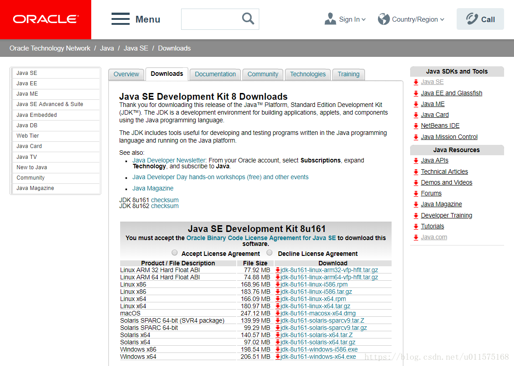
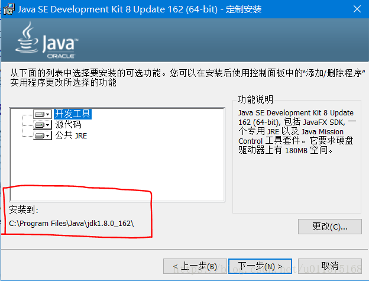
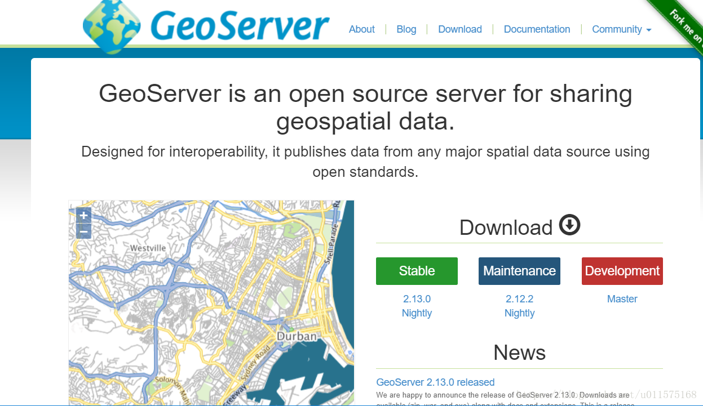
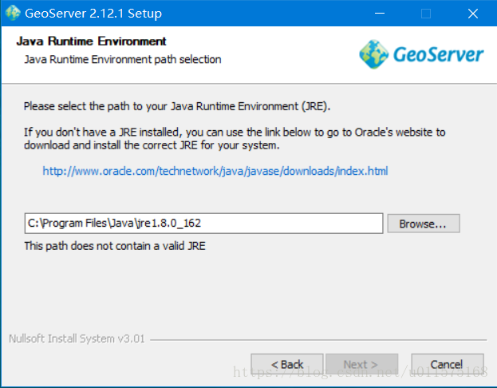
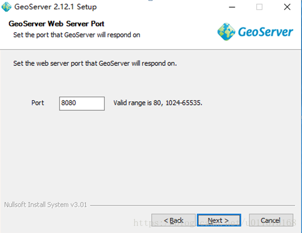
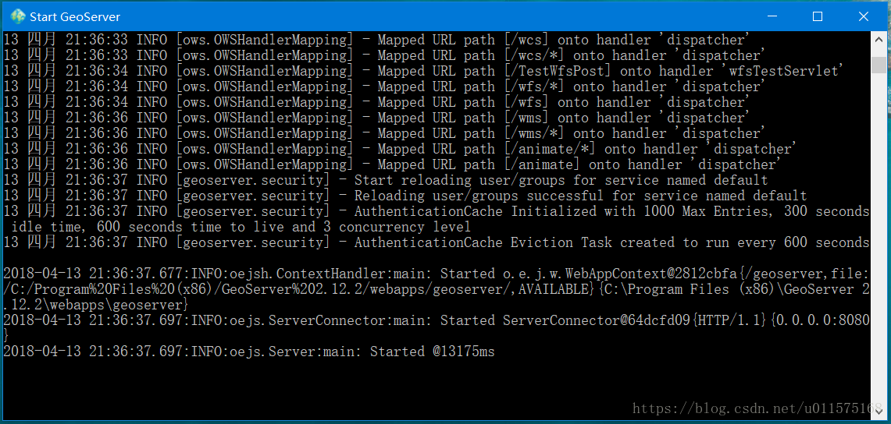
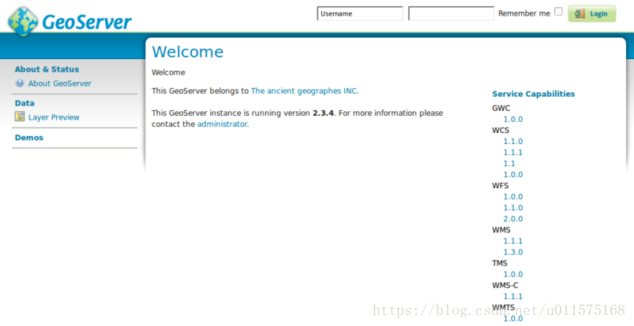
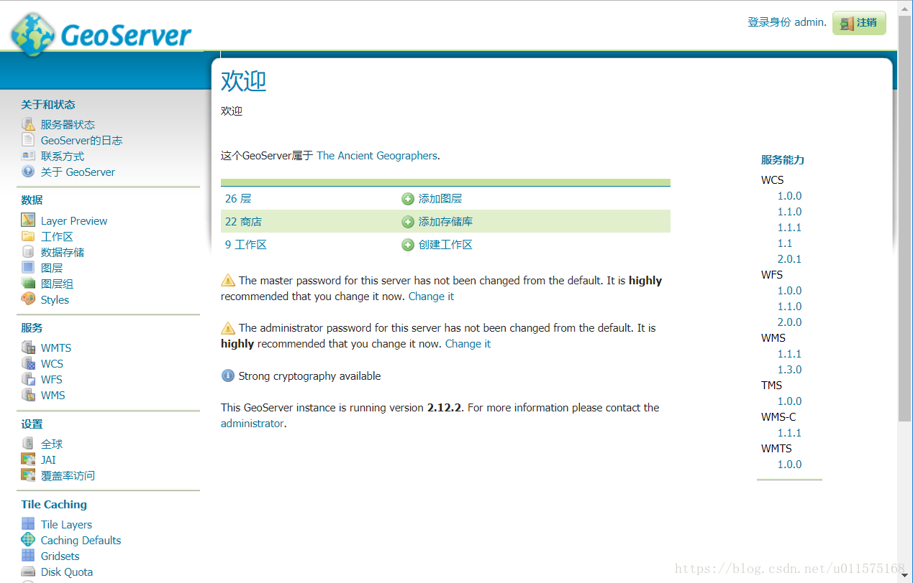

# GeoServer的安装与启动

我们在使用网络地图服务时（WMS），如果在互联网上，则可以直接使用Google,Bing,Baidu等大公司提供的地图服务。然而，当需要在内部局域网使用WMS服务时，就必须自己搭建地图服务器，提供WMS了。

本文主要阐述基于开源平台GeoServer搭建内部局域网上的Web地图发布的过程。

GeoServer是 OpenGIS Web 服务器规范的 J2EE 实现，利用 GeoServer 可以方便的发布地图数据，允许用户对特征数据进行更新、删除、插入操作，通过 GeoServer 可以比较容易的在用户之间迅速共享空间地理信息。

## GeoServer安装和环境搭建
### Java运行环境JDK的安装
GeoServer是基于Java的软件，运行的时候需要JDK的支持。在Oracle官网上http://www.oracle.com/technetwork/java/javase/downloads/jdk8-downloads-2133151.html）下载JDK8(Java SE 8u161)版本并安装，如下图所示。Windows64位系统选择最后一个。

下载完成后，双击安装，一路“下一步”，注意安装的路径，一会安装Geoserver会用到。

JDK8提供了运行GeoServer所需的运行环境。

### GeoServer的安装
在GeoServer官方网站（http://geoserver.org）下载并安装GeoServer（Stable版本）。

在此步骤需要输入JDK的安装路径，如下图所示，如果路径不对，需要手动选择(点击Browser...)

设置用户名和密码，缺省使用用户名“admin”和密码“geoserver”。
选择默认目录和端口8080。注意，如果本机默认安装了Tomcat服务器，GeoServer的端口号不要设置成默认的8080，避免与Tomcat的端口号冲突，造成不必要的麻烦。最后，选择开启服务的方式为手动开启，确认之后即可安装。

### GeoServer的启动
Windows系统通过开始菜单-Start GeoServer即可启动GeoServer，启动界面如下图，为控制台界面显示。**注意，使用GeoServer作为WMS服务器期间，不要关闭此窗口！**

### GeoServer的管理界面
GeoServer启动后，打开浏览器，输入 http://localhost:8080/geoserver/web（这里的8080就是你之前安装是设置的端口号） 即可访问GeoServer的系统界面。注意，先打开GeoServer，然后才能在浏览器中访问管理界面。

开启 GeoServer 界面后，使用之前安装过程中的默认用户名“admin”和密码“geoserver”登录。管理界面显示如下。

在此管理界面我们可以上传各种类型的地图资源，进行地图的发布等服务了！

--------------------------------------------------------------------------------
[1]: http://live.osgeo.org/zh/quickstart/geoserver_quickstart.html
