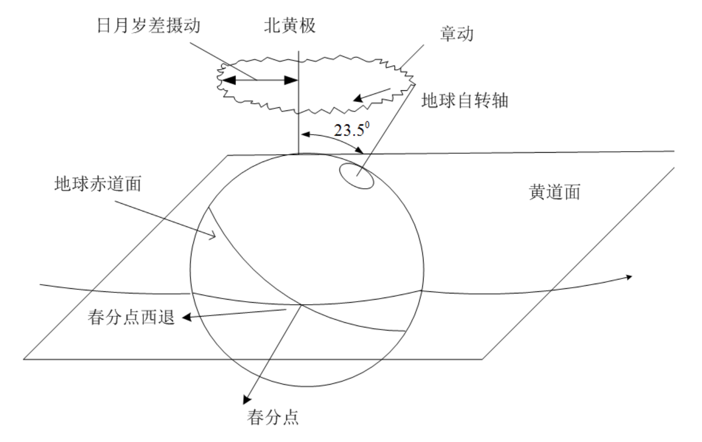
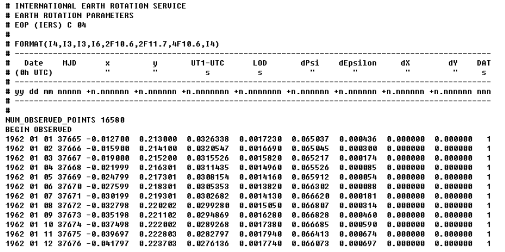

本文主要阐述了目前国际天文界最新规定的岁差章动模型(IAU 2000A/B)，并根据此模型给出ITRS,GCRS和
J2000平赤道地心系相互转换的详细步骤。

本文主要依据《IERS Conventions 2003》(IERS Technical Note No. 32)而来，由于文章为英文，且详细叙述了ITRS,GCRS参考系以及岁差章动等模型，会使得读者初次阅读（或天文背景知识不够）产生阅读障碍。笔者也是在多次反复阅读的基础上并参考其它书籍和文献才稍微弄清楚，因此本文是笔者关于此文献的一个总结，希望能够对读者有所帮助。

本文不打算对坐标系转换的理论（岁差章动，极移等）进行详细讲解，仅仅给出坐标转换的基本步骤和必要常识，以便读者根据此文能够迅速掌握ITRS,GCRS和J2000平赤道地心系相互转换的基本原理，并能够依据IERS提供的Fortran源程序进行实际编程应用。

# **前言**

## **名词缩写和解释**

| 缩写    | 英文全称                                                       | 中文/解释            |
| ----- | ---------------------------------------------------------- | ---------------- |
| BCRS  | barycentric celestial reference system                     | 太阳系质心天球参考系       |
| CEO   | celestial intermediate origin                              | 天球中间原点           |
| CIP   | celestial intermediate pole                                | 天球中间极            |
| CIRS  | celestial intermediate reference system                    | 天球中间参考系          |
| EOP   | earth orientation parameters                               | 地球定向参数           |
| GCRS  | geocentric celestial reference system                      | 地心天球参考系          |
| GMST  | Greenwich mean sidereal time                               | 格林威治平恒星时         |
| GAST  | Greenwich apparent sidereal time                           | 格林威治视恒星时         |
| IAU   | international astronomical union                           | 国际天文学联合会         |
| ICRS  | international celestial reference system                   | 国际天球参考系          |
| IERS  | international Earth rotation and reference systems service | 国际地球自转和参考系服务     |
| ITRS  | international terrestrial reference system                 | 国际地球参考系/地固系      |
| J2000 | 2000 January 1.5                                           | 2000年1月1.5（参考历元） |
| SOFA  | standards of fundamental astronomy                         | 天文学基础标准库         |
| TEO   | terrestrial intermediate origin                            | 地球中间原点           |
| TIRS  | terrestrial intermediate reference system                  | 地球中间参考系          |
| TT    | terrestrial time                                           | 地球时              |
| UT    | universal time UT1                                         | 世界时（UT1）         |
| UTC   | coordinated universal time                                 | 协调世界时（UTC）       |
| MAS   | milliarcsecond                                             | 毫角秒              |

## **ITRS**

就是我们常说的地固坐标系，其原点在地球质心（包含大气海洋等质量），坐标系xy平面为地球赤道面，z轴指向北极CIO处，x轴指向格林威治子午线与赤道面交点处。

此坐标系固定在地球上，地面站测控，以及地球引力场系数等都在此坐标系下定义。

## **J2000.0**

常被称为J2000平赤道地心坐标系。其原点也是在地球质心，xy平面为J2000时刻的地球平赤道面，x轴指向J2000时刻的平春分点（J2000时刻平赤道面与平黄道面的一个交点）。

此坐标系常被作为地球卫星的惯性坐标系，卫星运动积分等都在此坐标系计算。

## **GCRS**

J2000地心天球坐标系，其定义与J2000平赤道地心坐标系仅有一个常值偏差矩阵B。目前IAU推荐用此坐标系逐渐取代J2000平赤道地心坐标系。

## **时间量**

$$
\begin{aligned}
&UT1 = UTC + (UT1-UTC) \\
&DAT = TAI - UTC \\
&TAI = UTC + DAT \\
&TT = TAI + 32.184\mathrm{s}
\end{aligned}
$$

给定UTC时刻，可求得其距离J2000的世纪数，即

$$
t=\frac{TT-2451545.0}{36525}
$$

上式中 2000 Jan 1d 12h TT 对应的儒略日（Julian day）为 $2451545.0$ 天。

## **坐标转换**

当一坐标系绕其3个轴旋转 $\theta$ 角时，则坐标旋转矩阵可表述为：

$$
R_x(\theta) = 
    \begin{pmatrix}
    1 & 0 & 0 \\
    0 & \cos\theta & \sin\theta \\
    0 & -\sin\theta & \cos\theta
    \end{pmatrix}
$$

$$
R_y(\theta) = 
    \begin{pmatrix}
    \cos\theta & 0 & -\sin\theta \\
    0 & 1 & 0 \\
    \sin\theta & 0 & \cos\theta
    \end{pmatrix}
$$

$$
R_z(\theta) = 
    \begin{pmatrix}
    \cos\theta & \sin\theta & 0 \\
    -\sin\theta & \cos\theta & 0 \\
    0 & 0 & 1
    \end{pmatrix}
$$

其旋转方向符合右手螺旋法则，即逆时针旋转为正方向。另外坐标旋转矩阵具备如下性质：

$$
R^{-1}(\theta)=R^T(\theta)=R(-\theta)
$$

# **背景知识**

我们知道，地球的自转轴在惯性空间中不是固定的，而是不断摆动的。此摆动造成地轴绕北黄级顺时针运动，夹角约为23.5度。于此同时，地轴还在做微小的抖动，见下图。前者的运动称为岁差(Precession)，后者运动成为章动(Nutation)。岁差章动的原因主要有两个方面。其一是太阳系行星对地球绕日轨道所产生的摄动影响；其二是太阳和月球对地球赤道隆起部分的摄动影响。

关于岁差章动的计算，此前一直采用IAU 1976岁差模型和1980章动模型。随着时间的推移，此模型的精度逐渐跟不上需要。因此，IAU又规定，自2003年1月1日起，采用新的岁差章动模型，即IAU 2000A模型（精度到达0.2mas），或者IAU 2000B模型（精度达到1mas）。

岁差章动模型描述了地球自转轴的运动，另外，由于地球表面的海洋，大气运动以及地核内部液体的运动造成地球自转轴并不是相对地球不动的；相对地球北极CIO点来说有个小范围的运动，此种现象成为极移。

此外，地球的自转也不是均匀的，也很复杂。

综上所述，从地固坐标系(ITRS)到地心惯性系(GCRS或J2000平赤道地心系)的坐标转换矩阵由极移，自转和岁差章动组成。

# **ITRS到GCRS的转换矩阵**

**本文采用IAU 2000A/B 岁差章动模型**，在某历元UTC时刻，ITRS到GCRS的转换矩阵可写成：

$$
\vec{r}_{\mathrm{GCRS}}=Q(t)\cdot R(t)\cdot W(t)\cdot\vec{r}_{\mathrm{ITRS}}=H\cdot G^{T}(t)\cdot\vec{r}_{\mathrm{ITRS}}
$$

其中，$\vec{r}_{\mathrm{ITRS}}$和$\vec{r}_{\mathrm{GCRS}}$分别对应同一位置向量在ITRS和GCRS坐标系中的坐标。

上式中，$W(t)$，$R(t)$和$Q(t)$分别对应极移，自转和岁差章动转换矩阵。

在计算$R(t)$和$Q(t)$的时候，会有两种计算方法，我们分别称为CEO-based转换方法和equinox-based转换方法。其中前者为IAU提出的新的计算方法。

下面分别给出上述三个转换矩阵的求解过程。

## **极移矩阵 $W(t)$**

$$
W(t)=R_z(-s')\cdot R_y(x_p)\cdot R_x(y_p)
$$

上式中，$s'$为：

$$
s'=-0.047\mathrm{mas}\cdot t
$$

极移量$(x_p,y_p)$的求解为：

$$
(x_p,y_p)=(x,y)_{\mathrm{IERS}}+(\Delta x,\Delta y)_{\mathrm{tidal}}+(\Delta x,\Delta y)_{\mathrm{nutation}}
$$

极移量主要是由IERS根据天文观测给出的$(x,y)_{\mathrm{IERS}}$，每周都有新的观测数据，此外，由于地球潮汐和章动的影响，会对极移有微小的修正$(\Delta x,\Delta y)_{\mathrm{tidal}}$和$(\Delta x,\Delta y)_{\mathrm{nutation}}$。

上式中，$(x,y)_{\mathrm{IERS}}$由IERS给出的观测数据计算求得，$(\Delta x,\Delta y)_{\mathrm{tidal}}+(\Delta x,\Delta y)_{\mathrm{nutation}}$可由公式计算得到，IERS提供此fortran源程序。

## **地球自转矩阵$R(t)$**

$$
R(t)=R_z(-\theta)
$$

地球自转角$\theta$的求解根据转换方法的不同有不同的求解方式（CEO-based或者equinox-based），具体求解IERS给出了fortran源程序。

## **岁差章动矩阵 $Q(t)$**

前面提到，计算此矩阵有两种方法：

### **1.  CEO-based方法：**

这种方法是IAU最新提出的并极力倡导的，其计算公式为：

$$
Q(t)=
\begin{pmatrix}
1-aX^{2} & -aXY & X \\
-aXY & 1-aY^{2} & Y \\
-X & -Y & 1-a(X^{2}+Y^{2})
\end{pmatrix}\cdot R_z(s)
$$

其中：

$$
a=\frac{1}{2}+\frac{1}{8}(X^2+Y^2)
$$

上式中：

$$
(X,Y)=(X,Y)_{\mathrm{IAU2000}}+(dX+dY)_{\mathrm{IERS}}
$$

$(X,Y)_{\mathrm{IAU2000}}$和$s$可根据IAU2000A/B岁差章动模型求解出，IERS同样给出求解的fortran源程序，另外，由于IAU2000A/B岁差章动模型没有包含地轴的高频率运动，所以要加上IERS通过观测数据给出的高频率修正项$(dX+dY)_{\mathrm{IERS}}$。

### **2. Equinox-based方法：**

$$
Q(t)=B\cdot P(t)\cdot N(t)
$$

其中，常值偏差矩阵$B$，岁差矩阵$P(t)$和章动矩阵$N(t)$的定义如下：

$$
\begin{aligned}
B &= R_z(-\delta\alpha_0) \cdot R_y(-\xi_0) \cdot R_x(\eta_0) \\
P(t) &= R_x(-\epsilon_0) \cdot R_z(-\psi_A) \cdot R_x(\omega_A) \cdot R_z(-\chi_A) \\
N(t) &= R_x(-\bar{\epsilon}) \cdot R_z(-\Delta\psi) \cdot R_x(\bar{\epsilon}+\Delta\epsilon)
\end{aligned}
$$

章动量$(\Delta\psi,\Delta\epsilon)$为：

$$
(\Delta\psi,\Delta\epsilon)=(\Delta\psi,\Delta\epsilon)_{\mathrm{IAU2000}}+(\delta\Delta\psi,\delta\Delta\epsilon)_{\mathrm{IERS}}
$$

上式中，$(\Delta\psi,\Delta\epsilon)_{\mathrm{IAU2000}}$由IERS 2000A章动模型给出。前面提到过，IAU 2000A/B模型提供的岁差章动不包含高频率项，而是由IERS的观测数据提供（上式右端最后一项），但是在IERS给出的观测数据中仅仅给出$(dX,dY)_{\mathrm{IERS}}$，我们可以通过IERS提供的fortran源程序将$(dX,dY)_{\mathrm{IERS}}$转换为$(\delta\Delta\psi,\delta\Delta\epsilon)_{\mathrm{IERS}}$。

其余参数皆为岁差参数，可以通过公式求出，此处从略。

值得一提的是常值偏差矩阵中的参数也是给定的，在CEO-based方法求解中，此偏差是包含在$(X,Y)_{\mathrm{IAU2000}}$中的。

# **利用IERS提供的Fortran源程序进行转换**

上节中详细讲述了ITRS到GCRS转换矩阵的求解过程，在实际应用中，如果是自己编写源程序的话是件非常琐碎的事情，因为IERS 2000A/B 章动模型的参数多达1000多项。幸而这些基本子程序IERS都提供了，我们所做的就是如何正确的运用这些源程序，并将它们组合起来。

在[ftp://maia.usno.navy.mil/conv2000/chapter5/上可下载相关的源程序，子程序列表如下：](ftp://maia.usno.navy.mil/conv2000/chapter5/上可下载相关的源程序，子程序列表如下：)

| 子程序名                                                                                     | 说明                                                           |
| ---------------------------------------------------------------------------------------- | ------------------------------------------------------------ |
| BPN2000                                                                                  | CEO-based intermediate-to-celestial matrix                   |
| CBPN2000                                                                                 | equinox-based true-to-celestial matrix                       |
| EE2000                                                                                   | equation of the equinoxes (EE)                               |
| EECT2000                                                                                 | EE complementary terms                                       |
| ERA2000                                                                                  | Earth Rotation Angle                                         |
| GMST2000                                                                                 | Greenwich Mean Sidereal Time                                 |
| GST2000                                                                                  | Greenwich (apparent) Sidereal Time                           |
| NU2000A                                                                                  | nutation, IAU 2000A                                          |
| NU2000B                                                                                  | nutation, IAU 2000B                                          |
| POM2000                                                                                  | form polar-motion matrix                                     |
| SP2000                                                                                   | the quantity s’                                              |
| T2C2000                                                                                  | form terrestrial to celestial matrix                         |
| XYS2000A                                                                                 | X, Y, s                                                      |
| interp.f                                                                                 | Interpolation of IERS polar motion and UT1 time series       |
| uai2000.f                                                                                | IAU 2000 celestial pole offsets conversion (dpsi,deps,dX,dY) |

上表最后可从[ftp://hpiers.obspm.fr/iers/models上下载得到。](ftp://hpiers.obspm.fr/iers/models上下载得到。)

## **IERS观测数据的处理**

前面一再提到IAU 2000A/B章动岁差模型不包含高频率项，因此在完整的坐标转换过程中，必须考虑到IERS提供观测数据的高频率修正项。

IERS每周发布Bulletins A，每月发布Bulletins B，它们都是描述EOP的参数，下面是综合的EOP参数文件(C 04)，其主要内容如下：

注意上述文件中，dPsi,dEpsilon是针对IAU 1980章动模型的修正项$(\delta\Delta\psi,\delta\Delta\epsilon)_{\mathrm{IAU1980}}$，不是IAU 2000A章动模型的修正项$(\delta\Delta\psi,\delta\Delta\epsilon)_{\mathrm{IAU2000}}$，因此不需要使用。

根据UTC时刻的儒略日，加上数据列表$MJD,x,y,UT1-UTC$，可调用interp.f文件中的interp子程序插值计算出对应UTC时刻的$(x_p,y_p)$和$(UT1-UTC)_{\mathrm{IERS}}$ 。在子程序interp中，先插值计算出IERS的观测数据$(x,y)_{\mathrm{IERS}}$和$(UT1-UTC)_{\mathrm{IERS}}$，然后内部调用子程序PMUT1_OCEANS和PM_GRAVI计算由潮汐和章动引起的高频率修正项$(\Delta x,\Delta y)_{\mathrm{tidal}},(\Delta x,\Delta y)_{\mathrm{nutation}}$和$(UT1-UTC)_{\mathrm{tidal}}$，然后分别相加，给出最后的$(x_p,y_p)$和$UT1-UTC$ 。
另外，根据IERS的观测数据列表$MJD,dX,dY,LOD,DAT$，可插值计算出$(dX,dY)_{\mathrm{IERS}}$、$LOD$和$DAT$。若为equinox-based方法转换，则需要调用uai2000.f文件中的子程序dXdY_dpsideps将$(dX,dY)_{\mathrm{IERS}}$转换为$(\delta\Delta\psi,\delta\Delta\epsilon)_{\mathrm{IERS}}$。

有了$UT1-UTC$和$DAT$,则可求得$UT1,TT$和$t$ 。这些时间量在以后的子程序中都需要。

## **具体转换步骤**

首先调用子程序SP2000求得$s'$，再由上面插值求得的$(x_p,y_p)$，调用子程序POM2000即可求得极移矩阵$W(t)$。
求地球自转和岁差章动矩阵有两种方法，下面分别叙述：

### **1. CEO-based transformation**

调用ERA2000求得地球自转角$\theta$；
然后调用子程序XYS2000A求得$(X,Y)_{\mathrm{IAU2000}}$ 和$s$，再加上上面观测数据插值的$(dX,dY)_{\mathrm{IERS}}$，则可求得$(X,Y)$。根据$(X,Y,s)$，利用子程序BPN2000即可求得岁差章动转换矩阵$Q(t)$ 。

### **2. Equinox-based transformation**

调用子程序NU2000A求得章动量$(\Delta\psi,\Delta\epsilon)_{\mathrm{IAU2000}}$，再加上由观测数据插值求得的$(dX,dY)_{\mathrm{IERS}}$转换后的$(\delta\Delta\psi,\delta\Delta\epsilon)_{\mathrm{IERS}}$，得到最后的$(\Delta\psi,\Delta\epsilon)$；
由$\Delta\epsilon$，调用GST2000即可求得地球自转角$\theta$;
然后再由$(\Delta\psi,\Delta\epsilon)$调用子程序CBPN2000，求得岁差章动矩阵$Q(t)$。此处需要对子程序CBPN2000进行简单的说明，其内部进行常值偏差矩阵B和岁差章动矩阵P,N的计算，最后给出矩阵$Q(t)$。

由上述两种方法之一求得$W(t),\theta$，和$Q(t)$，调用子程序T2C2000即可求得ITRS到GCRS的转换矩阵$H\cdot G^{T}(t)$。

若采用方法二时，可以用子程序NU2000B替代NU2000A，其它都不变，此种转换的精度稍低(1mas)，但是其计算速度会快很多，在精度要求不是很高的情况下采用此种方法可使计算速度大大提高。

# **其它的一些说明**

1.)	下面给出GCRS和ITRS（包含速度）转换的完整表述：

$$
\begin{aligned}
\vec{r}_{\mathrm{ITRS}} &=[Q(t)\cdot R(t)\cdot W(t)]^{T}\cdot\vec{r}_{\mathrm{GCRS}}=H\cdot G(t)\cdot\vec{r}_{\mathrm{GCRS}} \\
\vec{r}_{\mathrm{TIRS}} &=[Q(t)\cdot R(t)]^{T}\cdot\vec{r}_{\mathrm{GCRS}} \\
\vec{V}_{\mathrm{ITRS}} &=W^{T}(t)\cdot\{R^{T}(t)\cdot Q^{T}(t)\vec{V}_{\mathrm{GCRS}}-\vec{\omega}_{e}\times\vec{r}_{\mathrm{TIRS}}\}
\end{aligned}
$$

和

$$
\begin{aligned}
\vec{r}_{\mathrm{GCRS}} &=Q(t)\cdot R(t)\cdot W(t)\cdot\vec{r}_{\mathrm{ITRS}}=H\cdot G^{T}(t)\cdot\vec{r}_{\mathrm{ITRS}} \\
\vec{r}_{\mathrm{TIRS}} &=W(t)\cdot\vec{r}_{\mathrm{ITRS}} \\
\vec{V}_{\mathrm{GCRS}} &=Q(t)\cdot R(t)\cdot\{W(t)\cdot\vec{V}_{\mathrm{ITRS}}+\vec{\omega}_{e}\times\vec{r}_{\mathrm{TIRS}}\}
\end{aligned}
$$

其中

$$
\omega_e=7.292115146706979\times10^{-5}\left(1-\mathrm{LOD}/86400\right)
$$

上式中的LOD由IERS的观测数据插值求得。
注意上述公式中$\vec{r}_{\mathrm{TIRS}}$和$\vec{r}_{\mathrm{ITRS}}$的区别，$\vec{r}_{\mathrm{TIRS}}$为地固系ITRS坐标$\vec{r}_{\mathrm{ITRS}}$经过极移转换矩阵后的坐标。

2.)	若需要GCRS和J2000平赤道地心系的相互转换，只需要常值偏差矩阵B即可。其具体的源程序需要读者自行编制。

$$
\begin{aligned}
\vec{r}_{\mathrm{GCRS}} &=B\cdot\vec{r}_{\mathrm{J2000}} \\
\vec{V}_{\mathrm{GCRS}} &=B\cdot\vec{V}_{\mathrm{J2000}} \\
\vec{r}_{\mathrm{J2000}} &=B^{T}\cdot\vec{r}_{\mathrm{GCRS}} \\
\vec{V}_{\mathrm{J2000}} &=B^{T}\cdot\vec{V}_{\mathrm{GCRS}}
\end{aligned}
$$

3.)	在IERS提供的fortran源程序中，有部分子程序需要调用IAU SOFA软件包中的子程序，有关IAU SOFA软件包的说明和使用请参见我的文档《IAU SOFA软件包介绍》。	

4.)	IAU SOFA软件包中也包含有关岁差章动和极移等基本子程序，其主要内容和本文介绍的fortran源程序大同小异。但其软件包中还包含以前的岁差章动模型以及最新的IAU2006岁差模型，读者需要的话可参考其文档说明“sofa_pn.pdf”，并有具体例子，强烈建议读者阅读。

# **参考文献**

 **1. IERS Conventions(2003)**
 可从IERS网站上下载([http://www.IERS.org)。此文详细叙述了IAU](http://www.IERS.org)。此文详细叙述了IAU) 2003A/B岁差章动模型，以及ITRS和GCRS坐标系的定义和详细转换过程，也是本文档的主要英文依据。在尽可能的情况下，读者可以多阅读几遍。

 **2. 《Fundamentals of Astrodynnamics and Applications》, Third Edition， Microcosm Press, 2007**
此书为David A. Vallado所著，此书中第3章“Coordinate and Systems”详细介绍了时间，坐标系系统，以及详细的ITRS到GCRS的转换过程。

 **3. [ftp://maia.usno.navy.mil/conv2000/chapter5/和ftp://hpiers.obspm.fr/iers/models](ftp://maia.usno.navy.mil/conv2000/chapter5/和ftp://hpiers.obspm.fr/iers/models)**
 此两ftp网站上含有IAU 2000岁差章动模型的所有Fortran源程序。也是本文中子程序的来源处。

 **4.  [http://www.iau-sofa.rl.ac.uk/](http://www.iau-sofa.rl.ac.uk/)**
 从此网站上可下载IAU SOFA软件包，里面同样包含IAU 2000岁差章动模型的所有Fortran源程序，另外还包括最新的IAU 2006模型，以及儒略日计算，行星历表等常用基本子程序。

 **5.  [http://hpiers.obspm.fr/eop-pc/](http://hpiers.obspm.fr/eop-pc/)**
 此网站包含EOP各种类型数据，包含IERS的Bulletin A/B 和C 04，以及一些其它文件的说明。
 