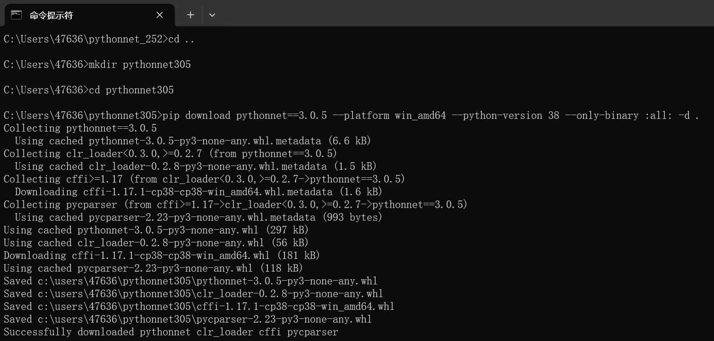
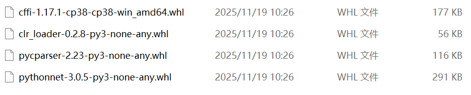

# Python调用C# DLL(pythonnet)介绍
Python中有个神奇的包:pythonnet，用它可以使得用户在python编程环境中像使用python一样调用C#的动态链接库文件中的类（严格来说是.Net 程序集）。

采用本文中的方式，可在python环境中调用最新的.Net 9.0的程序集。

具体可参考[https://pypi.org/project/pythonnet/](https://pypi.org/project/pythonnet/)


## 运行环境(Win 11, 联网状态）

### .Net环境
目前使用.Net 9.0 SDK，下载地址：[https://dotnet.microsoft.com/zh-cn/download/dotnet/9.0](https://dotnet.microsoft.com/zh-cn/download/dotnet/9.0)

### python环境
python 3.8及以上
### pythonnet安装
使用下面命令安装
```
pip install pythonnet
```
安装完成后，需要添加系统的环境变量：

- 变量名：PYTHONNET_RUNTIME
- 变量值：coreclr

 ## 运行环境(Win 7, 不联网状态）
在Win7系统下，且为局域网状态，不能访问互联网，则需要下载pytyhonnet的安装包及其依赖包(whl文件）
### .Net环境
目前使用.Net 9.0 SDK，下载地址：[https://dotnet.microsoft.com/zh-cn/download/dotnet/9.0](https://dotnet.microsoft.com/zh-cn/download/dotnet/9.0)

### python环境
python 3.8及以上。可安装**Anaconda3-2020.07-Windows-x86_64.exe**。
Anaconda3安装完成后，默认的python版本为3.8.3

给系统的环境变量“path”添加相应的路径：
“C:\ProgramData\Anaconda3;C:\ProgramData\Anaconda3\Scripts”

这样在cmd.exe中输入python和pip就能够识别了。
### pythonnet包下载
在有网环境下，下载pythonnet-3.0.5版本的安装包及依赖包。
使用下面命令安装
```
# 创建下载目录
mkdir pythonnet305
cd pythonnet305

# 下载指定版本的 pythonnet 及其所有依赖
pip download pythonnet==3.0.5 --platform win_amd64 --python-version 38 --only-binary :all: -d .
```


参数说明
--pythonnet==3.0.5 - 指定版本
--platform win_amd64 - 指定 Windows 64 位平台
--python-version 38 - 指定 Python 3.8
--only-binary :all: - 只下载 wheel 包（不下载源码包）

下载完成后，则文件夹“pythonnet305”中包含4个文件，如下图
### pythonnet安装
下载完成后，将整个目录复制到离线机器，使用cmd.exe(管理员权限)，使用cd命令切换到“pythonnet305”文件夹中，然后执行：
```
pip install --no-index --find-links=. pythonnet==3.0.5
```
安装完成后，需要添加系统的环境变量：

- 变量名：PYTHONNET_RUNTIME
- 变量值：coreclr


**大功告成！！！**


