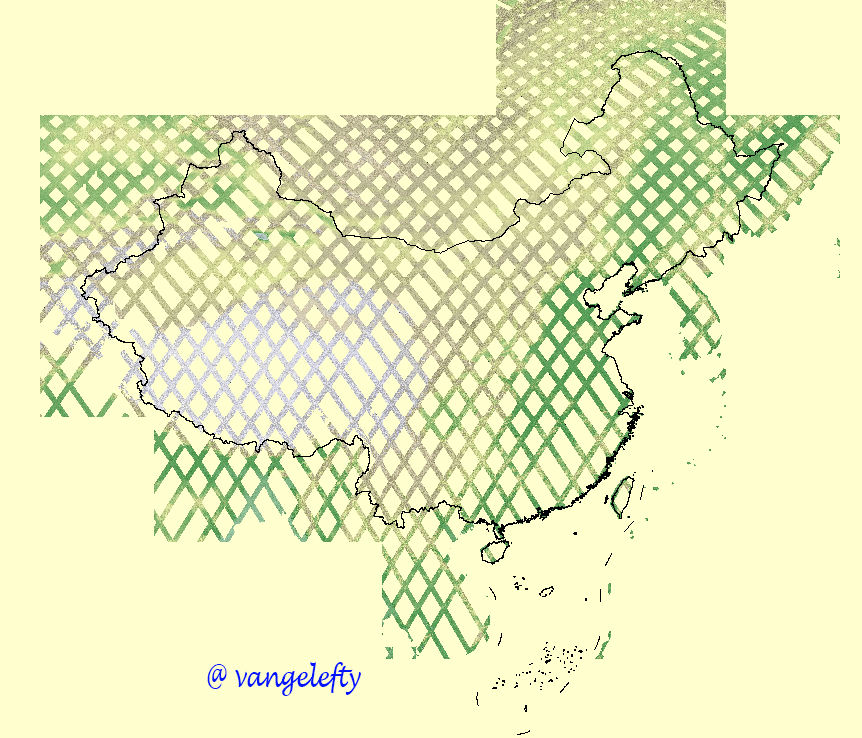
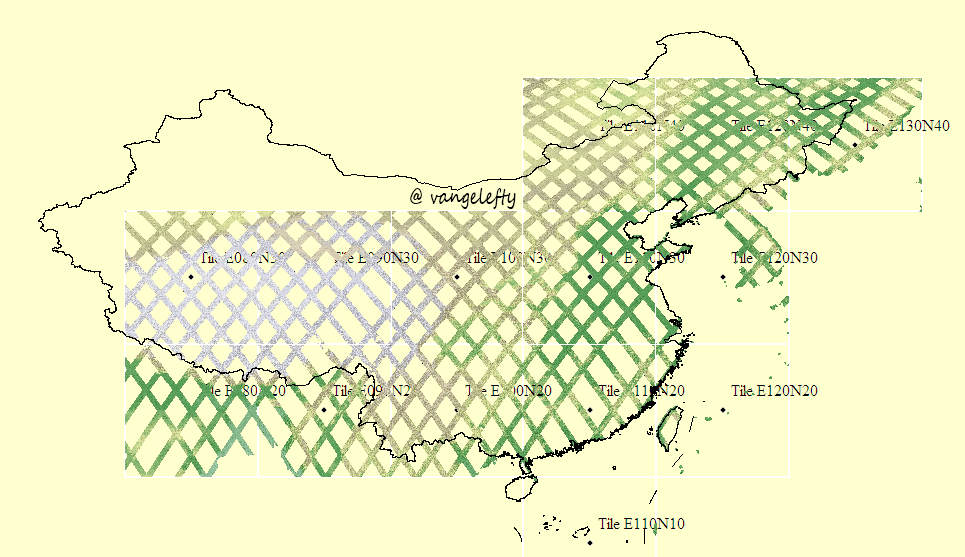
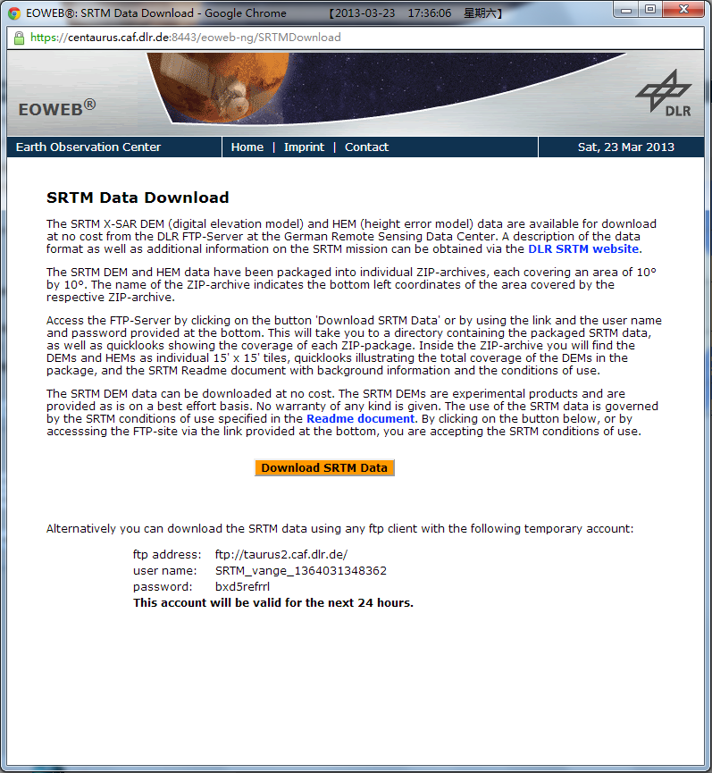

# SRTM、ASTER GDEM等全球数字高程数据（DEM）下载方式简介

原文地址：[SRTM、ASTER GDEM等全球数字高程数据（DEM）下载方式简介](http://blog.sina.com.cn/s/blog_720f853f0101c4a5.html)

作者：[vange](http://blog.sina.com.cn/u/1913619775)

之前写过一篇短文对比过几种数字高程数据的区别：[5种全球高程数据对比](http://blog.sina.com.cn/s/blog_720f853f01014hub.html),这篇文章简要介绍下如何下载这些数据。

1、DLR的数字高程数据。该数据也是SRTM（shuttle radar topographymission，航天飞机雷达地形测绘任务)数据，一般提到SRTM都是指NASA在2000年利用奋进号跑出来的数字高程数据，覆盖全面、公开数据早、精度在今天仍相当可观，所以更加有名。但SRTM并不只专指这一家，当年德国航天局DLR同在奋进号上用自己的雷达搞地形测绘，美国人用的C波段雷达，德国人用的X波段雷达，后者属于搭便车，航天飞机按美国人的测绘需求飞的，X波段覆盖更窄，没法扫全，所以扫出来的数据是呈网状的，但X波段精度更高，约在10米。

所以这个数据的优缺点都非常明显，优点是精度相当高，缺点是有些地方覆盖不全，覆盖方式如下图所示:

![\[转载\]SRTM、ASTER GDEM等全球数字高程数据（DEM）下载方](https://i-blog.csdnimg.cn/blog_migrate/0584a2f137fb211a0faab4f3fd2e0d2b.gif)

放大一点看北京附近覆盖的地区

![\[转载\]SRTM、ASTER GDEM等全球数字高程数据（DEM）下载方](https://i-blog.csdnimg.cn/blog_migrate/b7336415ba483dac90ead992df3f5383.gif)

近似的看，DLR的高程数据覆盖了中国国土面积约40%的区域，网状的带宽约50公里，空白的带宽约100公里，数据还是比较整齐。

DLR-DEM数据的下载源，我只知道DLR网站可以，未知是否还有其他镜像站提供下载。网址是:https://centaurus.caf.dlr.de:8443/eoweb-ng/template/default/welcome/entryPage.vm，需要注册才能下载，注册比较简单，另外这个网页约在2012年末时调整过检索方式，需要java的支持，安装一下即可。

以前下载DLR数据应该是通过地图检索出来，然后再在网页下载，比较类似下面日本航天局网站下载aster gdemv2数据的方式。（全部下完数据后就好久没有下载了，所以记不太准）

今天为了写此文，发现下载方式改变了，变得更方便了：登陆后，点击SRTM DATADOWNLOAD按钮，弹出一个页面，临时分配一个FTP帐号给你，可用24小时（貌似以前是挑选数据后才能弹出这个页面）：

![\[转载\]SRTM、ASTER GDEM等全球数字高程数据（DEM）下载方](https://i-blog.csdnimg.cn/blog_migrate/08fa3012efa4288525066fe0d1a9f980.gif)

![\[转载\]SRTM、ASTER GDEM等全球数字高程数据（DEM）下载方](https://i-blog.csdnimg.cn/blog_migrate/9878df337b80002d136e2670513a9e44.gif)

使用ftp客户端软件（如filezilla）就可以进入下载页面，这种方式下，文件检索只能依靠在googleearth里查看经纬度以获得自己想要的数据，最小下载单位是10经度*10纬度。此数据只有这一个源，所以网速也没法挑剔，100k/s我觉得还可以了。数据量方面，覆盖中国的数据约有16G，覆盖全球的数据约90G。

2、ASTER-GDEMV2，这是NASA新一代对地观测卫星TERRA测绘所得。覆盖全，精度约在30米。此数据约在2012年夏天之前还可以通过日本航天局的网站下载，之后就无法下载至今年2月，今天写此文再看发现竟然又可以下载了，此下载方式最简单，我的一部分ASTERGDEMV2数据就是在日本站下载的。网址是：http://gdem.ersdac.jspacesystems.or.jp/，先简单注册一下，再点左侧search进入检索界面，jp网站提供四种检索方式，用selecttilesdirectly即可，在地图上标记要下载的区域（最小单位是1经度*1纬度），点next，后续页面再选择一下用途即可点下载，我的网络带宽10M，下载速度能达到100多K，还是比较快的。

除了日本站，NASA网站也可以下载，只是下载相对麻烦一些。在日本站不能下载后，我利用NASA网站继续下载了剩余的数据，网址是：http://reverb.echo.nasa.gov/reverb/,也需要先注册，注册的邮箱一定要用自己能用的，数据下载的信息会发到这个邮箱。之所以说NASA网站麻烦，是因为连密码强度一类的规则都很多，注册后总要你不断完善信息（不完善也可）等等。该站也是利用地图检索，方式也简单，最小下载单位也是1经度*1纬度，在地图上用鼠标拖曳选中要下载的区域后，注意一定要等一会，地图下方的

Step 2: Select Datasets

要等一会才会出现检索出来的数据，有一大堆，这也是NASA网站厉害的一地方，把相当多的数据都整合在一个页面来下载，顺着窗口向下滚动，就能找到astergdem v2:

![\[转载\]SRTM、ASTER GDEM等全球数字高程数据（DEM）下载方](https://i-blog.csdnimg.cn/blog_migrate/63bc4016c46e4f9dcb03c71e4f79dd20.gif)

选中，然后点击下方的search forgranules，然后跳转下一个页面，出来一个类似购物网站的页面（有点雷~··~），把要下载的数据加购物车，再点view itemsin cart，再点order，再点proceed，再orderitems页面，同样要选数据用途，并确认NASA的数据使用声明，再proceed，（这几步网页反应都不会很快，约10秒），然后再点submitorders，这时NASA会向你的注册邮箱发两封邮件，第一封是**ReverbOrder Confirmation**这封邮件就是确认你刚才要下载数据信息的，几乎实时到达，没什么用。第二封邮件是告诉你下载地址的（每次下载数据都这样临时分配一个ftp给你，貌似是由不同镜像站来提供这个下载地址的，该ftp只能下载你前面检索并order的数据），这封邮件一般会有时滞，以我的经验，大多时候是会十几分钟内到达，慢的话也有过花好几小时的时候。而且似乎是要下载的数据越多邮件到的越快（好久没有大量下载数据了，这一点可能记得不准了）。这封邮件内容很多，你要做的就是找到下载地址即可，把地址复制到浏览器就能下载：

![\[转载\]SRTM、ASTER GDEM等全球数字高程数据（DEM）下载方](https://i-blog.csdnimg.cn/blog_migrate/083efeca17d02f9eeff778f70171c7c6.gif)

NASA的下载速度也还不错，比泥轰国的速度要慢一些，但也能接受。NASA搞的这一套用起来麻烦些，不过过程还是挺好玩的，能明显感受到美国人做事的那种思路。数据量方面，覆盖中国的数据约有22G。

以上两种数据结合，既能获得履盖全，又能尽可能的获得高精度的高程数据，所以我推荐使用DEM的话就下载以上两种就够了，或者仅下ASTERGDEMV2就行，精度也够可观了。以上两个数据都是2011年时才放出来的，这两个之前，还有大名鼎鼎的SRTM1、SRTM3（就是上面提到的奋进号SRTM之美国人的C波段数据），以及ASTERGDEM第一版数据，下面简要介绍其他DEM数据的下载。

3、ASTERGDEM第一版数据。第二版数据是对这个作了修正的，实际比较发现第二版数据的有较大的改善，精度达到了30米左右，而第一版精度在90米左右。由于数据出来的时候比较早，在国内也有镜像，即中科院的镜像，网址是：http://datamirror.csdb.cn/admin/datademMain.jsp，下载很简单，也需要注册，具体下载一看就会。这个数据号称是“30米分辩率数据”，公网搜索时也能看到有人说这个是第二版的数据，实际上从数据介绍看，它是ASTERGDEMV1经过加工而得，具体是如何加工的并未介绍，它说的“30米分辩率”与我所说的90米精度，简单的说并不予盾，具体口径有差异，但我也未作仔细研究。本质上这个数据还是ASTERGDEM第一版数据，跟第二版还是差很多。此ASTERGDEM第一版数据的最小下载单位也是1经度*1纬度。数据量方面，覆盖中国的数据约有11G。

4、SRTM3数据。就是前面提到的NASA之SRTMC波段数据，有SRTM1和SRTM3，数字1、3分别表示1角秒、3角秒，对应的精度在30米和90米，公开的SRTM1只覆盖美国地区，而中国只有SRTM3，下载地址同上述中科院镜像，网址：http://datamirror.csdb.cn/admin/datademMain.jsp，SRTM3数据下载的最小单位是5经度*5纬度。数据量方面，覆盖中国的数据约有2G。这个数据的最大好处就是大面积使用时很方便，每一块数据覆盖范围很广，5经度*5纬度的文件也只有约70M大小，作为概况使用完全够用。

5、GMTED2010数据。我只下载过一个区域的数据粗略看过，基本结论是该数据覆盖中国地区的精度在200米以上了，所以未细研究，下载网址：http://earthexplorer.usgs.gov/，下载方式跟前面几种很相似，就不细介绍。这个数据下载的最小单位是10经度*10纬度。

多说几句的是，虽然这个数据在中国的精度很有限，不过如果对美国本土地理有兴趣，可以好好发掘一下，比如该数据有公开的美国本土部分地区的1/3角秒精度DEM，即数米的精度。这个数据是美国地质调研局USGS所生产，关于该局的两个网站：http://www.usgs.gov/，https://lta.cr.usgs.gov/，里面有不少东西可看，我没太多时间细研究，但是粗看了一下网站，该局长期研究美国地理地质，几十年前就有大量可观的成果出来，可以看到其研究和成果物的发展演变脉络，现在也能看到公开的很多成果物，粗看上去都很好玩，进一步感叹美国的领先之处。

6、中国的数据？其实中国的进步也很快，资源三号的卫片已经出来，不时上其网站上看，发现进展很快，不断有更新，也已有产品可以订购，但具体没有细弄过，一来不是公开数据，二来网站还是不那么友好，没这么多时间折腾，所以没细研究。

本文作者保留所有版权，转载请注明出处。
