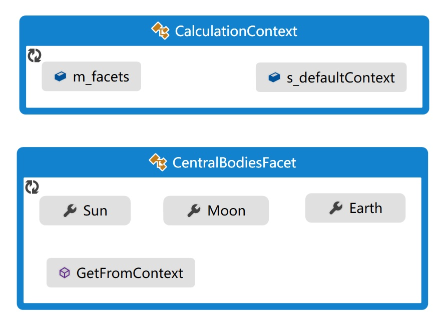

# STK Component之CalculationContext（计算上下文环境）

在使用STK Component类库进行航天工程方面的编程开发时，常常需要使用一些通用的类库，如太阳、地球、月球等类。对于此类，在编程中通常处理为全局变量，以便在任意地方直接调用。在C#中是没有全局变量或者全局函数的，可由以下两种处理方法：

 1. 将全局变量或函数封装为类（也可为静态类）的静态变量或者静态函数，这样在任何地方都可以直接调用，如系统自带的数学类Math。
 2. 将变量和函数封装为普通的类，但仅创建一个类的实例（或对象）。这种方式通常将类的构造函数隐藏起来，即无法通过使用New操作符调用类的构造函数来创建类的对象，而是通过类的静态构造函数来初始化类的一个静态字段（自身类），并引用此静态字段作为类的唯一对象。

如果上述两段话读者看不明白的话，建议还是好好翻一翻C#相关的书籍，加深一下理解。
 
 在STK Component类库中，采用的是第二种方式，通过CalculationContext类和CentralBodiesFacet类实现的。
 
 例如下段代码，借助CentralBodiesFacet类的静态函数GetFromContext获取到类CentralBodiesFacet的唯一对象后，可直接使用其地球属性的固定坐标系(earth.FixedFrame)。
```csharp
// 	从上下文环境直接获取CenralBodiesFacet的唯一对象
CentralBodiesFacet facet = CentralBodiesFacet.GetFromContext();
//	获取Earth对象
EarthCentralBody earth =  facet.Earth;
//	使用earth.FixedFrame
DateMotionCollection<Cartesian> ephemeris = propagator.Propagate(startDateJD, stopDateJD, step, 1, earth.FixedFrame);
```
实际上，在上述语句中，与我们直接打交道的是CentralBodiesFacet类，还有一个类：CalculationContext，它才是背后的主角。

下图为两个类的主要字段和函数（略去了大部分的成员）。

类CentralBodiesFacet中的属性有Sun,Moon,Earth，是我们需要使用的。如果仅仅实现这个功能，我们不需要CalculationContext类，可用下面的代码。
```csharp
    public class CentralBodiesFacet
    {
        EarthCentralBody m_earth;
        public EarthCentralBody Earth
        {
            get
            {
                if (m_earth == null) m_earth = new EarthCentralBody();
                return m_earth;
            }
        }

        //...Sun/Moon与Earth类似
	
		//  静态字段，唯一的类实例对象
        private static CentralBodiesFacet facet;

        public static CentralBodiesFacet GetFromContext()
        {
            if (facet == null)
            {
                facet = new CentralBodiesFacet();
            }
            return facet;
        }
    }
```
可以看出，类CentralBodiesFacet类中有一个静态字段facet，用以保存自身的唯一类实例。通过调用静态函数GetFromContext获取此类的唯一实例对象，若是第一次调用，则初始化facet。
通过这样设计此类，可以保证CentralBodiesFacet仅有一个实例对象，且只能通过静态函数GetFromContext获取到。获取后，即可使用其Sun/Earth/Moon等属性对象。

实际上，STK Component的实现远比以上复杂，它是通过CalculationContext类来存储CentralBodiesFacet类的唯一实例对象。
```csharp
public class CalculationContext : IThreadAware, ICloneWithContext
{
    // Fields
	//	...
    private CalculationContextFacet[] m_facets;
    private static CalculationContext s_defaultContext;
    //	...
}
```
类CalculationContext中，保存一个静态字段s_defaultContext，代表自身类的唯一实例（熟悉吧？！），同时通过一个CalculationContextFacet数组来保存其派生类对象：CentralBodiesFacet和LeapSecondsFacet。
在下句话中：
```csharp
CentralBodiesFacet facet = CentralBodiesFacet.GetFromContext();
```
STK Component类库主要经历了以下过程（实际过程比以下叙述的要复杂）：

 1. 调用CentralBodiesFacet的静态构造函数，创建CentralBodiesFacet的一个对象，暂定名为centerbodiesfacet;
 2. 调用CalculationContext类的静态构造函数和相关静态属性和函数（注意，不仅仅是静态构造函数），初始化静态字段s_defaultContext，作为CalculationContext类的唯一实例对象；
 3. 将centerbodiesfacet对象保存在s_defaultContext的私有字段m_facets[0]中；
 4. 通过类CalculationContext的GetFacet函数，从s_defaultContext中，将centerbodiesfacet取出来，赋值给外部变量facet。

此外，CalculationContext类还支持在不同的线程使用不同的CentralBodiesFacet对象，此处就不在详细叙述了。

**下面作一小结：在单一线程中，我们只与CentralBodiesFacet类打交道，CalculationContext类在后台提供支撑。无论何时何地，这两个类都仅有一个实例对象，这也是可以当做全局变量的原因。**
