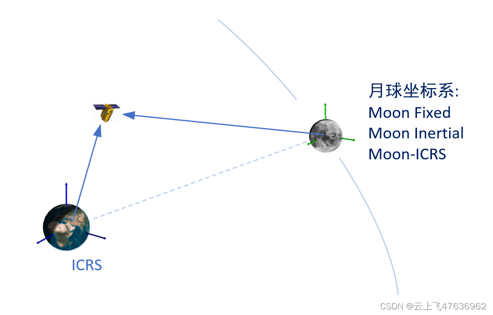
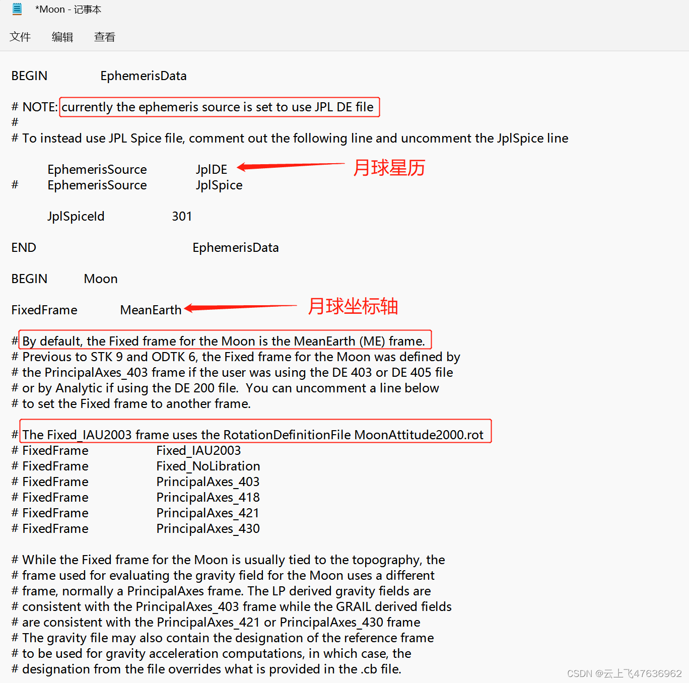

# STK/Component/Cesium中的月球坐标系的计算

下图中，已如某飞行器在地球惯性系(ICRS或GCRS或ICRF)中T时刻的位置，那么如何求解此飞行器T时刻在月球坐标系下的位置（速度）？

显然，这个问题涉及到两个方面，一是月球相对地球的位置(即地月的星历），二是ICRS到月球坐标轴的转换。

在STK桌面软件、Stk Comonent算法库、Cesium中均涉及到月球坐标系，其实这三者本一家，内部的算法也基本一致，但是由于月球的特殊性导致在涉及到月球坐标系计算的时候常常搞不清。

月球坐标系主要指：月球惯性系(Moon Inertial)与月球固连系(Moon Fixed)
此外为了比较，定义了月球ICRS坐标系，即原点在月心，坐标轴与ICRS的坐标轴重合。

本文阐述在STK/Component/Cesium中有关月球坐标系计算的问题。


## STK
STK软件中，打开矢量工具可查看月球的坐标系主要有两种:Moon Inertial和Moon Fixed

在[STK中心天体cb等相关文件说明](https://blog.csdn.net/u011575168/article/details/60603845?spm=1001.2014.3001.5501)一文可知，在STK中，每一个中心天体都有其对应的配置文件(.cb文件），分别存放在其对应名称的文件夹中，并且在STK启动时加载。

对于月球，其cb文件缺省位于目录下:C:\Program Files\AGI\STK 12\STKData\CentralBodies\Moon\Moon.cb，打开后部分文件内容如下图,可知缺省情况下的参数配置：
1. 月球的星历采用Jpl精密历表，目前是DE430。
2. 月球的固连坐标系采用"MeanEarth(ME)"，而不是"PrincipalAxes(PA)"，有关ME和PA的定义和区别，本文不再展开，请读者自行查阅。
3. MeanEarth坐标系的参数由Jpl DE430中定义，需要进行插值计算，为数值方法。
4. 也可设置Moon Fixed为FIxed_IAU2003，此坐标系的参数由MoonAttitude2000.rot文件中定义，为解析方法，具体参数的定义来源于国际天文联合会(IAU)的报告"Report of the IAU/IAG Working Group on Cartographic Coordinates and Rotational Elements of the Planets and satellites: 2000"。IAU每三年对此报告进行更新，此报告主要描述太阳系行星以及它们的卫星、小天体以及彗星等自转轴的指向和自转参数。


## Stk Component
在Stk Component算法库中，提供了Jpl精密历表，月球Moon Fixed系的相关类，下面代码给出T时刻地球惯性系(ICRS)中的某点在月球三个坐标系下的计算过程。
```csharp
    //  当前测试的时刻(UTCG)
    JulianDate t = new JulianDate(new GregorianDate(2020, 11, 23, 21, 6, 35.761));
                        
    //  STK中,某点在earth ICRF中的位置(STK)
    Cartesian r_stk_earthICRF = new Cartesian(-1.8087745223670499e+06, -6.2101045856704302e+06, -2.3931223275352502e+06);

    //  STK中，将上点转换到Moon不同坐标系下的数值:
    //  moon ICRF中的位置(STK)
    Cartesian r_stk_moonICRF = new Cartesian(-3.9577388635354376e+08, 3.8320783066947967e+07, 5.6969332431772619e+07);
    //  moon Inertial中的位置(STK)
    Cartesian r_stk_moonInertial = new Cartesian(-3.9727941178273672e+08, 3.8590773800480925e+07, 4.5064148976947613e+07);
    //  moon Fixed中的位置(STK)
    Cartesian r_stk_moonFixed = new Cartesian(3.9631923150127202e+08, 4.4511426953787886e+07, 4.7966196271462679e+07);
                   
    //=====================================================================================
    //  使用JPL精密历表De430               
    string filePath0 = AppDomain.CurrentDomain.BaseDirectory;
    string fp = Path.Combine(filePath0, @"Data/plneph.430");
    JplDE430 jplde = new JplDE430(fp);
    // Use the JplDE data in a CentralBodiesFacet
    CentralBodiesFacet centralBodies = CentralBodiesFacet.GetFromContext();
    jplde.UseForCentralBodyPositions(centralBodies);

    //  地球、月球
    EarthCentralBody earth = CentralBodiesFacet.GetFromContext().Earth;
    MoonCentralBody moon = CentralBodiesFacet.GetFromContext().Moon;

    //  使用JplDE 430中定义的月球Fixed系("Mean Earth")            
    moon.FixedFrame = jplde.GetMoonTopographicFixedFrame();

    //=====================================================================================
    //  创建地球ICRF系中的点
    var pos0 = new PointFixedOffset(earth.InertialFrame, r_stk_earthICRF);

    //  判断误差(0.01m)
    double ebsl = 0.01;

    //  在moon ICRF系下的位置(由于都是ICRF坐标轴,因此此处验证地月位置的正确性，采用Jplde430)
    //=====================================================================================
    ReferenceFrame moonIcrfFrame = new ReferenceFrame(moon.CenterOfMassPoint, earth.InternationalCelestialReferenceFrame.Axes);
    var r_moonICRF = GeometryTransformer.ObservePoint(pos0, moonIcrfFrame).Evaluate(t);
    Assert.AreEqual(r_stk_moonICRF.X, r_moonICRF.X, ebsl);
    Assert.AreEqual(r_stk_moonICRF.Y, r_moonICRF.Y, ebsl);
    Assert.AreEqual(r_stk_moonICRF.Z, r_moonICRF.Z, ebsl);

    //  在moon Inertial系下的位置(验证ICRF系转换到Moon Inertial系的正确性)
    //=====================================================================================
    var r_moonInertial = GeometryTransformer.ObservePoint(pos0, moon.InertialFrame).Evaluate(t);
    Assert.AreEqual(r_stk_moonInertial.X, r_moonInertial.X, ebsl);
    Assert.AreEqual(r_stk_moonInertial.Y, r_moonInertial.Y, ebsl);
    Assert.AreEqual(r_stk_moonInertial.Z, r_moonInertial.Z, ebsl);

    //  在moon Fixed系下的位置(验证ICRF系到Moon Fixed系的正确性)
    //  注意，此处Moon Fixed系为JplDE"Mean Earth" Axes
    //=====================================================================================
    var r_moonFixed = GeometryTransformer.ObservePoint(pos0, moon.FixedFrame).Evaluate(t);
    Assert.AreEqual(r_stk_moonFixed.X, r_moonFixed.X, ebsl);
    Assert.AreEqual(r_stk_moonFixed.Y, r_moonFixed.Y, ebsl);
    Assert.AreEqual(r_stk_moonFixed.Z, r_moonFixed.Z, ebsl);
```

## Cesium
由于Cesium中以地球Fixed系为世界坐标系，太阳和月球仅仅是一个特殊的对象用来衬托背景的。因此，Cesium中有关月球的星历和坐标系的计算均为解析方法。当然，此解析方法计算太阳月球的位置的精度也足够精确了，但是相比于JPL精密历表仍有一定的差距。

月球的星历采用Simon1994解析方法。Cesium中的源文件为：Source\Core\Simon1994PlanetaryPositions.js。
计算月球在地心惯性系下的代码如下：

```javascript
/**
 * Computes the position of the Moon in the Earth-centered inertial frame
 *
 * @param {JulianDate} [julianDate] The time at which to compute the Sun's position, if not provided the current system time is used.
 * @param {Cartesian3} [result] The object onto which to store the result.
 * @returns {Cartesian3} Calculated moon position
 */
Simon1994PlanetaryPositions.computeMoonPositionInEarthInertialFrame = function (
  julianDate,
  result
) {
  if (!defined(julianDate)) {
    julianDate = JulianDate.now();
  }

  result = computeSimonMoon(julianDate, result);
  Matrix3.multiplyByVector(axesTransformation, result, result);

  return result;
};
```

月球的地固系计算采用STK中的解析方法：FIxed_IAU2003（参见上面）。源代码文件为:
Source\Iau2000Orientation.js和IauOrientationAxes.js

下面代码为计算ICRF到月球Fixed系的转换的部分代码：
```javascript
//  获取Moon IAU J2000的参数
var axes = new IauOrientationAxes(Iau2000Orientation.ComputeMoon);
//  计算date时刻的ICRF->Moon Fixed的转换矩阵
axes.evaluate(date, result);
```

Cesium中，没有直接函数计算一个点在月球Fixed系下的位置，此外，Cesium中也没有ICRF到月球惯性系的转换方法。

## 小节
从上面分析可以看出。STK软件和Stk Component算法库基本一致，都可采用Jpl DE430精密历表计算月球的Fixed坐标系，也提供月球惯性系(Inertial)。

而Cesium中，仅仅有ICRF系到月球Fixed系的转换方法(IAU 2000解析方法)，和月球在地球惯性系下的位置方法(Simon1994解析方法)。


