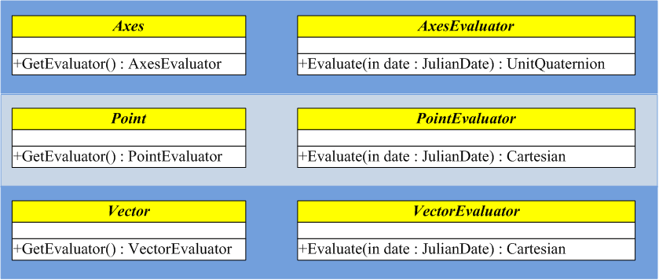

# STK Component：Evaluator pattern(计算器模式)

在STK Component中广泛的利用我们称之为的"计算器模式"。在Component中做任何计算时几乎都需要使用计算器模式。

所谓计算器模式，简单的说就是将一个对象的定义和其计算分离开。对象本身只保存数据，并不实际执行任何计算。从对象中获取其对应的计算器，然后利用计算器执行与该对象有关的计算。

## C# 中的枚举器
其实在学习C#中，我们已经遇到过计算器模式，这就是C#中的枚举器。让我们来重新温习一下，有助于理解计算器模式。

下面几个链接都是阐述计算器模式的，如果对枚举器不熟悉的可以参考。
http://www.cnblogs.com/JimmyZhang/archive/2007/08/22/865245.html
http://blog.csdn.net/jiangxinyu/article/details/8554818

面向对象设计原则中有一条是类的单一职责原则，所以我们要尽可能的去分解这些职责，用不同的类去承担不同的职责。Iterator模式就是分离了集合对象的遍历行为，抽象出一个迭代器类来负责，这样既可以做到不暴露集合的内部结构，又可让外部代码透明的访问集合内部的数据。

以自定义的字符串数组类为例，示例代码如下：
```
  //  自定义的类，实现字符串数组的功能（仅展示关键代码，其余省略）
    public class MyStringList : IEnumerable<string>
    {
        //  内部数组，用来保存字符串
        string[] strings;

        //  此类的其他属性及方法
        //...

        //------------------------------------------------------------
        //  Ienumerble<T>接口的实现，返回实现IEnumerator<T>接口的对象
        public IEnumerator<string> GetEnumerator()
        {
            return new MyStringListEnumerator(strings);
        }

		//------------------------------------------------------------
        // 嵌套的私有ListBoxEnumerator类实现
        private class MyStringListEnumerator : IEnumerator<string>
        {
            string[] mystrs;

            //  构造函数
            MyStringListEnumerator(string[] strs)
            {
                this.mystrs = strs;
            }

            // 接口IEnumerator的代码实现: Current/MoveNext/Reset..            
            //...
        }
    }
    
    
	//	使用方法：
    //  创建对象
	MyStringList myList = new MyStringList();
	//  获取对象的IEnumerator
    IEnumerator<string> myEnumerator = myList.GetEnumerator();
    //  使用IEnumerator的相关功能
    myEnumerator.MoveNext();
    //...

```

类MyStringList的内部字段strings保存着字符串的数组，同时有个内部的类MyStringListEnumerator来实现IEumerator接口。外部通过类的GetEnumerator()函数来获得实现接口IEnumerator的对象myEnumerator，注意，外部无法直接创建MyStringListEnumerator对象，是由GetEnumerator()函数获取的，获取后即可通过myEnumerator调用相关的功能(如Current,MoveNext,Reset)。

类MyStringList负责对象的建模，这个例子中，就是通过内部的数组保存字符串数组；类MyStringListEnumerator负责对象的功能(如MoveNext等)，外部对其不可见，**由类MyStringList内部进行实现**。通过这两个类把两者的职责分离开来，两者又相互联系，都是通过内部的数组(strings和mystrs，其实两个数组是同一个）来联系的。

## Evaluator模式
先来看一个STK Component中Evaluator的例子，以坐标系转换为例。
```
//	创建新的坐标系
AxesLinearRate axes = new AxesLinearRate();
//	以J2000的坐标系作为新坐标系axes的参考基准(旧坐标系)
axes.ReferenceAxes = CentralBodiesFacet.GetFromContext().Earth.J2000Frame.Axes;
//	初始时刻
axes.ReferenceEpoch = TimeConstants.J2000;
//	初始时刻：新坐标系相对旧坐标系的旋转(此处为单位阵，也就是说初始时刻两个坐标系重合)
axes.InitialRotation = UnitQuaternion.Identity;
//	新坐标系相对旧坐标系的旋转角速度（rad/s）
axes.InitialRotationalVelocity = 0.1;
//	新坐标系相对旧坐标系的旋转角加速度(rad/s^2)
axes.RotationalAcceleration = 0.0;
//	新坐标系相对旧坐标系的旋转矢量，此矢量在旧坐标系中表达(此处为绕旧坐标系的X轴旋转)
axes.SpinAxis = new UnitCartesian(1.0, 0.0, 0.0);

//	***以上定义了一个新的坐标系，从其定义参数，理论上我们可以求出在任意时刻，旧坐标系到新坐标系的转换矩阵
//----------------------------------------------------------------------------------
//	***以下为计算旧坐标系到新坐标系的转换矩阵

//	从新坐标系对象获取evaluator
AxesEvaluator evaluator = axes.GetEvaluator();
JulianDate dateToEvaluate = new JulianDate(new GregorianDate(2007, 11, 20, 12, 0, 0));
//	使用获得的evaluator计算某时刻的旧坐标系到新坐标系的转换矩阵(单位四元素形式)
UnitQuaternion rotationFromJ2000 = evaluator.Evaluate(dateToEvaluate);
```

上面的例子中，创建了一个坐标系对象axes，并计算其基准坐标系（旧坐标系）到它的转换矩阵。可以看出，axes对象仅仅用来描述一个新的坐标系是如何指向的（相对旧坐标系而言），而从旧坐标系到新坐标系的转换计算工作是由另一个类来实现的，它就是AxesEvaluator，是通过axes对象的GetEvaluator()方法来获取的。由AxesEvaluator类的函数Evaluate(JulianDate date)来计算两个坐标系的转换关系。**这种将对象的定义和其计算功能分开就是STK Component中的Evaluator模式。**
可以推测的是AxesEvaluator对象evaluator中必然保留或者直接指向axes中的相关定义参数，否则evaluator无法计算两个坐标系的转换。

## AxesLinearRate类的Evaluator代码实现
还是以坐标系AxesLinearRate类为例，通过.Net Reflector软件看看其源代码，从而了解其内部机制。
```
//	线性旋转坐标系类(继承自基类:Axes)
public class AxesLinearRate : Axes
{
	// 属性，描述相对旧坐标系的一系列属性参数
    // Properties
    public UnitQuaternion InitialRotation { get; set; }
    public double InitialRotationalVelocity { get; set; }
    // **参考坐标系，也就是旧坐标系
    public Axes ReferenceAxes { get; set; }
    public JulianDate ReferenceEpoch { get; set; }
    public double RotationalAcceleration { get; set; }
    public UnitCartesian SpinAxis { get; set; }

    // Methods
    // ...一系列override基类Axes的方法    
    //
	// **注意，此内部方法中，实际创建AxesEvaluator
    private AxesEvaluator CreateEvaluator(EvaluatorGroup group)
    {
      return new Evaluator(this.m_referenceAxes, this.m_epoch, this.m_initialRotation, this.m_spinAxis, this.m_initialRotationalVelocity, this.m_constantRotationalAcceleration);

    }
    // ... 
    public override AxesEvaluator GetEvaluator(EvaluatorGroup group);

    //------------------------------------------------------------------
    // **注意，由内部类来实现AxesEvaluator
    // 类Evaluator的名字可以取任何值，反正外部看不到，在外部，是以基类AxexEvaluator来代替。
    private class Evaluator : AxesEvaluator
    {
        // **看看这里的内部参数，是不是和类AxesLinearRate的属性参数基本一致？？！！
	    // 只要靠这些参数，它才能知道怎么计算两个坐标系的转换！！
        // Fields
        private double m_constantRotationalAcceleration;
        private JulianDate m_epoch;
        private UnitQuaternion m_initialRotation;
        private double m_initialRotationalVelocity;
        private Axes m_referenceAxes;
        private UnitCartesian m_spinAxis;

        // Methods
        // 这个构造函数在私有方法CreateEvaluator中被调用
        public Evaluator(Axes referenceAxes, JulianDate epoch, UnitQuaternion initialRotation, UnitCartesian spinAxis, double initialRotationalVelocity, double constantRotationalAcceleration);
       
        // **最重要方法！！！用来计算从旧坐标系到此坐标系的转换，此方法内部的代码就是具体的计算过程！
        public override UnitQuaternion Evaluate(JulianDate date);
        public override Motion<UnitQuaternion, Cartesian> Evaluate(JulianDate date, int order);
       //...其他方法

        // 这个属性用来保存旧坐标系
        public override TimeIntervalCollection<Axes> DefinedInIntervals { get; }
        // ...        
    }
}
```

首先类AxesLinearRate是继承基类Axes，实际上所有的坐标系都继承自Axes。类AxesLinearRate的一个重要方法就是GetEvaluator，用来获取其计算类AxesEvaluator对象。而AxesEvaluator的类的实现是由内部类Evaluator来实现的。

在内部类Evaluator中，保存了类AxesLinearRate的相关参数，以及用于计算坐标系转换的方法：Evaluate，其返回值为UnitQuaternion或Motion<UnitQuaternion,Cartesian>，后者包含新坐标系相对旧坐标系的旋转角速度、角加速度等等。

## 其他Evaluator
对于每个继承自Axes的类来说，其计算器类都为AxesEvaluator，由继承类负责实现AxesEvaluator类的实现，其Evaluate方法的返回值为UnitQuaternion。而对于其它类型，其计算器架构与其类似。见下图。

Axes、Point、Vector分别表示坐标系、点、矢量的基类，都包含一个GetEvaluator的方法，不同的是对应不同的类型其返回值也不同，分别为AxesEvaluator、PointEvaluator和VectorEvaluator，每个Evaluator的方法Evaluate的返回值也根据其类型不同而不同。

在自己以这些基类创建相应的具体类时，需要自行实现其对应的Evaluator。

    
        
