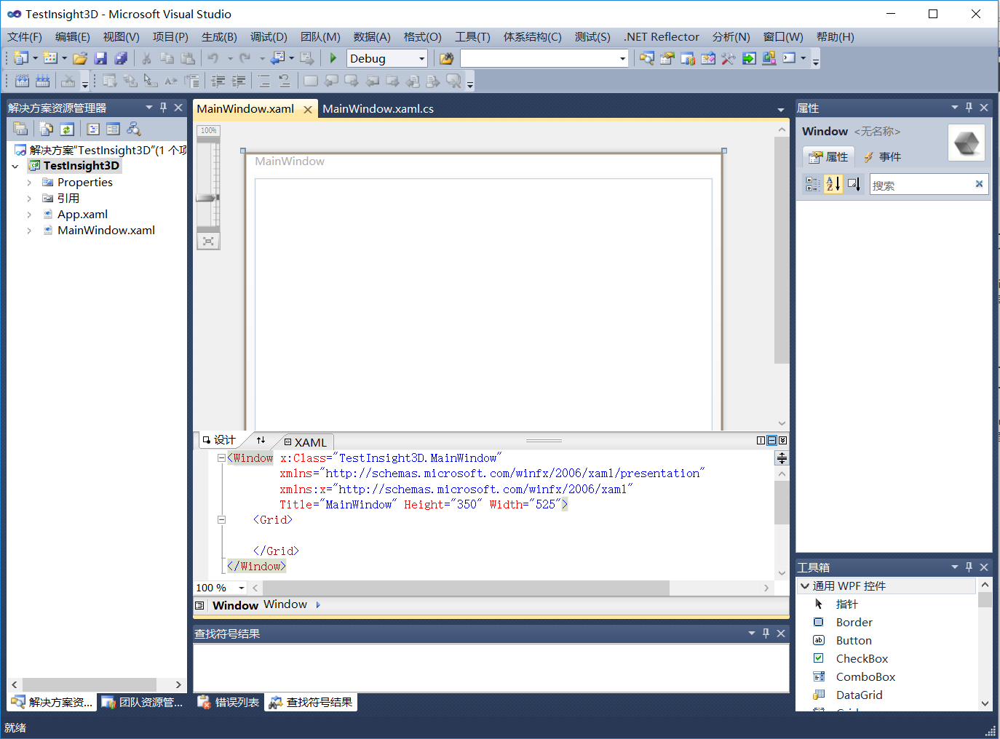
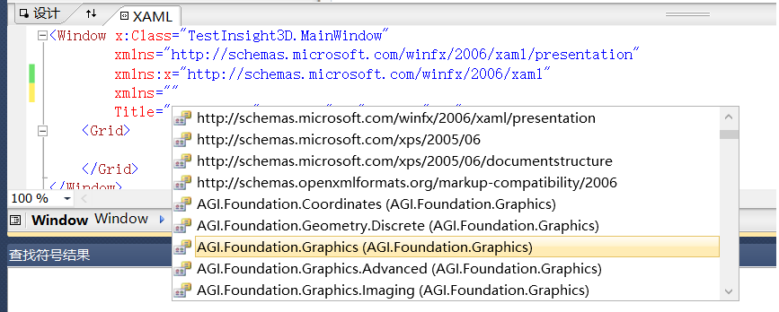
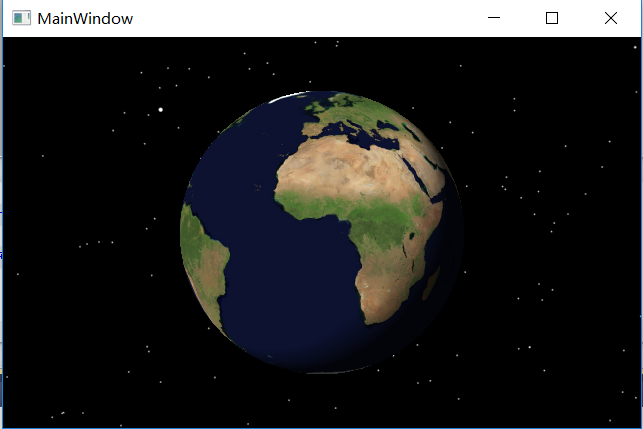
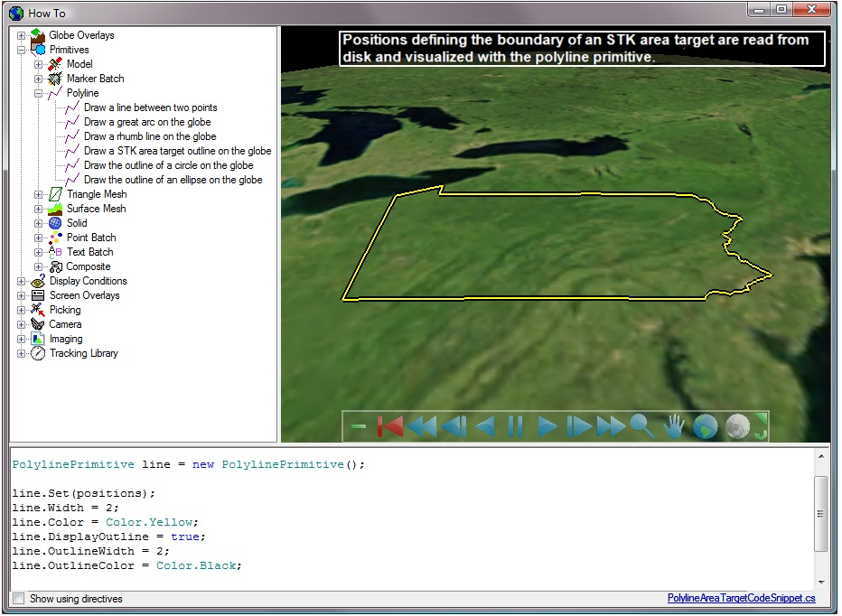

# STK Component Insight3D控件-WPF方式

STK Component Insight3D控件是用来三维显示的，在使用Visual Studio进行客户端程序开发时，使用Winform和Wpf的时候，两者加载Insight3D控件的步骤是略有区别的。本文简要介绍使用Windows WPF（C#）方式加载STK Component Insight3D控件的步骤。
本文使用Visual Studio 2010作为开发环境。

## Visual Studio设置
为了使得在Visual Studio中加载Insight3D控件，Visual Studio需要正确的设置，运行STK Component软件包下的vcredist_x86.exe ，如果是64位系统的话，还需运行vcredist_x64.exe 。

## 新建Visual Studio WPF工程

打开Visual Studio，新建Wpf工程项目（文件-新建-项目-Visual C#-WPF应用程序）。选择.Net FrameWork 4作为工程配置，设定项目名称为TestInsight3D（可任意设置）。新创建的工程如下图。 


在解决方案资源管理中，右键工程TestInsight3D，点击属性，在属性窗口“应用程序”-目标框架选项中，将.Net Framework 4 Client Profile更改为.Net Framework 4。

本文中使用x86版本的Insight3D控件，因此应将工程改为x86的配置。在菜单栏“生成-配置管理器”中，将项目的平台更改为“x86”，如果没有则新建平台，新建平台的类型为x86。

在项目配置文件app.config中，将其改为如下代码：
```
<configuration>
  <startup useLegacyV2RuntimeActivationPolicy="true">
    <supportedRuntime version="v4.0"/>
  </startup>
</configuration>
```

## 添加引用文件

 1. 为项目添加STK Compon引用。右键“引用”-添加引用-浏览，导航到文件路径（STK Component的软件包目录Assemblies文件夹），选择程序集DLL文件AGI.Foundation.Graphics.dll ，然后点击“确定”。此工程项目涉及到的程序集较少，如果涉及较多的话，应该添加其他相应的程序集（DLL）。

 2. 此外，Insight3D控件是WinForm形式，因此，为在WPF中使用WinForm控件，需要添加WindowsFormsIntegration程序集。右键“引用”-添加引用-程序集，在列表中选择WindowsFormsIntegration，然后点击“确定”。
 
 3. 如果使用的STK Component为未破解的话，则还需要license文件，如果为破解版本则忽略此步骤。license文件以.lic为拓展名，将其放置在Assemblies文件夹中。右键工程-添加-现有项，浏览到Assemblies文件，将licenses.licx文件（注意不是.lic文件）添加到工程中。

## 添加控件Insight3D

项目中，MainWindow.xaml为程序主窗口GUI，双击后，显示两个编辑界面：GUI窗口和XAML窗口。XAML窗口使用xml语言的方式添加控件，GUI窗口及时显示效果。

XAML窗口中，首先添加对STK.Foundation.Graphics程序集的命名空间引用，输入xmlns，在自动弹出的命名空间选项中选择AGI.Foundation.Graphics(AGI.Foundation.Graphics)命名空间，见下图。命名空间取名为Comp(可任意设置)。


然后添加Insight3D控件，控件名称为Insight3D1,以便后续代码中引用此控件。具体xaml代码如下：
```
<Window x:Class="TestInsight3D.MainWindow"
        xmlns="http://schemas.microsoft.com/winfx/2006/xaml/presentation"
        xmlns:x="http://schemas.microsoft.com/winfx/2006/xaml"
        xmlns:Comp="clr-namespace:AGI.Foundation.Graphics;assembly=AGI.Foundation.Graphics"
        Title="MainWindow" Height="350" Width="525">
    <Grid>
        <WindowsFormsHost>
            <Comp:Insight3D Name="Insight3D1"></Comp:Insight3D>
        </WindowsFormsHost>
    </Grid>
</Window>
```

项目生成后，按F5运行，即可正常启动加载Insight3D控件，如下图：


## 小结
本文大部分内容可参考STK Component的Help文档Getting Started部分。

本文给出的例子仅仅是如何使用Wpf方式加载Insight3D控件，后面具体在此控件中添加更进一步的功能，如飞行器的轨迹显示、地面站显示、图标显示等等请参考Help文档中相关说明，也可参见其提供的例子（Example文件夹下的HowTo工程），见下图，里面针对每个功能都直接提供了相关代码，可直接照搬。


