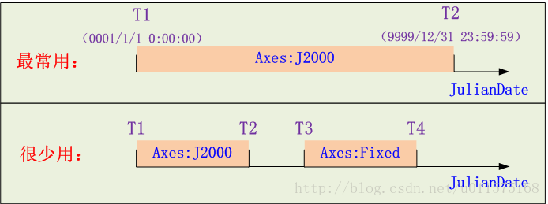
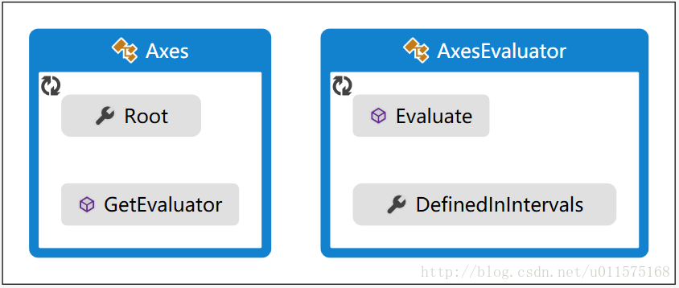
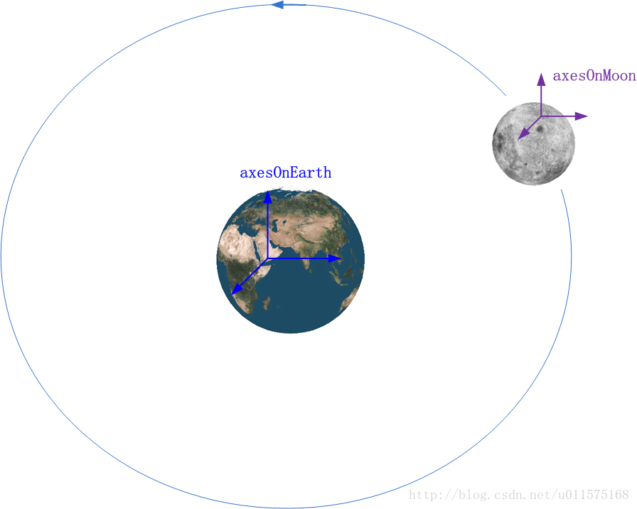
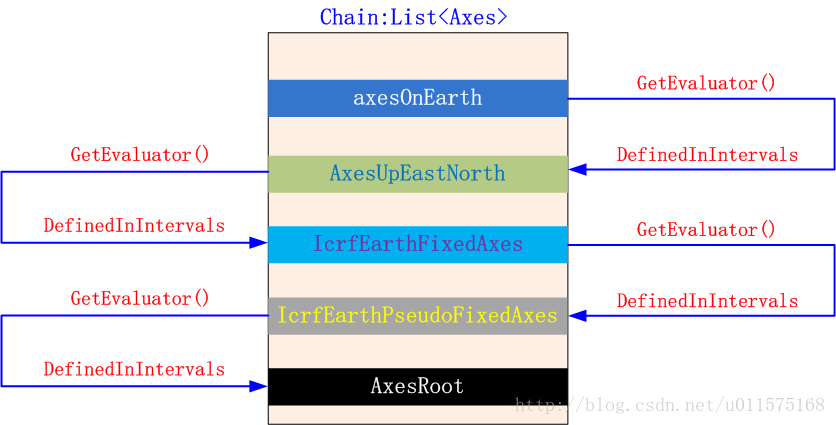
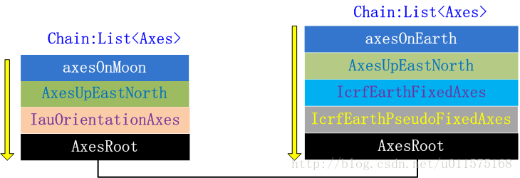
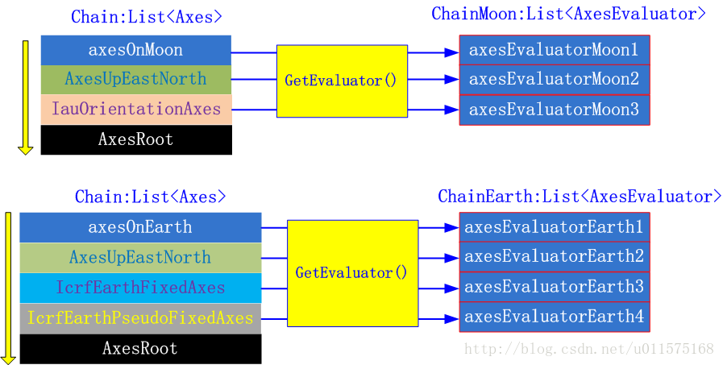

#前言

STK组件包含一个全功能的矢量几何工具库，用于创建矢量，坐标轴，点和坐标系等，以及计算每个参数如何随时间变化。 例如，Point可以表示由轨道积分器计算的卫星位置，然后可以计算卫星在任何已定义坐标系中的位置、速度；Axes可以表示运动的卫星的轨道坐标轴，然后可以计算此轨道坐标轴相对任何坐标轴的转换矩阵。

STK Component矢量几何工具库与STK桌面软件的Vector Geomentry Tool是对应的。 通过Reflector工具反编译Component类库，扒一扒其内部的运行机制，加深我们对此工具库的理解，以便更好的使用Component类库功能为我所用。

本文谈谈坐标轴(Axes)转换的基础知识，注意不是坐标系，坐标系=坐标轴+坐标原点。也就是说坐标轴是可以平移的，任何两个坐标轴之间的转换关系只涉及到它们的XYZ轴旋转关系，而与它们在什么地方没有关系。例如，讨论地球J2000系的坐标轴和月球惯性系的坐标轴时，可以将两个坐标系的原点重合，然后讨论两者坐标轴的旋转关系。

在STK Component中，有关坐标系旋转的类在命名空间 AGI.Foundation.Coordinates中的。

**继续阅读本文前，请先阅读并掌握前面两章基础：**
1. [STK Component：Evaluator pattern(计算器模式)](http://blog.csdn.net/u011575168/article/details/53349479)
2. [STK Component 矢量几何工具系列--坐标轴(Axes)转换基础](http://blog.csdn.net/u011575168/article/details/53229184)
#Axes基类与AxesEvaluator基类
所有的坐标轴类都继承自一个共同的基类：Axes，我们首先看看Axes内部的代码实现：
```
//	坐标轴的基类,继承自DefinitionalObject和IServiceProvider接口
public abstract class Axes : DefinitionalObject, IServiceProvider
{	
    // 公有属性，仅能获取，代表坐标轴的唯一全局对象，也是所有Axes的基础
	public static Axes Root
	{
	    get
	    {
	        return s_root;
	    }
	}
	private static readonly Axes s_root;
	
	 // 静态构造函数：创建AxesRoot类对象
    static Axes();
    {
	     s_root = new AxesRoot();
	}

    // 获取本类的AxesEvaluator，用以计算坐标转换矩阵
	// 此方法为空(abstract),需要继承类实现具体的代码!!
    public abstract AxesEvaluator GetEvaluator([NotNull] EvaluatorGroup group);

	//...其他属性和方法
}
```
上述代码隐藏了不重要的部分，仅仅显示两个重要的方面：
1.  Root属性。注意，这个是静态(static）属性，也就意味着无论你程序中有多少个坐标轴对象，他们都有**共同的、全局的、唯一的**属性，这个属性也是Axes对象(AxesRoot)，通过静态构造函数创建。静态构造函数在首次使用Axes时调用，且仅调用一次。为什么创建这个全局对象？我们知道，在计算坐标轴转换时，总是有两个坐标轴（新和旧），每个新的坐标轴总是相对于另一个旧坐标轴定义的，那么这个全局的Root对象就作为所有坐标轴的终极参考对象，Root本身不参与任何计算，仅仅作为一个坐标轴参考基准！**实际上AxesRoot被定义为ICRF坐标系的坐标轴，也是地球惯性系(Earth Inertial Coordinate System)的坐标轴。**
2. GetEvaluator方法,此方法为虚方法(Abstract)，需要在Axes的继承类中重写具体的方法（override）。在Evaluator pattern(计算器模式)章节中，我们说过，采用Evaluator方式是为了把一个对象的定义和它的计算功能相分开，Axes也采用这个模式。GetEvaluator方法返回AxesEvaluator类对象，用于计算此坐标轴相对旧坐标轴的转换矩阵。
下面来看看AxesEvaluator类是什么。
```
//  坐标轴计算的基类,继承自MotionEvaluator<UnitQuaternion, Cartesian>
//	而MotionEvaluator又继承自Function<JulianDate, UnitQuaternion, Cartesian> 
public abstract class AxesEvaluator : MotionEvaluator<UnitQuaternion, Cartesian>
{
    // 这个属性用来保存旧坐标轴或者原坐标轴对象
    // 此属性为空(abstract),需要继承类实现具体的代码!!
    public abstract TimeIntervalCollection<Axes> DefinedInIntervals { get; }
    
	// ***这个就是用来计算旧坐标轴到新坐标轴的转换，返回对象Motion<<UnitQuaternion, Cartesian>，
	//    其中，新旧坐标轴的转换是用单位四元数UnitQuaternion表示的！
    // 此方法为空(abstract),这个方法是在基类Function中定义的，需要继承类实现具体的代码!!
    public abstract Motion<UnitQuaternion, Cartesian> Evaluate(JulianDate date, int order);

    //...其他属性和方法
}
```
可以看出，AxesEvaluator类重要的两点 ： 
1.  DefinedInIntervals属性。这个属性用来保存旧坐标系对象，注意，定义一个Axes继承类时，其旧坐标的保存并不是在Axes继承类中，而是在其AxesEvaluator类中。DefinedInIntervals属性是TimeIntervalCollection&lt;Axes&gt;类型，仔细查看其源代码，就可以知道其是时间段的集合，每个时间段保留一个Axes对象。可以用下图来表示：

Component中，最常用的是整个时间集合仅有一个时间段，见上图上部，图中以J2000坐标轴为参考轴（旧坐标轴）；一般情形（很少用）的是上图下部，图中有两个时间段，分别为T1-T2时间段，参考轴为J2000；T3-T4时间段，参考轴为Fixed。此处J2000和Fixed坐标轴仅为示例！
2.  Evaluate方法。给定时刻date,则可以获取到对应此时刻新坐标轴相对旧坐标轴的四元数（可等效为转换矩阵），以及旋转轴的角速度、角加速度等等，用Motion&lt;UnitQuaternion, Cartesian&gt;对象表示。

以上谈到的两个要点都需要继承类重写的。
Axes和AxesEvaluator的重要属性和方法可由下图表示。



#一个例子：AxesLinearRate类
先来看一个STK Component中Evaluator的例子，展示如何使用AxesLinearRate类。
```
//	创建新的坐标系
AxesLinearRate axes = new AxesLinearRate();
//	以J2000的坐标系作为新坐标系axes的参考基准(旧坐标系)
axes.ReferenceAxes = CentralBodiesFacet.GetFromContext().Earth.J2000Frame.Axes;
//	初始时刻
axes.ReferenceEpoch = TimeConstants.J2000;
//	初始时刻：新坐标系相对旧坐标系的旋转(此处为单位阵，也就是说初始时刻两个坐标系重合)
axes.InitialRotation = UnitQuaternion.Identity;
//	新坐标系相对旧坐标系的旋转角速度（rad/s）
axes.InitialRotationalVelocity = 0.1;
//	新坐标系相对旧坐标系的旋转角加速度(rad/s^2)
axes.RotationalAcceleration = 0.0;
//	新坐标系相对旧坐标系的旋转矢量，此矢量在旧坐标系中表达(此处为绕旧坐标系的X轴旋转)
axes.SpinAxis = new UnitCartesian(1.0, 0.0, 0.0);

//	***以上定义了一个新的坐标系，从其定义参数，理论上我们可以求出在任意时刻，旧坐标系到新坐标系的转换矩阵
//----------------------------------------------------------------------------------
//	***以下为计算旧坐标系到新坐标系的转换矩阵

//	从新坐标系对象获取evaluator
AxesEvaluator evaluator = axes.GetEvaluator();
JulianDate dateToEvaluate = new JulianDate(new GregorianDate(2007, 11, 20, 12, 0, 0));
//	使用获得的evaluator计算某时刻的旧坐标系到新坐标系的转换矩阵(单位四元数形式)
UnitQuaternion rotationFromJ2000 = evaluator.Evaluate(dateToEvaluate);
```
上面的例子中，创建了一个坐标系对象axes，并计算其基准坐标系（旧坐标系）到它的转换矩阵。可以看出，axes对象仅仅用来描述一个新的坐标系是如何指向的（相对旧坐标系而言），而从旧坐标系到新坐标系的转换计算工作是由另一个类来实现的，它就是AxesEvaluator，是通过axes对象的GetEvaluator()方法来获取的。由AxesEvaluator类的函数Evaluate(JulianDate date)来计算两个坐标系的转换关系。**这种将对象的定义和其计算功能分开就是STK Component中的Evaluator模式。**
可以推测的是AxesEvaluator对象evaluator中必然保留或者直接指向axes中的相关定义参数，否则evaluator无法计算两个坐标系的转换。

下面来看看AxesLinearRate类的源代码。
```
//	线性旋转坐标系类(继承自基类:Axes)
public class AxesLinearRate : Axes
{
	// 属性，描述相对旧坐标系的一系列属性参数
    // Properties
    public UnitQuaternion InitialRotation { get; set; }
    public double InitialRotationalVelocity { get; set; }
    // **参考坐标系，也就是旧坐标系
    public Axes ReferenceAxes { get; set; }
    public JulianDate ReferenceEpoch { get; set; }
    public double RotationalAcceleration { get; set; }
    public UnitCartesian SpinAxis { get; set; }

    // Methods
    // ...一系列override基类Axes的方法    
    //
	// **注意，此内部方法中，实际创建AxesEvaluator
    private AxesEvaluator CreateEvaluator(EvaluatorGroup group)
    {
	    // 注意，这里将m_referenceAxes也就是旧坐标轴传递进Evaluator中！
      return new Evaluator(this.m_referenceAxes, this.m_epoch, this.m_initialRotation, this.m_spinAxis, this.m_initialRotationalVelocity, this.m_constantRotationalAcceleration);

    }
    
    // 这个方法重载了基类Axes的方法，在此方法中实际上调用CreateEvaluator方法
    public override AxesEvaluator GetEvaluator(EvaluatorGroup group);

    //------------------------------------------------------------------
    // **注意，由内部类来实现AxesEvaluator
    // 类Evaluator的名字可以取任何值，反正外部看不到，在外部，是以基类AxexEvaluator来代替。
    private class Evaluator : AxesEvaluator
    {
        // **看看这里的内部参数，是不是和类AxesLinearRate的属性参数基本一致？？！！
	    // 只要靠这些参数，它才能知道怎么计算两个坐标系的转换！！
        // Fields
        private double m_constantRotationalAcceleration;
        private JulianDate m_epoch;
        private UnitQuaternion m_initialRotation;
        private double m_initialRotationalVelocity;
        private Axes m_referenceAxes;
        private UnitCartesian m_spinAxis;

        // Methods
        // 这个构造函数在私有方法CreateEvaluator中被调用
        // 注意，m_referenceAxes保存的是旧坐标系，
        public Evaluator(Axes referenceAxes, JulianDate epoch, UnitQuaternion initialRotation, UnitCartesian spinAxis, double initialRotationalVelocity, double constantRotationalAcceleration);
       
        // **最重要方法！！！用来计算从旧坐标系到此坐标系的转换，此方法内部的代码就是具体的计算过程！
        public override UnitQuaternion Evaluate(JulianDate date);
        public override Motion<UnitQuaternion, Cartesian> Evaluate(JulianDate date, int order);
       

        // 这个属性用来保存旧坐标系
        // 注意旧坐标系是在此处保存的，而不是在AxesLinearRate类中
        public override TimeIntervalCollection<Axes> DefinedInIntervals { get; }
        {  
	        get
		    {
				// 只创建了一个时间段，且保留的坐标轴为m_referenceAxes，
				// 此参数通过构造函数赋值，实际上保留的是AxesLinearRate中的旧坐标轴(ReferenceAxes属性)
		        return AxesEvaluator.CreateConstantDefinedIn(this.m_referenceAxes);
		    }
	    }
       
       //...其他属性和方法
    }
}
```
在AxesLinearRate代码中，强调以下几点：
1.  类AxesLinearRate继承基类Axes，重写基类Axes的方法GetEvaluator，用来获取其计算类AxesEvaluator对象；
2.  AxesEvaluator类的实现是由内部类Evaluator来实现的，并且在AxesLinearRate的内部，在内部类Evaluator中，保存了类AxesLinearRate的相关参数；
3. 内部类Evaluator中，重写了基类AxesEvaluator的方法Evaluate，用于计算坐标系转换，其返回值为UnitQuaternion或Motion&lt;UnitQuaternion,Cartesian&gt;，后者还包含新坐标系相对旧坐标系的旋转角速度、角加速度等等;
4.  内部类Evaluator中，属性DefinedInIntervals仅保留了一个时间段，且Axes对象为AxesLinearRate类中的旧坐标轴()

将AxesLinearRate类与上节中的Axes和AxesEvaluator多对比较，加深相关概念的理解。
#任意两坐标轴转换(AxesInAxes类)
上面以AxesLinearRate类为例，给出了求解其旧坐标轴到新坐标轴的转换过程。如果已经有了两个坐标轴，那么如何求解两个坐标轴的相互转换？

如下图，在地球上某点创建一个当地地平坐标轴axesOnEarth（AxesEastNorthUp类对象），在月球上创建一个当地地平坐标轴axesOnMoon（AxesEastNorthUp类对象），那么axesOnMoon到axesOnEarth的坐标转换矩阵（或四元数）如何求解？

**上述两个坐标轴的转换可通过创建新的Axes继承类AxesInAxes来求解！**，具体代码见下。
```
//	获取地球、月球中心天体
EarthCentralBody earth = CentralBodiesFacet.GetFromContext().Earth;
MoonCentralBody moon = CentralBodiesFacet.GetFromContext().Moon;

//  经度、纬度、高度都为0
PointCartographic pointOnEarth = new PointCartographic(earth, new Cartographic(0, 0, 0));
//  地球上某点的地平坐标轴
AxesEastNorthUp axesOnEarth = new AxesEastNorthUp(earth, pointOnEarth);

//  经度、纬度、高度都为0
PointCartographic pointOnMoon = new PointCartographic(moon, new Cartographic(0, 0, 0));
//  月球上某点的地平坐标轴
AxesEastNorthUp axesOnMoon = new AxesEastNorthUp(moon, pointOnMoon);

//  以axesOnMoon为旧坐标轴，axesOnEarth为新坐标轴,创建新的Axes
AxesInAxes moon2earth = new AxesInAxes(axesOnEarth, axesOnMoon);
//  获取AxesEvaluator
AxesEvaluator axesEval = moon2earth.GetEvaluator();

//   计算某时刻axesOnMoon到axesOnEarth的单位四元数
JulianDate dateInUtc = new JulianDate(2454245, 0.0, TimeStandard.CoordinatedUniversalTime);
UnitQuaternion q_m2e = axesEval.Evaluate(dateInUtc);
```
从上面的代码可以看出，两个坐标轴的相互转换的具体实现过程在获取到的AxesEvaluator对象axesEval中。

从前面的Axes和AxesEvaluator的介绍我们知道，每一个坐标轴Axes的继承类，必定在其内部创建一个AxesEvaluator的继承类，在AxesEvaluator的继承类中，保存了其原坐标轴，也即旧坐标轴。不难想象，其保留的旧坐标轴也必定有它自己的AxesEvaluator，在其中保留它的旧坐标轴。通过这样追溯旧坐标轴，就形成了一个坐标轴的链路。从两个原始坐标轴分别追溯其各自的坐标轴链路，必定能够找到两者的交点（同一个旧坐标轴），从而将两个坐标轴链路串成一个坐标轴链路。

实际上，AxesInAxes类在创建它的AxesEvaluator时就是分别查找两个坐标轴的坐标轴链路，具体过程阐述如下。
以地球上的坐标轴axesOnEarth为例：
1.  通过调用地球上某点坐标轴axesOnEarth的GetEvaluator()方法，获取其AxesEvaluator对象，从其属性DefinedInIntervals中获取到其对应的旧坐标轴，这个旧坐标轴是AxesUpEastNorth类对象；
2.  再调用AxesUpEastNorth类对象的GetEvaluator()方法，获取其AxesEvaluator对象，从其属性DefinedInIntervals中获取到其对应的旧坐标轴，这个旧坐标轴是IcrfEarthFixedAxes类对象;
3. 再调用IcrfEarthFixedAxes类对象的GetEvaluator()方法，获取其AxesEvaluator对象，从其属性DefinedInIntervals中获取到其对应的旧坐标轴，这个旧坐标轴是AxesRoot类对象;
4. AxesRoot类对象是全局唯一对象，其旧坐标轴为空，则查找结束。将上述查找过程中的旧坐标轴对象保存为Axes链路：List&lt;Axes&gt;。
上述过程可用下图表示


月球上的坐标轴axesOnMoon的坐标轴链路查找过程同上。

最终两个坐标轴的旧坐标轴链路如下图，下图中，下层的坐标轴为上层坐标轴的旧坐标轴（原坐标轴或参考坐标轴），两个链路最底层的坐标轴皆为AxesRoot。


最终在AxesInAxes类的内部AxesEvaluator类中保留的不是List&lt;Axes&gt;，而是两个坐标轴的List&lt;AxesEvaluator&gt;，见下图。
从坐标轴链路中，通过GeEvaluator获取每个坐标轴的axesEvaluator，最终形成各自的axesEvaluator的链路ChainMoon和ChainEarth。

在求解最终的axesOnMoon到axesOnEarth的转换时，分别计算ChainMoon和ChainEarth，最后将两者再合并计算，得到最终的两坐标轴的转换。

#小结
1.  每个新的Axes继承类都在类的内部创建AxesEvaluator的继承类，通过GetEvaluator()方法获取到内部AxesEvaluator继承类的实例；在内部AxesEvaluator继承类中，通过Evaluate()方法中实现具体的两坐标轴转换过程，并在DefinedInIntervals属性中保留原坐标轴（旧坐标轴）;
2. 任意两坐标轴转换时，通过查找其旧坐标轴链路（两个链路必有交点）来计算两者的转换！

在实际计算任意两坐标轴的转换时，并不用创建新的AxesInAxes类对象，而是通过其提供的静态类方法直接计算，见下代码：
```
//	获取地球、月球中心天体
EarthCentralBody earth = CentralBodiesFacet.GetFromContext().Earth;
MoonCentralBody moon = CentralBodiesFacet.GetFromContext().Moon;

//  经度、纬度、高度都为0
PointCartographic pointOnEarth = new PointCartographic(earth, new Cartographic(0, 0, 0));
//  地球上某点的地平坐标轴
AxesEastNorthUp axesOnEarth = new AxesEastNorthUp(earth, pointOnEarth);

//  经度、纬度、高度都为0
PointCartographic pointOnMoon = new PointCartographic(moon, new Cartographic(0, 0, 0));
//  月球上某点的地平坐标轴
AxesEastNorthUp axesOnMoon = new AxesEastNorthUp(moon, pointOnMoon);

//  **************************************************
//  直接获取axesOnMoon到axesOnEarth的转换的AxesEvaluator
//  实际上，在此方法内部，还是创建了AxesInAxes对象来计算的
AxesEvaluator axesEval = GeometryTransformer.GetAxesTransformation(axesOnMoon, axesOnEarth);

//   计算某时刻axesOnMoon到axesOnEarth的单位四元数
JulianDate dateInUtc = new JulianDate(2454245, 0.0, TimeStandard.CoordinatedUniversalTime);
UnitQuaternion q_m2e = axesEval.Evaluate(dateInUtc);
```
