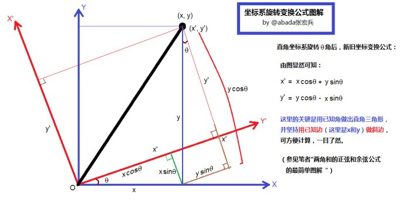
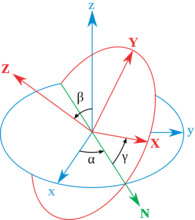

#前言
STK组件包含一个全功能的矢量几何工具库，用于创建矢量，坐标轴，点和坐标系等，以及计算每个参数如何随时间变化。 例如，Point可以表示由轨道积分器计算的卫星位置，然后可以计算卫星在任何已定义坐标系中的位置、速度；Axes可以表示运动的卫星的轨道坐标轴，然后可以计算此轨道坐标轴相对任何坐标轴的转换矩阵。

STK Component矢量几何工具库与STK桌面软件的Vector Geomentry Tool是对应的。 通过Reflector工具反编译Component类库，扒一扒其内部的运行机制，加深我们对此工具库的理解，以便更好的使用Component类库功能为我所用。

本文谈谈坐标轴(Axes)转换的基础知识，注意不是坐标系，坐标系=坐标轴+坐标原点。也就是说坐标轴是可以平移的，任何两个坐标轴之间的转换关系只涉及到它们的XYZ轴旋转关系，而与它们在什么地方没有关系。例如，讨论地球J2000系的坐标轴和月球惯性系的坐标轴时，可以将两个坐标系的原点重合，然后讨论两者坐标轴的旋转关系。

在STK Component中，有关坐标系旋转的类在命名空间 AGI.Foundation.Coordinates中的。

**注意，以下讨论中，由于两个坐标轴已重合，所以常常说成坐标系旋转如何如何，实际上还是两个坐标轴，请读者自行区分。**

最常用的旋转表示方法便是欧拉角和四元数，下面分别叙述。

**注意，这里介绍的转换定义、过程、顺序等就是STK Component里所采用的，所以在使用Component里相关类时，如果不记得其转换定义、过程及顺序时，可参考以下说明！**
#欧拉旋转
下图中，蓝色坐标系表示旧坐标系（也可以叫原坐标系），红色坐标系表示新坐标系；新坐标系是原坐标系绕其Z轴旋转$\theta$ 角，某一矢量在旧坐标系中的坐标为(x,y,z)，则**同一矢量**在新坐标系中的坐标为（x',y',z'）。

新旧坐标系中的坐标关系如下：
$$
		\begin{pmatrix}
        x' \\        
        y' \\
        z' \\
        \end{pmatrix}
        =  \begin{pmatrix}
        cos\theta & sin\theta & 0 \\        
        -sin\theta & cos\theta & 0 \\
        0 & 0 & 1 \\
        \end{pmatrix} 
        \begin{pmatrix}
        x \\        
        y \\
        z \\
        \end{pmatrix} 
        =M_{z}(\theta)
        \begin{pmatrix}
        x \\        
        y \\
        z \\
        \end{pmatrix} $$
 其中，$M_{z}(\theta)$为绕Z轴旋转的矩阵表示，也就是说为原坐标系到新坐标系的转换矩阵。
 
 绕X、Y轴旋转的转换矩阵过程同上类似，下面直接给出绕原坐标系X、Y、Z轴旋转的转换矩阵：
$$
        M_x(\theta)=
        \begin{pmatrix}
        1 & 0 & 0 \\
        0 & cos\theta & sin\theta \\
        0 & -sin\theta & cos\theta \\
        \end{pmatrix}        
\\
        M_y(\theta)=
        \begin{pmatrix}
        cos\theta & 0 & -sin\theta \\
        0 & 1 & 0 \\
        sin\theta & 0 & cos\theta \\
        \end{pmatrix}        
\\
        M_z(\theta)=
        \begin{pmatrix}
        cos\theta & sin\theta & 0 \\        
        -sin\theta & cos\theta & 0 \\
        0 & 0 & 1 \\
        \end{pmatrix}        
$$
其旋转方向符合右手螺旋法则，即逆时针旋转为正方向。另外坐标旋转矩阵具备如下性质：
$$R^{-1}(\theta)=R^T(\theta)=R(-\theta)$$
任何两个坐标轴的旋转关系都可以按照一定的坐标轴顺序（例如先x、再y、最后z）、每个轴旋转一定角度来实现，实际上是一系列坐标轴旋转的组合。

在上图旋转中，首先绕原坐标系(蓝色坐标轴)的Z轴旋转$\alpha$角度，得到新坐标系1，然后绕新坐标系1的X轴（图中N方向）旋转$\beta$角度，得到新坐标系2，最后绕新坐标系2的Z轴（图中 红色Z轴）旋转$\gamma$角度，得到最终的新坐标系（轴），图中红色表示。上述转换过程称之为欧拉转换，转序为313（表示先绕Z轴，然后绕X轴，最后绕Z轴旋转），$\alpha,\beta,\gamma$称之为欧拉角。
**注意，上述旋转过程中，每次旋转都是相对前面最新的坐标系为参考的！！**
上述欧拉转序对应的新旧坐标系的关系如下式：
$$
		\begin{pmatrix}
        x' \\        
        y' \\
        z' \\
        \end{pmatrix}
        =M_{z}(\gamma)M_{x}(\beta)M_{z}(\alpha)
        \begin{pmatrix}
        x \\        
        y \\
        z \\
        \end{pmatrix} $$
 从原坐标系到新坐标系的旋转矩阵$M$可表示为下式，每旋转一次，就左乘对应的旋转矩阵。
$$	M=M_{z}(\gamma)M_{x}(\beta)M_{z}(\alpha) $$
当然对于任意两个坐标轴，其转序并不仅仅为313，也可以是321、123等等，一共有12种可能性。
**注意，我们在说两个坐标轴的欧拉转换时，一定要确定是什么转序（是313还是321等等），以及对应的欧拉角！！**
#四元数（Quaternion）
四元数能够很方便的刻画刚体绕任意轴的旋转。四元数是一种高阶复数，四元数q表示为：
$$q=(x,y,z,w)=xi+yj+zk+w$$
其中，i，j，k满足：
$$i^2=j^2=k^2=-1$$$$ij=k,jk=i,ki=j$$
由于i，j，k的性质和笛卡尔坐标系三个轴叉乘的性质很像，所以可以将四元数写成一个向量和一个实数组合的形式：
$$q=(\vec{v}+w)=((x,y,z),w)$$
可以推导出四元数的一些运算性质，包括：
四元数乘法
$$q_1q_2=(\vec{v_1}\times \vec{v_2}+w_1\vec{v_2}+w_2\vec{v_1}, w_1w_2-\vec{v_1}\cdot \vec{v_2})$$
共轭四元数
$$q^*=(-\vec{v},w)$$
四元数的平方模
 $$N(q)=N(\vec{v})+w^2$$
 四元数的逆
$$q^{-1}=\frac{q^*}{N(q)}$$
四元数可以看做是向量和实数的一种更加一般的形式，向量可以视作为实部为0的四元数，而实数可以是作为虚部为0的四元数。上述四元数的运算性质也是实数或向量的运算性质的更一般的形式.

**任何两个坐标轴之间的转换除了可以用连续三个欧拉旋转实现外，还可以通过一次旋转完成。可以证明，总可以找到一个旋转轴和一个旋转角度，使得原坐标轴绕此旋转轴旋转一定的角度与新坐标轴重合。定义此旋转轴在原坐标系中的单位矢量坐标为$(x,y,z)$，旋转角度定义为$\theta$，则四元素$q$可表示为：**
$$q=((x,y,z)\sin{\frac{\theta}{2}},\cos{\frac{\theta}{2}})$$
**在考虑连续坐标轴旋转时，同欧拉旋转类似，采用四元数左乘，如下连续三个旋转：**
$$q=q_3q_2q_1$$
上述转换过程为：

 1. 从原坐标系转到新坐标系1，用四元数$q_1$表示两者的旋转关系；
 2. 从新坐标系1转到新坐标系2，用四元数$q_2$表示两者的旋转关系；
 3. 从新坐标系2转到最终的新坐标系，用四元数$q_3$表示两者的旋转关系；
 4. 从原坐标系到新坐标系的旋转关系用四元数$q$表示！
 
#小结
**STK Component计算坐标转换时，广泛采用欧拉转换与四元数，涉及到转换定义、顺序如上描述。切记，在连续转换中，无论是欧拉转换还是四元数，都是左乘转换矩阵或者四元数的！！**

**实际应用中，还有一种刚体的转换，与本文描述的转换过程刚好相反，读者注意区别。在使用Component中类库计算时，请采用本文介绍的转换定义及顺序！**

采用欧拉转序及四元数的旋转总结如下（欧拉旋转中，欧拉转序为313）：
$$	M=M_{z}(\gamma)M_{x}(\beta)M_{z}(\alpha) $$$$q=q_3q_2q_1$$

        
