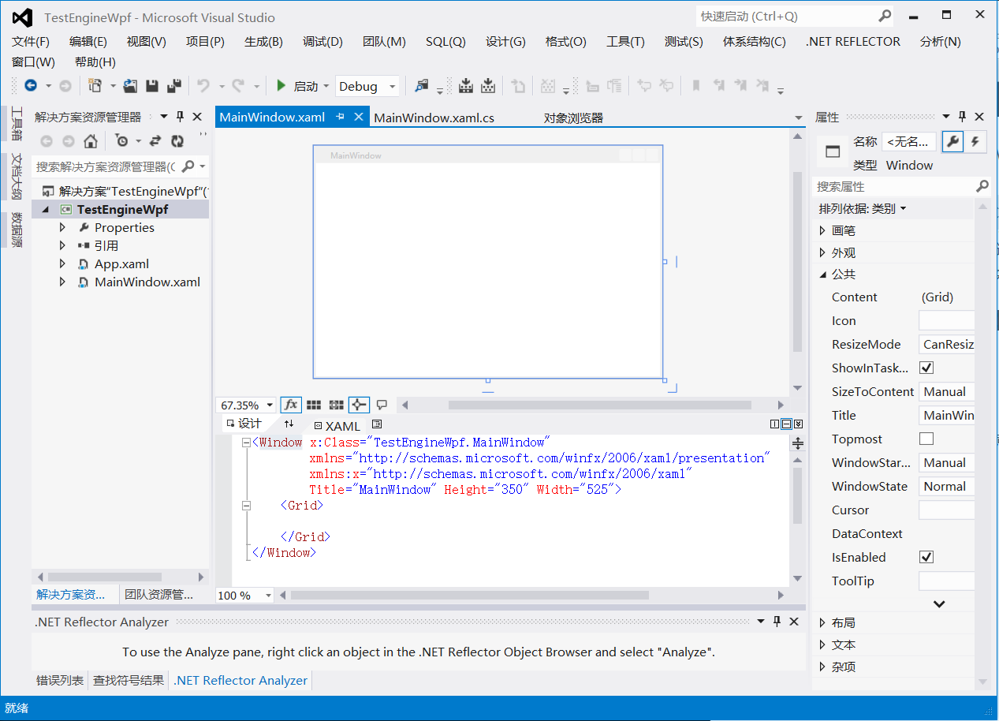
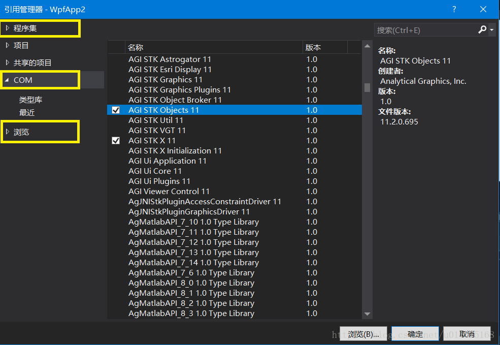
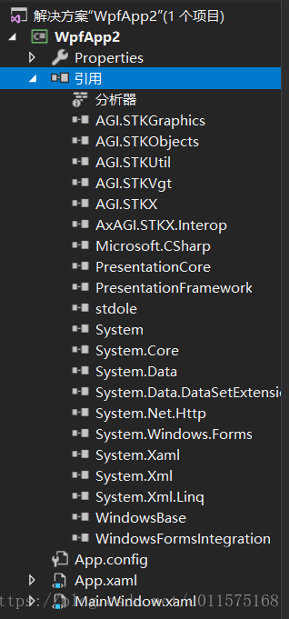
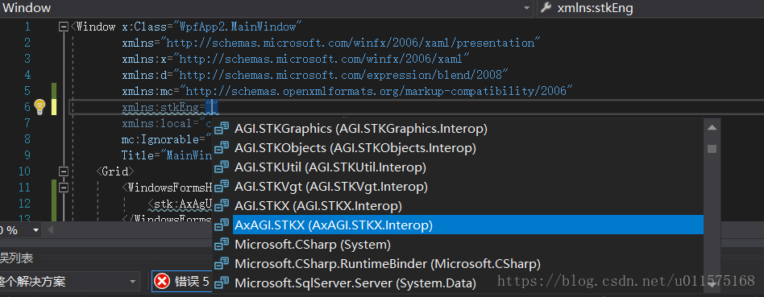
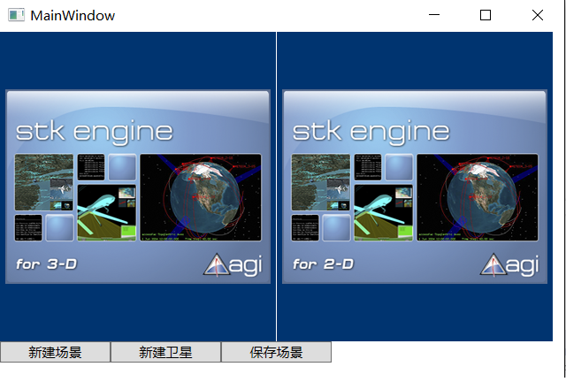
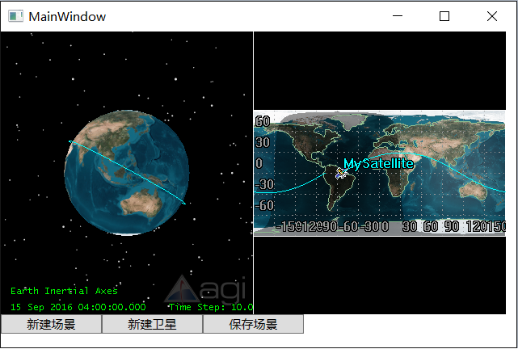
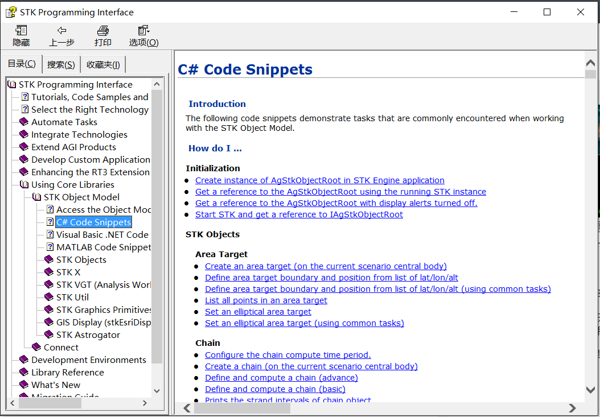

# STK Engine二次开发-WPF方式

本文简要介绍使用Windows WPF（C#）方式进行STK Engine的二次开发，如何添加AGI Global Control和AGI Map Control控件到用户软件界面，以及如何初始化STK场景。
### **WinForm与WPF方式**
在使用STK Engine进行二次开发客户端软件的时候，通常使用的是Windows Form的形式，在这种开发模式下，我们使用STK 3D、2D控件的时候，是直接从控件栏将3D、2D控件直接拖到面板上实现的。这种方式简单，方便。

本文阐述使用Windows WPF方式使用STK Engine进行二次开发客户端软件的前期设置。使用WPF方式开发时，其软件GUI界面使用类似XML语言的方式，不清楚的可以自行搜索一下WPF，这里就不过多阐述了。相比WinForm方式，WPF开发方式有以下两个优点：

 1. 当STK Engine为64位时，在使用Visual Studio开发时，控件栏里是添加不了STK 3D/2D的控件的，也就是说无法使用鼠标直接拖拽的方式将控件添加到界面上，只能通过原始代码的方式自行添加，非常繁琐；
 
 2. 使用WPF方式，采用XML语言的方式，可以直接将3D、2D控件直接嵌入软件界面，同时可以使用WPF的样式等丰富自己的软件界面。

### **STK Engine API**
对于.Net方式的STK Engine二次开发，本质是调用其提供的API，API以程序集（DLL）的方式存放在STK软件的安装目录下（STK安装目录\bin\Primary Interop Assemblies）。

既然是程序集DLL文件形式，那么我们使用它和任何其他第三方的DLL都是一样的过程。一是在工程中引用相关的DLL文件，二是通过Using命名空间的方式来使用相关类。

### **新建Visual Studio WPF工程**
打开Visual Studio，新建Wpf工程项目（文件-新建-项目-Visual C#-WPF应用程序）。选择.Net FrameWork 4作为工程配置，项目名称（可任意设置）：TestEngineWpf。新创建的工程如下图。
 

### **添加引用文件**
为项目添加STK Engine API引用。右键“引用”-添加引用打开引用管理器，分别按照以下操作，添加几个dll程序集。
 - 点击“程序集”，选择(前面打√)“System.Windows.Forms”和“WindowsFormsIntegration”，这两个程序集是wpf程序里安装winform控件所需要的；
 - 点击“COM”，选择“AGI STK Objects 11”、“AGI STK X 11”；
 - 点击“浏览”，导航到文件路径（STK安装目录\bin\Primary Interop Assemblies），选择程序集“AxAGI.STKX.Interop.dll”，然后点击“确定”。

添加引用完成后，即可在引用栏里看到添加的引用，其中AGI.STKUtil和AGI.STKVgt两个程序是AGI.STKObjects所依赖的，系统自动帮我们添加了。
注意，由于此工程项目为示范项目，所以涉及到的程序集较少；如果STK Engine二次开发项目涉及较多程序集的话，应该添加其他相应的程序集（DLL），比如如果涉及到STK桌面软件相关操作，则应添加“AGI UI Application 11”等程序集。

### **主窗口添加控件**
项目中，MainWindow.xaml为程序主窗口GUI，双击后，显示两个编辑界面：GUI窗口和XAML窗口。XAML窗口使用xml语言的方式添加控件，GUI窗口及时显示效果。

XAML窗口中，首先添加对STK程序集的命名空间引用，然后添加STK 3D、2D控件及三个按钮，整个XAML代码如下：
```
<Window x:Class="TestEngineWpf.MainWindow"
        xmlns="http://schemas.microsoft.com/winfx/2006/xaml/presentation"
        xmlns:x="http://schemas.microsoft.com/winfx/2006/xaml" 
        
        xmlns:stkEng="clr-namespace:AxAGI.STKX;assembly=AxAGI.STKX.Interop" 
        
        Title="MainWindow" Height="350" Width="525">
    <Grid>
        <StackPanel>
            <!--此面板包含STK 3D/2D控件，高度、宽度可根据需要自行设置，或者自动适应-->
            <StackPanel Orientation="Horizontal">
                <WindowsFormsHost Height="280" Width="250">
                    <stkEng:AxAgUiAxVOCntrl></stkEng:AxAgUiAxVOCntrl>                    
                </WindowsFormsHost>
                <WindowsFormsHost Height="280" Width="250">
                    <stkEng:AxAgUiAx2DCntrl></stkEng:AxAgUiAx2DCntrl>
                </WindowsFormsHost>
            </StackPanel>
            <!--此面板设置简单的功能按钮-->
            <StackPanel Orientation="Horizontal">
                <Button Name="NewScenario" Width="100" Click="NewScenario_Click">新建场景</Button>
                <Button Name="NewSatellite" Width="100" Click="NewSatellite_Click">新建卫星</Button>
                <Button Name="SaveScenario" Width="100" Click="SaveScenario_Click">保存场景</Button>                
            </StackPanel>
        </StackPanel>               
    </Grid>
</Window>
```
注意，上述代码中，添加xml命名空间的引用时，写入"xmlns:stkEng="时，则会自动弹出命名空间，见下图，此时查找选择"AxAGI.STKX（AxAGI.STKX.Interop）"即可。
其中，stkEng是命名空间名称，可自己任意设定。

编译后，按F5，可以看到程序启动后的主窗口如下：看到了熟悉的3D/2D控件。


### **添加响应函数**
上面创建了控件，我们没有使用一行代码。下面开始为按钮创建响应函数。

 在解决方案资源管理器中，右键“MainWindow.xaml”，点击“查看代码”，则其代码窗口（MainWindow.xaml.cs）打开。在其中添加相应的响应函数代码，具体含义见其中注释。

```
using System;
using System.Collections.Generic;
using System.Linq;
using System.Text;
using System.Windows;
using System.Windows.Controls;
using System.Windows.Data;
using System.Windows.Documents;
using System.Windows.Input;
using System.Windows.Media;
using System.Windows.Media.Imaging;
using System.Windows.Navigation;
using System.Windows.Shapes;

//  引用命名空间，目前此文件内相关类仅涉及到此命名空间，
//  如果需要，还需要添加对其他命名空间的应用。
using AGI.STKObjects;

namespace TestEngineWpf
{
    /// <summary>
    /// MainWindow.xaml 的交互逻辑
    /// </summary>
    public partial class MainWindow : Window
    {
        //*********
        //  此为STK Engine的根，控制整个STK场景
        AgStkObjectRoot stkRoot;

        public MainWindow()
        {
            InitializeComponent();

            //  初始化
            stkRoot = new AgStkObjectRoot();
        }

        //  新建STK场景，场景名为Test
        private void NewScenario_Click(object sender, RoutedEventArgs e)
        {                        
            stkRoot.NewScenario("Test");
        }

        //  新建卫星
        private void NewSatellite_Click(object sender, RoutedEventArgs e)
        {
            // Create the Satellite 
            IAgSatellite satellite = stkRoot.CurrentScenario.Children.New(AgESTKObjectType.eSatellite, "MySatellite") as IAgSatellite;

            // Set propagator to J2 Perturbation 
            satellite.SetPropagatorType(AgEVePropagatorType.ePropagatorJ2Perturbation);

            // Get the J2 Perturbation propagator 
            IAgVePropagatorJ2Perturbation propagator = satellite.Propagator as IAgVePropagatorJ2Perturbation;

            //  轨道积分(相当于STK软件中的Apply按钮)
            propagator.Propagate();
        }

        //  保存场景
        private void SaveScenario_Click(object sender, RoutedEventArgs e)
        {            
            stkRoot.SaveAs(@"D:\Test");

            //  也可保存在具体的文件内，如D:\MySTK\Test，但要确保MySTK文件夹存在。
            //  Test为场景名称，也可改为其他名称，则自动将之前设定的场景名称更改。
            //stkRoot.SaveAs(@"D:\MySTK\Test");
        }
    }
}

```

编译后，按F5，分别点击：“新建场景”、“新建卫星”和“保存场景”。软件界面如下：

 

保存后的场景可在D:\下看到，可以看出，这与使用STK桌面软件创建场景后保存的文件是一样的。

### **小结**
采用WPF方式，添加STK 3D/2D控件是非常方便的，且不受64位的限制。

**STK 二次开发创建的场景文件（以及其中的卫星等对象），与STK桌面软件创建是一样的。STK 桌面软件是通过GUI界面鼠标操作，STK二次开发是通过类和相关函数进行操作（代替鼠标）而已，内核都是同一个。**

本文中，STK Engine二次开发使用.Net C#代码，采用STK Object Model形式调用相关类（如创建卫星等），当然也可以使用Connect指令的模式，此处就不在详述了。

诸如新建场景、新建卫星等等此类的代码，初学者可以参考STK帮助文档（STK Programming Interface）中的Using Core Libraries-STK Object Model-C# Code Snippets。
这个Snippets里面将大部分的功能都以代码例子的形式给出了，供参考。



 
