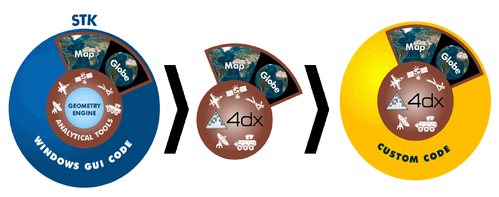
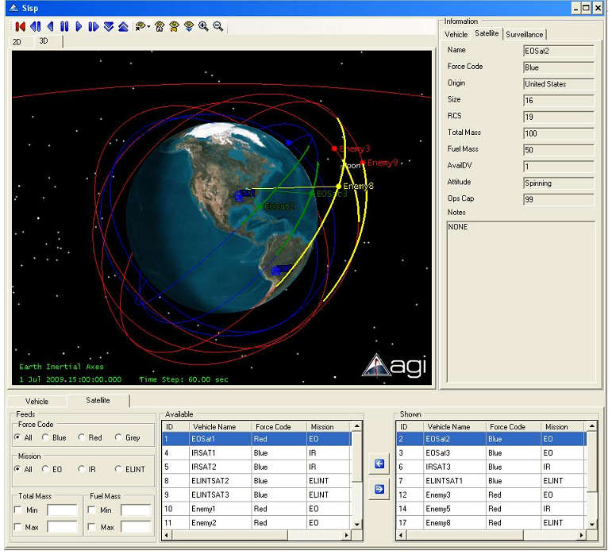

# STK Engine简介

使用STK客户端软件，通过其GUI界面设置场景，并进行各种计算的确给了我们非常大的自由。于此同时，STK提供其计算内核的API，使得软件开发者们可以利用STK的内核功能（各种功能计算、2D和3D显示）来开发自己的客户端应用程序，这就是基于STK的二次开发。
## 发展历史 ##
AGI公司自2003年起以COM组件和ActiveX控件的形式开放了其STK应用程序接口函数库（API），此API为STK运行的核心库。有了此API，则开发者可以在任何支持COM的语言环境下进行客户端应用程序的开发，相应的客户端应用程序称之为STK Engine（以前称之为4DX）应用程序。简单来说，STK Engine应用程序就是将自己所需的程序界面代替STK桌面应用程序的界面，而所有的计算内核都不变。

AGI最初仅仅提供有关2D、3D图形显示和控制的类库(STK/X)，并通过Connect语言的形式和STK内核联系。通过发送字符串命令给STK内核并以字符串形式接受反馈结果是非常不便和繁琐的，一方面针对不同的命令其字符串内容不同，另一方面在开发客户端应用程序时，在编译阶段无法发现隐藏的错误，使得开发效率大大降低。

随后，AGI开发出另一种形式的API来代替Connect语言，即对象模型Object Model(STK/Object)。对象模型（Object Model）库包含各种接口、类和事件，STK中绝大多数对象和功能都有相应的对象模型。利用对象模型来开发客户端应用程序时非常方便，可直接使用相应的接口、类和事件，充分发挥Visual Studio工具的优势（如智能感知等功能），同时在编译时就可发现错误代码。

简单的说，STK Object Model就是基于微软组建对象模型（COM）上一系列的库，目前主要包含以下几个方面的库：

 1. STK Objects: 这是最主要的库，包含STK Engine绝大部分功能。
 2.	 STK X: 这是与2D、3D图像显示和控制方面的库。
 3.	 STK Util: 此库为STK Objects和STK X共享的库。
 4.	 STK ESRI Display: 此库可允许开发者使用ESRI地图和GIS相关功能函数。
 5.	 STK Vector Geometry Tool: 这是有关矢量几何工具的库，与STK桌面应用程序功能相同，主要为点、坐标轴、角度、矢量、平面和坐标系的定义和使用。
 6.	 STK Astrogator: 此库与卫星轨道机动相关功能有关。
 
有关上述库中包含的接口、类、枚举和事件等都可在STK SDK帮助文档（Programming Interface Help）中找到。注意，帮助文档分为Desktop Help和Programming Interface Help。

STK Engine二次开发的COM库在STK软件安装目录下"bin\Primary Interop Assemblies"。

利用STK Engine进行客户端应用程序编程的实质就是用界面和STK相关函数对所需实现的功能进行封装。关键在于熟悉STK Object Model中6大库中的接口、类、枚举和事件，可以通过帮助文档来查询详细的语法接口，在实践中可以通过其自带的示例来逐渐熟悉。

下图可以形象的表示出STK Engine程序的实质：替换STK界面，内核不变！

##STK Engine特点##
 - 任何支持MS COM皆可应用STK Engine
 - 编程语言环境包括：C、C++、C#、VB.Net、Java、 Perl、VBscript or HTML
 - 与Windows、JAVA、.NET环境兼容
 - 支持在MS Office,Excel,World,PowerPoint,Outlook中开发
 - 支持鼠标事件、键盘事件和拖拽事件
 - 合并模块( Merge module)用来进行程序部署
 - 可以创建VDF文件
 - 支持各种行业标准图形和GIS数据
##示例程序##
下图为使用Window Form形式开发的一个客户端软件运行界面。

##软件安装##
利用STK Engine开发客户端应用程序时需要以下条件：

 - STK Basic/Professional/Expert任一版本的license。若你已有STK相应版本，且能正常使用，则意味着你已有相应的license。此license需要通过AGI License Server安装，若已安装STK，则可通过“开始-所有程序-AGI Support Tools-License Manager”打开，否则需要从AGI网站上下载安装。
 - STK Engine Runtime license。若有STK license的话，则通常已包含此license。
 - STK Engine SDK。此SDK是免费的，不需要license。通常STK安装时会安装此SDK。
##设置编程环境##
在正式编程创建客户端应用程序前，你需要明确以下几点：

 - 开发平台类型。目前仅包含Windows、Linux和Solaris三种平台。
 - 	你需要创建什么类型的应用程序？是Windows窗口应用程序、Web网页应用还是MS Office应用程序。
 - 	使用何种编程语言？你可以使用的语言环境有：Visual C#、Java、Matlab、Visual Basic.NET、Visual C++或者其他支持OLE的编程语言。
 - 	使用何种方式来连接STK Engine?是Connect，还是Object Model?
##创建应用程序##
在明确你的应用程序类型、编程环境和连接STK Engine方式后，就可以创建应用程序了，通常创建客户端应用程序过程如下：

 - 设置GUI，即图形用户界面。一个好的界面应该具有美感，且其排版布局应该很快使得用户上手。
 - 	为GUI中的各种按钮等控件设置事件响应函数。这是程序的核心，所有程序所应有的功能都在此部分进行编程，编程时主要使用STK Object Model库中的各种类、接口等，详细可参考帮助文档中有关Object Model中库的说明。
 - 测试。测试用来发现编程过程中的低级或者隐藏的错误，这个阶段有时也要花费大量的时间。
 - 用户帮助文档的编写等其他辅助性说明。
 
 安装完STK软件后，其安装目录下自带不同编程语言的STK Engine二次开发的例子，目录为：[STK安装目录]/CodeSamples”。
##程序部署##
在创建完成应用程序并测试通过后，就需要将应用程序部署为安装程序包以便用户安装。创建应用程序安装包有以下三种形式：

 - 使用STK Engine Microsoft Software Install(MSI)
 - 使用Visual Studio
 - 使用Install Shield

