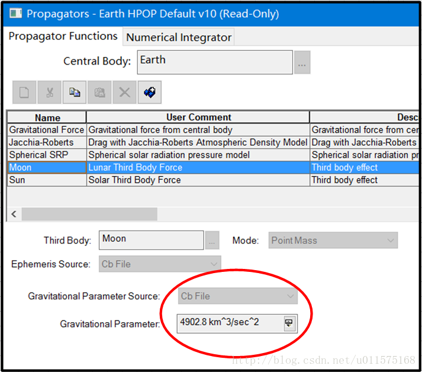
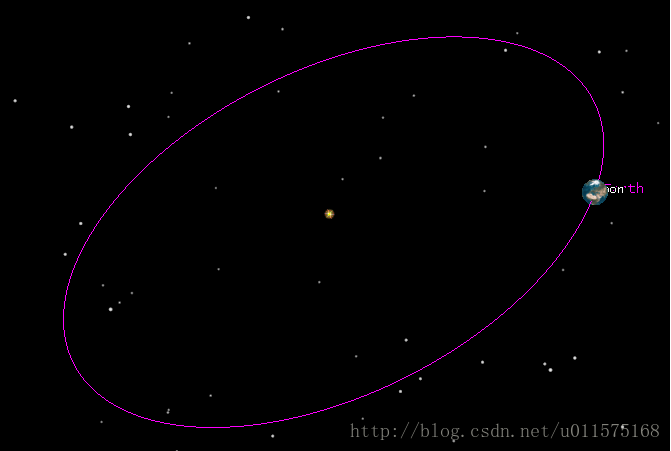
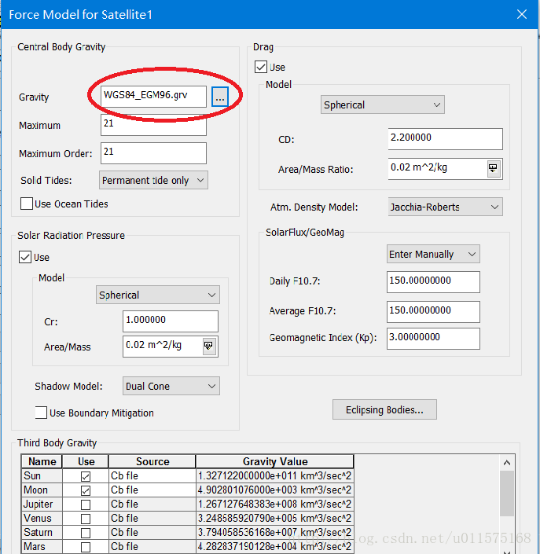
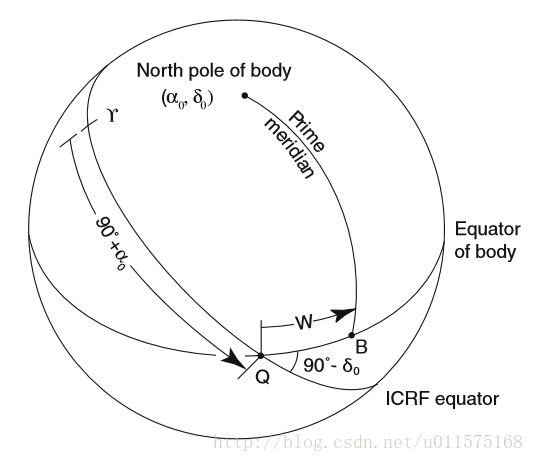

# STK中心天体cb等相关文件说明

STK中的中心天体就是指太阳及太阳系中的行星以及它们的卫星（如月球等）。我们在进行相关计算时，有关中心天体的椭球形状、姿态和星历等参数是缺省设置的，在必要的时候我们可以修改相应的参数设置，因此必须清楚中心天体的设置步骤才能获取到正确的结果。

本文主要介绍以下方面的内容:

 - 中心天体的.cb文件
 - 中心天体的.rot文件
 - 中心天体的星历设置
 
## 文件的位置及加载
在STK中，每一个中心天体都有其对应的配置文件(.cb文件），分别存放在其对应名称的文件夹中，并且在STK启动时加载。因此要想修改后的.cb文件生效，必须关闭STK，修改完对应中心天体的.cb文件后，再重新启动STK软件。

.cb文件位置位于[STK安装目录]\STKData\CentralBodies\[中心天体名称]下，比如对于地球来说，其具体位置为[STK安装目录]\STKData\CentralBodies\Earth\Earth.cb。对于Win7及以上的系统，STK（64位）缺省的安装目录为C:\Program Files\AGI\STK 11。

.cb文件中索引了其他文件，如.rot、.grv文件，都在同一文件夹下。

为防止误操作，.cb文件缺省设置为只读文件，因此读者应谨慎修改此文件，以免造成相关设置错误。

## .cb文件主要内容
下面以地球的cb文件为例，具体解释文件里主要参数的含义：

### Gm
 中心天体的引力常数， 即万有引力常数和中心地球总质量的乘积。
 
 在设置轨道积分器时（STK菜单"Utilities-Component Browser")，第三体引力摄动的GM参数值即来源于对应天体cb文件中的Gm数值。
 
 下图中为STK自带的Propagator:“Earth HPOP Default v10“，在此积分器中，第三体摄动的月球Gm参数即来源于moon.cb文件中的Gm数值（Sun类似）。
 
 此外，在卫星的HPOP积分器中，第三体参数的设置同上图类似，此处不再详述。 

### RefDistance/MinRadius
 中心天体椭球体的半长轴和半短轴。
 
 在设置地面站的经纬高参数时，是以此椭球体参数为参考的。椭球体参数不同，对于同一经纬度的地面站，最终转换为直角坐标xyz的值也不同。
 
 在3D窗口中，可以改变椭球体参数，实现中心天体的缩放，实现视觉上效果的改变。下图中，将地球的椭球体放大，从而在太阳系尺度下可见，这在展示深空探测轨道时比较有用。
 
 注意，在3D窗口的属性中，将“Advanced”页面的"Max visible Distance"设置为1e+010 km，才能看到上图。

### GravityModel（.grv文件）
中心天体的引力场模型参数的引用。对于地球来说，有众多引力场模型，如EGM96、WGS84、JGM3等等。

引力场模型参数使用单独的文件保存，后缀名为grv，与cb文件处于同一文件夹下。grv文件里主要包含中心天体非球形引力参数（带谐项和田谐项），也有Gm和RefDistance参数。当然，grv文件里的Gm和RefDistance参数仅仅与其自身的引力场模型参数配套使用，与cb文件里的Gm和RefDistance无关，尽管很多时候两者相等。

中心天体的引力场模型主要用来计算卫星在某点处受中心天体的引力，包含中心引力和非球形引力，具体的计算原理可参考相关参考书。

在设置卫星的积分器时(Propagator)，可以自定义中心天体的引力场，所引用的文件就是.grv文件，见下图，在设置卫星的HPOP积分器的Force Model时，可选择具体的中心天体引力文件。

### RotationDefinitionFile（.rot文件）
中心天体自转轴的姿态定义文件，此文件以.rot为后缀名，且与cb文件处于同一文件夹下。.rot文件中的参数最终用来计算中心天体的固连系和ICRF之间的姿态转换。

此文件主要描述中心天体自转轴相对ICRF坐标系的指向，用以下参数表示：赤经、赤纬和自转角度以及它们的导数，见下图。

.rot文件中的具体参数定义及数值取自于国际天文联合会(IAU)的报告“Report of the IAU/IAG Working Group on Cartographic Coordinates and Rotational Elements of the Planets and satellites: 2009, B.A. Archinal et al. (2011)“。IAU每三年对此报告进行更新，此报告主要描述太阳系行星以及它们的卫星、小天体以及彗星等自转轴的指向和自转参数。

需要注意的是，地球的自转非常复杂，需要考虑岁差、章动、自转和极移，并不能简单的用rot中的参数确定，因此对于地球来说，.rot文件仅仅是示意，实际需要使用具体的模型。以前使用J2000惯性系作为基准，此前一直采用IAU 1976岁差模型和1980章动模型。随着时间的推移，此模型的精度逐渐跟不上实际需要。因此，IAU规定，自2003年1月1日起，采用新的岁差章动模型，即IAU 2000A（B）模型，并使用ICRF作为基准惯性系（与J2000仅仅相差一个很小的常值转换矩阵，粗略理解时可当成J2000惯性系）。关于此模型的计算可参见我前面写的文档：[《ITRS/GCRS/J2000坐标系的相互转换》](http://blog.csdn.net/u011575168/article/details/52081409)，其官方文献请参考《IERS Conventions 2003》(IERS Technical Note No. 32)，读者可自行google一下。

Earth.cb文件中有关地球的岁差、章动、自转和极移参数的描述参数主要有以下：
 - ICRFTheory
 - ICRF_XYS_Algorithm
 - ApplyPoleWander
 - UseUpdatedEquationOfEquinox

在计算地球ICRF和ITRF（地固系）的姿态转换时，还需要IERS发布的最新的EOP文件与跳秒文件，这两个文件可以手动更新，替换STK中原来的文件即可，具体路径为：C:\ProgramData\AGI\STK 11 (x64)\DynamicEarthData。

### EphemerisSource
中心天体的星历（即位置、速度）。

目前中心天体的星历主要来源主要有以下几种：
 - JplDE （精密历表）
 - JplSpice (使用JPL SPICE文件)
 - File （使用.pe文件）
 - Analytic（使用分析法公式计算，精度低）

其中JplDE精密历表为最为常用的来源，由JPL发布的有关太阳系行星及其卫星的精密历表，常见的有DE405。有关JPL的行星精密历表可参见我的另一篇文章《JPL行星精密历表的使用》，百度即可。
