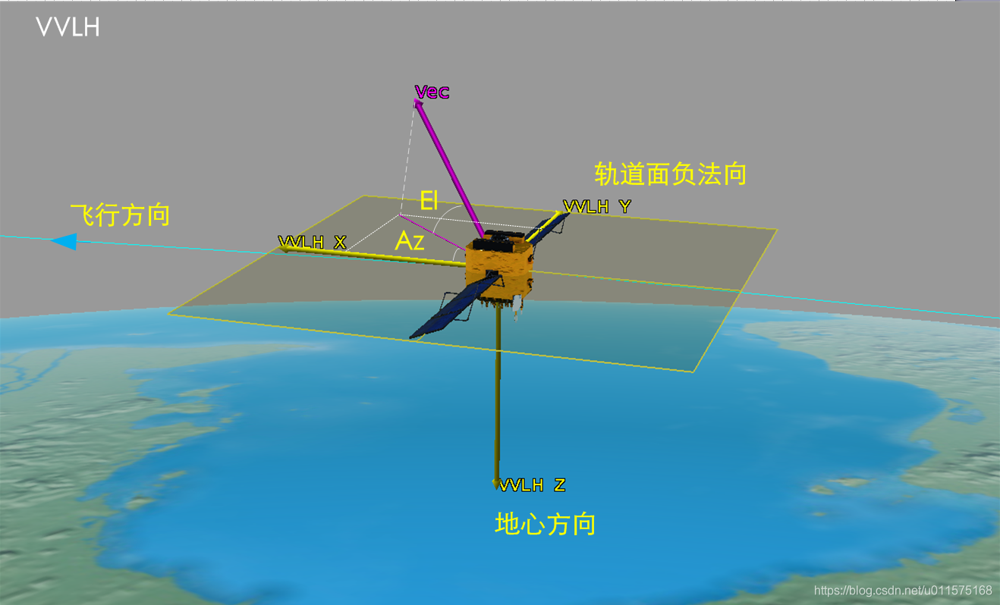

# STK中的VVLH坐标系及方位角、高度角

STK中，附着在卫星上的有许多坐标系，例如：VNC、LVLH、VVLH等。以及在定义某矢量方向时，需要使用方位角、高度角的概念。

VVLH坐标系和方位角(Az）、高度角(El)的示意见下图。

## VVLH
VVLH坐标系全称为：Vehicle Velocity Local Horizontal coordinate system。

对于卫星，其坐标系原点在卫星本体质心处（求解姿态相关时，与原点无关），VVLH三个坐标轴的定义如下（前右下坐标系）：

 - X: 沿飞行方向，由Y×Z确定；
 - Y: 轨道面负法向；
 - Z: 指向地心方向；
 
 需要注意，对于卫星，其轨道是定义在地心惯性系下的（地固系和地心惯性系下的卫星轨道面法向有所不同）。
 X轴的定义沿飞行方向，不一定与卫星的飞行速度矢量重合，而是由Y轴和Z轴叉乘决定。只有当卫星的轨道为圆轨道时，X轴才与飞行速度矢量重合。

## 方位角、高度角
STK中，定义一个矢量的方位角和高度角通常在VVLH坐标系下定义的。如太阳矢量的方位角和高度角。

- 方位角，英文名Azimuth,简称Az。定义为矢量在XY平面内投影与X轴的夹角，向Y轴方向为正。
- 高度角，英文名Elevation,简称El。定义为矢量与XY平面的夹角，向-Z轴方向为正。

