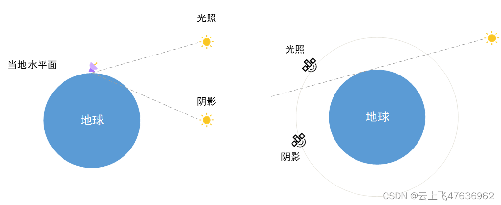
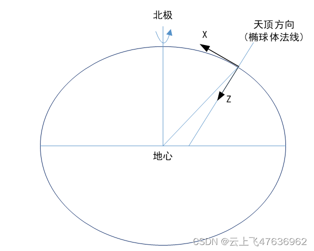
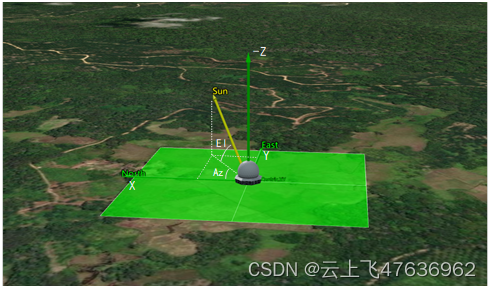
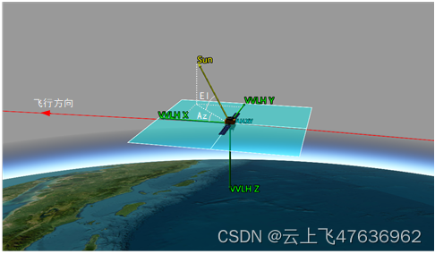
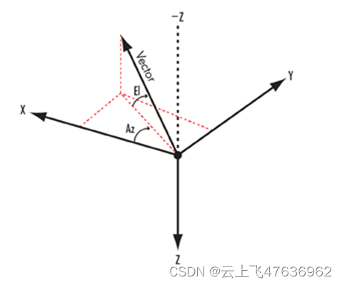
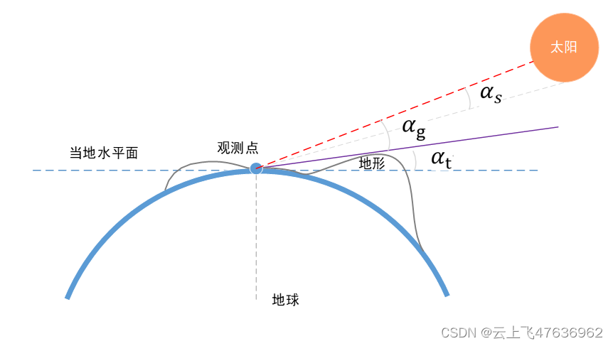
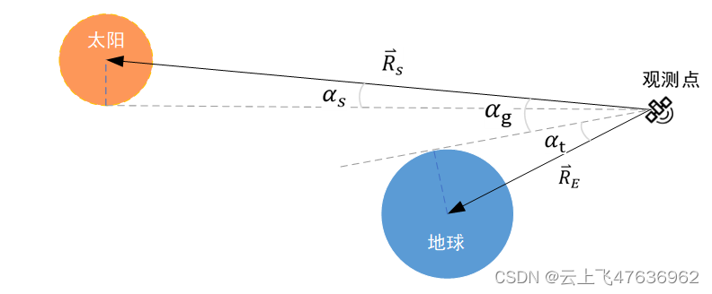

# STK中的光照计算模型

本文简要阐述STK中光照计算的模型。

在航天任务中，通常需要分析地面站、飞行器在一定时间内的光照情况，具体包括：
1)	地面站处在光照区和阴影区的具体时间范围；
2)	考虑地形遮挡后，地面站的光照区和阴影区的变化情况；
3)	飞行器绕地飞行过程中，处于光照区和阴影区的具体时间范围；
4)	地面站当地水平系下，太阳方位角、高度角的变化；
5)	飞行器轨道器或本体系下，太阳方位角、高度角的变化。

光照计算时，主要考虑的是地球对太阳的遮挡（其它天体也是类似的），见下图所示地面站和飞行器的光照示意图。

对于地面站（左图），考虑地球遮挡，当太阳在当地水平面之上时（对应的太阳的高度角大于0），即地面站为光照状态；反之则为阴影状态。

对于空间飞行器（右图），如卫星，当飞行器与太阳连线不被地球遮挡时，则飞行器为光照状态；反之则为阴影状态。

实际计算时，地球形状考虑为椭球体。

下面根据以上所涉及到的光照场景，详细讨论。

## 坐标系及太阳方位角、高度角
涉及到太阳位置计算时，通常涉及到太阳的方位角和高度角概念，因此首先确定好常用的坐标系和太阳方位角和高度角的定义。
### 地面站地平坐标系
地面站观测太阳时，采用当地水平坐标系（也称北东地坐标系），简称LH坐标系（Local Horizontal），其定义如下：

1)	X轴指向当地北方向；
2)	Y轴指向当地东方向；
3)	Z轴指向当地天底方向。

XY平面为当地水平面，垂直于地球椭球体法线，见下图。

下图给出了地面站LH系下的太阳方位角和高度角。

### 飞行器VVLH系
飞行器观测太阳时，通常采用轨道坐标系，简称VVLH坐标系（Vehicle Velocity, Local Horizontal），其定义如下：
1)	X轴约束在惯性系速度方向（由Y叉乘Z得到）；
2)	Y轴指向轨道面负法向；
3)	Z轴指向地心方向。

下图为飞行器的VVLH坐标系以及太阳方向矢量的高度角和方位角示意图。

### 太阳方位角和高度角
在地面站地平坐标系或者飞行器VVLH坐标系中，太阳方位角（Azimuth，简称Az）和高度角（Elevation，简称El）的定义如下图。

1)	方位角定义为：X轴与太阳方向矢量在XY平面内的投影矢量的夹角，+X轴为零点，向+Y轴方向为正；
2)	高度角定义为：太阳方向矢量与XY平面的夹角，-Z轴方向为正。

注意，对于飞行器本体坐标系（Body），则高度角以+Z轴方向为正。

根据以上定义，实际计算时，首先求得某时刻太阳（通常为视太阳）在地面站LH系或飞行器VVLH系的位置，设为$\mathbf{R}_s$：

$$\mathbf{R}_s=\left[X_s,Y_s,Z_s\right]^T$$

则太阳方位角Az和高度角El计算如下：

$$
\begin{cases}
Az=\operatorname{atan2}(Y_s,X_s) \\
El=\arcsin(-Z_s/R_s)
\end{cases}
$$

## 光照计算模型
无论是地面站还是飞行器，在精确计算光照和阴影的时间时，必须考虑到以下因素：

 1. 太阳圆盘的大小，以及被遮挡的部分大小；
 2. 对于地面站，当地水平面附近地形遮挡的影响；
 3. 对于空间飞行器，考虑地球的遮挡。

同时，太阳的光照状态分为以下三种情形：
1. 光照：太阳圆盘完全不被遮挡，地面站或飞行器处于完全光照状态，太阳光照强度因子为1；
2. 半影：太阳圆盘部分被遮挡，地面站或飞行器处于半影状态，太阳光照强度因子为0-1之间的小数；
3. 全影：太阳圆盘完全被遮挡，地面站或飞行器处于完全阴影状态，太阳光照强度因子为0。

首先给出地面站的光照计算模型，见下图。

某时刻，以观测点为中心，视太阳方向的地形最大仰角为$\alpha_t$，视太阳中心（即太阳位置）方向与地形最大仰角方向的夹角为$\alpha_g$（有正负，在地形之上为正，之下为负），太阳圆盘视半径为$\alpha_s$。

不考虑地形时($\alpha_t=0$)，$\alpha_g$即为视太阳方向与当地水平面的夹角，即太阳仰角El。

太阳圆盘视半径$\alpha_s$由下式给出：

$$
\alpha_s=\arcsin\dfrac{R_o}{R_s}
$$

上式中，$R_o$为太阳圆盘半径，取值为695700km，对应的视半径约为0.27°，具体数值与太阳的距离变化而稍有不同。

下图为飞行器的光照计算模型示意图。与地面站不同的是，不需要考虑地形的遮挡，转而考虑地球的遮挡。

某时刻，以观测点为中心，地心方向与地球边缘方向的夹角（称为地球视半径）为$\alpha_t$，视太阳中心（即太阳位置）方向与地球边缘方向的夹角为$\alpha_g$，太阳圆盘视半径为$\alpha_s$。观测点到地球的距离向量为$\mathbf{R}_E$。

地球视半径$\alpha_t$可由下式给出:

$$
\alpha_t=\arcsin\dfrac{R_e}{R_E}
$$

上式中，$R_e$为地球赤道半径，常取6378.14km。

根据上述两种光照模型，太阳光照状态的判别依据如下：

$$
\begin{cases}
\text{光照}: & \alpha_g>\alpha_s \\
\text{全影}: & \alpha_g<-\alpha_s \\
\text{半影}: & -\alpha_s \leq \alpha_g\leq\alpha_s
\end{cases}
$$

