# STK二次开发-Data Provider的使用

本文说明如何在 STK 二次开发中通过 Object Model 使用 Data Provider 获取报告数据，涵盖 Report Style 结构、关联对象、分组与直接获取方式、输入时间参数以及计算结果读取等关键步骤。

## 说明
在STK中，Report&Graph Manager控制面板用于生成STK对象（如卫星、地面站或Access等)的报告和图表，如卫星在J2000坐标系下的位置、速度等参数。它允许用户打开已存在的报告/图表、创建新的报告/图表以及改变报告/图表的格式。

Report&Graph Manager的打开方式有以下几种：
 - 菜单栏，路径为：“Analysis-Report & Graph Manager...”；
 - 工具栏中，点击图标 ；若工具栏中没有，则在工具栏空白处右键点击，在弹出的菜单中选择"Data Providers"即可显示；
- 对象浏览器（Object Browser）中右键点击对象，在弹出的右键菜单中，选择“Analysis-Report & Graph Manager...”。

下图为某卫星对象的Report&Graph控制面板的GUI界面。展开“Installed Styles”即可看见软件内缺省安装的报告样式(Report Style)。注意，不同对象的缺省安装的报告样式内容不同。
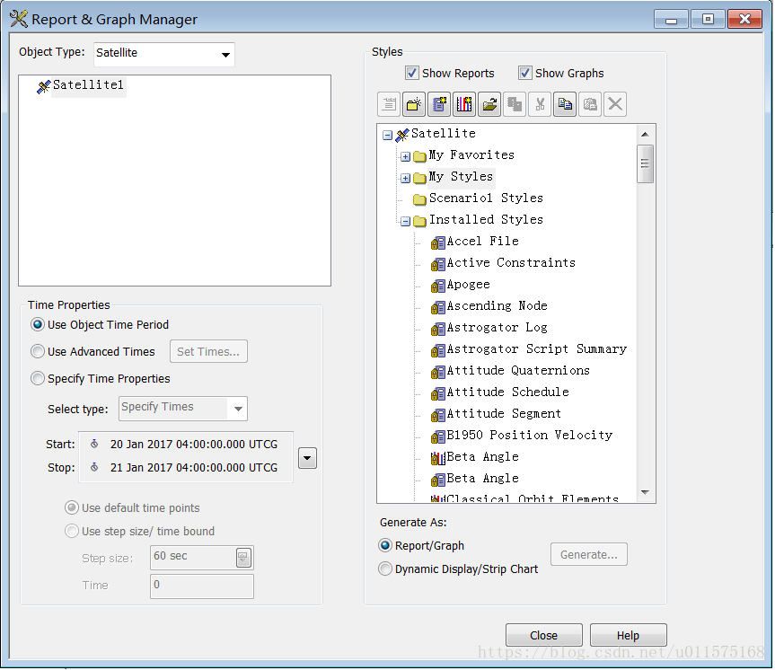
本章节不再详细叙述通过STK GUI界面方式手动生成报告或图表的方式，而是阐述使用STK Object Model类库方式获取、生成具体的报告数据。

通过代码获取报告主要有两种方式：Connect指令方式和Object Model方式。两者获取Report的机理稍有不同，具体见下图。
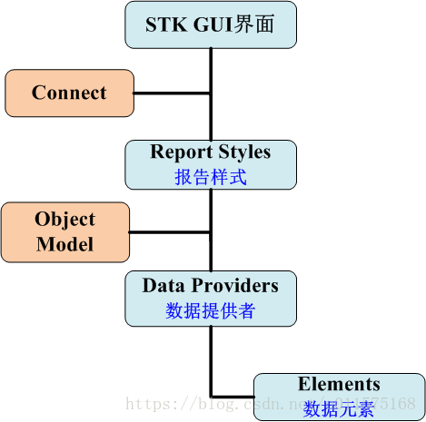
从图中可以看出，Connect指令的方式与GUI界面的操作方式一样，可以直接获取到具体对象的Report Styles，即缺省安装的、用户自己创建的报告。

而使用Object Model类库方式，则直接与具体的Data Providers（数据提供者）打交道，此种方式获取不到缺省安装、用于自己创建的报告。

下面具体阐述使用Object Model方式如何识别、计算以及获取具体的数据。

## Report Style（报告样式）结构
上图中可以看出一个Report Style是由具体的Data Providers组成的，我们来看一个具体的例子。

在“Installed Styles”中找到"J2000 Position Velocity"样式，这个报告样式用来生成卫星在J2000系下的位置和速度的。选中该样式，然后点击属性 ，则可打开该样式的属性窗口，见下图。

在报告样式的属性窗口中，左边窗口为各种的Data Providers，右边窗口为该样式的具体内容（Report Contents）。也就是说，样式的内容是由Data Providers中的具体数据组成的。

实际上，在新建一个报告样式的时候，就是通过样式的属性窗口，在左侧Data Providers窗口中自由选择合适的数据元素(Elements)，从而组成自定义的报告样式的。
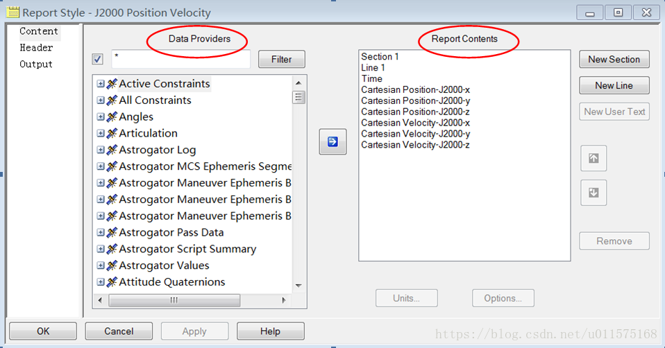
Data Providers窗口中列出了所有的与某个STK对象（此处为卫星）相关的数据。展开“Cartesian Position”数据组（Group），则可以看到组中所有的数据提供者（Data Provider）；展开数据提供者“J2000”，则可以看到此数据提供者下所有的数据元素（Element），如x/y/z等。

下图为Data Providers窗口的具体结构层次图。注意，大部分的节点都为数据组，即包含很多Data Provider，如节点“Cartesian Position”、“Cartesian Velocity”等节点；有的节点则直接为Data Provider，如节点“Close Approach Compute Results”。每个Data Provider中包含的则是我们最终需要的数据元素。
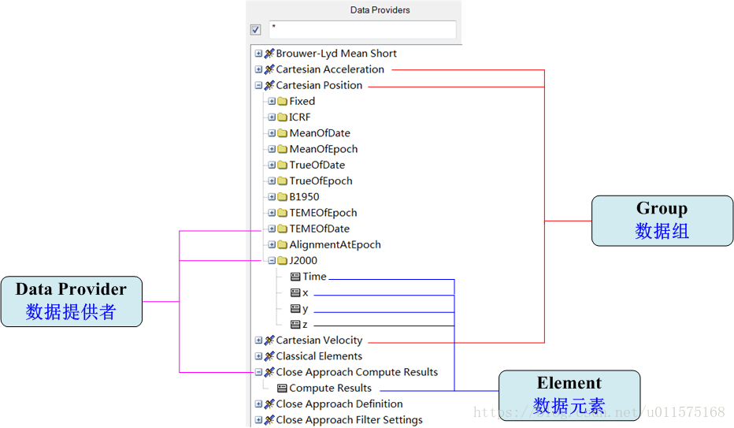
值得注意的是上面提到的名称：Group、Data Provider和Element，请读者关注，这也是Object Model中有关Data Provider类库的基础，后面具体代码中会多次涉及到。我们将会使用这些概念具体的阐述如何使用Object Model代码获取与报告样式相同的数据。
下图给出了三者在层次结构上的关系图。
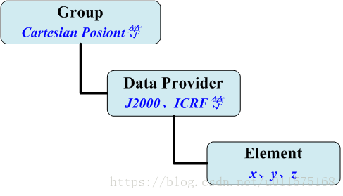

## 关联STK对象
要想获取STK对象的Data Provider类，首先要获取到STK场景中的相应对象，如卫星或地面站。

假设已经有一个STK场景在运行，场景的相关设置为：
- 场景初始时刻：1 Feb 2009 00:00:00.00;
- 场景结束时刻：2 Feb 2009, 00:00:00.00；
- 存在一地面站对象，名称为：Facility1;
- 存在一卫星对象，名称为：Satellite1。
则可以通过下面代码获取到地面站和卫星对象：
```
//  关联已打开的STK桌面场景
AgUiApplication uiApp = Marshal.GetActiveObject("STK11.Application") as AgUiApplication;

//  获取接口：IAgStkObjectRoot
IAgStkObjectRoot stkRoot = uiApp.Personality2 as IAgStkObjectRoot;

//  获取卫星对象
IAgStkObject satellite = stkRoot.CurrentScenario.Children["Satellite1"];

//  获取地面站对象
IAgStkObject facility = stkRoot.CurrentScenario.Children["Facility1"];
```

注意，获取卫星对象时，缺省使用接口IAgStkObject，我们并没有强制转换为卫星对象的接口（IAgSatellite），地面站的接口类似。IAgStkObject接口为STK中所有对象的基类接口，即拥有所有对象共有的属性与方法。下图为其部分属性。
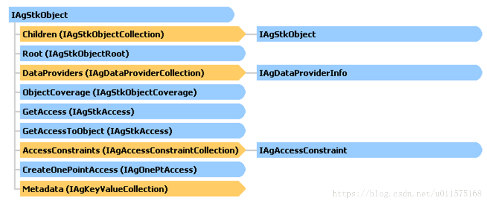

## 获取对象的Data Provider
本节阐述如何获取一个STK对象的特定的Data Provider，以下面三个具体的Data Provider 为例：
- 卫星J2000系下的位置（速度），在Cartesian Postion(Velocity)文件夹(Group)下，名称：J2000；
- 卫星轨道面的Beta角，名称：Beta Angle；
- 地面站的位置，名称：Cartesian Positon。
上面三个Data Provider在STK中报告样式属性窗口的位置如下图。
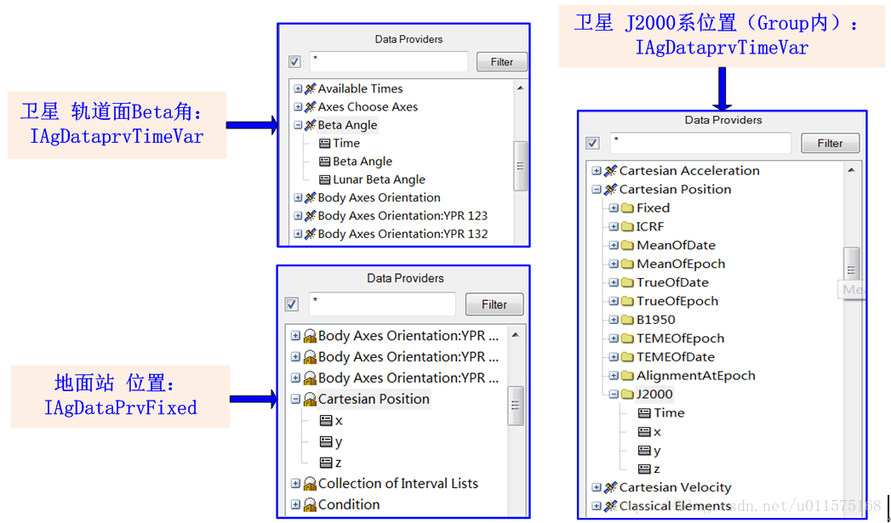
从IAgStkObject的属性中我们看到，每个STK对象都存在DataProviders属性（是一个集合），里面保存着对象的所有的数据提供者（Data Provider），其具体内容与报告样式属性窗口中左边的Data Providers列表内容一样。

从对象的属性DataProviders中获取到的Data Provider对象缺省使用接口IAgDataProviderInfo，这个接口是最底层的接口，我们获取后必须强制转换为其它的接口，否则我们啥都干不了。

一个具体的Data Provider对象主要为以下三个类之一：
- **AgDataPrvFixed**，与时间无关的数据，例如地面站的位置;
- **AgDataPrvInterval**，时间间隔的数据，如Access的结果，光照的时间等；
- **AgDataPrvTimeVar**，与时间相关的数据，即随时间变化的数据，这是绝大多数Data Provider的表现方式，如卫星的位置、速度等。

这三个类是通过分别实现三个具体的接口实现相应的功能，见下图。
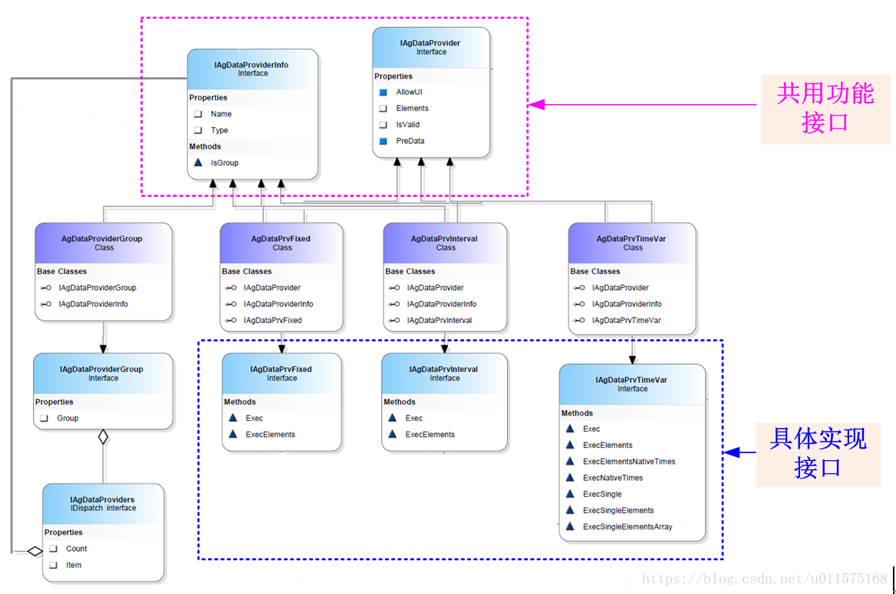
从图中可以看出，三个类都有两个共同的基类接口：IAgDataProviderInfo和IAgDataProvider，这两个接口提供共用的功能；而涉及到具体计算，则三个类都有相应的接口（具体功能下面再细谈）：
- **IAgDataPrvFixed**
- **IAgDataPrvInterval**
- **IAgDataPrvTimeVar**
上图中，继承自接口IAgDataProviderInfo还有一个类：AgDataProviderGroup。这个类实际上就是图5中的“Group”，仍然是Data Provider的集合。

下面具体给出几种获取对象的特定Data Provider的方式。

### 通过Group获取
一般来说，大多数的Data Provider都存放在相应的Group下，因此这种方式是最一般的方式。

以获取卫星在J2000系下的位置速度为例，其位置、速度的Data Provider获取代码如下：
```
//  获取Data Provider的组（Group），获取的对象缺省使用IAgDataProviderInfo接口
IAgDataProviderInfo dpPos = satellite.DataProviders["Cartesian Position"];
IAgDataProviderInfo dpVel = satellite.DataProviders["Cartesian Velocity"];

//  需要强制转换为IAgDataProviderGroup接口
IAgDataProviderGroup carPos = dpPos as IAgDataProviderGroup;
IAgDataProviderGroup carVel = dpVel as IAgDataProviderGroup;

//  从Group属性里获取到Data Provider：卫星在J2000系下的位置、速度            
//  获取到的Data Provider对象仍然缺省使用IAgDataProviderInfo接口,
//  这里强制转换为IAgDataPrvTimevar接口
IAgDataPrvTimeVar dpJ2000Pos = carPos.Group["J2000"] as IAgDataPrvTimeVar;
IAgDataPrvTimeVar dpJ2000Vel = carVel.Group["J2000"] as IAgDataPrvTimeVar;
```

最终我们获取的Data Provider为dp J2000Pos和dp J2000Vel，分别代表卫星在J2000系下的位置和速度。

上述获取的过程为先获取Data Provider的Group，再通过其Group属性获取具体的Data Provider（需要强制转换为对应的接口）。

### 直接获取
有的Data Provider并不存放在Group内，因此可以直接获取，见下代码。

获取卫星Beta角的Data Provider，最终强制转换为接口IAgDataPrvTimeVar。
```
//  获取卫星Beta角的Data Provider,获取到的对象缺省使用IAgDataProviderInfo接口
//  这里强制转换为IAgDataPrvTimevar接口
IAgDataPrvTimeVar dpInfo = satellite.DataProviders["Beta Angle"] as IAgDataPrvTimeVar;
```

获取地面站位置的Data Provider，最终强制转换为接口IAgDataPrvFixed。
```
//  获取地面站位置的Data Provider,获取到的对象缺省使用IAgDataProviderInfo接口
//  这里强制转换为IAgDataPrvFixed接口 
IAgDataPrvFixed dpInfo = facility.DataProviders["Cartesian Position"] as IAgDataPrvFixed;
```

### 通过DataProviders提供的方法直接获取(推荐)
前面说过，任何一个STK对象都存在DataProviders属性，这个属性是一个集合，实现了接口IAgDataProviderCollection，这个接口提供了几个方法，可以直接获取到特定Data Provider的接口。
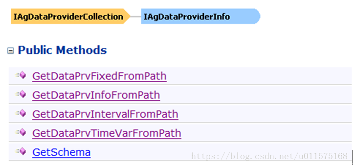
下面代码演示了通过特定的方法直接获取卫星J2000的位置、速度的Data Provider，其接口类型为IAgDataPrvTimeVar。
```
//  另外一种获取卫星J2000的位置速度的Data Provider
//  借助DataProviders的快捷方法直接获取IAgDataPrvTimeVar接口的对象
IAgDataPrvTimeVar dpPos2, dpVel2;
dpPos2 = satellite.DataProviders.GetDataPrvTimeVarFromPath("Cartesian Position//J2000");
dpVel2 = satellite.DataProviders.GetDataPrvTimeVarFromPath("Cartesian Velocity//J2000");
```

获取卫星的Beta角的Data Provider，直接获得接口IAgDataPrvTimeVar对象。
```
//  通过DataProviders的方法直接获取接口为IAgDataPrvTimeVar的Data Provider
IAgDataPrvTimeVar dpInfo2;
dpInfo2 = satellite.DataProviders.GetDataPrvTimeVarFromPath("Beta Angle");
```

获取地面站位置的Data Provider，直接获得接口IAgDataPrvFixed对象。
```
//  通过DataProviders的方法直接获取接口为IAgDataPrvFixed的Data Provider
IAgDataPrvFixed dpInfo2;
dpInfo2 = facility.DataProviders.GetDataPrvFixedFromPath("Cartesian Position");
```

从上面几个代码示例中可以看出，使用DataProviders属性提供的几种方法，可以直接获取到特定接口的Data Provider对象，不需要进行接口的强制转换。

**建议读者在获取STK对象的Data Provider时，采用此种方式进行。**

## Data Provider的输入参数及计算
获取到了Data Provider对象后，就可以进行相关数据的计算了，对于不同接口的Data Provider对象，其计算的方法也不同，见下图。
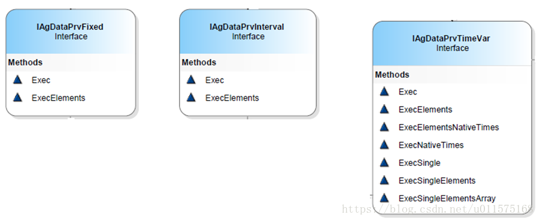
可以看出，前两种接口的方法较为简单，第三种也是最常用的接口提供的方法较多，每个接口都包含了Exec和ExecElements方法，其返回值都缺省为IAgDrResult接口对象。

### IAgDataPrvFixed接口方法
由于此种接口的Data Provider与时间无关，输入参数不需要时间。

使用Exec方法计算，Exec方法无输入参数，获取的结果包含Data Provider的所有元素。
获取地面站的位置，返回结果包含x、y、z三个分量。

```
//  获取地面站位置的Data Provider,获取到的对象缺省使用IAgDataProviderInfo接口
//  这里强制转换为IAgDataPrvFixed接口 
IAgDataPrvFixed dpInfo = facility.DataProviders["Cartesian Position"] as IAgDataPrvFixed;

//  无输入参数，返回结果中包含所有元素(x,y,z)
IAgDrResult resInfo = dpInfo.Exec();

```

使用ExecElements方法计算，需要Array数组作为输入参数，Array数组包含了需要计算元素的名称，获取的结果仅仅包含Data Provider的指定元素。
获取地面站的位置，返回结果仅包含x、z分量。

```
//  获取地面站位置的Data Provider,获取到的对象缺省使用IAgDataProviderInfo接口
//  这里强制转换为IAgDataPrvFixed接口 
IAgDataPrvFixed dpInfo = facility.DataProviders["Cartesian Position"] as IAgDataPrvFixed;

//  指定要计算的元素名称数组
Array elems = new object[] { "x", "z" };

//  输入参数为Array数组，返回结果中仅包含x，z元素
IAgDrResult resInfo = dpInfo.ExecElements(ref elems);
```

如无特别需求，建议使用第一种方法，形式简单。

### IAgDataPrvInterval接口方法
使用Exec方法计算，Exec方法的输入参数为初始时刻、结束时刻，获取的结果包含Data Provider的所有元素。

使用ExecElements方法计算，需要初始时刻、结束时刻、Array数组作为输入参数，Array数组包含了需要计算元素的名称，获取的结果仅包含Data Provider中的指定元素
例如，计算卫星对地面站的可见性，其计算结果是时间段的形式。

```
//  创建Access对象：卫星对地面站的可见性
IAgStkAccess Access = satellite.GetAccessToObject(facility) as IAgStkAccess;
//  可见性计算
Access.ComputeAccess();

//  获取Access的Data Provider:Access Data，获取到的对象缺省使用IAgDataProviderInfo接口
//  这里强制转换为IAgDataPrvInterval接口
IAgDataPrvInterval dpInfo = Access.DataProviders["Access Data"] as IAgDataPrvInterval;

//  输入参数为初始、结束时间,时间形式可多样，返回结果包含所有元素
IAgDrResult resInfo = dpInfo.Exec("18 Mar 2009 16:00:00.00", "19 Mar 2009 16:00:00.00");

//  第二种计算方式
//  指定要计算的元素名称数组
Array elems = new object[] { "Access Number", "Start Time", "Stop Time", "Duration" };

//  输入参数为初始、结束时间以及元素名称数组，返回结果仅包含指定的元素  
IAgDrResult resInfo2 = dpInfo.ExecElements("18 Mar 2009 16:00:00.00",  
                                      "19 Mar 2009 16:00:00.00", ref elems);

```

### IAgDataPrvTimeVar接口方法
此接口中的Exec和ExecElements方法同前两个接口的方法类似，此外还提供数个专门用于计算特定时刻的方法。

对于随时间变化的参数，我们在生成报告时，相应的输入参数通常指定初始时刻、结束时刻以及时间间隔，见下图。
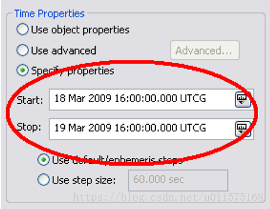
下面代码中演示了不同的输入及计算的接口方法，具体说明见其中的注释。

```
//  获取卫星对象satellite：IAgStkObject
//  另外一种获取卫星J2000的位置速度的Data Provider
//  借助DataProviders的快捷方法直接获取IAgDataPrvTimeVar接口的对象
IAgDataPrvTimeVar dpPos2, dpVel2;
dpPos2 = satellite.DataProviders.GetDataPrvTimeVarFromPath("Cartesian Position//J2000");
dpVel2 = satellite.DataProviders.GetDataPrvTimeVarFromPath("Cartesian Velocity//J2000");

//  下面仅给出了J2000系位置的计算方法，速度的计算方法类似！

//  方法1
//==================================================================
//  三月18-19号，每隔60s计算一次，返回所有位置参数(Time,x,y,z)
IAgDrResult resInfo = dpPos2.Exec("18 Mar 2009 16:00:00.00", "19 Mar 2009 16:00:00.00", 60);

//  方法2
//==================================================================
//  指定要计算的元素名称数组
Array elems = new object[] { "x", "z" };

//  三月18-19号，每隔60s计算一次，返回指定参数(x,z)
IAgDrResult resInfo2 = dpPos2.ExecElements("18 Mar 2009 16:00:00.00",
                                       "19 Mar 2009 16:00:00.00",  60,  ref elems);

//  方法3
//=================================================================
//  只计算一个时刻，返回所有参数在此时刻的值(Time,x,y,z)
IAgDrResult resInfo3 = dpPos2.ExecSingle("18 Mar 2009 16:00:00.00");

//  方法4
//=================================================================
//  只计算一个时刻，且仅返回指定参数在此时刻的值(x,z)
IAgDrResult resInfo4= dpPos2.ExecSingleElements("18 Mar 2009 16:00:00.00", ref elems);

//  方法5 //=================================================================
//  时间数组（根据需要给出任意个时间点）
Array times = new object[] { "18 Mar 2009 16:00:00.00", "18 Mar 2009 17:00:00.00" };

//  计算给定时刻（此处是2个时间点），返回指定参数(x,z)在这2个时刻的值
//  注意此处函数返回值的类型，不是缺省的类型了
IAgDrTimeArrayElements resInfo5 = dpPos2.ExecSingleElementsArray(ref times, ref elems);

```

### 预定义数据的设置(PreData)
在生成报告时，有部分Data Provider需要额外的输入参数，这些输入参数必须在计算之前设定。
例如，在计算卫星相对运动时，最常用的Data Provider是"Relative Motion"，这里面提供了卫星RIC和NTC两种坐标系的元素。

在STK中新建一个报告样式(Report Sytle)，报告内容为Relative Motion中的四个元素：Time/Radial/In-Track/Cross-Track（RIC坐标系中的分量）。

报告样式创建完成后，针对Satellite1生成此报告时，会弹出一个对话框，让用户选择需要计算的卫星目标，此处选择Satellite2，点击“Assign"，随后即可计算出卫星2相对卫星1的RIC坐标系中的运动。
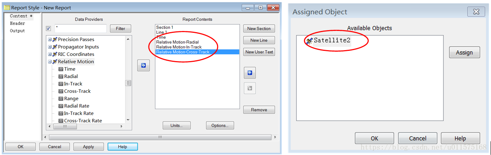

在使用Object Model方式时，使用PreData 属性来设置Satellite2。

前面章节中提到过，每个Data Provider 对象类都实现了两个共同的接口：IAgDataProviderInfo和IAgDataProvider，见图8。其中IAgDataProvider接口中“PreData”属性就专门用来设置额外的参数，如上面计算相对运动时需要制定卫星2对象。注意，PreData 属性是字符串类型，具体用法见下面代码演示。

```
//  获取卫星对象satellite:IAgStkObject
//  另一个卫星对象satellite2:IAgStkObject            
//  直接获取satellite的IAgDataPrvTimeVar接口对象(Relative Motion)
IAgDataPrvTimeVar RICdp = satellite.DataProviders.GetDataPrvTimeVarFromPath("Relative Motion");

//  需要计算的四个元素(RIC坐标系中的三个分量)
Array elems = new object[] { "Time", "Radial", "In-Track", "Cross-Track" };
            
//  需要强制转换为IAgDataProvider接口，才能使用PreData属性
//  注意此处设置Satellite2的方式，采用"Satellite/卫星名"的方式
 (RICdp as IAgDataProvider).PreData = "Satellite/Satellite2";

//  三月18-19号，每隔60s计算一次，返回指定4个参数的结果
IAgDrResult result = RICdp.ExecElements("18 Mar 2009 16:00:00.00", 
                                   "19 Mar 2009 16:00:00.00", 60, ref elems);
//  也可使用此Exce方法，则返回所有参数的结果
IAgDrResult result2 = RICdp.Exec("18 Mar 2009 16:00:00.00", "19 Mar 2009 16:00:00.00", 60);

```

可以看出，相比上面各节的输入与计算方法而言，仅在计算前设置了Data Provider的PreData属性（需先转换为IAgDataProvider接口)。

下面给出另外一个需要预先设定参数的例子。
例如，在计算卫星在任一坐标系下的位置时，最常用的Data Provider是"Points Choose System"组下面的“Center”，这里面提供了卫星点在某一坐标系中的所有元素。

在STK中新建一个报告样式(Report Sytle)，报告内容为Points Choose System下“Center”中的四个元素：Time/x/y/z。

报告样式创建完成后，针对Satellite1生成此报告时，会弹出一个对话框，让用户选择需要计算的坐标系，此处选择月固系，随后即可计算出卫星中心点在月固系中的位置三分量。
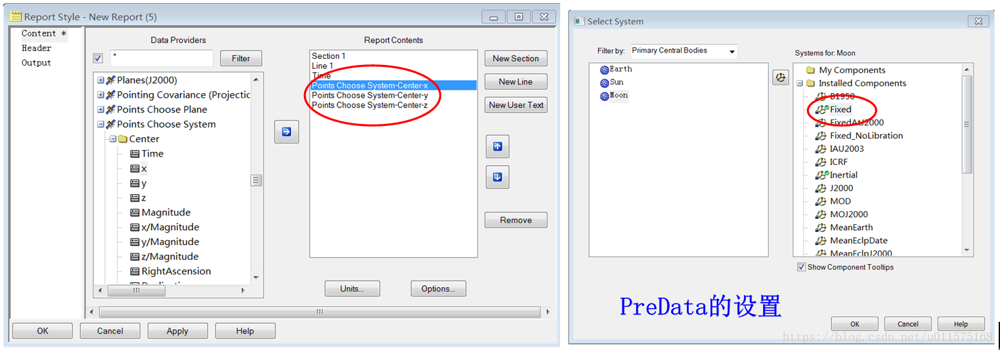
下面代码演示了如何设置月固系及计算卫星中心点在月固系中的位置。

```
//  获取卫星对象satellite:IAgStkObject     
//  直接获取satellite的IAgDataPrvTimeVar接口对象（卫星的中心点Center）
IAgDataPrvTimeVar dpPos = satellite.DataProviders.GetDataPrvTimeVarFromPath("Points Choose System//Center");

//  需要强制转换为IAgDataProvider接口，才能使用PreData属性
//  注意此处设置坐标系的方式，采用"CentralBody/Moon 坐标系名称"的方式
//  如果是设置另一卫星的体坐标系，则为"Satellite/卫星名 Body"的方式 
IAgDataProvider dp=dpPos as IAgDataProvider;
dp.PreData = "CentralBody/Moon Fixed";
            
//  需要计算的四个元素(月球固连系中的三个位置分量)
Array elems = new object[] { "Time", "x", "y", "z" };

//  三月18-19号，每隔60s计算一次，返回卫星中心在月固系下的位置(x,y,z)            
IAgDrResult result = dpPos.ExecElements("18 Mar 2009 16:00:00.00", 
                                   "19 Mar 2009 16:00:00.00", 60, ref elems);
```

## Data Provider的数据获取
前面叙述了如何获得一个STK对象的Data Provider，以及如何给这个Data Provider的输入参数赋值以及计算。现在到了最后一步，如何获得最终计算的数据。

从上节的演示代码中我们知道，三种接口类型的Data Provider的计算结果基本上都缺省返回IAgDrResult的接口对象。下图为IAgDrResult接口的属性图，其中里面的DataSets属性为一个集合（IAgDrDataSetCollection），集合中的元素就对应Data Provider中的元素，如J2000系下的x,y,z元素，每个元素用接口IAgDrDataSet代表，通过其GetValues方法返回具体数值的数组。
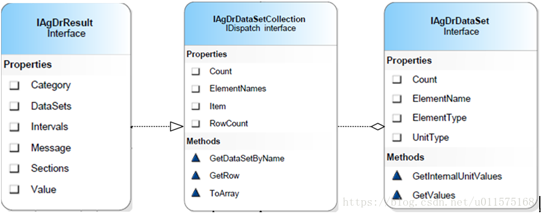
下面分不同接口的Data Provider具体阐述如何获取具体的数据。

### IAgDataPrvTimeVar接口
对于随时间变化的参数，其输出的结果也随时间变化，每个元素参数为一列。

下图为使用STK报告生成的卫星在J2000系下的位置和速度，加上时间一共7列，每列为一元素的数值。
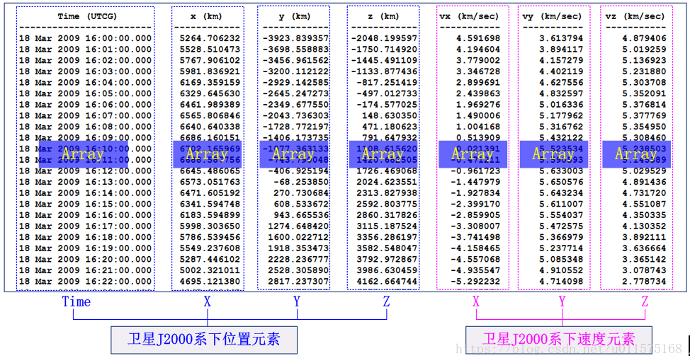
在Object Model方式下，每列元素的数值都保存在数组（System.Array类对象）中。

下面代码演示了如何获取卫星在J2000系下的位置、速度。

```
//  获取卫星对象satellite：IAgStkObject
//  直接获取IAgDataPrvTimeVar接口的对象
IAgDataPrvTimeVar dpPos2, dpVel2;
dpPos2 = satellite.DataProviders.GetDataPrvTimeVarFromPath("Cartesian Position//J2000");
dpVel2 = satellite.DataProviders.GetDataPrvTimeVarFromPath("Cartesian Velocity//J2000");

//  指定要计算的元素名称数组
Array elems = new object[] { "Time", "x", "y", "z" };
                        
//  J2000系下的位置
//  三月18-19号，每隔60s计算一次，返回指定参数(Time,x,y,z)
IAgDrResult resPos= dpPos2.ExecElements("18 Mar 2009 16:00:00.00", 
                                    "19 Mar 2009 16:00:00.00", 60, ref elems);
            
//  J2000系下的位置
//  三月18-19号，每隔60s计算一次，返回指定参数(Time,x,y,z)
IAgDrResult resVel = dpVel2.ExecElements("18 Mar 2009 16:00:00.00", 
                                     "19 Mar 2009 16:00:00.00", 60, ref elems);

//  获取结果中的数据集合(位置、速度)
IAgDrDataSetCollection dsPos = resPos.DataSets;
IAgDrDataSetCollection dsVel = resVel.DataSets;
            
//  获取J2000下的位置，保存在Array数组中,
//  注意，数据集合编号按照Time,x,y,z的顺序排列的，从0开始
Array arrayTime = dsPos[0].GetValues();
Array arrayX = dsPos[1].GetValues();
Array arrayY = dsPos[2].GetValues();
Array arrayZ = dsPos[3].GetValues();

//  获取J2000下的速度，保存在Array数组中。
//  注意编号从1开始，0编号对应Time，已经有了，此处不需要
Array arrayVx = dsVel[1].GetValues();
Array arrayVy = dsVel[2].GetValues();
Array arrayVz = dsVel[3].GetValues();

//  另外一种方式            //=================================================================
//  通过元素名称获取位置x分量数组,同arrayX
Array arrayX2 = dsPos.GetDataSetByName("x").GetValues();            
//  通过元素名称获取速度x分量数组,同arrayVx
Array arrayVx2 = dsVel.GetDataSetByName("x").GetValues();

```

如果只是想计算某几个时刻的位置（或速度），则可以使用稍微简洁的方法来获取，下面代码演示了获取两个时刻的位置。

```
//  获取卫星对象satellite：IAgStkObject
//  借助DataProviders的快捷方法直接获取IAgDataPrvTimeVar接口的对象:J2000系下的位置
IAgDataPrvTimeVar dpPos2;
dpPos2 = satellite.DataProviders.GetDataPrvTimeVarFromPath("Cartesian Position//J2000");
            
//  指定要计算的元素名称数组
Array elems = new object[] { "x","y", "z" };
            
//  时间数组（根据需要给出任意个时间点）
Array times = new object[] { "18 Mar 2009 16:00:00.00", "18 Mar 2009 17:00:00.00" };

//  计算给定时刻（此处是2个时间点），返回指定参数(x,y,z)在这2个时刻的值
//  注意此处函数返回值的类型，不是缺省的类型了
IAgDrTimeArrayElements resInfo5 = dpPos2.ExecSingleElementsArray(ref times, ref elems);

//  获取J2000下的位置x,y,z，保存在Array数组中，每个数组有2个元素，对应两个时刻            
Array arrayX = resInfo5.GetArray(0);
Array arrayY = resInfo5.GetArray(1);
Array arrayZ = resInfo5.GetArray(2);

```

### IAgDataPrvInterval接口
典型的时间段接口的为可见性分析（Access）数据的结果。

下图为卫星与地面站的Access报告结果。一共有四个元素，每个元素一列。
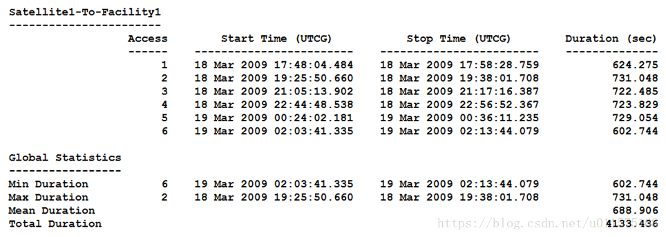
与随时间变化的参数类似，时间段的数据结果仍然以列数组的形式保存。

下面代码演示了如何获取卫星对地面站的可见性分析结果。

```
//  创建Access对象：卫星对地面站的可见性
IAgStkAccess Access = satellite.GetAccessToObject(facility) as IAgStkAccess;
//  可见性计算
Access.ComputeAccess();

//  获取Access的Data Provider:Access Data，获取到的对象缺省使用IAgDataProviderInfo接口
//  这里强制转换为IAgDataPrvInterval接口
IAgDataPrvInterval dpInfo = Access.DataProviders["Access Data"] as IAgDataPrvInterval;

//  指定要计算的元素名称数组
Array elems = new object[] { "Access Number", "Start Time", "Stop Time", "Duration" };

//  输入参数为初始、结束时间以及元素名称数组，返回结果仅包含指定的元素  
IAgDrResult resInfo2 = dpInfo.ExecElements("18 Mar 2009 16:00:00.00",
                                      "19 Mar 2009 16:00:00.00", ref elems);

//  获取结果中的数据集合
IAgDrDataSetCollection datasets = resInfo2.DataSets;

//  获取Access Data各元素，保存在Array数组中。
Array arrayAccNum = datasets[0].GetValues();
Array arrayStart = datasets[1].GetValues();
Array arrayStop = datasets[2].GetValues();
Array arrayDuration = datasets[3].GetValues();

```

### IAgDataPrvFixed接口
与时间无关的Data Provider的计算不需要时间，计算结果也仅有元素的数值，并没有数组。

同上两节类似，在Object Model中，仍然以数组的形式保存最终的结果，只是数组的长度为1。

下面代码演示了如何获取地面站在地固系下的位置。

```
//  获取地面站位置的Data Provider,获取到的对象缺省使用IAgDataProviderInfo接口
//  这里强制转换为IAgDataPrvFixed接口 
IAgDataPrvFixed dpInfo = facility.DataProviders["Cartesian Position"] as IAgDataPrvFixed;
           
//  无输入参数，返回结果中包含所有元素(x,y,z)
IAgDrResult resInfo = dpInfo.Exec();  

//  获取结果中的数据集合
IAgDrDataSetCollection datasets = resInfo.DataSets;

//  获取地面站各元素x,y,z，保存在Array数组中(数组中仅有1个数值)
Array arrayX = datasets[0].GetValues();
Array arrayY = datasets[1].GetValues();
Array arrayZ = datasets[2].GetValues();

```

### 小结
从以上各节的代码可以看出，绝大多数的Data Provider的计算结果都缺省为IAgDrResult接口，都可以通过其DataSets属性来获取数据的数组，并可通过数组编号（0,1,2...）依次获取数组结果，也可以通过元素的名称来获取数组。

## 输入的时间格式
在以上Data Provider的计算中，所有输入参数中涉及到的时间都是以UTCG格式来输入的，这是STK中的缺省时间格式。

在STK界面中，打开场景属性的设置页面，在“Basic”页面中，“Units”标签页用来设置各种单位的输入输出格式。其中时间格式（DateFormat）有众多的格式可以选择，见下图。
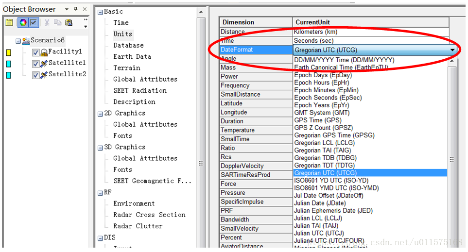
在使用Object Model方式进行二次开发时，应根据项目需要选择合适的时间格式，可供选择的格式同上图。

单位的设置是通过根接口IAgStkObjectRoot 的属性UnitPreferences来进行相关操作的。

下面代码演示了在进行卫星的位置Data Provider计算时，两种不同时间格式的输入方法。

```
//  获取卫星对象satellite：IAgStkObject
//  借助DataProviders的快捷方法直接获取IAgDataPrvTimeVar接口的对象:J2000系下的位置
IAgDataPrvTimeVar dpPos2;
dpPos2 = satellite.DataProviders.GetDataPrvTimeVarFromPath("Cartesian Position//J2000");

//  三月18-19号，每隔60s计算一次，返回所有位置参数(Time,x,y,z)
//  此处，时间输入格式为UTCG
IAgDrResult resInfo = dpPos2.Exec("18 Mar 2009 16:00:00.00", "19 Mar 2009 16:00:00.00", 60);

//  改变当前的时间格式为历元秒
stkRoot.UnitPreferences.SetCurrentUnit("DateFormat", "EpSec");

//  此处历元零时刻为："18 Mar 2009 16:00:00.00"
//  三月18-19号，每隔60s计算一次，返回所有位置参数(Time,x,y,z)
//  注意：输入参数的开始时间、结束时间皆为历元秒的格式，即为Double类型
//  返回结果同resInfo
IAgDrResult resInfo2 = dpPos2.Exec(0.0, 86400.0, 60);

```

