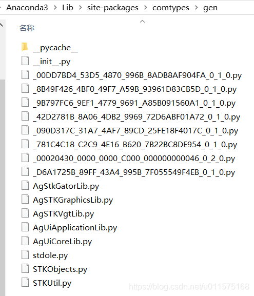
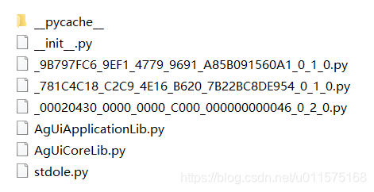
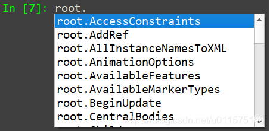

# STK二次开发-Python的首次连接

近年来，Python语言越来越火，STK也提供了Python的接口（Connect形式和Object Model形式）。与MATLAB类似，Python为解释性语言，同时可以借助于Python的强大的绘图库matplotlib直接进行作图。

本文给出python首次连接STK的详细步骤，首次连接完成后，才可以正常使用python进行STK二次开发。
## Python进行STK二次开发的适用场景
使用Python语言对STK进行二次开发主要适用于以下场景：
- 通过短短几十行或者数百行代码对STK场景进行连接（或创建）、参数化自动设置相关参数、获取相应的结果（如Access，Astrogator等计算结果），然后对结果进行分析，作图或者保存。
- 解决一个问题时，python代码文件仅仅为一个文件，而不是像C#工程那样拥有复杂的文件夹，简单明了。
- 目前python无法单独开发界面，将STK的3D和2D插件包含进来，形成自定义的GUI软件，这种开发形式还是C#较为合适。

## Python安装环境
推荐安装Anaconda，不仅因为它是免费的，而且会自动安装好常用的科学软件包，不用自己再到处找了。Anaconda有32位和64位版本的，同时建议采用最新的版本（python 3.5以上），并采用默认的安装目录。

安装完成后，可直接打开Spyder进行代码编写，也可使用Jupyter Notebook。

本文所有代码都是使用Spyder进行编写与运行。
## 首次连接步骤
Python与STK的连接采用Object Model形式（通过COM组件方式），不同于C#连接STK（所有的dll已自动安装在bin目录下），Python所需的连接库文件需要在**首次连接STK时**创建。首次连接完成后，最终在Anaconda的安装目录下的comtypes包内生成gen文件夹，具体路径为：[Anaconda3]\Lib\site-packages\comtypes\gen

gen文件下包含python与STK连接所需要的相关包，具体内容见下图

由于STK的API是通过COM组件的形式对外提供的，因此上述python模块是对COM组件的包装。

下面给出详细步骤。
#### 导入模块
使用以下代码导入相关模块：
```
import comtypes
from comtypes.client import CreateObject
```
#### 创建STK实例（打开STK）
通过下面语句来启动STK桌面程序，即创建STK实例。
```
# 打开STK桌面软件，创建STK实例
app=CreateObject("STK11.Application")
# 显示STK GUI界面
app.Visible = True
```
注意，上述语句是打开STK桌面程序，但是还没有创建具体的场景。上述语句的作用与通过鼠标点击STK图标打开STK桌面应用程序的作用相同。

上述语句执行后，会在comtypes模块下创建gen目录，并生成以下文件，见下图。

其中：
- AgUiApplicationLib.py
- AgUiCoreLib.py

这两个文件就是与STK桌面程序相关的python包装STK COM组件后的模块。

此时，我们可以看看创建的变量"app"的数据类型，使用type()函数，得到的类型为：comtypes.POINTER(_IAgUiApplication)。也就是说我们得到了一个指向IAgUiApplication的对象，最前面大写的"I"通常表示接口，按照STK的命名习惯，这个对象为类AgUiApplication的实例，即类和对应的接口的区别仅仅在于一个前缀I（Interface的简写）。
#### 创建IAgStkObjectRoot对象
若使用STK Object Model方式连接STK，则最重要的接口就是IAgStkObjectRoot，通过这个接口，我们可以创建场景，继而创建卫星、地面站等各种对象，然后设置其属性等等一系列的操作。可以说，使用Object Model方式连接STK，接口IAgStkObjectRoot是一切对象的鼻祖和源头。

IAgStkObjectRoot对象可通过IAgUiApplication的Personality2属性来获取:
```
root=app.Personality2
```
与上面类似，这个语句执行后，会在comtypes模块下的gen目录下创建对应的COM组件的python包装模块。

其中下面几个文件就是我们所需要的python模块：
- AgSTKGraphicsLib.py
- AgSTKVgtLib.py
- STKObjects.py
- STKUtil.py

同样，我们可以通过type()函数类来查看变量"root"的类型为：comtypes.POINTER(_IAgStkObjectRoot)。

在Spyder的控制台中，我们输入"root."然后按Tab键，即可只能调用智能提示功能将IAgStkObjectRoot的所有属性显示出来，如下图。在编程中采用这种方式可以直接看清楚一个对象所代表的接口的所有属性，可以节省很多时间，少走弯路。

#### 创建AgStkGatorLib模块(使用Astrogator需要)
以上创建的python模块包含了STK Object Model中绝大多数的接口、类等API。

卫星轨道机动模块Astrogator在STK软件中是一个非常重要的部分，以至于在STK API中是一个相对独立的模块。因此，如果需要使用Astrogator相关的API，则还需要创建对应的python包装模块。

使用下面一句代码即可。
```
comtypes.client.GetModule((comtypes.GUID("{090D317C-31A7-4AF7-89CD-25FE18F4017C}") ,1,0))
```
这个语句执行后，会在comtypes模块下的gen目录下创建对应的COM组件的python包装模块：
- AgStkGatorLib.py

至此，python首次连接STK的工作已基本完成。
## 小结
python首次连接STK时，会自动在comtypes文件下创建gen目录，并创建STK Object Model的COM组件对应的python包装模块。

完整代码如下：
```
# -*- coding: utf-8 -*-
"""
    Python 首次连接STK（此文件只运行一次）
    
    此文件运行后，会在目录[Anaconda3]\Lib\site-packages\comtypes\gen下创建以下模块：
        - AgUiApplicationLib.py
        - AgUiCoreLib.py
        - AgSTKGraphicsLib.py
        - AgSTKVgtLib.py
        - STKObjects.py
        - STKUtil.py
        - AgStkGatorLib
"""
# 导入com相关模块
import comtypes
from comtypes.client import CreateObject

# 打开STK桌面软件，创建STK实例
app=CreateObject("STK11.Application")
# 显示STK GUI界面
app.Visible = True

print('app的类型为：',type(app))

#  获取Object Model的根对象：IAgStkObjectRoot
#  此接口为Object Model中的最顶层接口，由此接口可创建场景、地面站、卫星等
root = app.Personality2

print('root的类型为：',type(root))

#  创建Astrogator相关的模块：AgStkGatorLib
comtypes.client.GetModule((comtypes.GUID("{090D317C-31A7-4AF7-89CD-25FE18F4017C}") ,1,0))

print('python 首次连接STK完成！')
print('STK Object Model API 的python模块已在comtypes\gen目录下创建！')
print('请关闭已打开的STK!')
```
注意，此代码仅运行一次，运行后，将会在comtypes文件夹下创建gen目录，并创建以下模块：
- AgUiApplicationLib.py
- AgUiCoreLib.py
- AgSTKGraphicsLib.py
- AgSTKVgtLib.py
- STKObjects.py
- STKUtil.py
- AgStkGatorLib.py
运行完成后，将打开的STK程序关闭即可。

在python二次开发STK时，可以直接使用上述几个模块！

python二次开发STK的具体步骤和C#开发类似，可参考STK Programing Interface Help。

附：[源代码文件](https://download.csdn.net/download/u011575168/10939915)


