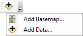
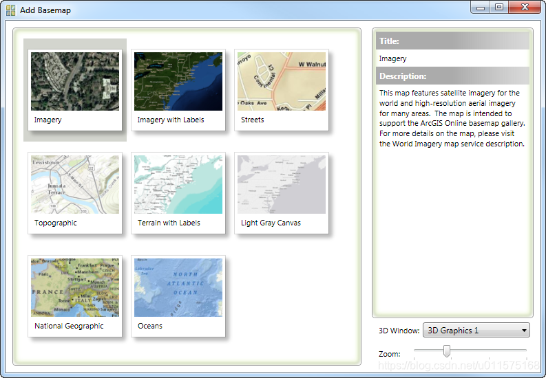
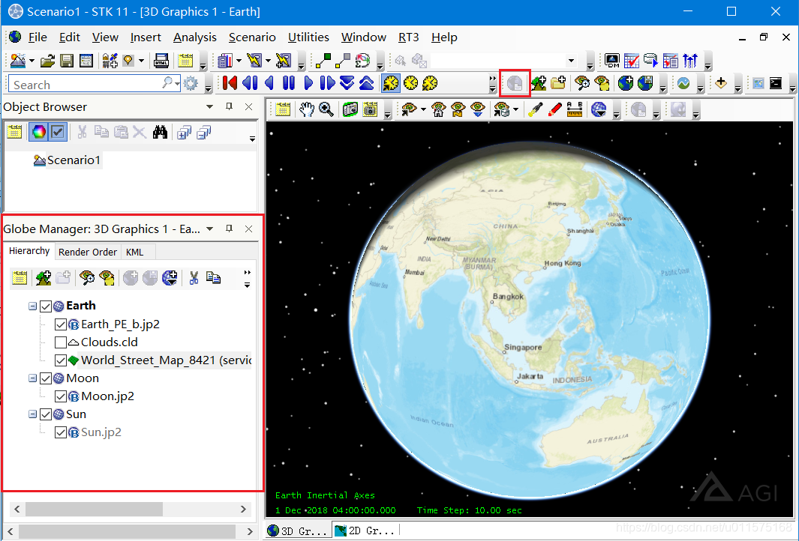
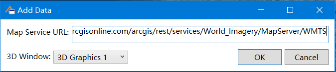
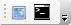
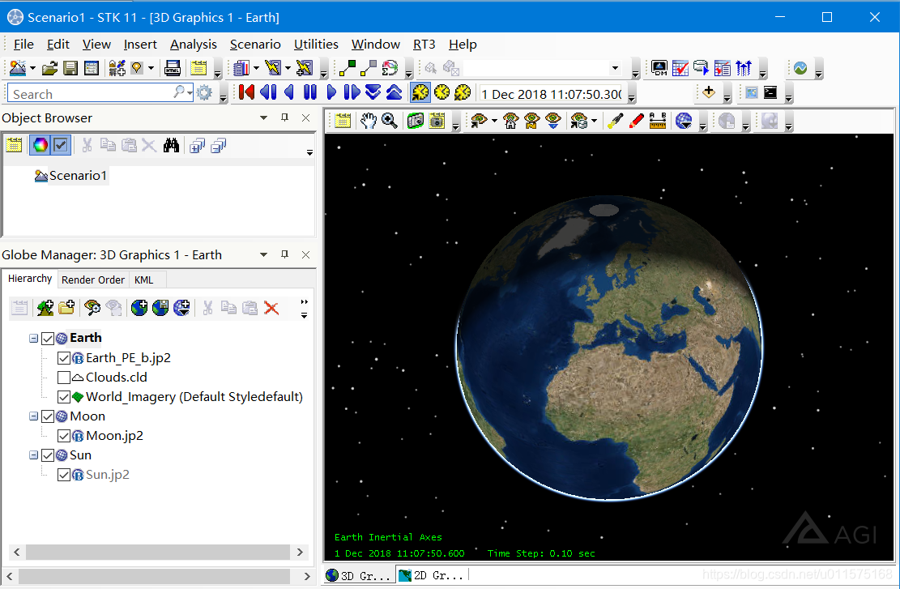
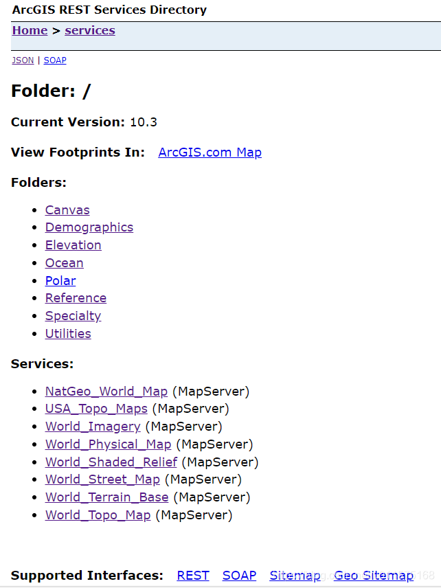
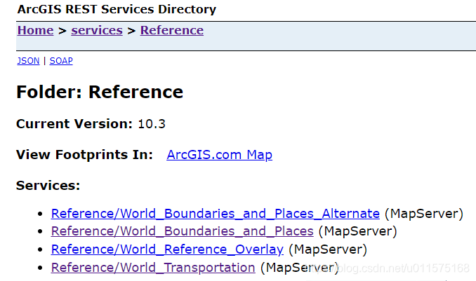
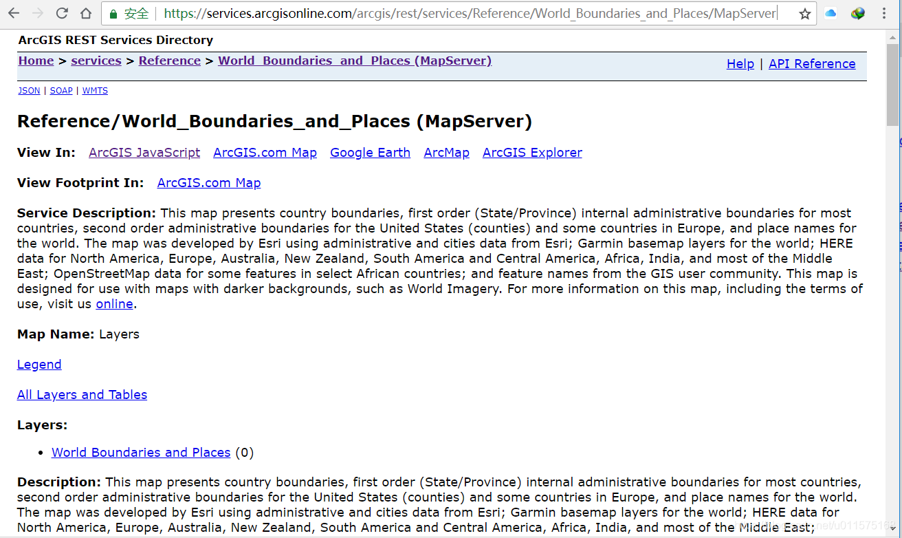

# STK加载WMS、WMTS服务

在STK软件中，其3D/2D窗口中地球（其它行星类似）的地图图片是通过特定格式（带经纬度信息）的图片直接加载而成，详细步骤参考： [STK中STK加载地图与高清影像图](https://blog.csdn.net/u011575168/article/details/80244175)。

在GIS方面，无论是栅格图还是矢量图都可以通过网络地图服务的形式来获取，例如平时我们通过网页浏览的百度地图、谷歌地图等，都是通过网络地图服务方式，实时从服务器端获取所需的地图数据。

在目前的网络地图服务中，采用较多的有两种格式：WMS和WMTS。其中WMTS方式更加流行。

**在STK中，以插件的形式提供了对WMS和WMTS两种格式的网络地图服务的支持，使得STK中的3D窗口（2D窗口目前不支持）可直接自动加载不同层级的地图。**

有关WMTS的简单介绍，可参考这篇文章：[5分钟学GIS | WMTS服务初步理解与读取](https://blog.csdn.net/supermapsupport/article/details/76806670)。

## ArcGIS REST Client插件
ArcGIS REST Client插件提供连接ArcGIS网络地图服务器的接口，并可以添加相应的数据到STK 3D窗口中。ArcGIS网络地图基本上都是WMTS形式提供服务接口的。

直接点击工具栏上的图标即可打开ArcGIS REST Client插件提供的两个功能：Add Basemap和Add Data。

如果在工具栏看不到图标的话，可在工具栏上右键，然后在弹出的菜单栏里，选中"ArcGIS REST Client"即可。
### Add Basemap
这里的basemap的字面意思是底图，在GIS中，底图通常为栅格图，如我们常见的卫星影像图。通常还要在底图上叠加诸如道路等各种矢量图。在STK中，不区分底图和其它地图的区别，基本都称为影像地图图层："Imagery"。

点击"Add Basemap..."即可打开"Add Basemap"对话框，如下图所示，显示了目前ArcGIS能够提供的几种地图。鼠标左键单击某地图的缩略图标，即可在右侧显示对应的说明。双击缩略图标，则可将此地图添加到对应的3D窗口中。

所有添加的地图都显示在"Globe Manager"中，见下图（加载Street地图后的效果）。

GlobeManger可通过工具栏打开，若没有的话，则右键工具栏，在弹出的菜单中选择"Globe Manger"即可。

若加载多个地图，则可通过Globe Manger中的"Render Order"页面调整多个地图的顺序。
### Add Data
前面介绍的Add Basemap是几个常用的地图。此处可添加所有ArcGIS提供的web service。
点击“Add Data”即可打开对话框，在"Map Service URL"中输入具体图层的url，点击“OK”即可将相应的图层添加入3D窗口（以及对应的Globe Manager）。 

对于ArcGIS所提供的各种地图服务图层的URL，通常以 “/MapServer”结尾（**注意：最后再加上/WMTS也可以**）。
如：https://services.arcgisonline.com/arcgis/rest/services/World_Imagery/MapServer。

## Web Map Services插件
Web Map Services插件提供连接WMS或WMTS网络地图服务器的接口，并可以添加相应的数据到STK 3D窗口中。相比较于ArcGIS REST Client插件，Web Map Services插件提供的功能则更广泛，不局限于ArcGIS提供的Web Service，任何支持WMS或WMTS服务接口的网络地图服务器都可通过此插件进行连接。

直接点击工具栏上的图标即可打开Web Map Services，此插件提供的两个功能：Add Map Service Layer（添加地图服务层）和Web Map Services Console（网络地图服务控制台）

如果在工具栏看不到图标的话，可在工具栏上右键，然后在弹出的菜单栏里，选中"Web Map Services"即可。
### Add Map Service Layer
点击"Web Map Service"即可打开"Add Map Service Layer"对话框。
 - 在"Server"地址栏里输入提供WMS或WMTS的服务器地址；
 - 选择对应的Type：Auto、WMS、WMTS；
 - 点击"Get Capabilities"按钮，即可连接服务器；
 - 连接成功后，在左侧"Layers"里显示服务器提供的地图图层；
 - 选中对应的图层，点击“Add Layer”按钮，即可将此图层添加到STK 3D窗口中。

上图中例子的地址为：https://services.arcgisonline.com/arcgis/rest/services/World_Imagery/MapServer/WMTS
添加后的图层自动显示在"Globe Manager"中，见下图。

### Web Map Services Console
点击"Web Map Services Console"即可打开控制台窗口，此控制台窗口显示STK与服务器连接时下载的每一个地图瓦片的信息，主要供调试使用，一般不需要使用此功能。

## 常用WMTS的服务地址
前面介绍的两个插件，都需要填写具体提供WMS或WMTS服务的地图服务地址，这个需要我们自己提供，此处介绍几个常见的地址。

### ArcGIS Online
ArcGIS作为ESRI公司的旗舰级软件产品，已在GIS领域处于龙头地位。其通过REST、SOAP等方式提供网络地图服务。

主地址为：https://services.arcgisonline.com/arcgis/rest/services
页面内容如下：

#### 1 Folder文件夹
点击“Folder”即可看见提供的更细致的服务，其URL一般格式为：
https://services.arcgisonline.com/arcgis/rest/services/[folder]/[serviceName]/[serviceType]
其中，[folder[为文件夹名称，/[serviceName]/[serviceType] 为具体的服务名称和类型。

例如，点击"Reference"，则可看到此文件夹下提供的具体服务如下（有4个）。

以第2个为例，点击则显示对应的服务说明页面，见下图，**地址栏里就是对应的URL(注意：最后再加上/WMTS)**：https://services.arcgisonline.com/arcgis/rest/services/Reference/World_Boundaries_and_Places/MapServer/WMTS
其它"Folder"下对应的服务的URL类似。

#### 2 Services
此页面提供的8个基本的地图服务与前面介绍的ArcGIS REST Client插件中的basemap基本一致，其服务URL地址格式为：
https://services.arcgisonline.com/arcgis/rest/services/[serviceName]/[serviceType]
其中，[serviceName]/[serviceType] 为具体的服务名称和类型。
以World_Imagery为例，其URL地址为（**注意：最后再加上/WMTS**）：
https://services.arcgisonline.com/arcgis/rest/services/World_Imagery/MapServer/WMTS
