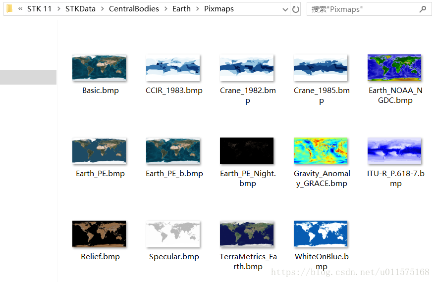
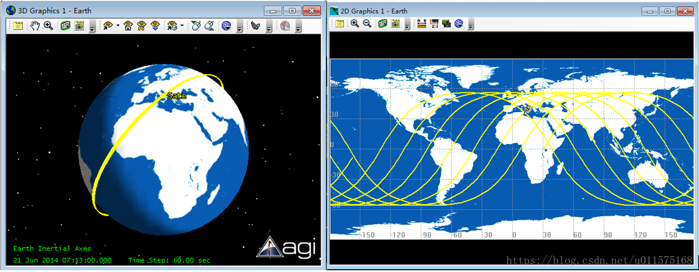
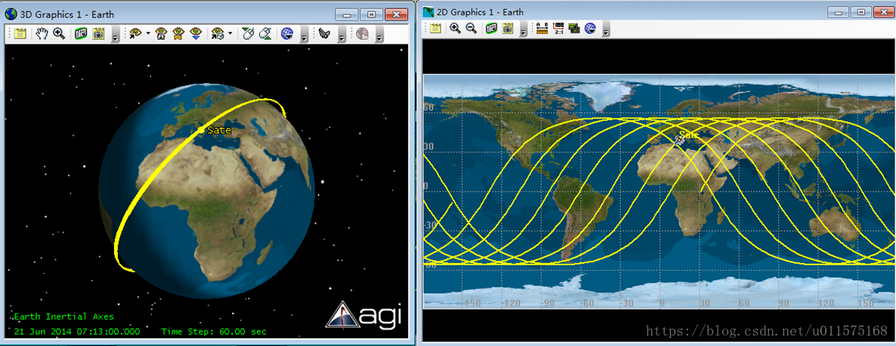
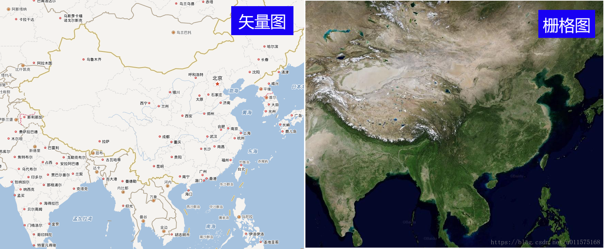
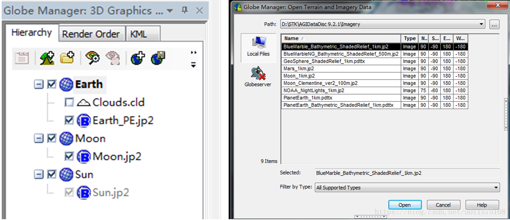
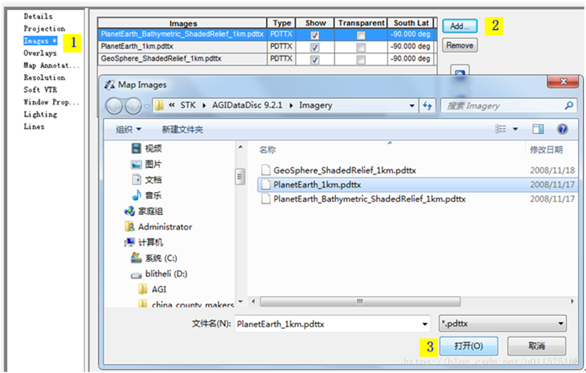
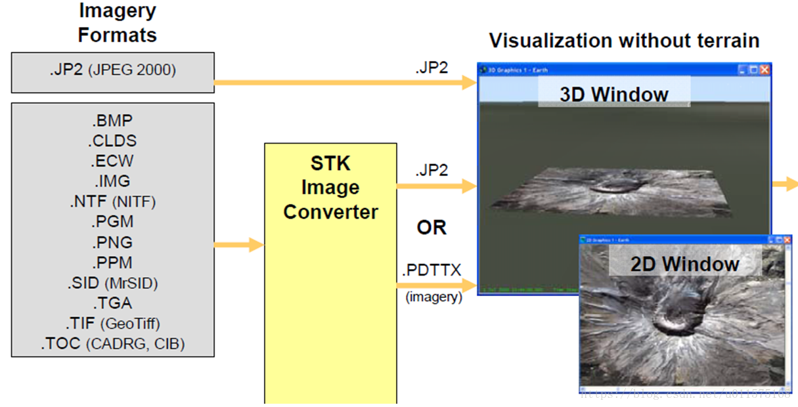
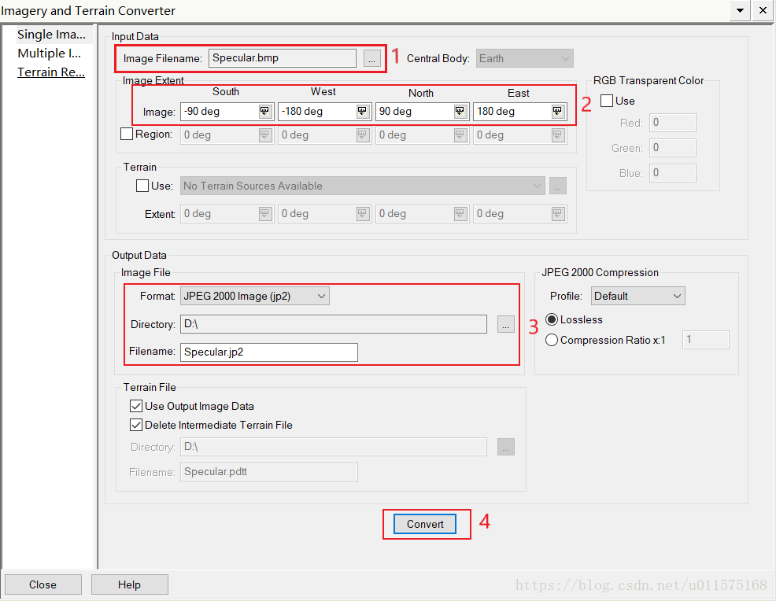

# STK加载地图与高清影像图

在STK软件中，其3D/2D窗口中地球（其它行星类似）的地图图片是通过特定格式（带经纬度信息）的图片直接加载而成。选择合适的地图图片，除了可以显示不同形式的地理坐标外，还可提升视景仿真动画的逼真效果。
本文主要阐述以下几方面内容：
1.	STK 3D/2D窗口导入地图图片的步骤；
2.	使用STK软件自带图片转换工具，将主流地图图片转换成STK图片格式

STK自带的地球地图图片位于路径：[STK安装目录]\STKData\CentralBodies\Earth\Pixmaps，主要的图片如下图：

其中加载WhiteOnBlue.bmp的效果如下：

加载GeoShere的效果如下（这个图片不在自带文件里）

#地图图片的说明
在地理信息系统中，地图表现的形式主要有两种：矢量图和栅格图，见下图所示。

简单来说，矢量图是由点、线、多边形等组成的，放大或者所有都没有分辨率损失；而栅格图是由像素组成的，例如卫星拍摄的图片，与分辨率相关。
但是在网络地图中，例如我们平时看到的百度地图或谷歌地图，为了方便网络传输和使用，其矢量图都已经转换为栅格图，所有的地图都是普通图片格式的，如png或jpg，图片本身没有经纬度信息，要靠图片的编号来识别。
因此，本文所说的地图图片就是指已经栅格化的地图图片。
此外，需要注意的是STK使用的地图图片的投影都是经纬直投的，也就是说全球的地图图片宽高像素比为2：1，即经度均匀分布，从-180°（西经）至+180°（东经），纬度也均匀分布，从-90°（北纬）到+90°（南纬）。
#STK地图图片的导入
STK导入地图图片主要有以下三种情形：
1. STK软件安装目录中，给太阳系九大行星都提供了全球的地图图片，其中地球的最多。这些图片的存放路径为：STK安装位置\STK 9\STKData\VO\Textures，图片格式为.jp2；或者通过AGI官网下载数据光盘下载（AGIDataDisc 9.2.1，约3.7G），里面包含一些高清晰度的地图图片及星空背景图（.jp2和pdttx）；
2. 将现有的图片（.bmp,.tif等格式）通过STK图像转换工具转换成.jp2或pdttx格式，然后再导入STK；
3. 通过STK插件，如Bing，ArcGis，WMS，直接在线链接地图服务器，实时加载地图图片。
本文阐述前两种内容。
##3D窗口导入
3D窗口中，地球的地图图片和地形都是通过“Globe Manager”来导入的。“Globe Manager”的打开步骤：选中3D窗口，然后点击工具栏图标即可打开，见下左图。
选中Earth，然后点击图标（或者右键Earth也可看到相应图标），即可打开地形或地图图片查找窗口，见下右图。然后通过右上角"..."按钮找到你所要加载的地图图片所在文件即可。

##2D窗口导入
选中2D窗口，右键属性 ，即可打开2D窗口的属性设置窗口，见下图。然后选中“Images”属性页面，点击“Add…”按钮打开文件浏览器查找所要加载的地图图片。

#STK地图图片转换工具
用于STK 3D和2D窗口地图图片的格式有两种：PDTTX和JP2（JPEG2000），这两种图片包含图片的地理经纬度信息。

STK提供了地图图片转换工具（Image Converter Tool），可支持将多种图片格式转换为PDTTX或JP2格式。下图是其转换流程图。

转换工具可通过菜单栏“Utilities/Image Converter…”打开。
通过“Input Data”打开需要转换格式的地图图片，并通过“Image Extent”设定地图图片四角的经纬度信息（要和地图图片显示的经纬度要一致），最后通过“Output Data”设定好转换格式和路径后，即可进行格式转换。

转换完成后，就可以将其加载入3D或2D窗口内使用。
注意，此处需要转换的地图图片必须是经纬直投的，即宽高像素比为2：1。
