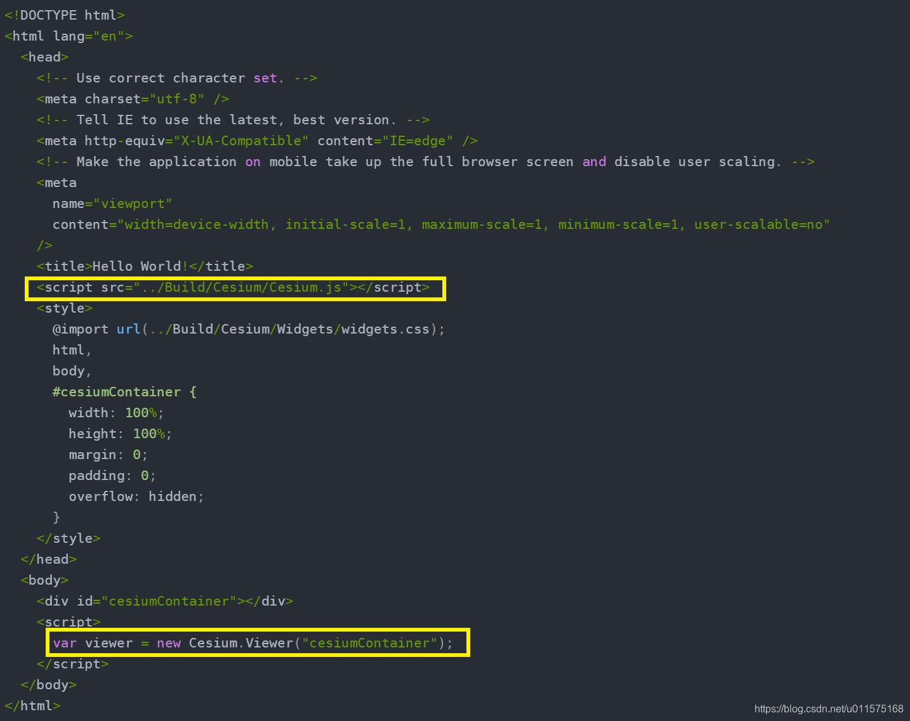
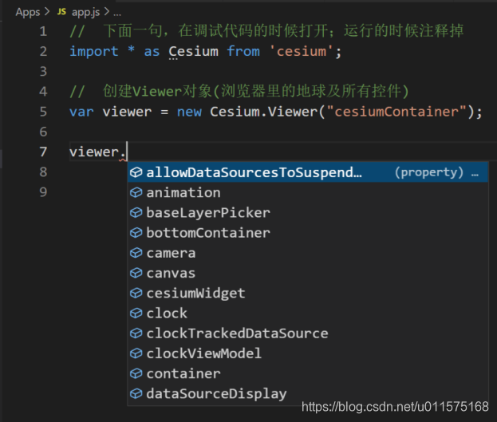
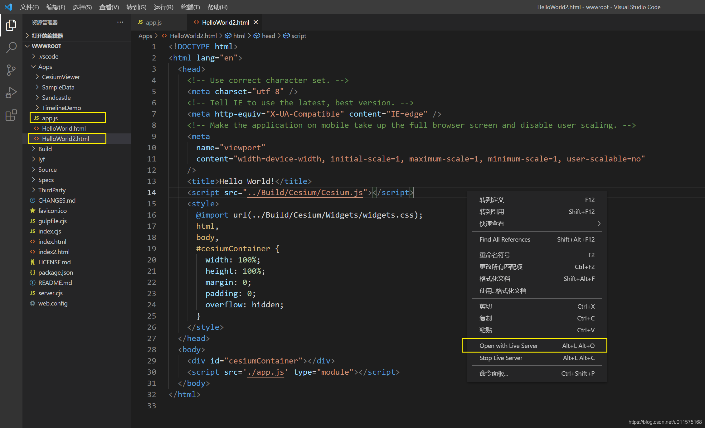

# VSCode实现Cesium的智能提示功能

之前在[“VSC调试Cesium代码及模块功能初探”](https://blog.csdn.net/u011575168/article/details/104401258)介绍了在vs code中如何调试cesium的源代码中的部分函数。目前看来，在整体引入Cesium时就无能为力了。

从1.70版本开始，CesiumJS附带了正式的TypeScript类型定义，即Cesium.d.ts文件。d.ts大名叫TypeScript Declaration File，里面存放一些声明，类似于C/C++的.h头文件。d.ts文件的一个越来越广泛的应用场景是编辑器智能提示（具体见IntelliSense based on TypeScript Declaration Files）。

本文给出如何在vs code编辑器中编辑cesium代码时使用d.ts文件，从而到达智能提示的效果。我查阅了网上很多地方，都没有直接给出完整的例子，**本文的解决方案也是不完整的，希望各位提出更改意见**（本人对js不精通）。

## 官方调用方式
在Cesium包里有个例子文件helloworld.html（Apps/HelloWorld.html），实现了最简单的Cesium示例。

从上面代码可以看出，一个典型的html文档实现cesium应用，主要干了两件事：
1. `<head>`里引用Cesium.js文件（`<script src="../Build/Cesium/Cesium.js"></script>`），这里文件引用的是min格式的，我们在调试的时候也可以引用"/Build/CesiumUnminified/Cesium.js"。
2. 在`<body>`里的js代码里，直接创建Viewer对象（代码：`var viewer = new Cesium.Viewer("cesiumContainer");`），注意，此处输入代码时是没有智能提示的，也就是说，Cesium对象里的属性、接口、函数等统统没有智能提示，智能我们自己手动输入，极大的影响了工作效率。

## Cesium的智能提示开启
在Cesium包里，我们发现有三处地方包含了Cesium.d.ts文件，分别为：
1. Build/Cesium/Cesium.d.ts
2. Build/CesiumUnminified/Cesium.d.ts
3. Source/Cesium.d.ts

我猜是最后一个起作用(通过package.json文件里看出的）。反正只要有了Cesium.d.ts文件，我们在编写js代码时就可以有智能提示的功能了。

在通常的项目工程中，cesium的代码不会直接在html文件里写，而是单独写在一个.js文件里，此处在Apps文件里创建两个文件:
1. app.js
2. HelloWorld2.html

其中,HelloWorld2.html文件由HelloWorld.html文件拷贝而来，具体代码如下：

```csharp
<!DOCTYPE html>
<html lang="en">
  <head>
    <!-- Use correct character set. -->
    <meta charset="utf-8" />
    <!-- Tell IE to use the latest, best version. -->
    <meta http-equiv="X-UA-Compatible" content="IE=edge" />
    <!-- Make the application on mobile take up the full browser screen and disable user scaling. -->
    <meta
      name="viewport"
      content="width=device-width, initial-scale=1, maximum-scale=1, minimum-scale=1, user-scalable=no"
    />
    <title>Hello World!</title>
    <script src="../Build/Cesium/Cesium.js"></script>
    <style>
      @import url(../Build/Cesium/Widgets/widgets.css);
      html,
      body,
      #cesiumContainer {
        width: 100%;
        height: 100%;
        margin: 0;
        padding: 0;
        overflow: hidden;
      }
    </style>
  </head>
  <body>
    <div id="cesiumContainer"></div>    
    <script src='./app.js'></script>
  </body>
</html>
```
相比较原文件，HelloWorld2.html文件只改动了一个地方：`<script src='./app.js'></script>`，即直接引用一个js代码文件。
注意，`<head>`里引用Cesium.js文件方式不变，仍然为（`<script src="../Build/Cesium/Cesium.js"></script>`）

而"app.js"文件里的内容如下：

```csharp
//  下面一句，在调试（编写）代码的时候打开；运行的时候注释掉
import * as Cesium from 'cesium';

//  创建Viewer对象(浏览器里的地球及所有控件)
var viewer = new Cesium.Viewer("cesiumContainer");  
```
只要有第一句:"`import * as Cesium from 'cesium';`"，那么后面的所有语句都有智能提示功能。见下图

但是在运行的时候一定要将第一句import注释掉，否则运行时浏览器加载时会报错误：`Uncaught TypeError: Failed to resolve module specifier "cesium". Relative references must start with either "/", "./", or "../"`.

将html文档里的Cesium.js的引用去掉，也同样如此，我也不知道为什么。

## 运行HelloWorld2.html
**前提：VS Code安装"Live Server"插件（自行搜索）。**
见下图，在HelloWorld.html页面上右键，选择"Open with Liver Server"即可临时启动服务器，运行网页，便出现我们熟悉的地球界面。

## 小结
由于Cesium.d.ts文件的存在，使得我们在js文件里，加上一句"`import * as Cesium from 'cesium';`"，即可引用全局对象Cesium及其里面所有属性、函数的功能。但是在发布时，必须将词句注释掉。

同时，html文档里，正常引用Cesium文件，这样在js文件里，所使用Cesium对象才可正常运行。

各位有更好的方法不吝指教！
