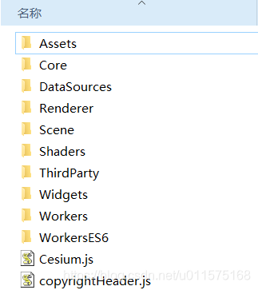
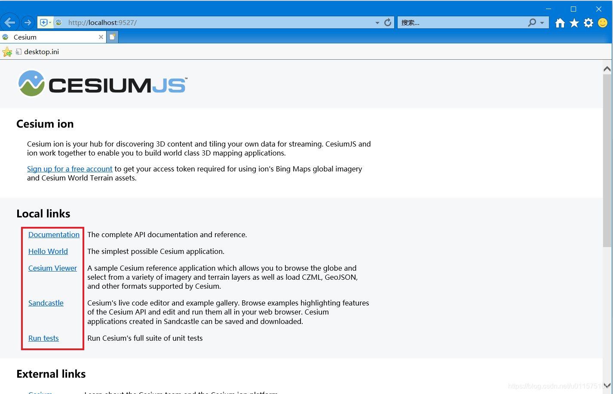
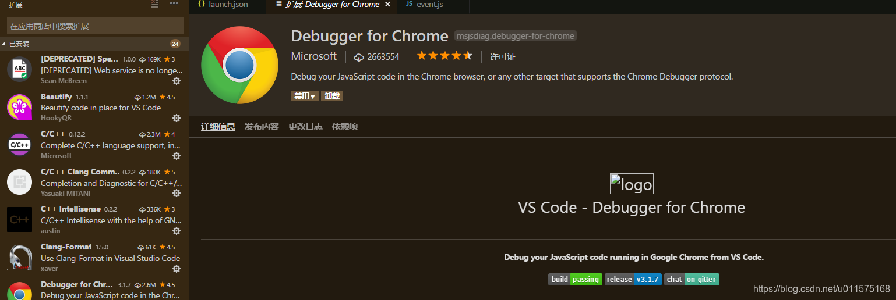
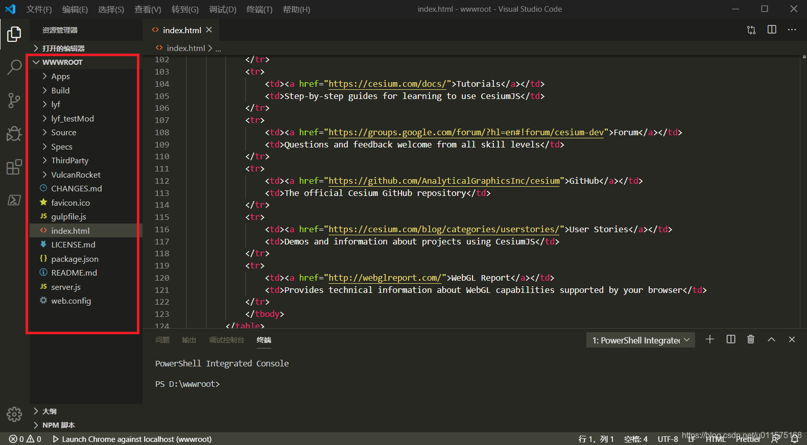
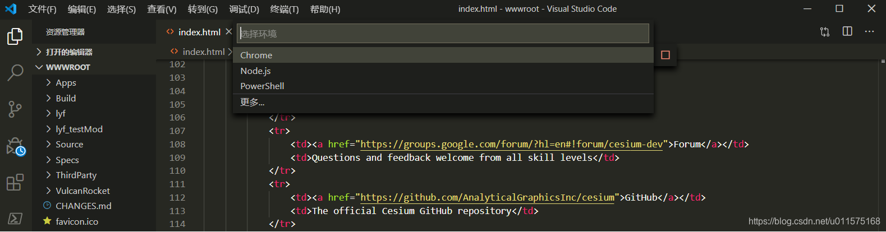
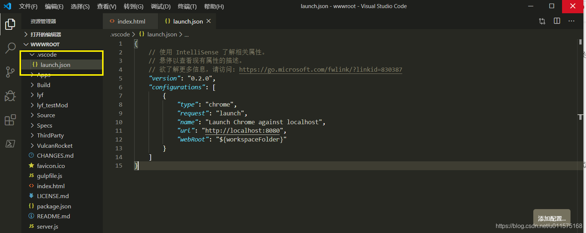
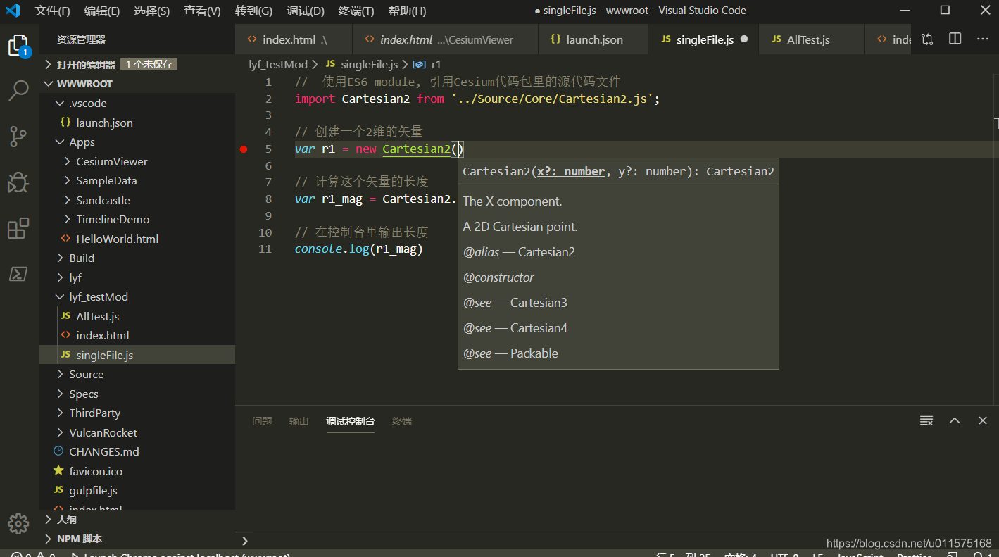
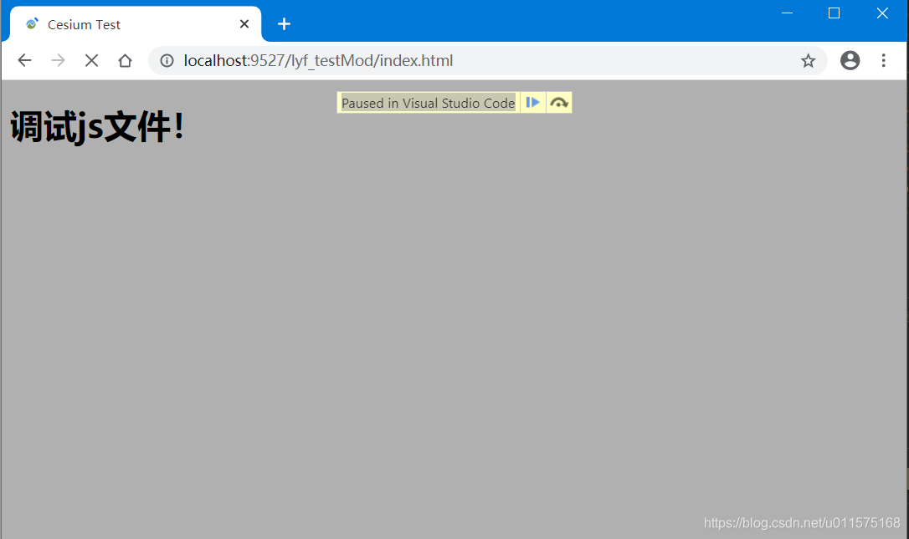
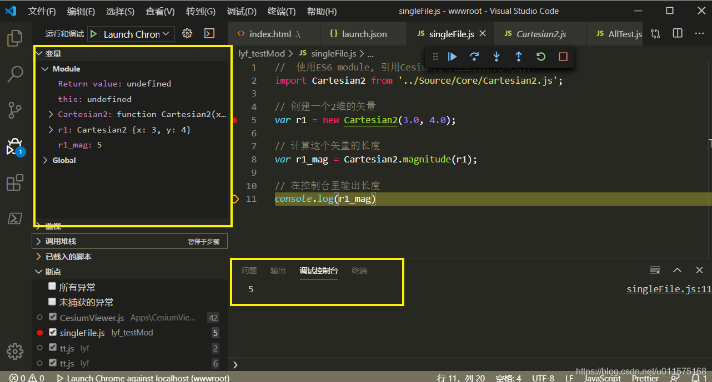

# VSC调试Cesium代码及模块功能初探

本文主要介绍：
 - 介绍Cesium的新特性-使用ES6 标准的模块，而舍弃了AMD的模块调用方式
 - 使用vsc(visual studio code)调试Cesium代码。什么？你还不知道vsc?那赶紧去学吧！

## ES6 JavaScript 模块（module）介绍
ES6之间的javascript没有原生的模块，导致编写js代码及其痛苦。当我们的代码要编写很多的时候，最理想的是按照代码的类别放在不同的文件，对于js来说就是放在不同的.js文件中。然而这么常见的问题js竟然没有原生的模块以供用户很方便的调用不同文件中的代码。

在python中，不同文件的代码(不同.py文件）可以通过"import"命令导入其他文件中的变量，而且是可以有选择的导入一部分变量。这样的模块化对代码封装起到了极大的作用。

在c#中，不同文件(.cs)的代码使用命名空间的概念。一个文件中可以通过"using 命名空间名"的方式引用其它文件中对应命名空间的类，也起到了模块化代码封装的作用。

在ES6之前，为了解决js代码模块化的问题，存在两种主流的模块化库，分别为AMD规范和CMD规范。而随着前几年ES6标准的确定，现在编写js代码可以直接使用模块了。ES6 的模块的主要功能为：
1. 每一个模块只加载一次，即每一个.js文件的加载只执行一次， 如果下次再去加载同目录下同文件，则直接从内存中读取。 一个模块就是一个文件，或者说就是一个对象；
2. 每一个模块内声明的变量都是局部变量， 不会污染全局作用域；
3. 模块内部的变量或者函数可以通过export导出；
4. 一个模块可以导入别的模块，而且可以导入任意多个。

Cesium代码前期一直使用AMD规范来实现代码的模块化，而自1.63(2019年11月）起，Ceisum将所有的js代码重构，从AMD模块规范全面迁移至ES6 Module。想了解更新的内容可参考官网的博客:[CesiumJS Migrates to ES6 Modules](https://cesium.com/blog/2019/10/31/cesiumjs-es6/)。

本文不对ES6 的模块做更深入的介绍，读者可自行学习。

下载Cesium代码包之后，其“Source”文件中存放了所有的js源代码，并分类按子文件夹存储，见下图：

每个子文件里面都是一个个.js文件，分别为一个个的功能类，从模块的角度来看，每一个.js文件都是一个模块。其中Cesium.js文件的内容如下，可以看出，它引用了所有的子文件，因此这个文件也可看作最全的模块。

```javascript
export var VERSION = '1.66';
export { default as ApproximateTerrainHeights } from './Core/ApproximateTerrainHeights.js';
export { default as ArcGISTiledElevationTerrainProvider } from './Core/ArcGISTiledElevationTerrainProvider.js';
export { default as ArcType } from './Core/ArcType.js';
export { default as AssociativeArray } from './Core/AssociativeArray.js';
export { default as AttributeCompression } from './Core/AttributeCompression.js';
export { default as AxisAlignedBoundingBox } from './Core/AxisAlignedBoundingBox.js';
export { default as BingMapsApi } from './Core/BingMapsApi.js';
export { default as BingMapsGeocoderService } from './Core/BingMapsGeocoderService.js';
export { default as BoundingRectangle } from './Core/BoundingRectangle.js';
export { default as BoundingSphere } from './Core/BoundingSphere.js';
export { default as BoxGeometry } from './Core/BoxGeometry.js';
export { default as BoxOutlineGeometry } from './Core/BoxOutlineGeometry.js';
export { default as Cartesian2 } from './Core/Cartesian2.js';
export { default as Cartesian3 } from './Core/Cartesian3.js';
export { default as Cartesian4 } from './Core/Cartesian4.js';
export { default as Cartographic } from './Core/Cartographic.js';
//...
```
## vsc调试Cesium
vsc作为微软出品的轻量级编程IDE利器，前几年出来之后，由于其小巧、快捷及功能强大等各种优点迅速占领了广大程序员的阵地。

使用Chrome浏览器调试js代码也非常方便，但是vsc调试js代码有以下几个方面的好处：
1. 借助于vsc的只能提示功能，在vsc中写js代码实在是太爽了；
2. 写好js代码，直接在vsc中需要的地方打断点，调试时在vsc内部一步步运行又方便，也可以很方便的看到所有变量的数值；

下面分步骤介绍。
#### 准备工作：本地服务器的安装
调试Cesium官方例子，或者自己编写相应的功能网页，最好使用本地服务器。本地服务器的配置有多种方式：IIS(微软windows系统自带)、Tomcat、Python、NodeJS。

**配置完成后，假设Cesium的文件夹为"D:\wwwroot"。也即是本地网站的根目录所在。**

IIS方式请参考：[使用IIS创建Cesium本地服务器](https://blog.csdn.net/u011575168/article/details/104384305)，Windows系统的推荐使用这种方式，简单！！

后面几种方式的创建请参考之前的博文：[使用Tomcat架设Cesium本地服务器(含Nodejs,Python方法)](https://blog.csdn.net/u011575168/article/details/80031663)

创建成功之后的标志为，打开Chrome浏览器，在地址栏里"localhost:9527"（这里的端口号9527是在创建IIS网站的时候配置的，可以任意设置端口号），出现以下界面就表示成功，**这个页面就是Cesium代码包里的"Index.html"文件（D:\wwwroot\Index.html）**。

#### VSC配置 Debugger for Chrome插件
Debugger for Chrome这个插件是可以直接在vsc里面调试js文件，跟谷歌Chrome浏览器的控制台是一样的功能，下载了它就不用打开浏览器的控制台就能进行打断点。

打开vsc后，首先在左侧扩展中搜索Debugger for Chrome并点击安装：

依次点击vsc左上角“文件”-“打开文件夹”，然后选择"D:\wwwroot"，即可打开Cesium代码包的文件夹。双击"index.html"即可打开主页的html文档。下图中，左侧为资源管理器，可以看到wwwroot文件夹下所有的东西。**注意，我自己需要测试的东西全部放在文件夹"lyf"、"lyf_testMod"两个文件夹下，这样我们自己的测试文档就与Cesium代码包的文档区分开来。**

按“F5”,vsc默认你要运行调试"index.html"文件，由于vsc运行任何类型的文件都需要有相应的配置文件，而此时我们的左侧的文件夹里还没有相应的配置文件，因此会让我们选择合适的环境。

这里我们选择"Chrome"，因为是让Chrome打开html文件。之后在文件夹中会自动创建".vscode"文件夹，以及"launch.json"配置文件，见下图。

launch.json配置文件是json格式的，它是vsc运行依据，目前只有一个配置，下面介绍主要配置参数的意思：
 - version : 你定义这个配置文件的版本，生成的时候默认是0.2.0
 - configuration：配置域，内部包含多个配置，使用"{}"进行区分，上图中仅有一个配置；
 - name：配置文件的名字，自己随便起；
 - type：调试的类型，此处我们要打开chrome,调试js，所以是"chrome"。这个类型与插件的类型相关。例如，如果我们下载的是python插件，要调试python文件(.py)，那么此处就应该是"python"了。
 - request : 配置文件的请求类型，有launch和attach两种。launch是需要服务器的需要配置url，这里就是我们需要的。
 - url:这个是chrome插件带的，指定访问的链接。也就是说我们想要在chrome浏览器中打开的html文件。
 - webRoot：也是chrome插件带的，指定根目录或者执行文件。"${workspaceRoot}"就是你打开vscode读取的项目目录，也就是"D:\wwwroot"。
 
这里需要进一步解释的就是"url"参数了。
例如想要调试"d:\wwwroot\index.html"文件，那么此处就要填写"http://localhost:9527\index.html"。
而如果要调试我自己文件夹下的文件"d:\wwwroot\lyf_testMod\index.html"，那么url参数就应该填写写"http://localhost:9527\lyf_testMod\index.html"。

说到现在，相比大家明白这种调试的缺点了，也就是说你想调试哪个html文件，那么必须手动在lauch.json文件里修改"url"的地址了，这也是比较麻烦的事情。因此，上图中，vsc默认给我们的配置是错误的，运行后chrome浏览器根本打不开，因为之前我们配置的本地网站的端口号是“9527”!
下面以调试"d:\wwwroot\lyf_testMod\index.html"文件为例（我自己编写的测试文档），launch.json文件中的配置文件如下：
```javascript
{
    // 使用 IntelliSense 了解相关属性。 
    // 悬停以查看现有属性的描述。
    // 欲了解更多信息，请访问: https://go.microsoft.com/fwlink/?linkid=830387
    "version": "0.2.0",
    "configurations": [
        {
            "type": "chrome",
            "request": "launch",
            "name": "Launch Chrome against localhost",
            "url": "http://localhost:9527/lyf_testMod/index.html",
            "webRoot": "${workspaceFolder}"
        }
    ]
}
```
可以看到，我们修改了url地址，使它指向了我所有调试的html文档。
#### 编辑和测试Cesium相关代码
前面配置好了chrome调试的插件，那么现在可以在vsc里调试js代码了，主要是调试cesium代码包里的源代码，并且展示最新ES6模块的功能。

我所有调试的文档放在文件夹下"lyf_testMod"下。目前有如下几个文档：

 - index.html。 由于js代码都是嵌入到网页中的（即html文件），所以我们需要一个载体。
 - singleFile.js。目前要测试的js代码，被"index.html"引用。
 - AllTest.js。同"singleFile.js"，测试的另一个文档。
 
 index.html文档为最简单的html网页，内容如下：
 ```javascript
<!DOCTYPE html>
<html lang="en">
<head>
    <!-- Use correct character set. -->
    <meta charset="utf-8">
    <title>Cesium Test</title>
</head>
<body>
    <h1>调试js文件！</h1>
    <script src="singleFile.js" type="module"></script>
</body>
</html>
```
这个html文档是最简单的，body里仅有一个标题(h1)和js代码。此处我们要调试的js代码就放在"singleFile.js"中，因此要在index.html中使用```"<script src="singleFile.js" type="module"></script>"```引用它。同时，由于我们的代码中使用了ES6的模块功能，所以在引用"singleFile.js"文件时，要设置type="module"。

下面看看"singleFile.js"文件，这个文件中主要是使用Cesium中的二维向量对象。首先创建一个二维矢量，再计算这个矢量的长度，最后再控制台输出长度的数值。
```javascript
//  使用ES6 module, 引用Cesium代码包里的源代码文件
import Cartesian2 from '../Source/Core/Cartesian2.js';

// 创建一个2维的矢量
var r1 = new Cartesian2(3.0, 4.0); 

// 计算这个矢量的长度
var r1_mag = Cartesian2.magnitude(r1); 

// 在控制台里输出长度
console.log(r1_mag)
```
我们在vsc中编写js代码时，可以利用智能提示功能，见下图。由于我们使用了"import"引用了Cesium源代码文件"Cartesian2.js"中的对象，因此，我们在使用这个对象时，当键入"new  Cartesian2()"时，vsc编译器就会自动弹出相关的智能提示，给出形参的说明。这一点对于我们编写代码调用Cesium的相关类时帮助非常大，而不用每一步都去手动查Cesium相关类的说明。

这个就是使用ES6模块带来的好处，引用另外一个模块（文件）的对象是在是太简单了。

此外，在调试过程中，也非常方便。

我们在vsc中按F5调试时，vsc自动打开chrome,并在地址栏中输入"http://localhost:9527/lyf_testMod/index.html"，当调用其中的"singleFile.js"时，则会自动跳转到vsc中的"singleFile.js"文件中。如果其中设置了断点，则会自动在断点处暂停。
下图是启动后，chome浏览器自动打开的情形，显示了标题"调试js文件"，并处于debug状态，只不过不是停留在chrome中的debug，而是停留在vsc中的debug中状态。

此时，由于我们在js文件中设置了断点，因此停留在"singleFile.js"中，按F10可一步一步的单步调试，见下图。

上图中可以看出，在vsc调试js代码时，左侧变量栏中实时显示各变量的数值，下部调试控制台显示输出的内容。
#### 两种引用Cesium文件的方式
最后说一说两种引用Cesium文件的方式。
上面的例子中，我们仅仅import了Cartesian2模块，如果还需要其他的模块，那么就要写多行import代码。那么有没有一种简单的方式呢？答案是肯定的。

在文章中开头，我们说过，“Source”文件中的"Cesium.js"文件里把所有的Cesium模块都引用了，所以我们需要啥模块，直接从"Cesium.js"文件中import就行了。
具体代码的写法放在"AllTest.js"文件中，内容如下：

```javascript
// AllTest.js文件
import {
    Cartesian2,
    Cartesian3,
    createWorldTerrain,
    defined,
    formatError,
    Math as CesiumMath,
    objectToQuery,
    queryToObject,
    CzmlDataSource,
    GeoJsonDataSource,
    KmlDataSource,
    TileMapServiceImageryProvider,
    Viewer,
    viewerCesiumInspectorMixin,
    viewerDragDropMixin
} from '../Source/Cesium.js';

// 创建一个2维的矢量
var r1 = new Cartesian2(3.0, 4.0); 

// 计算这个矢量的长度
var r1_mag = Cartesian2.magnitude(r1); 

// 在控制台里输出长度
console.log(r1_mag)
```
从上面代码中，我们可以看到，仅仅引用了一个文件(../Souce/Cesium.js)，我们使用import引入了多个模块:Cartesian2/Cartesian3/createWorldTerrain....。
注意，要在index.html文件中，将```"<script src="singleFile.js" type="module"></script>"```改为```"<script src="AllTest.js" type="module"></script>"```

好了，希望以上的内容对初学者调试Cesium代码有所帮助！

