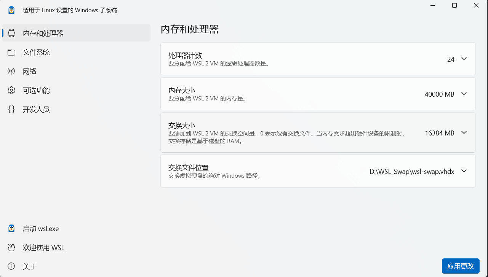
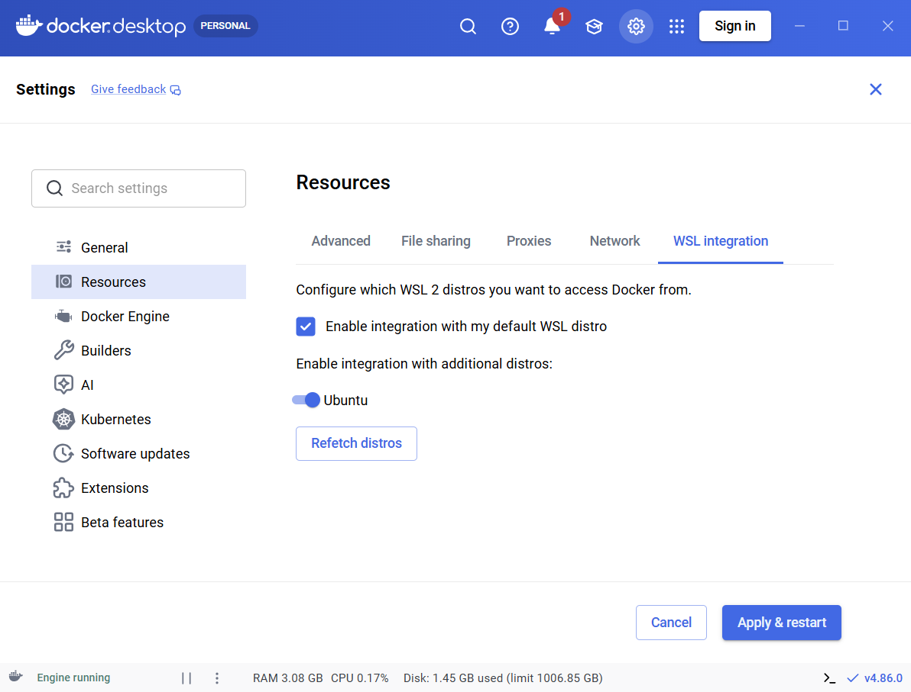
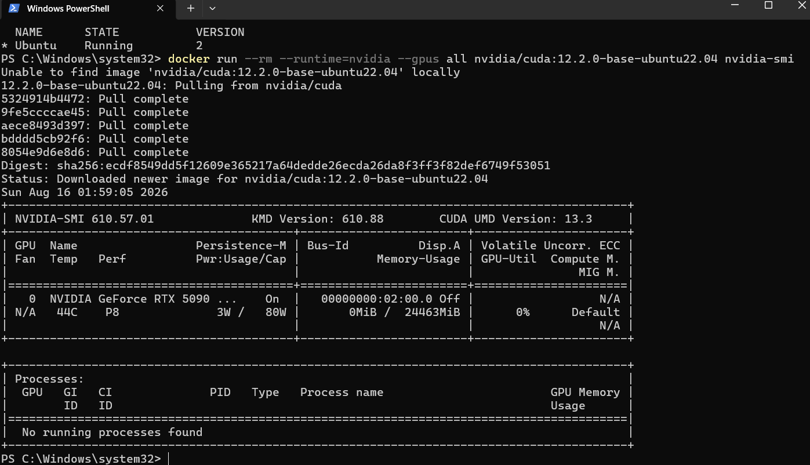
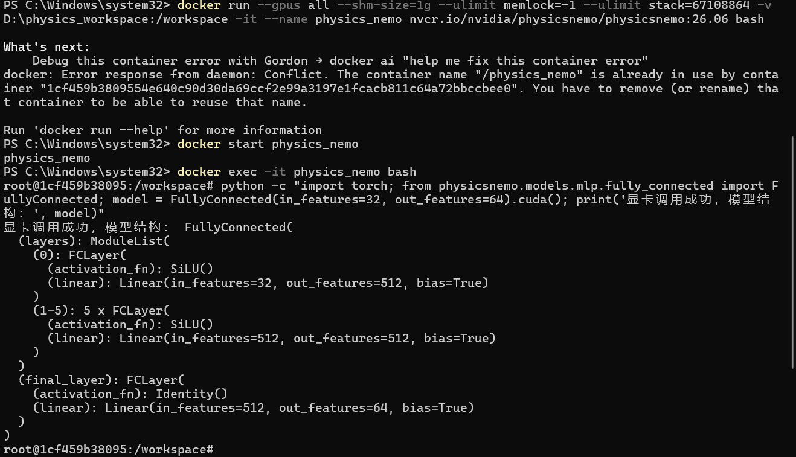

# Windows WSL2 + Docker 环境下NVIDIA PhysicsNeMo 安装指南

本指南专为拥有 NVIDIA 独立显卡（如 GeForce RTX 系列、Quadro 系列或 Tesla 系列）的 Windows 用户设计。如果你是一名物理模拟、计算科学或 AI for Science 领域的研究者、工程师或学生，希望在 Windows 系统上高效利用 GPU 加速能力来运行和开发基于 NVIDIA PhysicsNeMo 的科学机器学习（SciML）应用，那么这份教程正是为你准备的。

PhysicsNeMo 是 NVIDIA 推出的一个开源框架，它将物理建模与神经网络深度融合，能够高效求解偏微分方程、进行流体仿真、材料模拟等复杂物理任务。然而，其官方环境通常基于 Linux 和 Docker，对于习惯 Windows 的开发者来说，直接部署存在一定门槛。

因此，本指南将带你从零开始，在 Windows 11/10 上，通过 WSL2（Windows Subsystem for Linux 2）和 Docker 技术，搭建一个完整、稳定且支持 GPU 加速的 PhysicsNeMo 开发环境。整个过程无需安装双系统或虚拟机，你将在熟悉的 Windows 界面下，获得接近原生 Linux 的性能体验，并能够直接调用 NVIDIA 显卡进行大规模科学计算。

我们将依次完成以下核心步骤：
1.  **安装与配置 WSL2**：在 Windows 中无缝集成 Linux 子系统。
2.  **优化 WSL2 资源**：合理分配 CPU 和内存，确保计算任务稳定运行。
3.  **安装 Docker Desktop** 并配置与 WSL2 的集成及存储路径。
4.  **更新 NVIDIA 显卡驱动**并验证 Docker 内的 GPU 调用能力。
5.  **拉取并运行 PhysicsNeMo 官方 Docker 镜像**，创建持久化工作容器。
6.  **验证环境**并获取官方示例代码库，开启你的第一个 SciML 项目。

无论你是刚接触科学机器学习，还是已有相关经验但希望在 Windows 平台快速搭建实验环境，跟随本指南，你都能在约一小时内完成全部配置，并立即开始 PhysicsNeMo 的探索与实践。
## 前置硬件与系统要求
- 操作系统：Windows 11（推荐）或 Windows 10
- 显卡驱动：NVIDIA 显卡驱动版本需在 610.43 或更高。
- 存储空间：建议 D 盘或非 C 盘预留 100 GB 以上的可用空间（镜像解压后较大）。
---
## 第一步：安装与升级 WSL2

### 1. 开启 WSL 功能

以管理员身份打开 Windows PowerShell，输入以下命令安装默认的 Linux 子系统：

```powershell
wsl --install
```

> 注：安装完成后，请根据提示重启电脑。

### 2. 安装 Linux 操作系统

接着在 PowerShell 中，输入以下命令从微软商店下载并安装官方最推荐的 Ubuntu 系统：

```powershell
wsl --install --distribution Ubuntu
```

> 注意：安装完成后，会提示创建一个用户名和密码，最好设置一下。

完成后在 PowerShell 中运行以下代码，看到类似以下输出，就说明彻底大功告成了：

```powershell
PS C:\Windows\system32> wsl -l -v
  NAME     STATE      VERSION
* Ubuntu   Running    2
```

### 3. 常见报错修复：缺少 msi 安装包

如果在配置或更新时弹出类似 “The feature you are trying to use is on a network resource that is unavailable” 的错误，说明系统缓存的安装包丢失。

解决方法：前往微软官方 GitHub 仓库（microsoft/WSL）手动下载对应版本的 `wsl.x.x.x.x64.msi` 安装包，双击运行即可覆盖修复。

---

## 第二步：通过图形界面配置 WSL2 资源限制

为了防止 Linux 容器在进行高强度物理计算时吃光 Windows 资源导致卡死，必须合理分配 CPU 和内存。

### 1. 打开 WSL 设置 UI

在 Windows 开始菜单搜索框输入 “WSL 设置”（或 WSL Settings）并打开；或者在 Windows 运行窗口（Win + R）中输入：

```powershell
wsl --settings
```

### 2. 硬件资源推荐配置

在弹出的图形界面中进行如下调整：

- 处理器计数（Processors）：修改为物理 CPU 总核心数的一半左右（例如：总核心 20，填写 10 或 12）。
- 内存大小（Memory）：根据笔记本总内存填写：
  - 若总内存为 32GB，填写 24GB。
  - 若总内存为 64GB，填写 32GB。
- 注意：数值后必须带大写单位 GB。
- 交换大小（Swap）：填写 16GB（作为备用虚拟内存，防止显存/内存溢出闪退）。
- 交换文件位置：若 C 盘空间紧张，点击“浏览交换文件”，将其指定到 D 盘的自定义文件夹中（如 `wsl-swap.vhdx`）。注意，`wsl-swp.vhdx` 为手动创建的，使用一个空白 txt 文件即可，后缀名为 `vhdx`。
- 网络模式：Mirrored。这样的话不使用传统的虚拟网卡，而是直接把 Windows 主机的网络栈“镜像”给 WSL。使得 WSL 和 Windows 共享完全相同的 IP 地址。若 Windows 系统开启了网络代理（如科学上网工具），WSL 里面不需要任何配置，直接就能开箱即用。


### 3. 应用并重启服务

点击界面右下角的 “保存/应用”。随后在 PowerShell 中运行以下命令使配置彻底生效：

```powershell
wsl --shutdown
```

---

## 第三步：Docker Desktop 安装与 D 盘存储配置

### 1. 下载与安装

前往 Docker 官网下载 Windows 版 Docker Desktop 并安装。

### 2. 联动 WSL2

打开 Docker Desktop，点击右上角 ⚙️（设置齿轮），完成以下配置：

- 进入 General，确保勾选了 “Use the WSL 2 based engine”
- 进入 Resources -> WSL integration，勾选 “Enable integration with my default WSL distro”
- 在下方列表中，将你的 Linux 发行版（如 Ubuntu）右侧的开关调至打开（蓝色）状态
- 进入 Resources -> Advanced，点击 “Browse” 按钮将 Disk image location 位置设置为非 C 盘，这样可以避免后续大镜像（几十 G 量级）占用 C 盘空间（例如，在 D 盘新建文件夹 DockerData）。本步骤为可选项。
- 点击 Apply & restart。


---
## 第四步：驱动更新与 GPU 通道验证

### 1. 升级显卡驱动（核心步骤）

PhysicsNeMo 26.06 镜像强制要求最新驱动。请前往 NVIDIA 驱动官网，下载对应显卡（如 RTX 4060 Laptop）的最新 Game Ready 或 Studio 驱动，安装时勾选“执行清洁安装”，完成后重启电脑。

### 2. 验证 Docker 内的 GPU 加速

打开 Windows PowerShell，运行以下命令测试 Docker 能否正确调用显卡：

```powershell
docker run --rm --runtime=nvidia --gpus all nvidia/cuda:12.2.0-base-ubuntu22.04 nvidia-smi
```

成功标志：终端正确打印出类似下面的 NVIDIA-SMI 显卡信息表格，并正确识别出你的显卡型号（如 RTX 5090）。

---
## 第五步：拉取与运行 PhysicsNeMo 镜像
### 1. 拉取官方镜像

在 PowerShell 中运行以下命令（由于镜像高达 40GB 以上，建议在稳定的网络代理环境下下载）：

```powershell
docker pull nvcr.io/nvidia/physicsnemo/physicsnemo:26.06
```

### 2. 创建并运行持久化容器（挂载 D 盘）

在 D 盘根目录下手动创建一个名为 `physics_workspace` 的文件夹。然后在 PowerShell 中一键执行以下整行命令：

```powershell
docker run --gpus all --shm-size=1g --ulimit memlock=-1 --ulimit stack=67108864 -v D:\physics_workspace:/workspace -it --name physics_nemo nvcr.io/nvidia/physicsnemo/physicsnemo:26.06 bash
```

参数解析：

- `-v D:\physics_workspace:/workspace`：将本地 D 盘文件夹实时映射到容器内。你在 D 盘写的代码会同步出现在容器里，且退出容器代码不会丢失。
- `--name physics_nemo`：为容器命名。去掉了官方命令中的 `--rm`，防止退出时容器被自动销毁。

后面可使用powershell进入：

1. 启动已经存在的旧容器：`docker start physics_nemo`
2. 进入该容器的命令行内部：`docker exec -it physics_nemo bash`

---
## 第六步：环境终极验证与获取官方案例

当命令行前缀变为 `root@xxxxxx:/workspace#` 时，说明你已成功进入容器内部。

### 1. 运行 Python 代码验证 GPU 加速

在容器终端内直接执行以下 Python 命令：

```bash
python -c "import torch; from physicsnemo.models.mlp.fully_connected import FullyConnected; model = FullyConnected(in_features=32, out_features=64).cuda(); print('显卡调用成功，模型结构：', model)"
```

成功标志：屏幕输出 “显卡调用成功” 以及网络的 Layer 结构。



### 2. 下载全套 PhysicsNeMo 官方示例

在容器终端内，利用挂载好的工作目录直接克隆官方 GitHub 仓库 [NVD]：

```bash
git clone https://github.com/NVIDIA/physicsnemo.git
```

克隆完成后，你可以直接回到 Windows 系统，在 `examples` 路径下用你习惯的编辑器（如 VS Code）查看、修改并运行所有的官方物理 AI 案例 [NVD]！

---

## 💡日常进出环境小贴士

- 如何退出环境：在容器终端输入 `exit` 回车即可安全退出，数据和配置均会保留。
- 下次如何再次进入：重新打开电脑后，无需再运行长串的 `docker run`，只需在 PowerShell 中运行以下命令即可秒回战场：

```powershell
docker start -i physics_nemo
```
