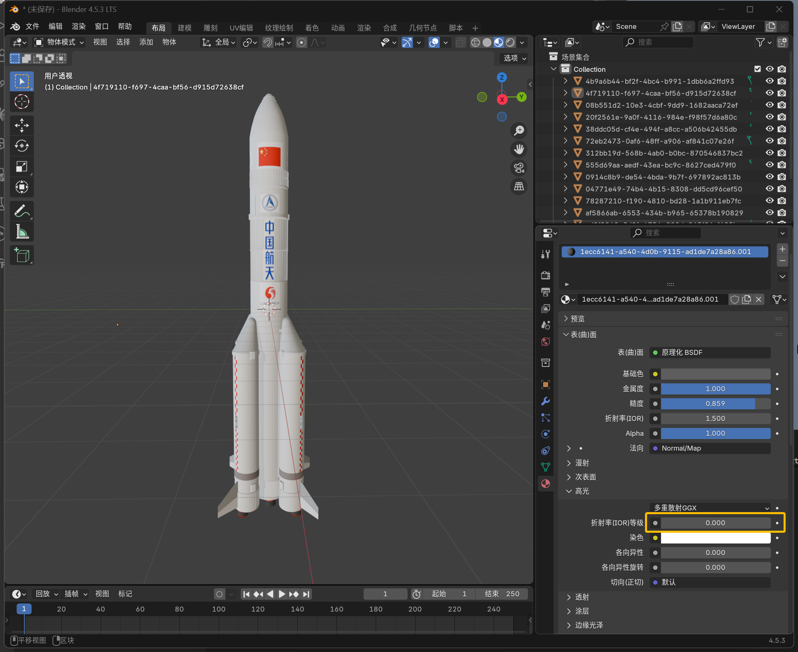
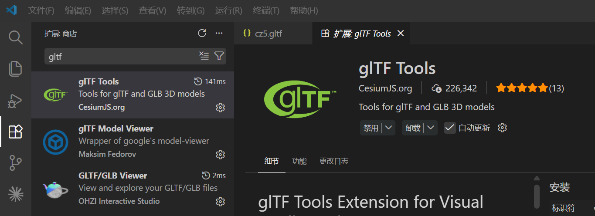
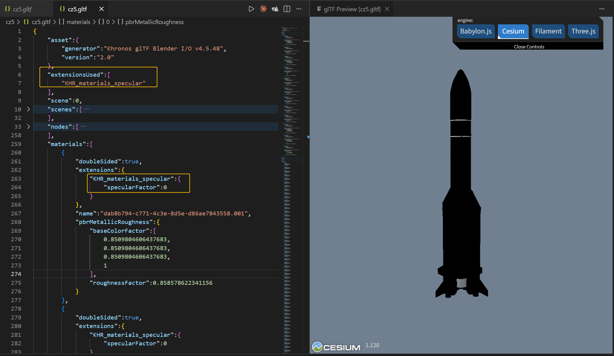
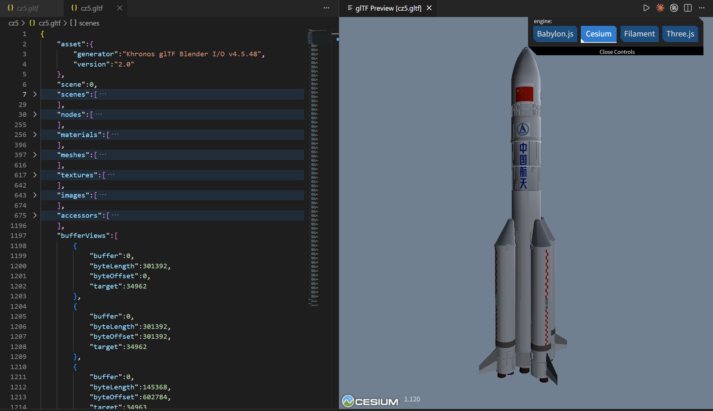

# glb模型在Cesium中发黑的机理分析

最近在将一款火箭模型(fbx模式）转换为glb(gltf)格式后，在Cesium中加载结果模型看起来全黑，经过分析发现是由于高光的折射率等级(IOR level)默认设置错误(设置为0)导致的，将其设置为0.5即可在Cesium中表现正常。
# 现象
现有一个fbx格式的模型，使用blender 4.5导入，模型**显示正常**。不过需要注意的是，模型的大部分都采用BSDF材质，其基础设置为：
- 基础色：灰白色
- 金属度：1
- 糙度：0.86
- 折射率(IOR): 1.5
- 高光/折射率等级（IOR level): 0.0

随后使用blender默认的“导出”-“gltf 2.0"，导出的gltf文件在visual studio code中打开，借助gltf Tools插件，可在vsc的扩展商店里安装。

vsc中，选中导出的gltf文件，然后可以预览3D模型，gltf Tools插件提供四种3D框架：Babylon.js,Cesium,Filament,Three.js。

其它三种都可以正常显示，唯独Cesium显示基本是黑色的（没有反光），且在gltf文件里包含扩展: KHR_materials_specular，且在材质里，其扩展的specularFactor都为0，见下图。

经查询和测试，在Blender中，将材质的  - **高光/折射率等级（IOR level): 设置为0.5** 即可。此时导出的gltf中不再有 KHR_materials_specular扩展，Cesium中显示也正常了！（见下图）

------------------------------
# 机理分析
这是一个非常典型的 PBR（物理渲染）工作流兼容性问题。
## 1. 为什么高光的 IOR Level = 0 会导致 Cesium 变黑？

* 数学逻辑： 在 Blender 4.0+ 中，IOR Level 是对物理反射率的缩放。设为 0 意味着该物体完全不反射光线（反射率 $F0 = 0$）。
* glTF 扩展： 导出时，Blender 为了保留这个“不反光”的特性，必须使用 KHR_materials_specular 扩展并将 specularFactor 设为 0。
* 渲染器差异：
  * Cesium： 严格遵循物理公式。如果反射系数为 0，且没有环境光补偿（Cesium的背景环境为黑色宇宙星空），物体表面无法产生任何高光和环境反射，导致视觉上呈现死黑（尤其是边缘处）。
  * Three.js / Babylon.js： 它们通常有更激进的环境光补偿 (Ambient Light) 或默认的漫反射增强。即使高光反射率为 0，它们也会用环境光强行把物体“照亮”，让你看到 Base Color。
## 2. 为什么 IOR Level = 0.5 就正常了？
* 回归标准： 在 glTF 标准中，非金属的默认反射率被固定在 4%（对应 IOR = 1.5）。
* 消除扩展： 当你在 Blender 中设置 IOR Level = 0.5 时，正好符合 glTF 的默认标准值。导出器认为不需要额外修正，因此不再写入 KHR_materials_specular 扩展。
* 兼容性飞跃： 此时 Cesium 使用最基础的 Metallic-Roughness 逻辑进行渲染。即使没有环境贴图，基础的光照计算也能正常运作，不会出现因参数极端导致的黑块。

------------------------------
# Blender 材质设置的标准“黄金法则”
为了确保模型在 Cesium、Three.js 等所有引擎中表现一致，建议在 Blender 中遵循以下设置：
## 1. 材质节点 (Principled BSDF) 设置

* IOR (折射率)： 始终保持在 1.45 ~ 1.50 之间（这是绝大多数现实物质的物理值）。
* IOR Level (高光级别)： 始终保持为 0.5。
* 注：如果你觉得反光太强，调高 Roughness（粗糙度），而不是调低 IOR Level。
* Metallic (金属度)：
   * 涂漆/塑料/木头： 必须设为 0。
   * 裸露金属： 设为 1。
* Base Color (基础色)： 不要使用纯黑或纯白。建议使用 V = 0.1~0.8 之间的灰色/彩色。

------------------------------

# Cesium 端的配套优化
即便模型导出正确，Cesium 默认的光照依然偏弱。建议在代码中加入：

. 开启 HDR： viewer.scene.highDynamicRange = true; 让色彩更丰富，防止背光面死黑。

------------------------------
# 总结建议
在 Blender 中，请将 IOR 保持 1.45，IOR Level 保持 0.5。

如果想要物体看起来“不那么亮”，请通过 增加 Roughness（粗糙度） 或 调暗 Base Color（基础色） 来实现，而不是通过把 IOR 归零。这样导出的 GLB 文件结构最简洁，在 Cesium 中的兼容性也最好。

