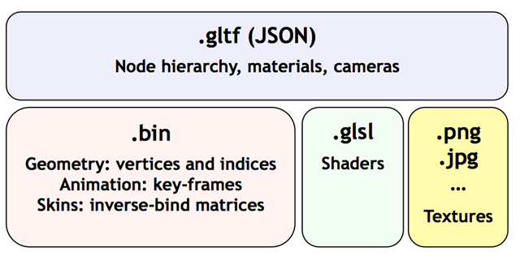
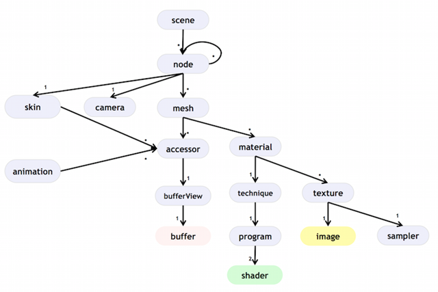
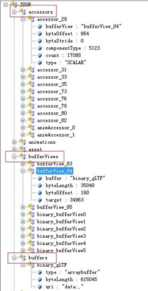
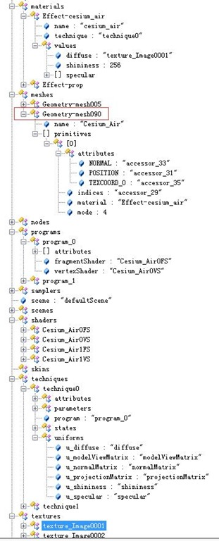
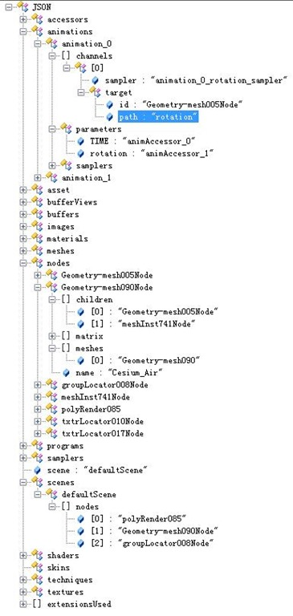

# zz: Cesium原理篇：glTF

关键字：Cesium glTF WebGL技术

大纲：

1 glTF简介，这是一个什么东西，有哪些特点

2 Cesium如何加载，渲染glTF，逻辑结构和关键技术

3 个人总结，从glTF学习如何设计一个二进制格式，个人想法分享

共计 4000字 | 建议阅读时间 未知

_**1 **_glTF简介

之前介绍了Cesium的Property，Material，Batch，GroundPrimitive这些内容，可以说是简单地物和风格的解决思路。当Cesium把这些技术点整合起来，我们便具备了渲染模型的威力。也就是今天要讲的glTF模型渲染。

glTF的全称是GL传输格式，是一种针对GL(WebGL，OpenGL ES以及OpenGL)接口的运行时资产(asset)。在3D内容的传输和加载中，glTF通过提供一种高效，易扩展，可协作的格式，填补了3D建模工具和现代GL应用之间的空白。github上有对该数据规范的详细介绍，春节期间我翻译了其中的核心部分，有兴趣的可以了解。

三维模型的格式这么多，为什么不用现成了，而是非要自己重新定义一个规范，原文中Patrick很诚实详尽的做了解释。简单说，目前主流的三维模型主要的特点在于数据制作上，在Web传输和解析上无法满足需求，而glTF的特点就是传输和解析的高效。首先，二进制的传输方式最为高效，也就是ArrayBuffer形式，但二进制的解析则很繁琐，也很容易出错。如何提高解析效率呢，就如同云盘的秒传功能，不解析，或减少解析是最有效的解析方式， 要做到这一点，则要求显卡，WebGL能够直接加载该数据结构。

上图是glTF的一个大概结构，分为四大块，最上面的json是一个表述，描述该模型的节点层级，材质，相机，动画等相关逻辑结构，bin则对应这些对象的具体数据信息，glsl是对该模型渲染的着色器，针对该模型的数据信息，给出渲染“配方”，当然还有纹理内容。大块内容可以以Base64的编码内迁到文件中，方便拷贝和加载，也可以以URI的外链方式，侧重重用性。

下图是json中包含的描述信息，内容详细，比如mesh，纹理，蒙皮和动画，定义了accessor的访问器规则，同时还给出了相机，节点这些场景管理的信息。充分体现了glTF规范设计的强大，让我想到了一句话：“解决问题固然重要，但通过设计避免问题则更胜一筹”。可以说，该规范是对复杂三维模型的一个很不错的抽象，考虑的很充分，之间的接口定义也很规范，如果你也想设计一个二进制数据规范的话，这是一个很好的学习，借鉴范本。

_**2 **_glTF渲染

东西再好，光说不练假把式。设计好了，只是一个开始而不是完结，还需要持续的推广和应用。这年头酒香也怕巷子深，伯牙难觅钟子期的画面有没有。下面我们来看看glTF是如何渲染模型的，talk is cheap and show me the code~

**▽** 加载&渲染
    
    
    var entity = viewer.entities.add({
        name : url,
        position : position,
        orientation : orientation,
        model : {
            uri : url,
            minimumPixelSize : 128,
            maximumScale : 20000
        }
    });
    
    var model = scene.primitives.add(Cesium.Model.fromGltf({
        url : './duck/duck.gltf'
    }));
    
    // 内部通过该方法来解析JSON对象，获取表述信息和具体的数据内容
    function parseBinaryGltfHeader(uint8Array) {
        var json = getStringFromTypedArray(uint8Array, sceneOffset, sceneLength);
        return {
            glTF: JSON.parse(json),
            binaryOffset: binOffset
        };    
    }

如上是加载glTF的过程，也是提供两种方式，一种是以Entity的方式，一种是以Primitive的方式，消费数码相机（前者）和单反相机（后者）的差别。同时，Cesium对Model的渲染也是基于状态的更新的，这个和地球，Entity的渲染思路是一致的。Model有三个状态，加载(NEEDS_LOAD)，解析(LOADING)，和结束(LOADED)。在不同状态下做该做的事，各司其职，互不干涉。

下面我们详细介绍这个过程中三个重要的部分。 

**▽** BufferView&Accessor

如图，红框部分，从下往上看。Buffer缓存是一个二进制的数据块，是几何对象，动画和蒙皮等数据信息的组合，在json中申明了这个数据块的类型arraybuffer和长度。BufferView，缓存视图，是Buffer的子集，如果Buffer是一本书的内容，那么BufferView就是一个目录，将这本书划分成章节，并表示该章节的起始页和长度。缓存和缓存视图并不包含类型信息。他们只是简单定义从文件中取出的原始数据，并不知道这些数据到底有什么涵义和结构。glTF文件中的对象（网格，蒙皮，动画）都不会直接访问缓存或缓存视图，而是通过Accessor访问器，这样我们拿到这块数据后，知道这块数据是vec4，float还是其他类型。 

**▽** Mesh

如上，有了访问的规范，我们还得知道一个几何对象的逻辑结构，就好比拼图游戏，我们能拿到一块块拼图，心中还要有一个轮廓，能把这些拼图拼成一个完整的图像。下面我们来看看Mesh这张图是有哪些部分构成的，一切的一切还是从上方图的红框开始。

该Mesh可以有多个Primitive组成，每个图元有attribute顶点数据，indices顶点索引，mode类型为triangles，还有material材质，这些内容我们已经在之前的章节介绍过，不知道你还给我多少。我们再看material对象，里面用到了technique，其他的都是具体的光照模型的参数值，稍微特殊的是diffuse，是一张纹理。technique里面封装了着色器需要的参数，包括attribute和uniform，以及GL状态states，对应的着色器代码program，还有shaders，texture纹理的封装等，这些对象的值是一个accessor，进而获取对应的值。。这些对象我们之前都详细介绍过，我们顺藤摸瓜，算是对之前内容的温习，并串联成一个完整体系。可以说，里面的技术点都和以前的内容一样，glTF定义了他们之间交互的规范，将他们封装为一个整体。

**▽** Scene&Animation

在很多应用中，只是从一个建模数据包中带出单一对象，这并不充分。因此glTF还包含整个场景的关系，包括节点，变换矩阵，变换的层级关系，网格，材质，相机和动画，试图保存所有信息。这是一个场景树的逻辑，算是glTF的一个优化。如上图，该Scene中有三个node，其实Cesium_Air节点对应的mesh名字为Geometry-mesh090，他还有两个子节点。

当然，Cesium内部提供了动画的解析（_runtime），在createRuntimeAnimations方法中实现，详细的自己来看。其中包括TIME计时器，samplers插值方式，所对应的动画节点和具体的属性（比如rotation）。这样每一帧会更新对应的值。

_**3 **_总结

如上是glTF的一个介绍，下面来谈几点个人的想法。

**▽** 必要性

设计一个二进制文件的风险很大的，多数情况下会是一个失败的产品。所以，当你觉得你需要一个新的数据格式时，你最好的选择就是回家睡觉，早上起来想想是否还有这种冲动。如果时间久了，冲动还在，再理性的衡量也不迟。《Unix编程艺术》里面概括了两个衡量点：时效性和数据量。当已有的数据格式无法满足你对这两点的需要时，或许你真的有充分的理由来设计一个新的数据格式了。

设计一个新的数据格式是一件很有挑战的事情，而且由于自身的局限性，剧情很可能是这样的，你设计完了，很好的解决了你的问题，你觉得很棒，但不久的未来，随着应用的推广，需求的增加，现有的数据格式无法满足业务的多样性，有可能是你考虑不充分，有可能是过分需求，这些都是未知的风险，让你陷入两难，增加版本号，数据规范升级，版本多了会很混乱，也会出现旧版本读取新数据这种无法解决的隐患。微调的话，则会弄脏现有的数据规范。慢慢的，时间证明了它是多么的失败。

所以，这个人经验一定要丰富，谨慎，能够做决定的人越少越好，不仅着眼于当前要解决的问题，还要综合考虑通用性。但这又是一个困惑，也要控制它的应用范围，随着硬件性能的提高，避免过渡设计和优化。比如glTF提供了扩展，提供了场景树，相机的信息，这都是出于通用性的考虑，但这个是否实用，就不好判断了。 

**▽** Accessor&Json表述

这是glTF数据读取的机制，设计的很优雅，很值得我们学习。

通常，对一个二进制文件，我们都是按照规范格式逐个字节的解析，这样就有一个很大的风险，一步错了，后面的都会错。因为这太容易出错了，万一版本升级，多加了几个字节，就会导致整个文件无法解析，我们增加了超级纠错的机制。对每一块数据前面加一个长度，或者校验码，检测这块数据是否完整，每块读完后，根据这块的长度跳到下一个二进制块重新开始（而不是循序渐进），这样每一块坏了不会影响下一块。问题解决了，但并不实用，还仅仅是从技术层面的处理，所以我们需要增加规范，从设计上来解决这个问题，增加一个表述信息，根据accessor的规范来读取二进制流。（个人猜测protocol buffer也是这样的设计思路）

当然，如果实现这种读取方式，我们就需要一个“目录”页，glTF提供了json形式的header，这个header是json形式，也可以是xml格式，好处是灵活，兼容性强。相比xml，json是浏览器内部封装成对象，效率高，缺点查询不方便。

**▽** 产品化

万事开头难，何况是创造一个新的东西，而且，当这个新的东西落地后，一切才刚刚开始。你需要完善的文档和配套工具，需要和相关的厂商（数据&硬件）合作，是否开源，许可协议等，一堆事情要做，而且要做好。如果只是草草了事，只是看起来漂亮，还是无法得到别人的认可，纯属自娱自乐的行为，那就大为失色了。 

不妨低调的提供一个不是规范的规范，有了足够的项目实践和完善，踏踏实实的用起来，得到了用户的认可，文档工作也做细致了，标准化规范化自然也就提上了议程。好的技术，好的产品，好的标准，一切都是环环相扣的，所以，做好每一步，顺其自然，就像那首歌一样，Que sera sera, Whatever will be will be。 

不知道有多少看到这，不容易啊，推荐有缘人看看这部推荐的电影，一部关于自闭症的动画片，我很喜欢~
