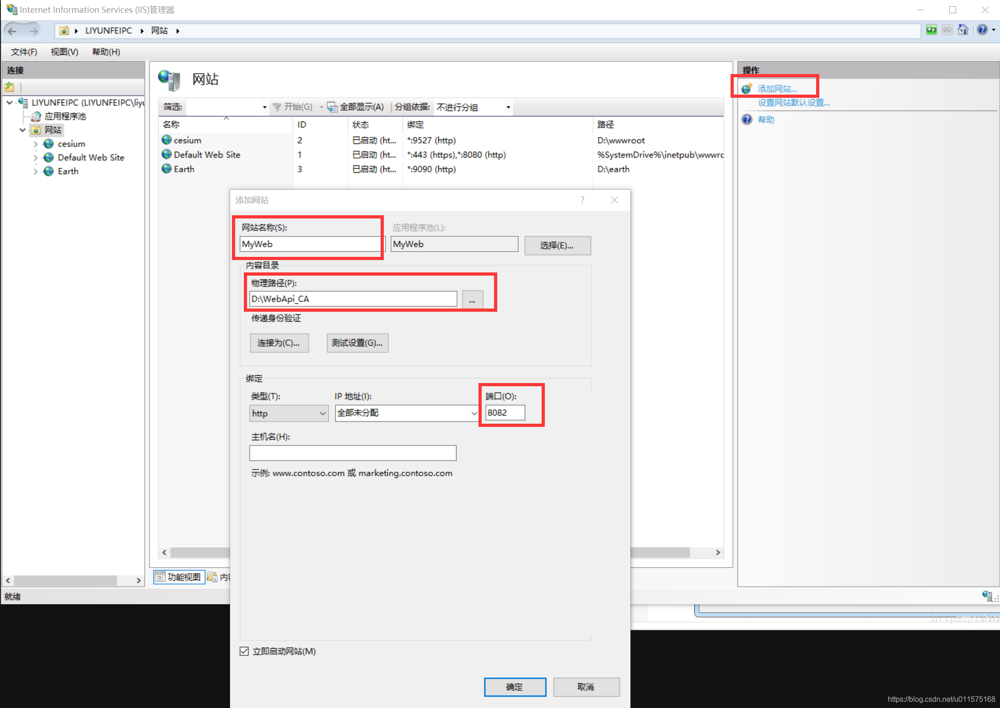
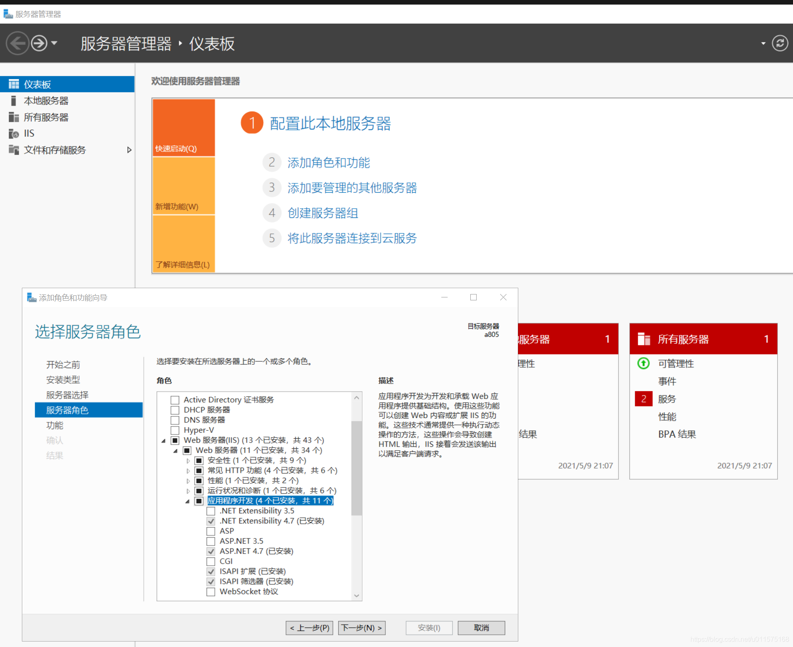

# “HTTP 错误 500.19”的错误解决方法

## IIS发布网站
在使用windows系统发布网站时，采用IIS，见下图流程

有关IIS发布网站的详细步骤可参考：[使用IIS创建Cesium本地服务器](https://blog.csdn.net/u011575168/article/details/104384305)

## HTTP 错误 500.19
我使用的为阿里云服务器，操作系统为:windows server 2019。
我采用ASP.Net WebApi开发完后，发布到网站上（将文件夹拷贝到服务器上，参见上图中的D:\WebApi_CA），访问时出现"HTTP 错误 500.19 - Internal Server Error "错误。在网络上搜索了好多中方法，发现主要的原因是windows server 2019的IIS没有安装asp.net 4.7，因此需要手动安装。见下图：

在Web服务器/应用程序开发中，将ASP.NET 4.7勾选即可，然后一直下一步即可。

问题解决。

如果还不行，也有可能是网站文件夹权限的问题，右键属性，在"安全"页面中，添加"everyone"用户，权限全部勾选上，再试试看。
