#STK模型格式及Deep Exploration介绍
在STK软件中，使用两种格式进行3维模型的显示，mdl和dae两种格式。

 其中，mdl格式为STK软件特有的格式，暂时没有现成的CAD软件直接进行mdl格式模型的制作，只能通过STK软件自带的格式转换软件(lwConvert.exe)将lwo格式的模型转换为mdl格式。
 
另一种dae格式的模型则从STK9开始支持，dae格式是主要用于多个图形程序之间交换的数字格式，常用的CAD建模软件一般都直接支持dae格式的输出。

通常使用STK模型时，主要是将其它CAD软件制作好的模型直接转换为mdl或dae格式供STK使用。本文想要介绍的就是一款强大的模型转换软件--Deep Exploration，简称DE。

Deep Exploration ，是Right Hemisphere出品的一款功能强大的3D文件转换大师，使用它进行STK支持的格式转换过程见下图。
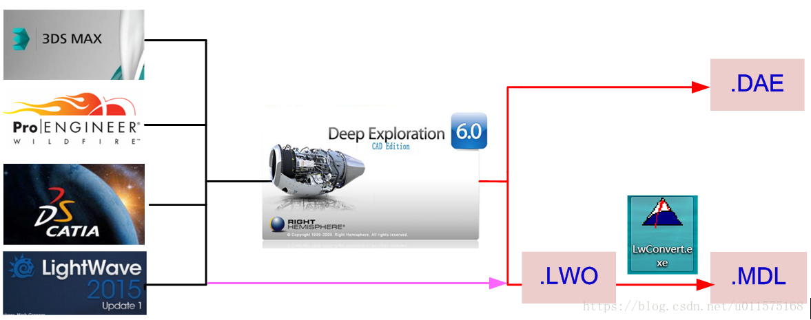
在获得各种CAD软件（如3DsMax/ProE/CATIA/Lightwave）的模型后，可直接使用Deep Exploration软件打开，打开后，可直接进行模型的编辑、修改和贴图等各种操作，实际上，DE也可以直接进行建模。修改完成后，直接另存为dae格式，或者lwo格式。
另存为dae格式的模型可直接在STK中使用。
另存为lwo格式的模型可在lightwave软件中进行修改，然后可通过STK自带的小软件“LwConvert.exe”将lwo格式的模型转换为mdl格式的模型，mdl格式模型可直接在STK中使用。
以上就是使用Deep Exploration转换各种CAD模型为STK可用模型的过程，可以看出，使用dae格式的模型转换过程较为简单：DE打开各种格式的模型--修改模型--另存为dae格式。

其中使用DE修改模型这个内涵太大，本文仅仅介绍其中的有关模型的材质与贴图相关的操作。
#DE的材质与贴图
在DE中，每一个模型都有不同的实体（mesh）组成的，可在对象列表(3D Objects List)里具体看到不同的组成部分，如下图，帆板的模型顶层文件夹为fb ,然后由四个子文件夹(fanban_zhankai)组成，每个子文件夹包含两个实体，名称皆为wwbe103-15，下图为选中的一个帆板实体。
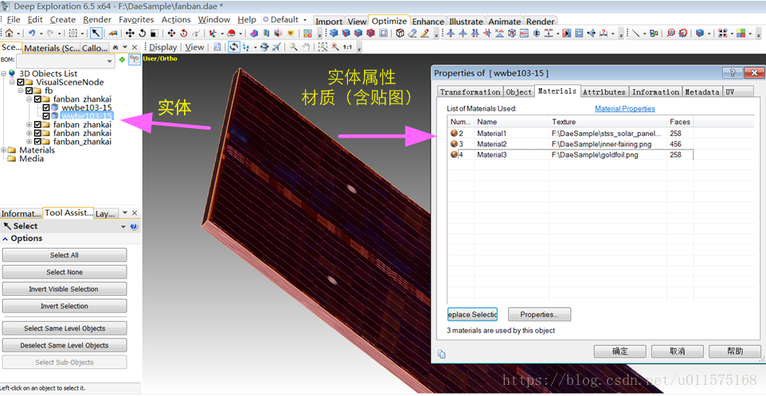
每一个实体都需要包含至少一种材质(Material)。所谓材质，主要就是用来设置模型的颜色（包含漫反射、镜面反射等等），当然也可以不用颜色，直接用贴图(Texture)，也就是将一幅图像贴在实体的表面，常用UV变换来贴图。

使用材质+贴图的方式可以非常方便的改变模型的外观效果。见上图，鼠标双击帆板实体后，则弹出对应的属性窗口，可以看到，一个帆板实体由三种材质组成，每一个材质都使用了贴图。
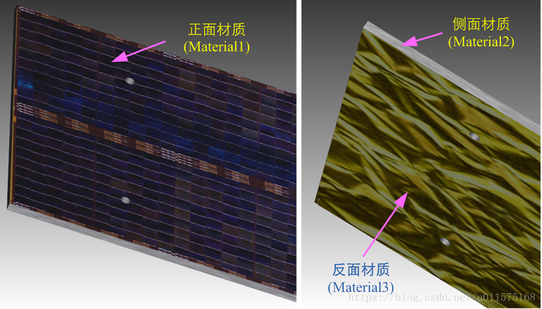

#修改材质的贴图
可以通过两种方式来改变某种材质的贴图，以帆板正面的材质为例。

 1. 打开Textures窗口（通过菜单栏Window-Panels-Textures），鼠标选中需要加载的图片，直接拖拽到帆板正面上。
 2. 双击帆板正面，在弹出的属性窗口Materials页面中，双击需要改变的材质（此例为Material1），即可打开对应材质的属性窗口，在maps页面中，点击“Browse...”，找到需要替换的图片即可，具体见下图的步骤1和2。
 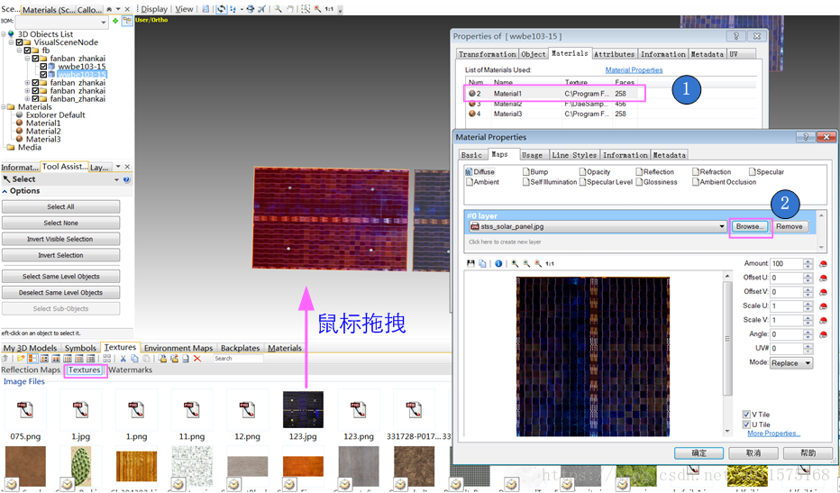
 
注意，修改材质的贴图也即修改了材质，因为材质是唯一的，因此使用这种方式会使得所有使用同一材质（此例中的Material1）的其它实体的贴图也全部更换。见下图，尽管仅仅改变了其中一个帆板的材质的贴图，但是由于其它7块帆板都使用的是同一种材质，因此其材质包含的贴图也相应的改变。
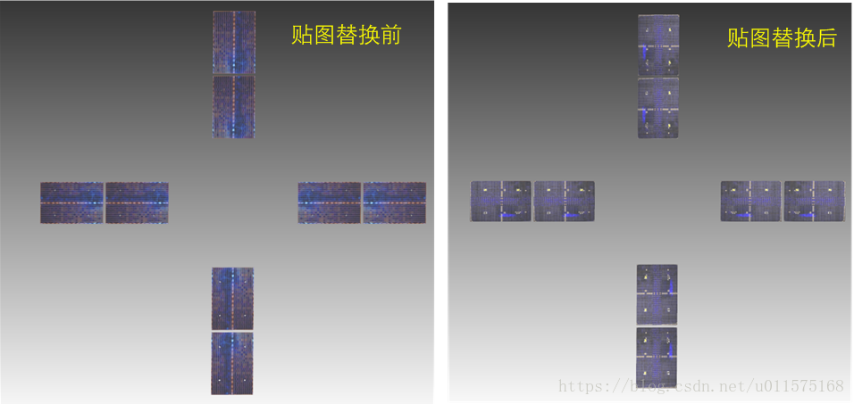

这种方式有优点也有缺点。优点是在许多实体使用同一材质时，替换一块实体的贴图，其本质就是替换所有实体所使用的同一材质的贴图，如上图中的8块帆板，可一起替换帆板表面的贴图。

当然，如果只想替换单独一个实体的贴图而不影响其它的实体，这种方式就行不通了。这种情形下，必须将改变实体的材质，使得此实体使用的材质都与其它实体的材质都不一样。
#改变实体的材质
如果想改变实体的材质，并且与其它材质不同，常用的做法是新建一个材质，然后使用它。

下图给出了如何新建一个材质：右键Materials，然后点击“Create Material”。使用鼠标将新创建的材质直接拖拽到需要改变材质的实体上，即可改变实体的材质为新创建的材质。
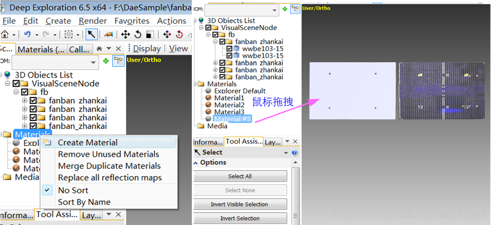

下图为帆板正面的材质更换为新的材质之后的属性窗口，从图中可以看出，帆板正面原来的材质为Material1，现在被修改为material #5，且该变后的材质没有使用贴图（Texture一栏为空）。
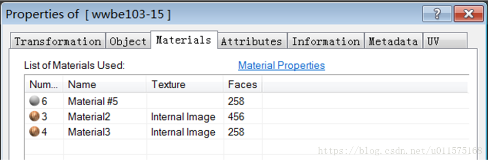

此时，再按照上节给出的修改材质的贴图方式，即可单独将此实体的贴图修改，又不影响其他的实体。

总是创建新的材质使用则会导致很多单独的实体，有时反而会不方便。同时，有时候不需要使用新的材质，而是想使用其它实体或者已有的材质，怎么办？下图给出了详细的步骤。
1) 双击需要改变材质的实体，弹出属性窗口；
2) 在属性窗口中，选中需要改变的材质（如图中的Material1)，然后点击“Replace Selection”；
3) 弹出提示窗口，提示你直接单击你想更换的材质； 
4) 可以从材质菜单栏里单击，也可直接单击某个实体（对应的材质）。

下图中，左块的帆板使用了新建的材质，而且更换了贴图，如果想改变右块的帆板，使得其材质与左块一样，就可以使用这种方法。
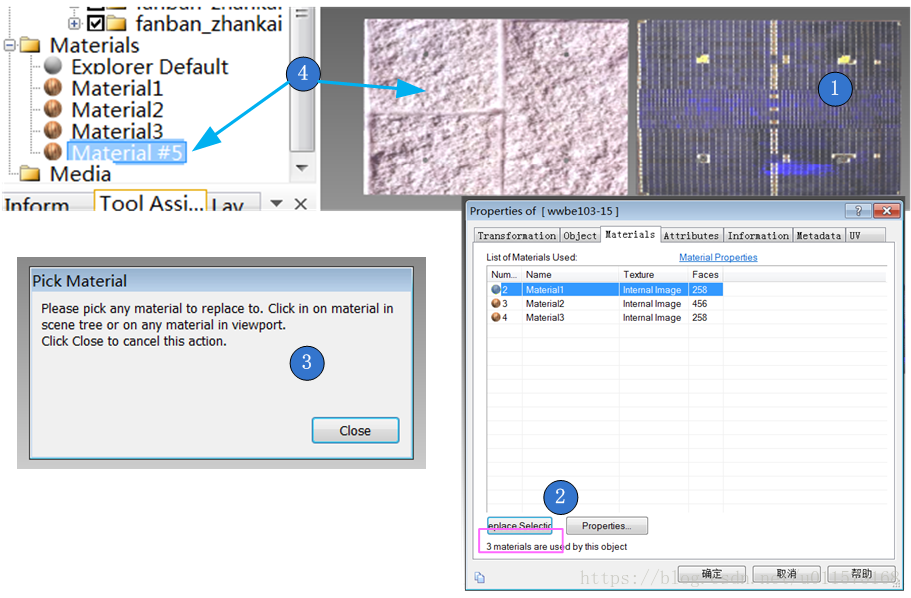

#UV贴图设置
在前面的步骤中，我们都是直接通过鼠标的拖拽的方式直接将贴图图片贴到实体上，这过程中实际上是一个UV贴图的过程。

UV贴图添加了两额外的坐标来指向你的物体；它们就是U与V轴，也就是说你可以把物体展开成一个平面（横向与垂直），在这个平面上绘画你的纹理。一旦UV坐标被指定到点上，那么纹理就好像被固定在物体的表面上，所有的点都相当于大头针。不管你的物体有如何不规则或者你如何移动或弯曲它，大头针始终被钉在那个位置，这样纹理都能正确的映射在物体上。以学术观点来说，它并不是正确的投影贴图，因为纹理精确到点上并且内插其中的每一处。但这不是重点，重点是它能很好为你工作。

通过双击实体打开属性窗口，进而双击具体材质即可打开材质属性窗口，其中“Maps”页面为UV贴图设置页面，见下图。

前面已经介绍过，点击“Browse”可以改变贴图的纹理即图片。而通过设置“Offset U/V”、“Scale U/V”、“Angle”等属性框可以改变贴图的外在显示形式。
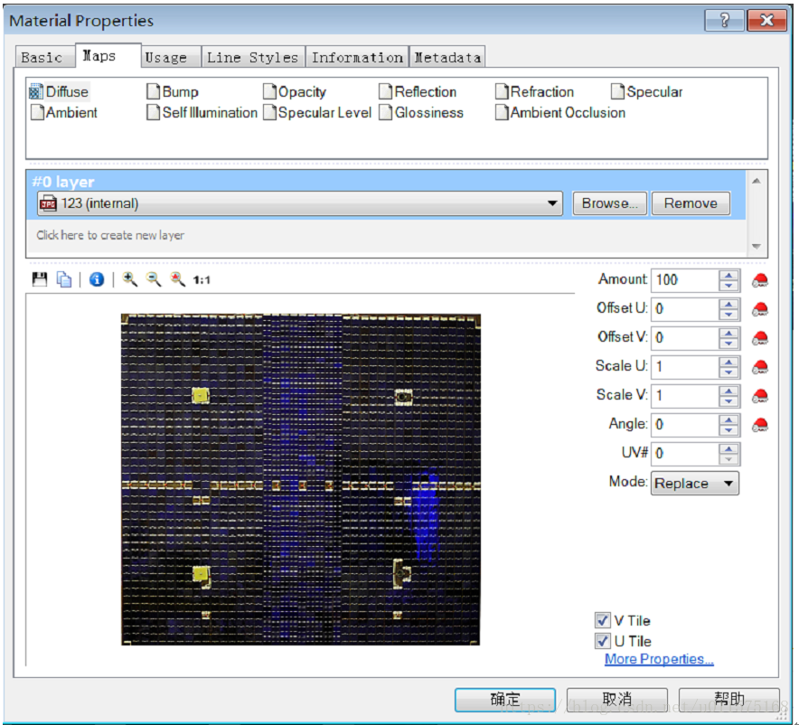
下图为几种不同UV设置的效果图，实际使用时，可根据贴图图片的长宽和需要贴图的实体的形状进行具体设置，以实现最有效的现实效果。
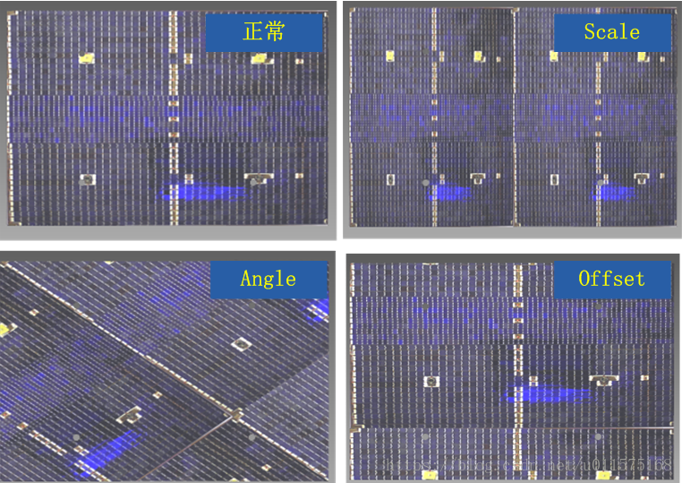
#小结
本文介绍了如何改变实体的材质，以及如何修改材质的贴图。

下图给出了完整的模型、实体、材质与贴图纹理图片之间的层次关系。

每一个完整的模型都是由不同的实体组成的，如卫星由帆板、天线、外壳等实体组成。

而每一个实体的外在显示方式都是通过材质来展示的，材质可通过纯颜色来展示（如下图中的实体4），也可通过贴图纹理图片来显示（如下图中的实体1-实体3）。

下图中，实体1和实体2共用同一个材质，即材质1，改变材质1的UV贴图纹理，即图片1，则实体1和实体2的外观显示都发生同样的改变。实体3单独使用材质2，单独改变材质2的纹理图片2不会对其它实体产生影响。实体4单独使用材质3，材质3没有使用UV贴图，仅仅使用纯颜色。
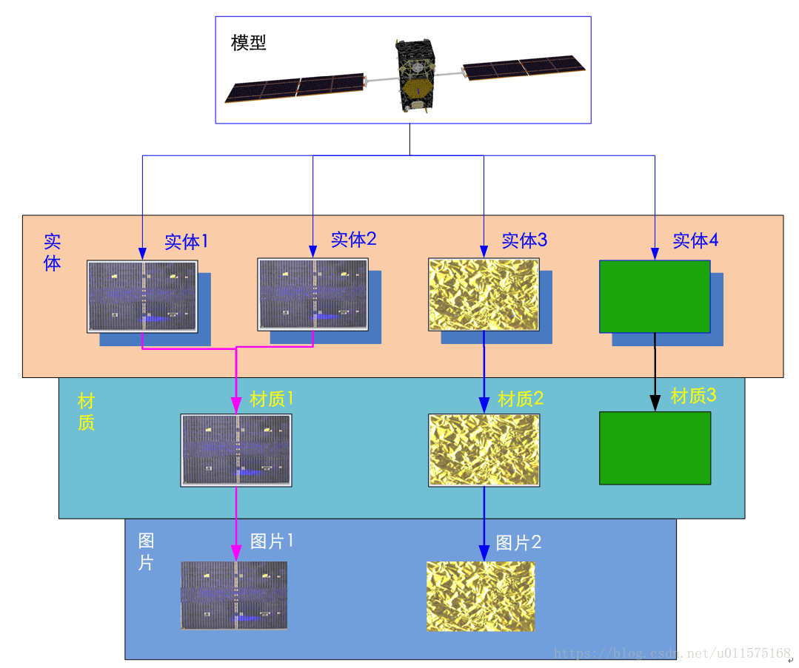
