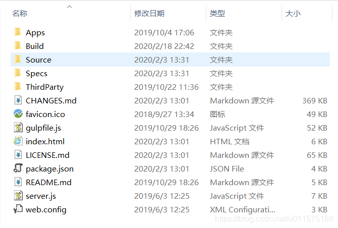
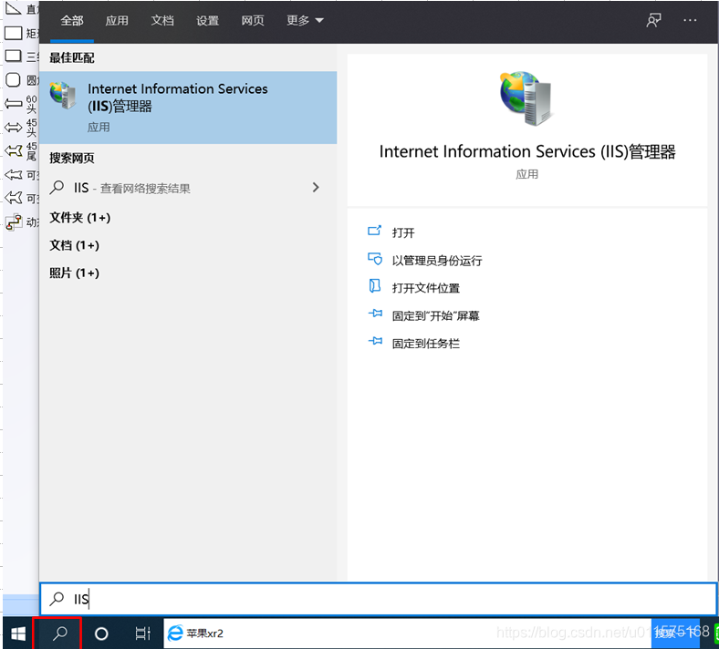
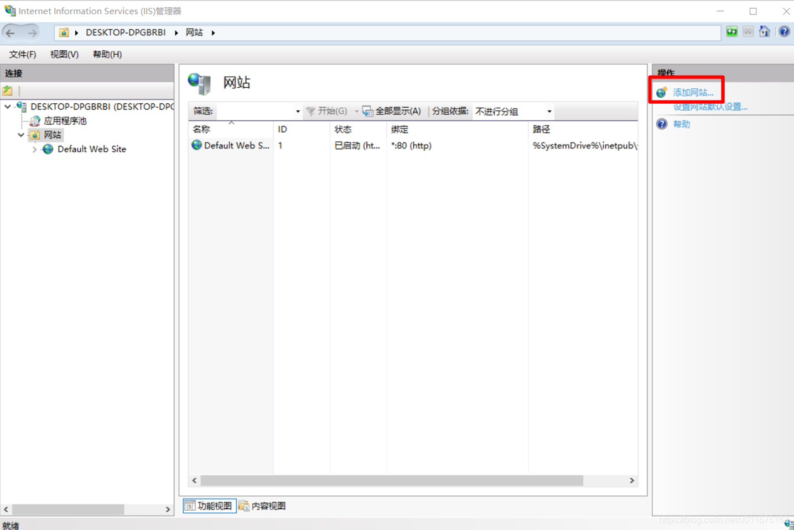
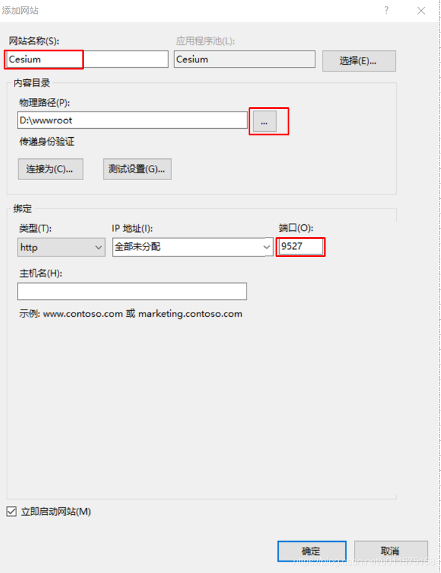

# 使用IIS创建Cesium本地服务器

研究学习Cesium少不了创建本地服务器。创建本地服务器有多种方式：IIS(微软windows系统自带)、Tomcat、Python、NodeJS。后面几种方式的创建请参考之前的博文：[**使用Tomcat架设Cesium本地服务器(含Nodejs,Python方法)**](https://blog.csdn.net/u011575168/article/details/80031663)

本文介绍使用微软自身的Web服务器组件(IIS)创建Cesium本地服务器，步骤非常简单。对IIS不熟悉的同学自行百度或谷歌。

### Cesium安装包说明
从Cesium.com上下载Cesium安装包，将其解压到合适的位置，以D盘为例，解压到“wwwroot”文件夹下，文件夹名称"wwwroot"是我自己起的，你可以自己随便命名。

下图为Cesium解压后的文件目录，Cesium把所有的东西几乎都放进去了，不仅包含Cesium的所有源代码(javascript)，还包含了一些例子（如hello world和Sandcastl）。因此，**这个文件夹内的所有内容就是一个小型网站**，我们把这个文件夹放在自己的服务器上就可以直接创建一个现成的网站。也可以在此基础上修改和创建具有自己特色的网站。

文件夹中：
"index.html"为此网站的主网页，例如我们输入"www.baidu.com"看到的就是百度网站的主网页，通常为"index.html"。

"server.js"为nodejs方式的主运行文件，详见[**使用Tomcat架设Cesium本地服务器(含Nodejs,Python方法)**]，使用IIS方式不需要此文件。

"Source"文件夹内为Cesium的所有源代码文件，可以直接引用，也可以自己打开看学习。

"Apps"文件夹内为一些例子。

我们需要创建Cesium本地服务器的本质使用windows系统的Web服务组件将此文件夹作为网站的内容。

### 使用IIS创建Cesium本地网站
IIS是Internet Information Services英文全称的缩写，是一个World Wide Web server服务。IIS是一种Web（网页）服务组件，其中包括Web服务器、FTP服务器、NNTP服务器和SMTP服务器，分别用于网页浏览、文件传输、新闻服务和邮件发送等方面，它使得在网络（包括互联网和局域网）上发布信息成了一件很容易的事。

简单来说，我们只要知道IIS是网页服务组件，用来搭载网站运行程序的平台即可，

一般windows系统都有IIS服务组件，如果没有的自行百度如何开启吧。

以win10系统为例，在左下角搜索IIS，即可打开IIS。

打开IIS后的界面如下。

点击“添加网站”，在弹出的窗口中，填入网站信息：

"网站名称"-自己任意取；
"物理路径"-关联到Cesium的文件夹，即之前创建的"D:\wwwroot"；
"端口号"-自己任意取，只要不冲突就行了。默认为"80"。

**大功告成！！**，我们成功的利用IIS组件在本机创建了一个网站。网站所在的文件夹就是"D:\wwwroot"。

此时，打开浏览器，输入网址"localhost:9527"即可打开网站，如果端口号是默认的80端口，则只输入"localhost"即可。打开的默认主页如下。注意，默认打开的主页就是之前提到的"Index.html"文件。

Cesium很贴心的给我们做好了链接："Hello Wolrd" 、"Sandcastle"等例子。自己欣赏吧！

再提示一次，文件夹"wwwroot"就是我们的本地网站，因此文件夹里面的任意文件都可以通过网页访问的形式打开。
例如我们想直接访问"Apps\Helloworld.html"文件，则在浏览器地址栏里输入："http://localhost:9527/Apps/HelloWorld.html"即可。

通过这种方式，我们在此文件夹内创建自己的文件夹，然后创建自己的网页，然后通过浏览器去访问，从而达到调试自己编写的网页的目的。
