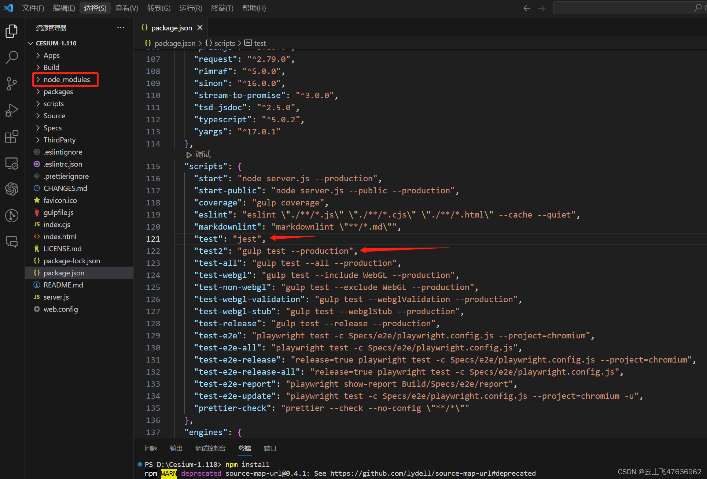
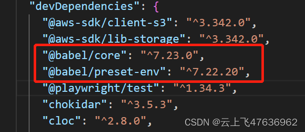
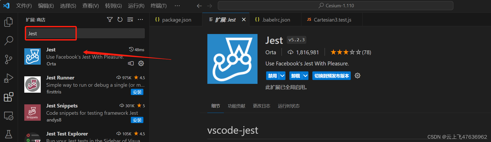
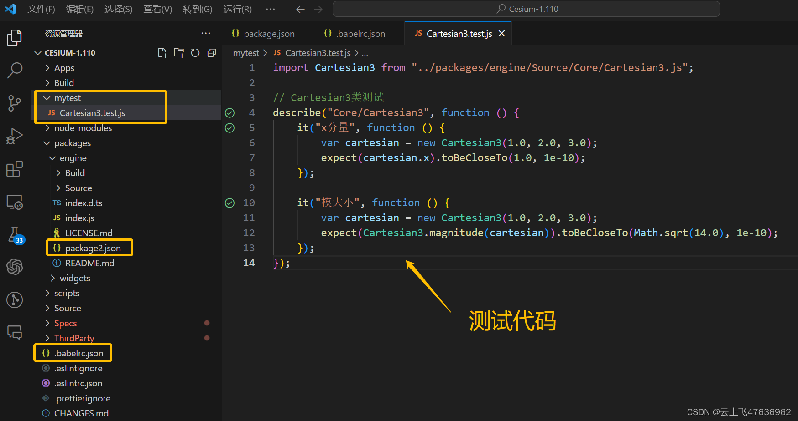
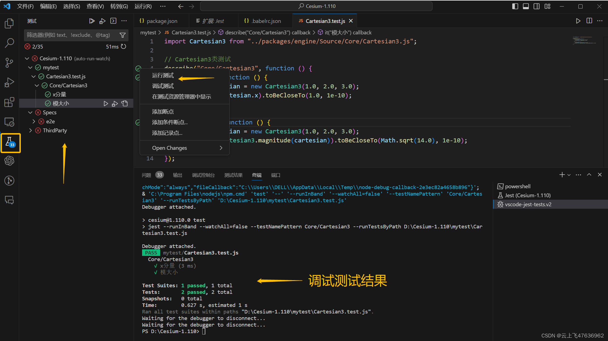

# 使用Jest测试Cesium源码

@[TOC](使用Jest测试Cesium源码)

# 介绍
在使用Cesium时，我们常常需要编写自己的业务代码，其中需要引用Cesium的源码，这样方便调试。此外，目前代码中直接使用ES6的模块(Import等语法)，而不是之前的CommonJS方式。

本文介绍如何使用流行的前端测试工具jest来实现自动化测试。此处暂时使用nodejs来调试代码，不涉及浏览器。

Cesium自身包含总多的测试代码(Spec文件夹下)，并使用Jasmine来运行测试。不过它的测试都是所有文件打包好后再测试的，不便于我们单独测试某一个类。因此本文使用Jest来单独进行测试。

# 环境
- Cesium :110版本，可直接从官方网站上下载。[https://cesium.com/downloads/](https://cesium.com/downloads/)
- 开发环境: Visual Studio Code（下面简称VSC），nodejs环境

# Cesium安装
Cesium的安装和使用此处仅做简单介绍，如果是初学者可以搜索相关的教程。

- 将压缩包解压缩后，使用VSC可打开。
- 安装相关包: 

```bash
npm install
```
npm install命令则根据package.json中的依赖安装相应的包（新创建node_modules目录）。

- 修改package.json中的内容，将"scripts"中的"test":"gulp test --production"修改为"test2":"gulp test --production"(仅作为备份，test2名字无实际意义)。 
- 将原来的"test"内容修改为"jest”，以便后续使用jest进行测试。


# Jest
Jest 是由 Facebook 推出的一个前端测试框架，具有许多非常好的特性，譬如执行速度快、API友好、自动监控、Snapshot、测试覆盖率、Mock等各种特性，并且适用于Babel、TypeScript、Node、React、Angular、Vue等。

### 安装Jest模块包
在VSC终端运行命令：

```bash
npm install --save-dev jest
```
### 安装babel
Jest本身只支持commonjs模块，不支持es6的模块，因此当我们使用import引用别的模块时是不支持的。可以使用Babel包将es6模块转换为commonjs模块。


```bash
npm install --save-dev @babel/core
npm install --save-dev @babel/preset-env
```
安装完babel后，查看一下package.json文件下的devDependencies看看有没有babel的两个依赖包:

成功安装后，还需要在项目文件夹下增加一个babel的配置文件.babelrc.json,内容如下:

```bash
{
    "presets": [
        [
            "@babel/preset-env",{
                "targets":{
                    "node":"current"
                }
            }
        ]
    ]
}
```
### 安装Jest的VSC插件
在VSC的扩展里搜索"Jest"，安装这个插件。这个插件可以让我们方便的管理和测试我们的测试算例。

# 测试例子
这里，我们假设测试Cesium的源码里的Cartesian3类。100版本以后，源码都放到"packages"文件夹内了。

在项目根目录下新建“mytest”目录，新增"Cartesian3.test.js“文件，代码如下：

```javascript
import Cartesian3 from "../packages/engine/Source/Core/Cartesian3.js";

// Cartesian3类测试
describe("Core/Cartesian3", function () {
    it("x分量", function () {
        var cartesian = new Cartesian3(1.0, 2.0, 3.0);
        expect(cartesian.x).toBeCloseTo(1.0, 1e-10);
    });

    it("模大小", function () {  
        var cartesian = new Cartesian3(1.0, 2.0, 3.0);
        expect(Cartesian3.magnitude(cartesian)).toBeCloseTo(Math.sqrt(14.0), 1e-10);
    });
});
```
代码里，使用"import"命令直接引用Cesium源码文件"Cartesian3.js"，运行时Babel自动帮我们将代码转换为commonjs代码。

"describe"函数和"it"函数都是Jest支持的。

**注意！！！**由于我们引用的Cesium源码位于“packages/engine”文件夹内，而“packages/engine”内本身有"package.json"文件，这个文件影响Jest，所以我们不需要这个文件，将其改名为“package2.json”，暂时保留即可！！

最终的代码界面如下：


我们可以看到在测试代码的旁边出现了测试提示按钮，使用绿色或者红色表示测试的成功与否。

打开VSC左侧的“测试”按钮，即可打开“测试”页面，显示各个测试文件。同时，在代码的左侧，右键，可“运行测试”或者“调试测试”。

调试测试后，生成测试结果。见下图。



# 小结
本文我们通过安装Jest相关包，通过可视化的方式进行单个测试文件的测试，测试文件中引用了Cesium的源码，便于我们调试时查看源代码的运行。此处仅使用nodejs测试相关代码，与浏览器无关。


