# 使用Tomcat架设Cesium本地服务器(含Nodejs,Python方法)

本文主要说明如何使用Tomcat作为本地web服务器，然后将Cesium整个文件夹部署在Tomcat的Webapps文件夹内，即可实现浏览器访问Cesium本地主页。
我们将Cesium部署在本地服务器上主要有以下方面的考虑：

 - 局域网内，创建Web服务，通过对Cesium服务端文件的修改，展示我们自己想要提供的功能，从而可以在局域网内任何一台机器上通过浏览器即可访问
 - 将测试修改后的Cesium文件部署到云主机中自己的网站上，实现个人网站的发布

**以下各代码及说明均在Windows10操作系统下。**

有关Cesium请参考：
 - [Cesium简介](https://blog.csdn.net/u011575168/article/details/80030937)
 - [Cesium官方文档](https://cesiumjs.org/tutorials/)

还有两种常见的Web服务方式：Node.js和Python，Cesium官方文档里都有介绍，这里简单的说一下过程(假设Cesium已经下载并解压缩好）
#### Node.js方式
 1. 从官网安装Node.js
 2. 打开控制台，并进入到Cesium的安装目录，然后输入：npm install
 然后将会自动安装依赖的模块包，并自动在Cesium根目录下创建一个‘node_modules’文件夹
 3. 在控制台继续输入：node server.js，即可启动Web服务，见下图
 4. 浏览器网址栏输入：http://localhost:8080，即可访问Cesium的主文件
 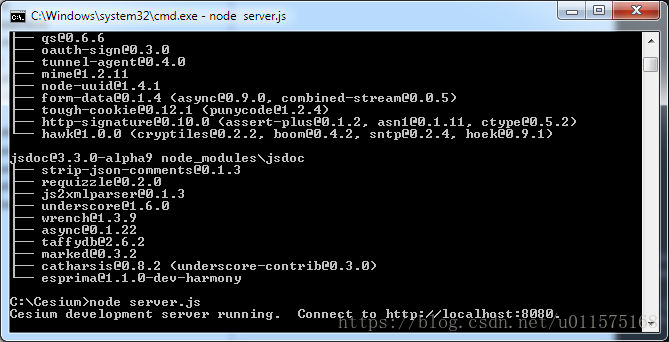
#### Python方式
 1. 假设已经安装好Python，我使用的是Anaconda 5.1，Python版本是3.6的
 2. 通过开始菜单打开Anaconda Prompt控制台程序，并进入到Cesium的安装目录,然后输入：python -m http.server 9090，即可打开Web服务，见下图（其中9090为端口号，可自行设置，只要不与其他端口冲突就行了）
 3. 在浏览器地址栏中输入：http://localhost:9090/ ，即可访问Cesium的主文件
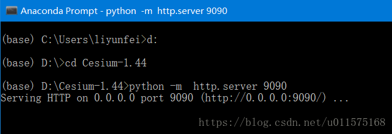

## Tomcat的安装与配置
有关tomcat的介绍，可参考[Tomcat 快速入门](https://www.cnblogs.com/jingmoxukong/p/8258837.html?utm_source=gold_browser_extension)

Tomcat是由Apache公司发布的一款适合于JSP程序设计和Java EE程序设计开发的轻量级Web服务器。符合W3C标准，支持Servlet和JSP规范。由于其拥有技术先进、性能稳定和开源免费的特征，深受Java开发者的喜爱并得到了部分软件开发商的许可，成为目前比较流行的Web应用服务器。
### 下载
去[Tomcat官网](https://tomcat.apache.org)下载，当前日期（2018年4月）我下载的是apache-tomcat-9.0.7。注意，下载.zip文件为免安装版本。
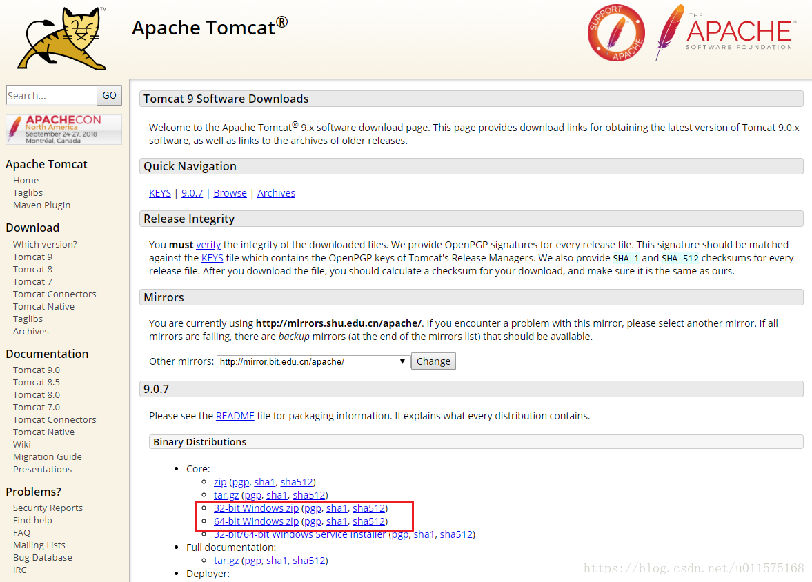
放在合适位置，直接解压缩即可，我放在 D:\apache-tomcat-9.0.7
### 环境变量配置
配置系统的环境变量（右键计算机-属性-高级系统设置-环境变量-新建系统变量）
变量名：CATALINA_HOME，变量值为安装目录" D:\apache-tomcat-9.0.7"，根据你自己安装的目录进行对应修改，见下图。
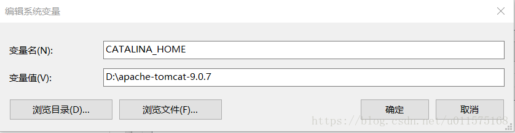
由于tomcat依赖于JAVA的运行环境，因此应确保JRE的安装，我安装的JDK版本是1.8，同样查看JRE的环境变量是否配置正确，确保JRE_HOME指向正确的位置。
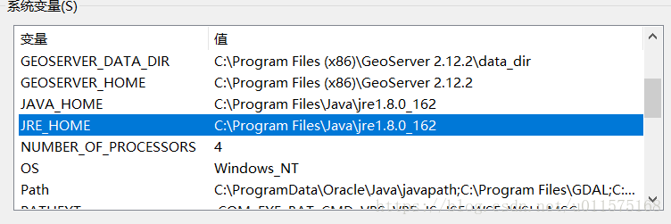
有关Java运行环境JDK的安装，请参考：https://blog.csdn.net/u011575168/article/details/79920107
### 启动服务
进入到Tomcat安装目录的bin目录下，找到startup.bat文件，双击运行，即可看到以下界面，注意，在tomcat提供web服务期间，不要关闭此窗口。
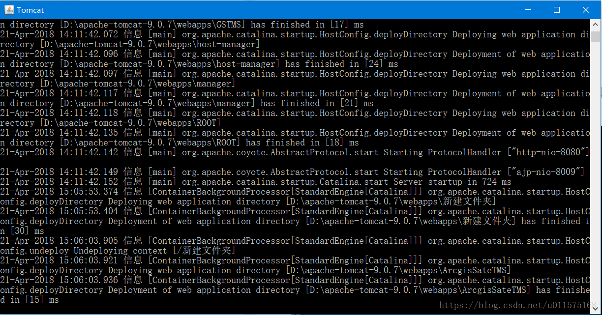
然后打开浏览器，在里面输入http://localhost:8080/ 就可以看到如下界面： 
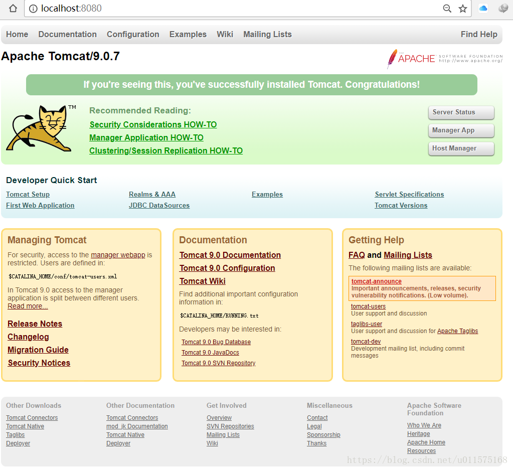
到此Tomcat就搭建好了,web服务即开启。
### 关闭服务
直接关闭命令行窗口时，Tomcat就停止了。
### 修改端口号
tomcat提供web服务默认的端口号是8080，如果想要修改端口号，则进入Tomcat安装目录下的conf目录，打开server.xml，修改以下代码中的port值，然后重启tomcat即可。
```
<Connector port="8080" protocol="HTTP/1.1"  
               connectionTimeout="20000"  
               redirectPort="8443" /> 
```
注意，如果是建立个人网站，则端口号设置为80

### tomcat报warinig Unable to add the resource at [..] to the cache..
信息大致的意思就是不能给资源加cache了，因为没有足够的可用空间了。
原来 tomcat8中增加了静态资源缓存的配置
以下是两个相关参数说明：

 1. cacheMaxSize：静态资源缓存最大值，以KB为单位，默认值为10240KB
 2. cachingAllowed：是否允许静态资源缓存，默认为true
 
解决方法：
 增大缓存 在 conf/context.xml中加入：
```
<Resources cachingAllowed="true" cacheMaxSize="102400"/>
```
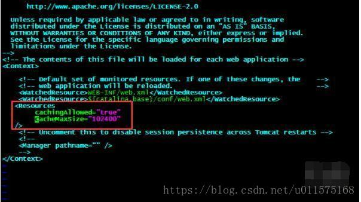

### 修改tomcat默认主页
前面介绍开启tomcat服务时，默认登录的页面是tomcat的，那么如何修改TOMCAT的默认主页为你自己项目的主页呢？

最简单的办法是删除Tomcat目录下的\webapps\ROOT文件夹下所有文件，然后将自己主页的文件全部放在Root文件夹下面。

同时删除文件夹\work\Catalina内的所有文件即可。

## Cesium的配置
下载[Cesium](https://cesiumjs.org/downloads/)(2018年4月的版本是1.44)，将其解压缩在Tomcat目录下的Webapps文件夹内，Cesium文件夹结构如下(为了方便可以将文件夹名称Cesium-1.44改为Cesium)：
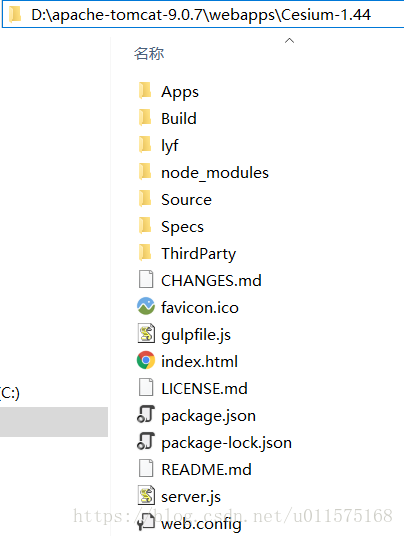
其中，文件夹lyf是我自己创建的。
注意，我们下载的压缩包文件是放在服务器端的，index.html就是我们通过浏览器访问tomcat服务器上的Cesium的主页面，不能直接双击打开，必须通过浏览器访问才能打开。
### 浏览器访问Cesium及调试
确保你的浏览器支持WebGl，现在最新的浏览器如Chrome/Edge都支持的。
确保tomcat的服务打开，在浏览器地址栏输入http://localhost:8080/Cesium-1.44/即可打开:
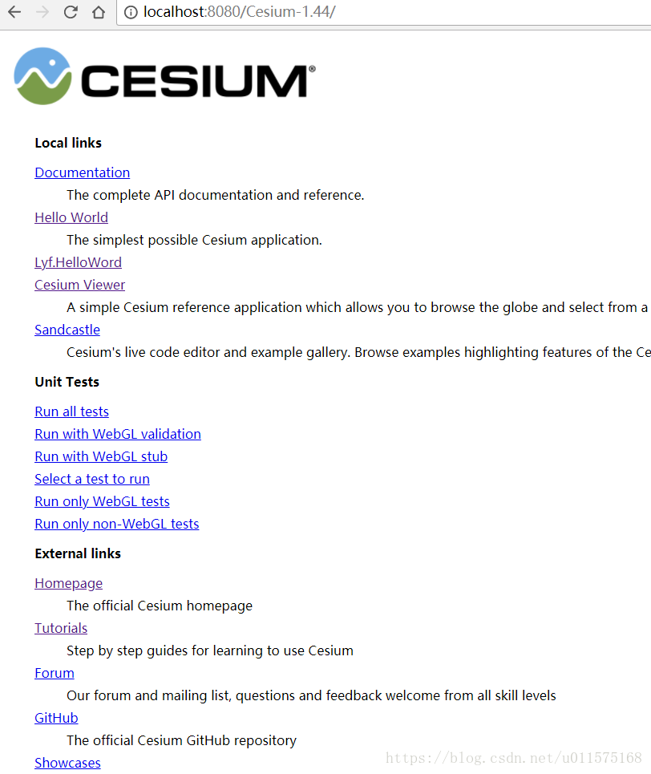
注意，上图中，Lyf.HelloWord是我通过修改index.html内容增加的，见下代码处：
```
  <dt>
            <a href="Apps/HelloWorld.html">Hello World</a>
          </dt>
          <dd>
            The simplest possible Cesium application.
          </dd>
          <dt>
            <a href="lyf/LyfHelloWorld.html">Lyf.HelloWord</a>
          </dt>
          <dt>
            <a href="Apps/CesiumViewer/index.html">Cesium Viewer</a>
          </dt>
```
我个人建议在本地机器利用Cesium开发的简单流程如下：

 1. 在Cesium-1.44文件夹内创建自己的个人文件夹（我的是lyf），以后自己所有开发的所有网页(html,img,css)都放在这个文件夹中。
 2. 拷贝Cesium-1.44/Apps/HelloWorld.html文件到个人文件下，并修改名称（如LyfHelloWorld.html），以便区别。
 2. 在Cesium主文件index.html中，创建连接指向个人文件夹中的html文件，如LyfHelloWorld.html。
 3. 利用各种网页编辑器(Eclipse,Visual Studio Code,PyCharm等）直接修改LyfHelloWorld.html，或者创建其他的网页。
 3. 然后浏览器刷新主页http://localhost:8080/Cesium-1.44/，点击指向所要测试的连接即可查看修改后的效果。
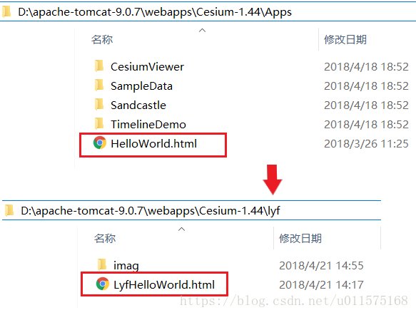

### 一个例子
例如，我想将下面的图片加载到3D地球上

则将图片WhiteOnBlue.bmp放在lyf文件夹下的imag文件夹内，然后修改lyfHelloworld.html中代码如下：
```
<body>
  <div id="cesiumContainer"></div>
  <script>
    
    var viewer = new Cesium.Viewer('cesiumContainer', {
      baseLayerPicker: false
    });
   
    layers.addImageryProvider(new Cesium.SingleTileImageryProvider({
                          url : 'imag/WhiteOnBlue.bmp',
                          rectangle : Cesium.Rectangle.fromDegrees(-180.0, -90.0, 180.0, 90.0)
    }));  
  </script>
</body>
```
保存后，重新加载http://localhost:8080/Cesium-1.44/，点击lyf.HelloWord，即可打开我自己修改后的页面(后面修改html代码后，可直接更新此页面)：
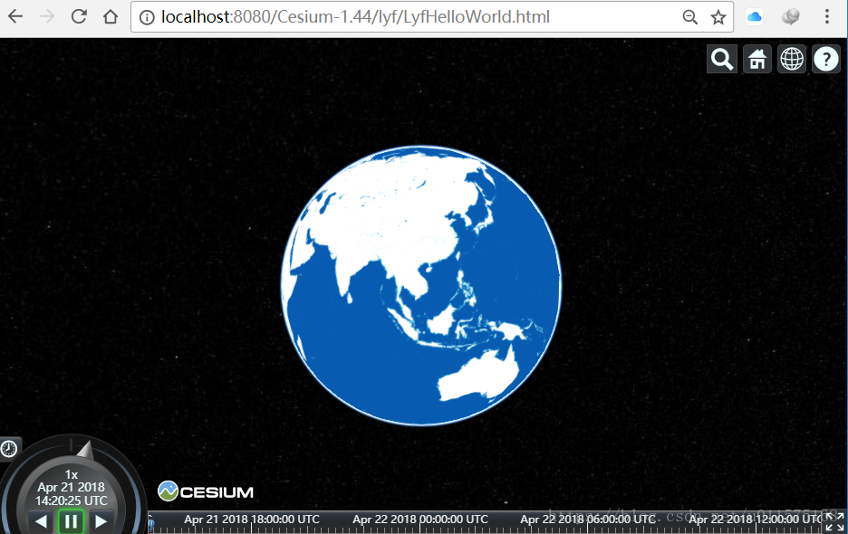

Have Fun！
